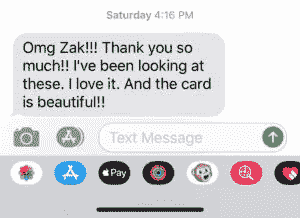
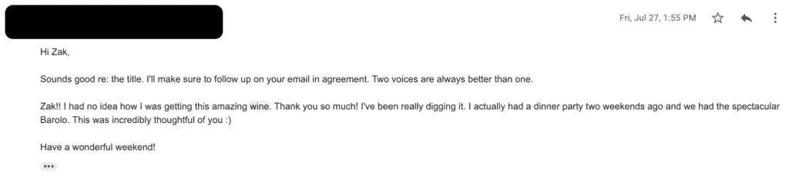

# 如何给朋友、家人和专业人士送上最好的礼物

> 原文：<https://medium.com/swlh/how-to-give-great-gifts-to-friends-family-and-professional-contacts-e0cbc8354fe5>

成为一名优秀的送礼者是一项高杠杆的技能。它有助于你在职业交往中留下积极的印象，巩固你现有的关系网，并使与朋友和家人的特殊场合充满乐趣。知道如何送出好礼物可以从一份工作或职业延续到下一份工作或职业。

但是说实话，我以前很讨厌送礼物。

我觉得我做得很糟糕。为了让*擅长这个*，你必须付出一只手和一条腿。

所以我默认了我能想到的:感谢卡和礼品卡。

(不要给别人礼品卡，除非你想说，“这是一次完全强制性的互动，我想不出还有什么更好的礼物送给你。”尤其是亚马逊礼品卡。本质上就是给这个人现金。)

最终，我厌倦了自己不擅长送礼物的感觉，所以我告诉自己我会让*成为擅长送礼物的人。送礼物和其他事情一样是一项技能，所以通过一些学习和练习，我应该会变得更好，对吗？*

现在我很高兴地说，我擅长送礼。事实上，我想说我喜欢给人送礼物的机会。这不仅仅是在商业环境中建立社会资本的乐趣和伟大，而且也是一种游戏。

努力让对方认为你比他们自己更了解他们。

这时你就知道你已经成功地送出了一份礼物。

# 听，注意，做你的研究

成为一个伟大的送礼者归结为成为一个伟大的倾听者，寻找细节，把别人看成像你一样复杂的人。

大多数人认为送礼物是你每年都会做几次的事情，你只是送他们他们让你送的东西。当然，这很简单。但是它没有那种影响和持久的效果——那种“哦，你不应该这样做的”的感觉—伟大的礼物给予的人。

这是因为*倾听别人的意见需要付出努力，这种方式会给你提供有用的信息，告诉你应该送他们什么样的礼物。*

这需要努力，但并不难。

# 倾听问题

我发现给某人送什么样的礼物的常用方法是直接听他们说什么。

不，我不是说“问他们想要什么，然后给他们买。”

我的意思是，**寻找他们的问题是什么，并问自己，“我能给他们什么来解决这个问题？”**

每个人都有他们想要解决的问题，他们可能会顺便把这些问题告诉你。可能是他们的鞋子漏了，他们没有足够的时间做饭，他们想更多地装饰他们的墙壁，或者他们的背一直在杀死他们。

给他们一份礼物*为他们解决这些问题*。更好的是，他们知道会为他们解决这些问题，但出于某种原因，他们不会为自己购买。

当人们在婚礼和婴儿洗礼等重大生活事件中送礼物时，他们会直觉地理解这一点——当他们去为托儿所购买玩具或为新婚夫妇购买他们可以一起使用的礼物时——但这似乎在正常的送礼中迷失了。

但是在这些事件之外，人们会问“这个人喜欢什么？他们的口味是什么？”不要问，“我能给这个人什么样的礼物，让他喜欢，同时又能帮助他改善现在的生活？”

# 例子:我妈妈的生日

我妈妈在工作中花了很多时间站立。她加班做销售和室内设计工作。她到家时已经筋疲力尽了。当我们和她交谈时，她总是告诉我们她工作有多累。

她也不像她知道自己能吃的那样吃得好。她重视保持厨房的整洁。她炉灶上的一滴油脂比因为她累了而不吃东西更让她恼火。

所以，有人想在下班回家后用一种方便、干净的方式为自己做饭。

她需要一个类似空气油炸锅的东西。

我本可以为她准备一顿晚餐和一些男人送给母亲的生日礼物(香水？我不知道。).相反，我从好市多(Costco)给她订了一个空气炸锅( [Gourmia 5 Qt 数字空气炸锅，59.99 美元](https://www.costco.com/Gourmia-5-Qt-Digital-Air-Fryer.product.100404905.html))。

(我妈妈不是那种对礼物热情洋溢的人，所以这是一个惊喜。)

这份礼物为她解决了一个她一直在谈论的问题。它还解决了一个次要问题(“我不知道如何使用”)，包括空气油炸锅的辅助礼物:一本空气油炸食品的食谱。

# 寻找不明显的怪癖

有时候，这个人有一个你可以用礼物解决的问题并不明显。也许他们只是有一些小怪癖和口味，你真的想给他们一份与这些怪癖相关的礼物。

这很有效，因为这些怪癖应该是*不明显的*。它们应该是个性特征、品味和偏好，只有当你非常了解这个人的时候，你才能发现。

(这也是普通礼品卡不是好礼物的原因。他们说，“我对你一无所知，所以给你钱。”)

因此，密切关注那些揭示人们有趣怪癖的品味和偏好。

一些快速简单的地方:

*   他们喝什么？他们喜欢某种特定的咖啡吗？酒？
*   他们穿什么？他们会遵从特定的品牌吗？还是特定的风格？
*   (注意:衣服很难做，因为尺码很复杂。把风格品味作为你如何赠送配饰的一个指标，这些配饰通常更容易确定尺寸。)
*   他们读什么？他们喜欢特定的流派吗？作者？
*   他们在哪里度过他们的空闲时间？他们喜欢音乐会吗？他们喜欢课程吗？他们喜欢运动吗？如果有，在哪里，和谁？

我首先问，“这个人把他们的可支配收入花在哪里了？”

然后问，**“我能给他们什么，他们说，但他们不会得到自己吗？”**

那就去追。

# 例子:女朋友的生日

我真的很喜欢 [Ramit Sethi 的内容](http://iwillteachyoutoberich.com/)。我女朋友也是。这实际上是我们第一次约会时最先建立联系的事情之一。

在她的生日，我想给她一些东西，说明她的个性不明显的怪癖，但也是她自己永远不会得到的东西。

我有机会在纽约与 Ramit 坐下来讨论了几个项目，我希望他的投入。开会前，我拿起一本他的书， [*我会教你变得富有*](https://www.amazon.com/Will-Teach-You-Be-Rich/dp/0761147489/ref=sr_1_1?s=books&ie=UTF8&qid=1545147072&sr=1-1&keywords=i+will+teach+you+to+be+rich) ，贴在书包里。在深入探讨我向 Ramit 提出的问题的实质之前，我请他在上面签名，并为她的生日进行个性化定制。

这不仅是一个很好的礼物，而且对 Ramit 来说，在他的书上签名也很有趣(如果你礼貌地要求他们并让他们容易做，大多数作者实际上喜欢这样做)。

# 做一些调查

如果你找不到明显的问题或分析出某人性格中的怪癖，就对他们做一些研究，仔细听他们谈论什么，以便更好地辨别他们的口味。如果你*不得不*仅根据口味给某人送礼物，不要根据“哦，她是个女人，所以我肯定他们喜欢花”或“哦，他是个男人，所以我肯定他喜欢运动”这样宽泛的东西做出推断

侦查可以细致到在谷歌地图上查找人们的地址，查看他们的邻居，研究他们的博客或个人网站，或者找到他们创建或出现的任何媒体。

或者可以简单到关注他们在交谈中或社交媒体上发布的内容。

# 例子:感谢我的文学代理人

我的文学经纪人帮助我达成了一笔出书交易。她让我整理出一份很棒的提案，并在不到两周的时间里给我安排了几个顶级出版商的电话。她从一家我想合作的出版商那里为我争取到了一笔超出我预期的交易。

她在一次通话中顺便提到她喜欢葡萄酒。她熟悉加里·维纳查克和他的崛起。

因此，我给了她一张加里·维葡萄酒俱乐部的订阅卡(来自葡萄酒图书馆的加里·维葡萄酒俱乐部，每月 55 美元，以示感谢)。

(忘了发纸条说是我发的……于是有了第二行。)

# 问问其他更了解他们的人

有时候你就是不知道该送什么给某人。在这种情况下，听从更了解他们的人。

一封简单的电子邮件或短信就可以了:

> *嘿* ***【名】***
> 
> *我在看得到* ***【受礼人姓名】*** *某事为* ***【原因】*** *。但我不确定该送他们什么。*
> 
> *他们是喜欢* ***【选项 A】*******【选项 B】****，还是* ***【选项 C】****？如果不是，你知道他们想要什么吗？**
> 
> **谢谢，**
> 
> ****【你的名字】****

*抛出一些想法让这封邮件或短信更容易回复。如果你告诉人们，“他们喜欢什么？”你可能得不到回应，因为这太开放了。*

# *示例:感谢一位当地财务主管*

*匹兹堡当地的一位财务主管最近给了我半个小时的时间来讨论筹资问题。他在私募股权和风险投资方面都有经验，所以我想听听他对如何在当地筹集资金的看法。他是一个非常忙碌的人，老实说，我有点惊讶他同意相对快速地与我会面。*

*他也是我一个好朋友的同事。我不知道该送他什么作为感谢，所以我问了我的朋友。*

*“他喜欢酒。红色。几个月前我买了一瓶他喜欢的梅洛葡萄酒。”*

*所以我买了那个并寄给了他。他吃了一惊(但并不奇怪——这瓶酒才 30 美元)，并心存感激。*

# *关于送礼的一些规则*

*送礼有好的方式，也有不好的方式。尽量避免一些常见的错误(包括我自己犯过的错误)。*

# *何时送礼物*

*你不应该总是送礼物给人。你可以送某人一本书、一瓶酒或某种玩具。你可以表现出事务性。*

*建立世界级网络的首要规则是**不要做交易**。*

*送礼有一种隐含的互惠，如果没有某种互惠已经建立，可以使关系尴尬。换句话说，你不想让那个人认为他们欠你什么，而他们以前并没有。*

*这就是为什么很多专业人士不会接受礼物(Sol 的政策[这里](https://www.sjo.com/about/)就是一个很好的例子)。这并不是说他们不想接受你提供的一瓶酒或一本书，而是他们不想卷入随之而来的尴尬的权力动态游戏。*

*所以，根据经验，给这些人送礼物是可以接受的:*

*   *知己*
*   *家庭的*
*   *超出你对他们期望的专业人士*
*   *例:我有一个会计，她最近帮我处理了一个税务问题，并很快解决了，尽管她本可以拒绝我，或者向我收取过高的费用。她超越了自我。我想感谢她，所以送了她一瓶酒。*
*   ***例如:**当我与那些冒险与我合作的公司建立业务伙伴关系时，我会在圣诞节前后送他们一份礼物作为感谢。他们喜欢它，它给人留下了好印象。*

*如果你要问，“这会不会很奇怪或令人毛骨悚然？”答案大概是肯定的。在这种情况下，只要遵从一张感谢卡。*

# *赠与的比例*

*要记住的一件重要事情是**比例**。*

*不要为了和你见面而给别人买车。*

*不要因为别人帮你找到了理想的工作而给他们礼品卡。*

*如果有人为你做了非常有帮助的事情，并且超出了你的预期，给他们一份稍微超出他们预期的礼物。关于你的送礼，要有分寸。一些最好的礼物不需要花很多钱就能得到，但是在组合它们的时候要传达出极大的关心和研究。这些比仅仅支付金钱更难不成比例。*

# *不要送有负担的礼物*

*你送的任何礼物都应该给接受礼物的人带来更多的效用，而不是带走更多。*

*有些礼物需要保养。漂亮的鞋子就是一个例子。虽然一双好鞋对于喜欢鞋子的人来说是一个很好的礼物，但要确保不管维护它们的成本是多少(例如，擦亮它们，调整它们，如果旧了就重新穿上),对你要送鞋的人来说都是相对较小的成本。*

*会员资格和旅行费用也很高。虽然如果购买得当，去佛罗里达的机票可能不会花很多钱，但让某人觉得有义务为酒店房间付钱是令人不舒服的，可能会适得其反。*

# *记得附上笔记*

*我以前也犯过这样的错误，送别人一份礼物，后来才发现我从来没有在上面注明是我送的。*

*如果你不能在送礼物的同时附上一张便条，送上一张感谢卡，表明你也给他们送了礼物。*

# *发送感谢卡*

*如果你想不出礼物或者礼物不合适，就写一张手写的感谢卡。如果真诚地发送和传达，人们会喜欢手写的卡片。*

*(这是我需要提高自己的一个方面——但每次我花时间寄贺卡，人们都会很感激。)*

*学会如何很好地送礼物可以让你在同龄人中脱颖而出，并在你的朋友、家人和熟人的心目中产生积极的影响。另外，这很有趣。花时间去学习如何去做。*

*这是最初在 ZakSlayback.com 发表的**，在那里我写了如何在你的职业生涯中获得成功。***

****

## **这篇文章发表在 [The Startup](https://medium.com/swlh) 上，这是 Medium 最大的创业刊物，拥有+402，714 名读者。**

## **在这里订阅接收[我们的头条新闻](http://growthsupply.com/the-startup-newsletter/)。**

****