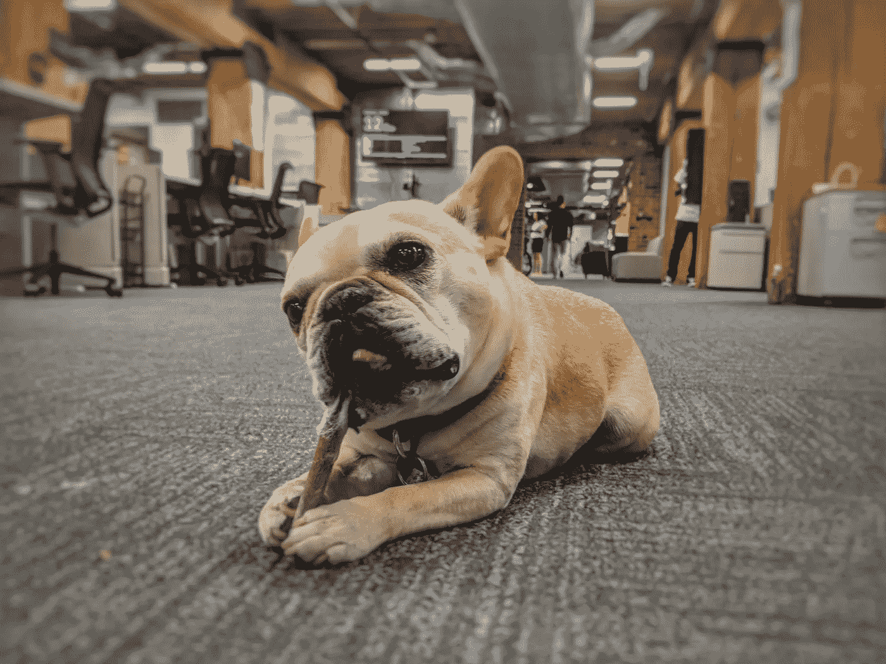
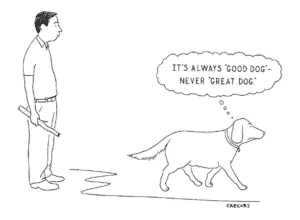

# 如何给你的办公室狗做绩效评估

> 原文：<https://medium.com/swlh/how-to-give-your-office-dog-their-performance-review-e7a79ce4845b>

Bodie — on the product team. Been with Reflektive for 4 years.

在我们为评估季做准备的时候，我们在[reflective](http://www.reflektive.com/)做了一些研究，发现网上缺乏关于如何给办公室狗做绩效评估的资源，这令人不安。

像人类一样，狗非常敏感，这就是为什么给予它们微妙而积极的表现反馈对它们的参与和生产力至关重要。

[研究](https://www.tandfonline.com/doi/abs/10.1080/08927936.2017.1270595)表明，狗对一个组织的文化和协作有积极的影响，所以强调你的办公室狗可以提高他们的表现的方法以创造一个更好的工作环境是很重要的。

这篇文章将指导你通过一些关键的方法来评估你的办公室狗，并根据他们在这个周期的表现给予反馈。

# 评估他们的目标进度

免责声明:这一步是在假设你和你的办公室狗设定了[几个 okr](https://www.reflektive.com/blog/how-to-win-okrs/)的情况下进行的，以确保在进入绩效评估之前设定了明确的期望，但是如果你没有，就跳过这一部分，确保设定未来的目标。

你必须根据你的狗的目标和他们完成的任务来衡量他们的表现。因为不是所有的办公室狗都是一样的，对照目标来衡量是减少评估过程中的偏见和不公平的一个很好的方法。

例如，你的办公室狗交了多少新朋友？他们普遍的兴奋和愉快达到办公室的标准了吗？他们是否最大限度地减少了上个季度的办公室事故数量？尝试用数字和图表量化他们的进步。

> *根据狗狗的目标和完成的任务来衡量狗狗的表现。*

# 回顾实时反馈讨论

理想情况下，你应该和你的办公室狗进行实时反馈讨论。最好的时间是在每周 1×1 会议期间，但是实时反馈平台也可以帮助跟踪反馈，即使你只能口头向狗传达你的反馈。

作为狗的经理，你有责任在整个评估周期中记录表现，以便在正式评估时，你的信息得到组织和数据的支持。

办公室狗对反馈的反应如何？他们是否根据上述反馈进行了改进？在这一步中，这两个问题都是需要记住的。如果您需要更多指导，请参考 Reflektive 首席执行官 Rajeev Behera 撰写的这篇文章，该文介绍了有效的绩效评估问题的 4 个基本属性。

> 作为狗狗的经理，你有责任记录狗狗的表现。

# 对成就给予认可

[事实证明](https://www.reflektive.com/blog/hr-roundtable-recognition/)认可是让人类和狗都参与到工作中的最佳方式之一。你为什么花那么多时间用食物来激励和训练你的狗？因为这是他们学习的方式。职场很像。

在衡量目标进展和盘点反馈讨论后，花时间对你的办公室狗在整个周期中的辛勤工作给予表扬和感谢是很重要的。因为毕竟，不管怎样，他们永远是一只好狗。

为了激励和鼓舞你的办公室狗继续努力工作，一定要明确和有目的地认可你。避免含糊不清的陈述，准确描述哪些行为和成就产生了影响。

《纽约人》

# 如何组织改进讨论

如果你处于年度评估周期，你的办公室狗可能没有意识到改进是必要的，所以一旦你明确了这个对话是必要的，下面是如何进行对话的方法。

你会想要表达清晰而坚定的意图。去年，我们写了一篇关于如何给出建设性反馈的文章，所以请点击[这里](https://www.reflektive.com/blog/constructive-feedback-mistakes/)查看，以确保您的反馈得到好评。

> *反馈示例:*
> 
> “Bodie，你在领导会议上的破坏性行为分散了注意力，也不合适。今后，如果你能在我忙的时候，保持耐心，提高工作效率，我将不胜感激。”

最重要的是，一定要向狗儿保证，它们在各方面的表现都有提高的空间，你会致力于和它们一起工作，这样它们才能发挥出全部的潜力。此外，请记住，为了确保未来的积极表现，反馈需要持续不断。

> *一定要向狗狗保证，它们的表现在各个方面都有提升的空间。*

最后，如果他们的表现导致你的办公室将他们的养狗政策从“友好”更新为“禁止”，你应该清楚是哪些行为导致了这种变化，这样他们的未来在其他地方仍然是光明的，如果他们决定采取行动的话。

## 这篇文章发表在 [The Startup](https://medium.com/swlh) 上，这是 Medium 最大的创业刊物，有+ 374，685 人关注。

## 在此订阅接收[我们的头条新闻](http://growthsupply.com/the-startup-newsletter/)。

