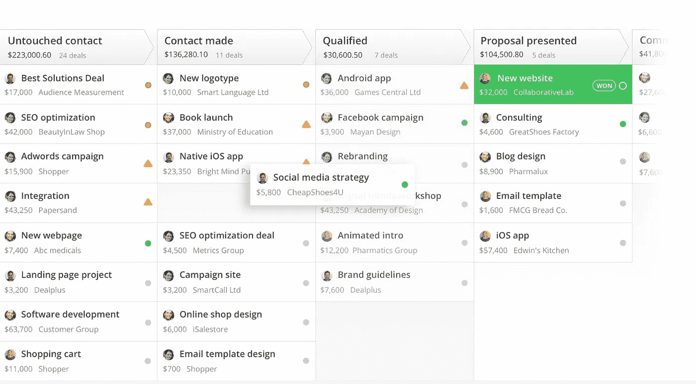
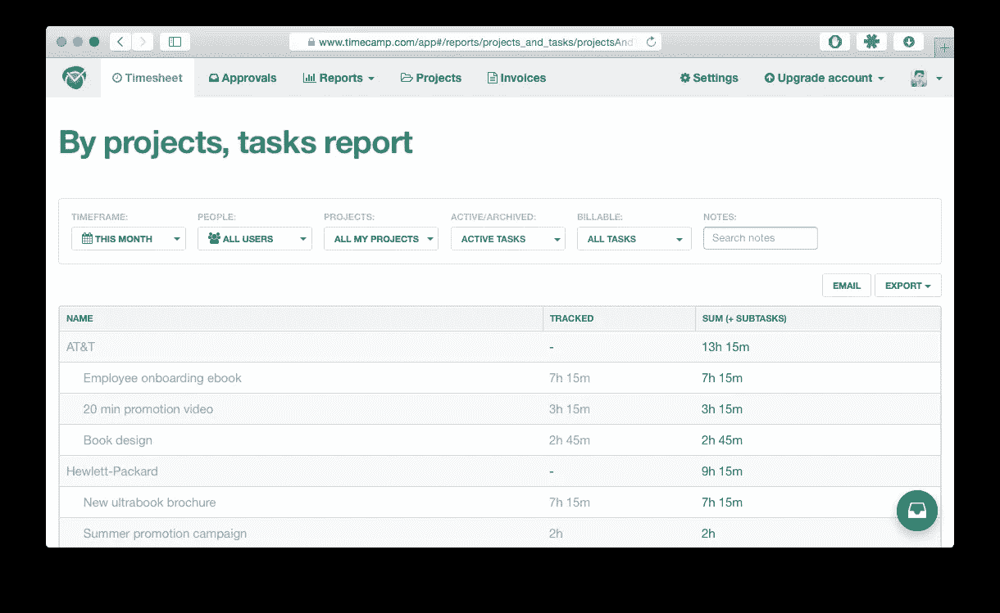
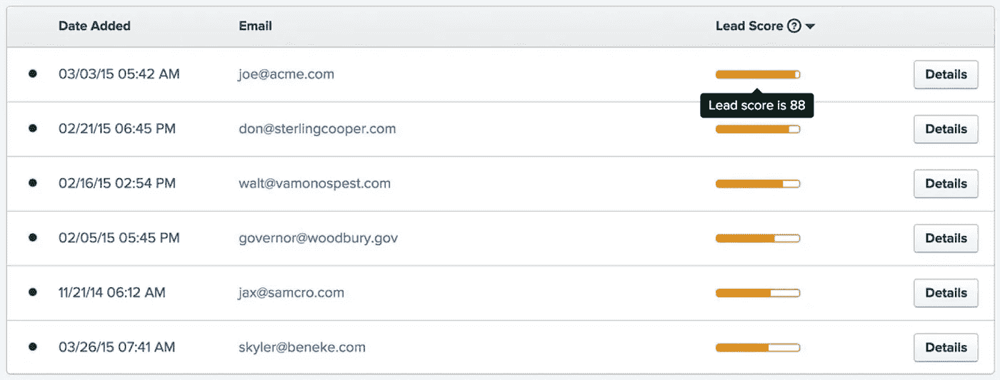
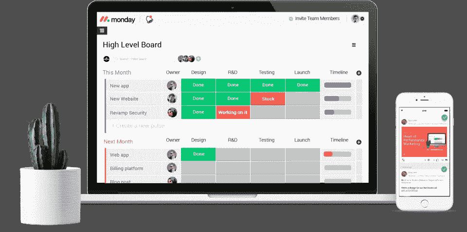
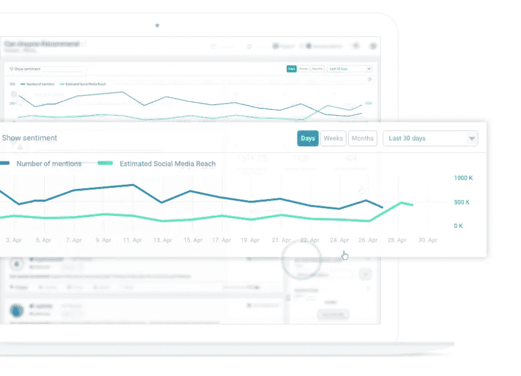

# 如何发展一家咨询初创公司:5 个对你有帮助的应用

> 原文：<https://medium.com/swlh/how-to-grow-a-consulting-startup-5-applications-that-will-help-you-5ca868199c08>

对于我们这些没有很强的编程背景，也不懂得如何与他人进行日常交流的人来说，创办或从事咨询业务是一个显而易见的选择。咨询也是我们喜欢在[picks as](https://goo.gl/db4Mmh)做的事情。

如果你是一个软技能型的人，你可能喜欢花时间和你的客户在一起，帮助他们做生意，解决问题，或者有时是更复杂的事情，比如出售他们企业的股份。

毕竟，**咨询是关于知识的**，但最重要的是，关于**我们与他人交流经验和信念的方式。**

## 咨询是关于连接知识和关系的，但是…

交谈、保持联系、建立关系几乎是你工作的 50%,所以它不可能自动化，足够幸运的是，咨询很可能永远不会被一些人工智能引擎取代，因为它永远不会取代客户-顾问关系中至关重要的关系和信任。

> “作为一名顾问，我最大的优势就是无知并问几个问题”[彼得·德鲁克](http://amorebeautifulquestion.com/peter-drucker-consultant-as-master-questioner/)，管理教育的先驱

然而，有一些方法可以帮助你管理你的人际关系、联系和交流。

您可以**使用不同类型的应用程序来提高您日常顾问工作的效率**，这些应用程序将支持您组织潜在客户渠道等任务，增加您一次可以处理的线索数量，沟通和管理您在特定项目上花费的时间，或者监控互联网上关于您品牌的意见。

# 1.使用 [CRM 系统](https://goo.gl/25fqLR)在一个地方管理您的销售线索

如果你运行或工作于一个更大的咨询机构，你可能熟悉先进的定制 CRM 系统。

有时，它们工作得足够好，但更多的时候，我从顾问那里听到:“我们已经有了一个 CRM 系统，但我们没有使用其 80%的功能”，而最常见的是我从员工那里听到“哦，不，我必须再次填写这个 CRM 信息”。

那么，在一个 80%没用或者只是日常工作中令人讨厌的元素的定制系统上花费数千美元有什么意义呢？

## 简单且真正适用于咨询业务的 CRM—[pipe drive](https://goo.gl/rKYTYr)

[Pipedrive](https://goo.gl/rKYTYr) — simply visualized pipeline of deals/leads

CRM 应该在你的日常工作中帮助和支持你，而不是分散你的注意力。

而这正是 [Pipedrive](https://goo.gl/rKYTYr) 最核心的本质。Pipedrive 的主要视图是**一个结构化的交易管道**，可以根据您的需求进行配置(例如，对于销售管道:引导- >联系达成- >会议- >谈判，或者对于并购流程:长名单- >短名单- >预告- >备忘录- >尽职调查- > SPA 谈判)。

> “Pipedrive CRM 价格合理，是最容易设置和理解的 CRM 服务之一。”[罗布·马文](https://www.pcmag.com/article2/0,2817,2488769,00.asp)，PCMag 编辑

关于 [Pipedrive](https://goo.gl/rKYTYr) 你会在你的咨询业务中发现最有用的东西有:
1。以可视化方式在一个地方查看和管理您的所有交易
2。与您的电子邮件集成，使您能够直接从 CRM 向客户发送电子邮件
3。为每个客户执行的计划活动
4。统计数据(多少百分比的交易经过了特定的渠道阶段)
5。一个移动应用程序，让您可以随时随地访问每个联系人或客户的信息、历史记录和笔记

Pipedrive 旨在提供帮助而不是分散注意力，你很可能会发现自己使用它是因为“你想”而不是“你必须”。

# 2.使用[时间跟踪应用](https://goo.gl/kAYxcg)跟踪项目花费的时间并处理每小时的客户账单

在咨询或顾问业务中，有 3 种最常见的商业模式:

1.  小时率
2.  每月预付定金
3.  成功费

不管以上哪一个是你的计费基础，知道你或你的团队在特定项目上花了多少时间是非常重要的。

如果你的团队花了 50%的时间在这个项目上，而这个项目只给你提供了 10%的月收入，那么考虑一下你如何管理你的资源分配或者你如何给你的客户开账单可能是值得的。

如果您按小时收费，您就不希望为每个员工运行 excel 电子表格。取而代之的是，使用一个应用程序来监控花费在项目上的时间，并直接从应用程序的界面向你的客户开具发票。

## 用于监控项目时间的用户友好型应用程序— [TimeCamp](https://goo.gl/Rgos8n)

[Timecamp](https://goo.gl/Rgos8n) — track and manage time spent on projects/clients

TimeCamp 是一款在线时间追踪应用，可以让你报告在特定任务或项目上花费的时间。

您可以将您的活动标记为可计费/不可计费，这对于按小时计费模式来说非常方便。

TimeCamp 和手机中的标准时间跟踪应用程序的主要区别在于，它是一个面向所有员工的集成解决方案，让您可以生成每个人的工作时间报告，也可以生成整个公司的报告。这意味着你可以得到一个关于你如何有效利用你的资源的详细而又大致的展望。

[TimeCamp](https://goo.gl/Rgos8n) 对您的咨询业务最有用的功能有:
1。生成报告哪个项目花费员工的时间最多
2。根据您在客户身上花费的时间开具发票
3。使用移动应用在旅途中快速报告

# 3.使用[电子邮件营销](https://goo.gl/K64MHe)提醒您的客户

我接触过的大多数咨询公司并不热衷于电子邮件营销。当你与客户互动时，你必须专业、勤奋并适应客户的需求。

因此，一些顾问认为电子邮件营销有点太过强势，不想给他们的客户群发送每周或每月的简讯。

然而，这种思维方式是由我们对电子邮件营销的误导性认识所驱动的，这种电子邮件营销与充满不想要的促销和愚蠢信息的垃圾简讯有关。但是你做电子邮件营销的方式可能完全不同。

你可以向你的客户或前客户提供有价值的信息，同时提醒他们关于你的品牌，这样当他们寻找咨询服务时，他们已经知道谁最了解并能在这个过程中帮助他们。

为什么不给你所有的客户发送一个链接，链接到这篇有趣的文章，告诉他们你对这篇文章的看法，或者告诉他们一些可能会影响他们业务的新规定呢？

> “电子邮件有一种许多渠道都没有的能力:大规模地创造有价值的、个性化的接触。” [*戴维·纽曼*](https://books.google.pl/books?id=0r9cDQAAQBAJ&pg=PT138&lpg=PT138&dq=Email+has+an+ability+many+David+Newman&source=bl&ots=20txI0WzlW&sig=ElVoa93erZeahkqwjwfo8-II89w&hl=pl&sa=X&ved=0ahUKEwjJ6I_PpPPXAhUDKpoKHevfCMUQ6AEIQTAF#v=onepage&q=Email%20has%20an%20ability%20many%20David%20Newman&f=false) *，营销专家*

## [滴滴](https://goo.gl/4iWkKi)——一款管理你的电子邮件营销的应用

[Drip](https://goo.gl/4iWkKi) — see who likes your emails and can become your client

使用 [Drip](https://goo.gl/4iWkKi) ，你可以简单地通过拖放和定制特定元素来设计你的电子邮件活动，就像你在 PowerPoint 上做的一样。

因此，你的**简讯可以与你的咨询业务**的风格相匹配，无论它是多彩的还是更严肃和专业的。

它还可以让您存储有关您的订户的信息，将他们分组(如按行业)，并从您的 CRM 系统(如 Pipedrive)自动更新电子邮件数据库。

使用 Drip，您还可以通过简单的可视化电子邮件发送流程来自动化您的电子邮件活动，例如，如果收件人点击电子邮件中包含的链接，下周将会自动发送一封电子邮件，其中包含有关您的服务的更多信息。

[滴滴](https://goo.gl/4iWkKi)对你的咨询业务最有用的功能有:
1。能够根据您组织的风格设计您的电子邮件
2。从您的 CRM 系统自动上传电子邮件地址
3。跟踪谁打开/点击了你的邮件，这样你就知道谁可能对你的服务感兴趣

# 4.使用[项目管理应用](https://goo.gl/DXSg23)构建和管理您的项目

有时候你的项目流程非常简单，没有太多需要担心的，尤其是如果你是项目的唯一负责人。一旦你开始提供更复杂的服务，一次管理几个客户或者在一个更大的团队中运作，问题就出现了。

然后，一次管理所有事情变得相当具有挑战性。然而，在你的组织中，有很大的空间来提高应用程序的效率，这些应用程序可以帮助你管理正在进行的项目。

例如，潜在投资者的名单不需要通过来回发送 excel 电子表格来管理。您可以使用项目管理应用程序对其进行组织，然后**与您的团队分享，并就该列表进行实时协作**。

[- >观看我们的视频如何使用 Monday.com 管理投资者名单](https://goo.gl/yKkecm)

## [Monday.com](https://goo.gl/Yx8ooz)—管理您咨询项目的项目管理应用

[Monday.com](https://goo.gl/Yx8ooz) — manage the project’s flow or the list of investors

[Monday.com](https://goo.gl/Yx8ooz)是一个非常有趣的应用程序，可以帮助你管理你的项目，它的工作方式对咨询业务特别有用。

使用 Monday.com，您可以设置不同的任务，并轻松地设置它们的状态。因此，举例来说，你可以为你的客户做非常全面的项目管理(例如，为 M&A 咨询公司:挑逗-> NDA ->信息备忘录->尽职调查-> SPA)，但你也可以**为每个客户创建单独的董事会**进入项目的细节，例如，管理你的潜在投资者名单。

[Monday.com](https://goo.gl/Yx8ooz)对你的咨询业务最有用的特点是:
1。与您的团队成员实时协作处理项目/列表
2。将数据导出到 excel，向您的客户发送可视化更新
3。根据每个项目的特点定制其结构

# 5.使用[品牌监控应用](https://goo.gl/ztyqUi)监控您的品牌声誉

> “建立一个声誉需要 20 年，毁掉它只需要 5 分钟”[沃伦·巴菲特](https://www.forbes.com/forbes/welcome/?toURL=https%3A//www.forbes.com/pictures/eede45imgh/it-takes-20-years-to-bui/&refURL=https%3A//www.google.pl/&referrer=https%3A//www.google.pl/)

声誉是咨询业务成功的关键。一个满意的客户可以为你未来的客户创造奇迹，但是同样的，一个不满意的客户会毁了你的声誉，让你再也得不到更多的合同。

在今天的网络世界中，监控你的品牌在互联网上的声誉并快速处理任何危机变得至关重要。

这很难通过只在谷歌上键入你的品牌名称来处理，但使用品牌监测应用程序就容易多了，它可以帮助你在互联网或任何社交媒体上接收关于你的品牌提及的即时更新。

## 品牌 24——一个品牌监测应用程序，用来监测人们对你的品牌的评价

[Brand24](https://goo.gl/w579aP) — know when somebody says good or bad about your brand on the internet

使用 [Brand24](https://goo.gl/w579aP) ，您可以观察互联网上的特定关键词，并获得任何新提及的通知。例如，该应用程序可以**通知你有人在脸书或博客上推荐你的公司**，这让你可以与此人联系并表达你的谢意。

同样，当有人抱怨你的服务时，你可以迅速做出反应，解决任何问题。一些真正值得考虑的关系和声誉驱动的咨询业务。

[Brand24](https://goo.gl/w579aP) 对你的咨询业务最有用的特点是:
1。监控互联网/社交媒体上关于您品牌的任何提及
2。分析你的品牌在互联网上的总体受欢迎程度
3。观察和监控竞争对手的活动

## 专注于真正重要的事情，将日常任务自动化

你与客户合作的方式、你的建议的质量和相关性是你独特的销售主张。专注于在真正重要的事情上变得越来越好，自动化任何其他重复性的任务。

每隔几天自动发送电子邮件可能不是最好的选择，但构建你与客户的工作和沟通方式，使用上述应用将**让你更有效率，可能会节省你的时间和金钱**并且你的客户会因为你更加关注对他们真正重要的事情而喜欢你。

在 picksaas.com 的***中，我们发现了帮助您发展电子商务、服务、网站、博客或其他业务的应用程序。我们帮助您找到合适的营销、分析甚至设计应用，帮助您的公司变得更加有效。要接收我们关于发展您业务的最佳应用的更新，您可以随时* [*订阅我们的邮件列表中的*](https://picksaas.us16.list-manage.com/subscribe/post?u=0a811ad254e7cd14718599e3a&id=bdf0cfd955) *或关注我们的*[*Twitter*](https://twitter.com/picksaas)*。***

**您也可以* [*向我们预约一个简短的咨询*](https://app.acuityscheduling.com/schedule.php?owner=14759847) *，我们将向您展示如何配置、实施和使用最适合您特定业务需求的应用。**

**如果你觉得这份材料有用，别忘了鼓掌并查看其他故事:**

*   *[*我们用来提高营销效率的 5 款应用*](https://goo.gl/tb5ek5)*
*   *[*我们用来更好地管理公司的 5 款应用*](https://goo.gl/sQ5Xax)*
*   *[*3 种为你的电子商务业务做广告的应用*](https://goo.gl/q61vg8)*
*   **3 款提升你社交媒体营销的应用**
*   **[*云应用如何帮助这家公司在两年内拥有 1，000 名付费客户*](https://goo.gl/nQA8vT)**

****

## **这个故事发表在 [The Startup](https://medium.com/swlh) 上，这是 Medium 最大的企业家出版物，拥有 273，707+人。**

## **在这里订阅接收[我们的头条新闻](http://growthsupply.com/the-startup-newsletter/)。**

****