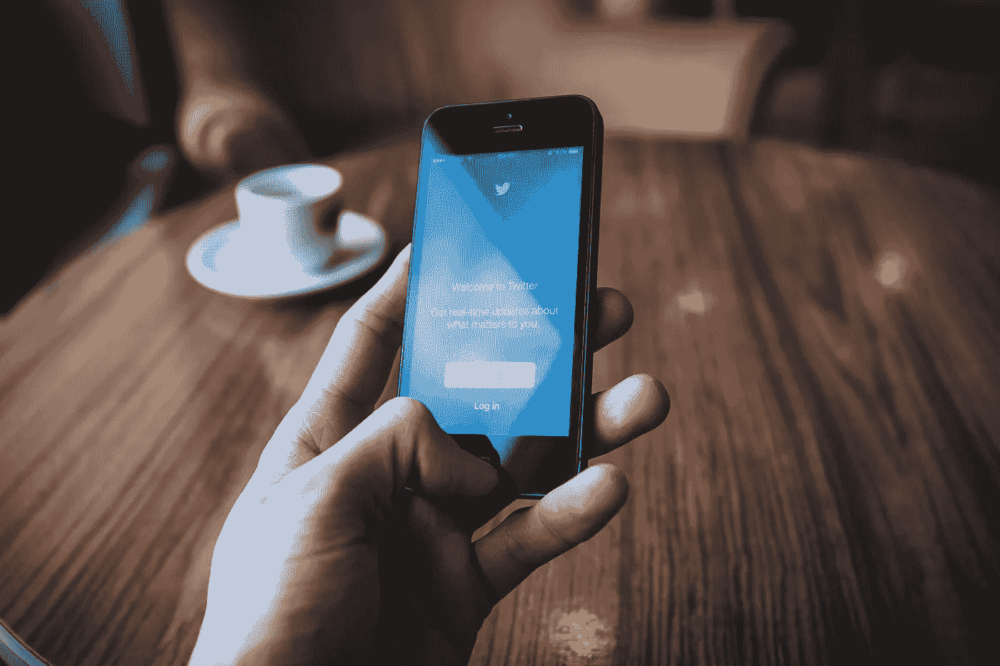

# 如何在任何平台(包括媒体)上培养一个可笑的追随者

> 原文：<https://medium.com/swlh/how-to-grow-a-ridiculous-following-on-any-platform-including-medium-6639642faeed>

前几天，我为 LinkedIn 制作了一个关于这个问题的非常激进的视频[。](https://www.linkedin.com/feed/update/urn:li:activity:6369535454705971201)

> 如果你不知道的话，LinkedIn 是现在发展粉丝的最热门的地方之一。

他们正在做各种各样的改变——敦促内容创作者像 19 世纪 40 年代后期的 40 个 9 那样涌向加利福尼亚。

只有一个问题..

> 我喜欢的来自 Medium、Instagram 甚至 Twitter 等平台的创作者蜂拥而至，只是为了创作一些不尽如人意的内容。

换句话说，他们是伟大的创作者，但他们只是不知道如何创作适用于 LinkedIn 的内容。这对我来说有点疯狂，因为:

1.  这表明杀手级内容创作者并不总是知道他们在做什么。
2.  内容不仅是包装，也是里面真正的内容。

> 我可以写一篇关于 Medium 的 1500 字的帖子，里面有很多很棒的见解，但是如果我把标题搞乱，把整篇文章变成一堵长长的文字墙，就没人会去读了。

是真的。

这就引出了我的第一点..

# 1.更好地“包装”内容

在我的在线课程中，我首先教人们如何写一篇好看的文章。

事实上，我在我的初学者文章中看到的 80%的问题都与结构有关。

只是读起来不太直观。

> 标题下面的图片不是普通图片，没有使用标题或引用，段落在过去的 4-5 行中漫游，形成巨大的内容墙。

我并不反对他们，他们只是需要学习。

许多看了[我的电子邮件课程](https://app.convertkit.com/landing_pages/290945?v=6)的人不明白这一课的价值。

> 朋友们，这可能是 75%的问题。

我这么说是因为不管你的文章有多好，如果它对平台来说不直观，没人会去读它。

> 老实说，这是一个小调整，可能需要 5 分钟来实现。多造几段，多拉几个引号，多造几个标题就行了。

换句话说，把你的诗隔开。

但那是中等。

LinkedIn，或者 Instagram，或者 Twitter 呢？你如何能找出那些平台的直觉？

> 很简单，你看那些已经在那里杀人的人。

在这里，你可以从像蒂芙尼·孙、尼古拉斯·科尔和本杰明·p·哈代这样的作家那里获得灵感。其他地方都一样。

每个平台都有大玩家。

找到他们，分析他们在做什么，并开始将这些发现融入到你自己的内容中。

# 2.耐心等待

> 你不会总是在站台上表现糟糕。

你知道为什么我的文章现在有 100 多个粉丝吗？

因为我有 24000+的粉丝！我认为我的内容相对较好，但它肯定有助于我有很多追随者。如果我没有那么多关注者，你认为每篇文章都会像现在这样受欢迎吗？

> 答案是否定的。

但是我等了很久才得到这么多的追随者！

我练习过。我已经调整了。我已经搞清楚什么对 Medium 有效，什么对 Medium 无效。

像加里·维说的，要有耐心。

> 这太疯狂了，甚至我开始真正钦佩的创造者也决定过早退出 LinkedIn。我并不是在批评他们——我只是想告诉你，即使是从创造性的角度来看拥有这一切的人也很难有耐心。

我也是。

从获得数百个喜欢到再次获得 1-2 个“喜欢”是很难的。

那些在一个平台上获得成功的人没有耐心去尝试另一个平台，因为他们为什么要这样做呢？

他们已经在其他地方获得了数千个赞。他们的时间投资在那里不是更好吗？

> 不过，我认为这是一场游戏。我喜欢找出一个平台，然后一步步走向成功。我喜欢看到数字越来越多。换句话说，我就是喜欢有创意。

# 3.写正确的主题

我认为《媒介》肯定缺乏触及的话题。

个人发展、写作、技术和其他一些“标签”在这里似乎做得很好。

但仅此而已。

> 健康/保健怎么样？心理健康呢？媒体上的顶级出版物似乎关注同样的事情，这很好，但几乎没有代表其他有不同兴趣的人。

Medium 是我认为任何人都可以做得很好的平台之一。如果你是一个想写心理健康话题的博主，你可能不会像一个个人发展作家那样在这里找到读者——但是仍然会有读者。

Medium 容纳了许多不同的人，他们有许多不同的兴趣。除此之外，你还会做什么？开博客？

> 你仍然需要通过脸书、推特、Instagram，是的，还有其他媒介，让所有人回到你的博客。

> 观众在这里——只是可能不会成群结队。无论如何，你都要在其他地方推销你的帖子——不妨把它们“安置”在你的一些读者已经在的地方(而不是在 Wordpress 上)。

> 关键是，每个平台都有一个主题问题。

如果你不写人们在那个平台上寻找的内容，对你来说将是一场艰苦的战斗。

# 4.遇见你的偶像——然后成为他们

我经常看到我的 LinkedIn 偶像在帖子中标记其他 LinkedIn 偶像。

> 这很好，但这些有影响力的人所做的只是交换观众——因此加强了彼此的影响力。

我认为成为一个平台上的影响者的很大一部分是与那里的其他影响者友好相处。

> 我认识蒂芙尼·孙、托德·布里森、安东尼·摩尔和亚历克斯·马瑟斯。

他们是很棒的人。他们在这里都有 20，000 以上的粉丝。

我们一起做了很多有趣的项目，我们真诚地互相帮助。

> 我只是认为，如果你不认识顶级球员，或者至少试着友好一点，你就永远不会在某个地方真正成功。

伸出手去，友善一点，但是不要让他们马上在下一篇文章中给你贴标签。考虑周到，比如他们的一些帖子，也许可以问他们你是否可以采访他们，并在即将到来的文章中标记他们。

> 这并不是 100%需要的，但是在任何给定的平台上，接触其他一流的玩家真的可以加速你的成长。

做好这四件事，你就能快速占领你选择的任何平台。

> 想在媒体上赚点外快吗？本周我将主持一些免费培训，名为“**如何在 Medium 上每月额外挣 900 美元**”[在此获得免费座位](https://events.genndi.com/register/169105139238473045/da2e6c5a01)！

## 这篇文章发表在[的《创业](https://medium.com/swlh)，这是 Medium 最大的创业刊物，拥有+ 376，592 读者。

## 在这里订阅接收[我们的头条新闻](http://growthsupply.com/the-startup-newsletter/)。

