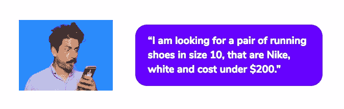
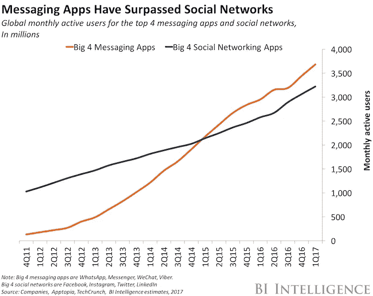

# 如何在不雇佣更多人的情况下发展和扩大你的业务？

> 原文：<https://medium.com/swlh/how-to-grow-and-scale-your-business-without-hiring-more-people-f34b50b3da72>

## 为什么客户获取的未来都在对话中

*(滚动到底部观看训练视频)*

## 营销瞬息万变，你必须跟上。

## 您的客户需求，即时个性化关注！

多亏了这些人设定的高期望值:

尤其是千禧一代买家，他们每年花费**6000 多亿美元**

你可能听说过:**机器人是未来**。

事实上，如果你今天想知道你的企业是否应该创建一个机器人，你问错了问题。

机器人驱动的商业是我们现代的命运。

# 那么，机器人到底是什么？

机器人只不过是一个自动完成某些任务的计算机程序，通常通过对话界面与用户聊天。

最先进的机器人由人工智能驱动，帮助它理解复杂的请求，个性化响应，并随着时间的推移改善交互。

这是我们所看到的消费者行为大转变的一部分。

随着人们进行研究，他们希望尽快获得所需的信息，并且随着技术的进步，越来越多地转向语音搜索。

电子邮件收件箱变得越来越杂乱，因此买家已经转向社交媒体，关注他们真正关心的品牌。

任何买家想要的只是他们的**问题**和**解决方案**之间最直接的联系。

假设你想从你最喜欢的网上商店买一双新运动鞋。您可以访问他们的网站，浏览 50 或 100 个产品页面，在表单中填写您的运输和付款信息，等等。

但是如果它有一个机器人，你只要告诉它…

…它会引导您浏览所有选项并下订单。

在幕后，机器人正引导你通过一系列相关的问题来收集必要的信息，以理解你的意图，然后提供正确的内容来满足你的需求。

> **在消息应用的帮助下，机器人可以帮助消费者找到解决方案，无论他们身在何处，使用什么设备。**

没有**表格**，**杂乱的收件箱**，或者**浪费时间**搜索和滚动内容。

沟通、服务和交易交织在一起，以提供顺畅、即时的对话。

他们完成他们的任务，从开始到结束，在你已经花费时间的地方:**消息应用。**

无论是 Facebook Messenger，WhatsApp，微信，还是 Viber，机器人都与这些应用程序集成在一起，可供您聊天。

换句话说，机器人首先解决了我们讨厌应用的问题。你不必下载你永远不会再使用的东西。

据说大多数人坚持使用五个应用程序。

**那些圣杯斑点？**

它们越来越多地被消息应用程序所占据。

今天，消息应用拥有超过**50 亿的月活跃用户**，人们第一次比社交网络更多地使用它们。

# 除非你是下一个十亿美元的科技独角兽，否则你的商业应用不太可能得到应有的关注。

A Tech Unicorn is a private company with a $Billion+ Valuation

机器人可能曾经是“人工智能世界的傻瓜”，但聊天机器人为任何行业的营销人员提供了与消费者在**个人**、**直接层次**上**互动**的机会——只要它们能够用引人入胜的叙述抓住(并保持)用户的注意力。

# 机器人可以在一天中自动完成数百甚至数千次交互，而这在传统上需要内部团队数小时的来回沟通。

**现在是时候对客户旅程的每个阶段进行高度个性化，并利用聊天机器人扩大业务规模。**

*   **将客户获取成本降低 50–80%**
*   **将参与度&转化率提高 500%**
*   **将客户服务成本降低 50–80%**

# **5X 订婚。**

参与度很难产生。聊天机器人是通过任何其他渠道与客户沟通的最简单方式

# **6 x 固位**。

愤怒的顾客流失。事实证明，24/7 全天候支持可以减少愤怒的客户，并将保留率提高 6 倍。

# **部署速度提高 10 倍**。

寻找与客户沟通的最佳方式？聊天机器人的部署速度是应用程序的 10 倍。

# 你准备好发现聊天机器人将如何彻底改变你的营销和销售了吗？

[在 RevStack，我们将人工智能、机器学习和数据科学领域的一些最聪明的头脑与数字营销策略师和销售黑客配对。](http://www.revstack.ai)

那么，为什么大多数创业公司、企业…甚至是财富 500 强企业没有开始利用对话式客户获取的力量…

因为…

就像 Kanye 一样，每个人似乎都有点失落…而且是有充分理由的。

人工智能、机器学习、聊天机器人和对话式商务都很复杂……所以我们建立了 RevStack。

RevStack 是一个人工智能驱动的销售助理，可以全天候工作，预先确定销售线索，与客户沟通，并通过聊天、文本、语音、电子邮件和移动钱包同步外联。

跳过在部署聊天机器人销售和营销大军时出现的高学习曲线和延迟。

或者…

看看我刚刚为一群小企业主进行的最新培训。

注册一个 RevStack 软件的免费试用版，或者联系我们安排一个时间，让我们为你开发你的对话增长机器。

# **如果你喜欢这个，请给我 10 个以上的掌声祝我好运。感谢**

**雷蒙·l·施瓦茨三世**

## 这篇文章发表在 [The Startup](https://medium.com/swlh) 上，这是 Medium 最大的创业刊物，有 287，184+人关注。

## 订阅接收[我们的头条新闻](http://growthsupply.com/the-startup-newsletter/)。

