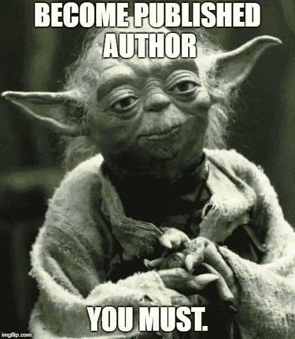
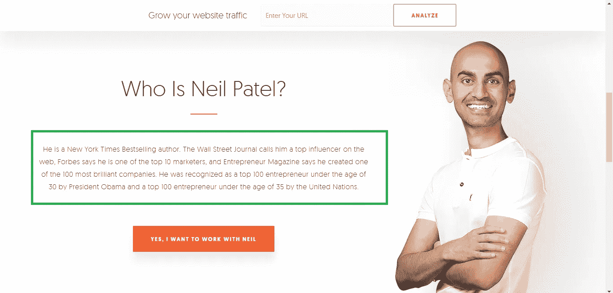
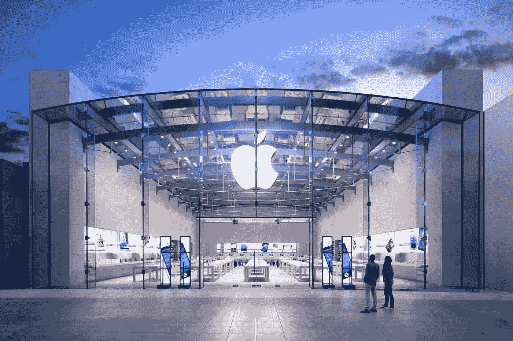
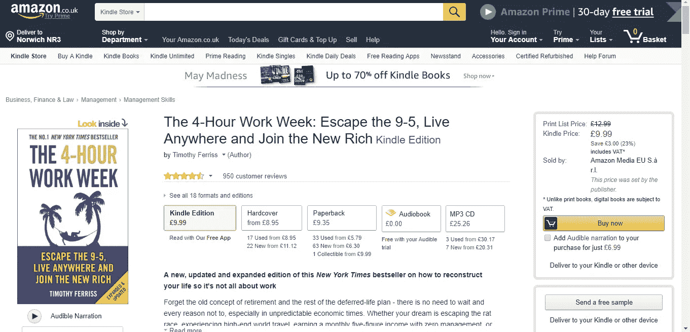
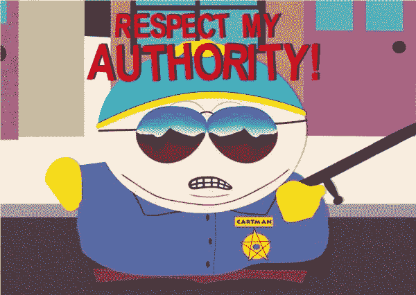
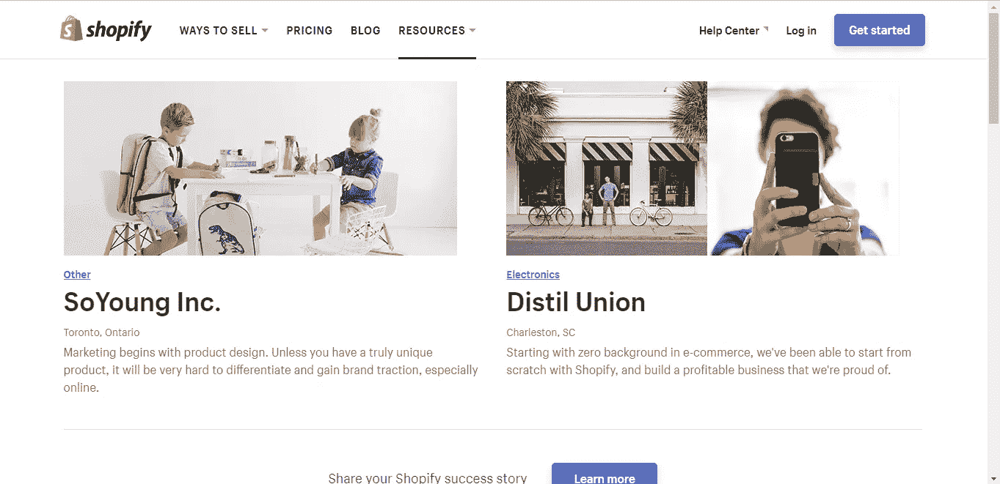
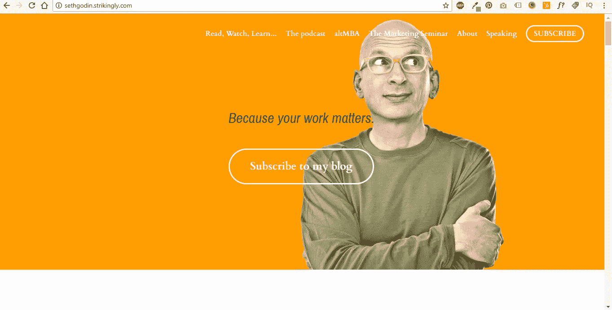
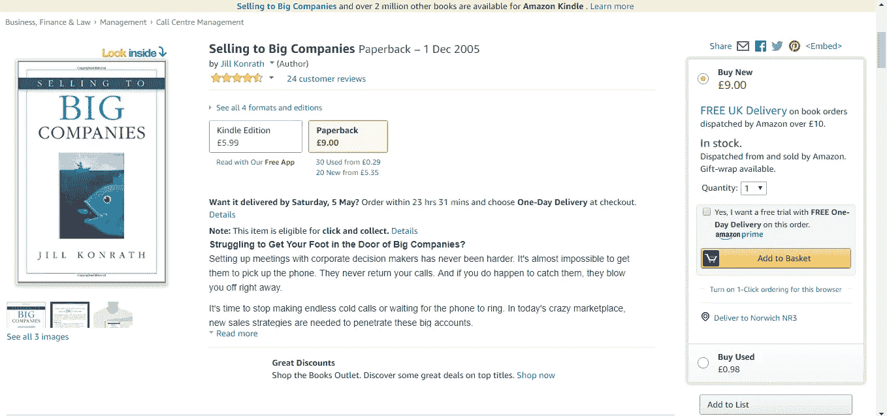
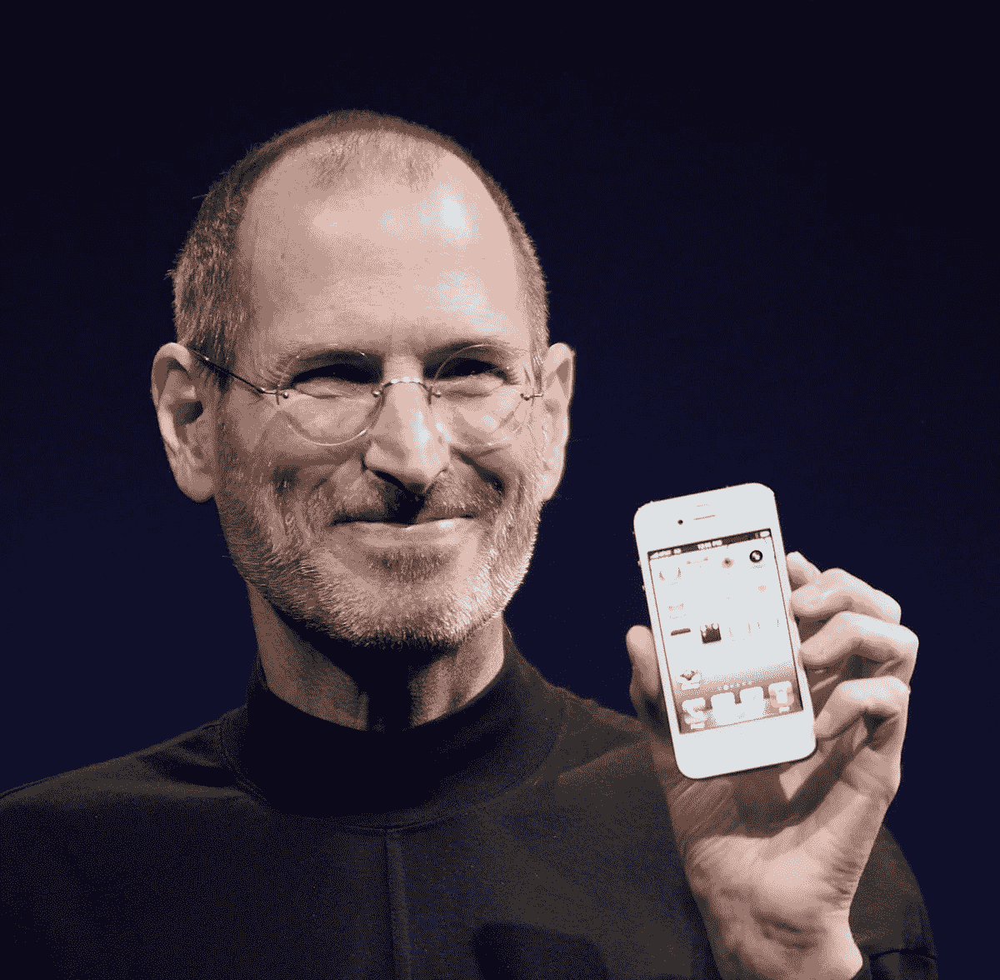
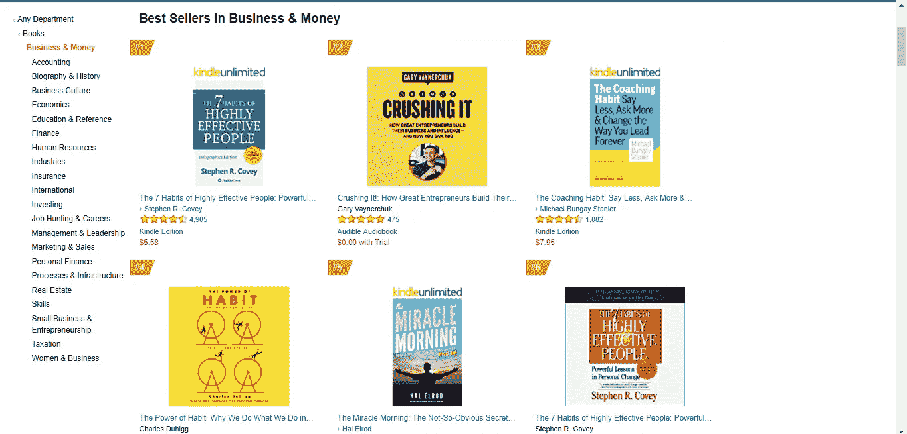

# 如何通过成为一名出版作家来发展你的业务

> 原文：<https://medium.com/swlh/how-to-grow-your-business-by-becoming-a-published-author-8d8503c8ee4>

你有没有在一项你非常擅长的工作上**失去过**，也许是输给了一个**更大的竞争对手**？

你是否曾经希望有一种方法可以让你**甚至** **在游戏场上稍微活跃一点？**

嗯，有，这叫**成为你所在领域的权威。**

# 权威营销

思想领导力这个术语多年来一直是热门话题。那是被人 [**写在赫夫博上的**](https://www.huffingtonpost.com/brian-horn/authority-marketing-is-a-_b_4918759.html) **远溯到 2014 年。久而久之，**思想领导演变成了**权威营销。**

**权威营销**是来自权威的**营销的概念。**

权威营销**意味着被**定位**为你所在领域的**专家**，这样你的论点**就来自权威。****

当你的观点来自**权威时，**人**会注意到。**

# 为什么权威很重要？

如果有两个人给你建议，其中一个是**出版的作者和公认的权威，另一个只是另一个**从业者**，你会听谁的？**

如果他们都有同样令人信服的论点，来自权威的**论点可能会胜出。**

这和**奖状、社会证明是一个概念。企业通常会看你和谁一起工作过，以及你是否在他们的领域工作过。**

**社会证明**是 **B2B** 销售行业的命脉。没有它就很难过下去，有了更多的社会证明就变得越来越容易。正如芭芭拉·科克兰(Barbara Corcoran)会说的:“每个人都想要每个人想要的东西，没有人想要没人想要的东西”。

看看**尼尔·帕特尔，比如**。如果你是一家大企业，想要最好的营销人员，你会听谁的？通用大型**营销机构或福布斯、奥巴马和联合国代言的家伙。**

Neil Patel — authority in action

# 获得竞争优势

营销就是要在竞争中保持领先。

如果你的所有竞争对手都**采用了集客营销，有好的推荐**和**像样的案例研究，你如何让自己与众不同？**

人们为什么**购买**本质上是关于三件事:

1.  产品/市场适合度
2.  价格
3.  **感知价值**

感知价值是某人认为你(或你的产品)的价值。

人们为苹果手机支付的高额费用值得吗？如果你把成本分解成**只是**螺母和螺栓，那么当然不是。

但是就普通大众的智能手机而言，苹果被视为权威，所以人们乐意为他们的产品(和品牌)支付高价。

# 想想斑马，而不是奶牛

如何在拥挤的市场中脱颖而出？

你做一些不同的事情。

过去两年，每个人和他的狗都开始使用脸书广告。

你不可能在 5 分钟内不被某个家伙的销售页面式广告轰炸，这个家伙每周在某个海滩工作 5 个小时，而他的生意每年自动为他赚 100 万英镑(我不知道这这么容易！).

谁还记得 5-10 年前的 PPC 辉煌时代，那时仅仅通过点击付费就可以在网上获得成功？

是的，我是那些从这个**惊人的营销渠道**中获益的人之一。

但是，就像所有营销趋势一样，最终每个人都会明白并开始采用它。使用平台**的**成本**急剧上升**，有效性**也急剧下降**。

# 每个人都注意斑马

Zebra cow — patent pending

如果你所在领域的每个人都在做一件事，**做相反的事情**。

如果脸书充斥着执行不力的广告，那就别玩老套了。

**写书。**

与 10-20 年前相比，在 2018 年写一本书并不困难。

**冷呼叫**仍然工作也是有原因的，它切断了**噪音**。如果你的潜在客户淹没在数字广告、博客文章、白皮书和网络研讨会中，用一本**研究充分的书来打破噪音，树立你的权威。**

你会惊讶地发现，如果配有**有针对性的推广策略，自己出版一本关于你专业知识的书是多么有效。**

一个公司的 **CEO** **会更关注什么…**

那个月他收到的第**1000 封电子邮件**要求**给他 15 分钟**的时间，或者是**亲手将一本书**送到他的办公桌上，书的标题**吸引人**并且封面设计得很好？

我可以向你保证，这封邮件会直接进入垃圾邮件，但这本书会留在他的书桌上，留在他的脑海里。

# 给我举个例子

听说过蒂姆·费里斯吗？

他写了一本名为《每周 4 小时工作制》的小书。

在他写这本书之前，几乎没人听说过这个人。一旦他这么做了，他一夜之间就爆发了。

《每周 4 小时工作制》已经售出超过 135 万册，并连续 4 年荣登《纽约时报》畅销书排行榜。

这本书出版于 2007 年，当时互联网是一个不同的地方。从那时起，我们已经取得了巨大的飞跃，今天出版一本书是无限容易的。

我想说的是，在这本书之前，没有人听说过蒂姆·费里斯。在他花时间以一本书的形式抓住他的价值并适当地宣传之后，他成为了我们这一代最有影响力的自助作家之一。

# 权威作为领导性别工具

这是一个提升竞争的问题。

如果每个人都在用免费的电子书来交换电子邮件，那就用一本真正的书来交换电子邮件。

随着数字营销进入门槛的降低，创造和运作数字营销活动的能力甚至连最不擅长技术的企业主都掌握在手中，竞争力也会增强。

例如，世界上最大的博客赫芬顿邮报每 58 秒发布一篇文章。这是每天 1600-2000 篇文章，现在每天至少增加几百篇。

每天有多少**企业主出版书籍？**

我打赌它远没有这么高。

# 权威是如何产生的？

权威通过以下三种方式之一产生:

*   **隐含权限**
*   **来自社会的权威证明**
*   **权威来自思想领导**

# 隐含的权力

隐含制服的一个很好的例子是**制服。**

如果我们看到**警官**在执勤，这立刻暗示他们有权力。

他们负责执行法律，他们的制服意味着他们的权威、训练和职位。医生的白大褂是另一个很好的例子。

一个医生不需要出版一本书来让我们知道他是这个领域的专家，他的白大褂已经说明了一切。这个人**接受了多年的教育**，这身制服很难挣。

罗伯特·恰尔迪尼在他的书 [**影响力:说服心理学**](https://www.amazon.co.uk/Influence-Psychology-Persuasion-Business-Essentials-ebook/dp/B002BD2UUC) 中写到了隐含权威的概念，如果你想了解这个话题，这本书很值得一读。

# 来自社会证明的权威

这就是**证明和案例分析的用武之地，也是它们如此重要的原因。**

社会证明告诉别人**你在**之前已经做得很好，你可以**再做一次。**

这是一个**信任信号**，它降低了决策过程中的风险因素。如果你作为权威被别人信任，我就更容易把你视为权威。

掌握了社会证明的公司是 Shopify。就小型网上商店而言，他们已经垄断了市场。

有更好的解决方案吗？当然，Woocommerce 就是其中之一。

但是，他们基本上是突然冒出来的，并凭借其令人难以置信的以客户成功为中心的营销赢得了巨大的市场份额。

他们有**大量的成功故事，基本上跨越了每个垂直领域**，并撰写了**大量经过充分研究的长篇内容**，讲述如何从零开始引导和发展商店，参考**他们自己的客户在他们的平台上做了同样的事情。**

Shopify Success Stories

# 来自思想领导的权威

你也可以称之为**证据就在布丁方法中。**

来自思想领导的权威是通过**行动获得的。**

通过**展示你知道你在说什么，通过给别人免费的价值。**

这是博客和内容营销背后的全部意义。没人知道你知道什么，除非你告诉他们。

创造**有用的、信息丰富的内容，或者把它分发出去或者卖给其他人**直接展示了**你知道多少**。

如果你真的是一个**思想领袖，证明给我看！**

当我想到**营销思想领袖**时，第一个想到的名字是**尼尔·帕特尔、塞斯·戈丁和加里·v .**

每个人都知道加里五世，因为他的**疯狂鼓舞人心的** **视频**和他如何发展他的家族葡萄酒业务的故事。

尼尔·帕特尔用他的**难以置信的博客**赢得了我的心，我在今年年初偶然发现了他的博客**。说真的，**如果你需要**学习任何营销相关的东西，去他的博客吧。**

大约 8 年前，我买了一本塞思·戈丁的书，就市场营销而言，他的书仍然在我的脑海中挥之不去。这正说明了拥有一本书有多么强大。

# 如何从思想领导中获得权威

建立思想领导力并不是一个新概念。

它以一种或另一种形式存在于时间的开端。

政治家、商人、学者、商人、当地酒吧的朋友，我们都这样做。

我们通过提供令人信服的论据来做到这一点。

无论是说服**朋友或同事**某款车是检验你说服力的方式，还是**从一场特别引人注目的**网上研讨会中获得新线索**。**

思想领导力是通过**给予价值并通过有效的沟通来“销售”这种价值而获得的。**

在某一点上，送出 **x 数量的价值后，**你就成为了**权威。**

每个行业和每个潜在客户的门槛都不一样。

你可能会发现你从一个视频教程中获得了线索或销售额，或者可能要花上好几个月的努力才能有所收获。

# 一本书是自动驾驶仪上的权威建筑

一本书特别强大的一点是它是有形的。

一本书将为你赢得权威，并占据某人办公室或家中的不动产。

不仅如此，如果你**卖掉你的书，**这种为你的权威买单的心理行为即使是很小的购买，也会让你更容易卖出更多。

这为更大的采购和与那个人进一步做生意打开了大门。

光是这方面就有整本书，像吉尔·康拉斯的《卖给大公司》中的《T1 T2 T3》，还有《T4 T5 T6 T7》等，这些书都谈到了从大公司做起，赢得他们的信任，并将其发展成大公司的重要性。

# 如何自我发布你的专业知识

自我出版一本书不再是过去那种令人生畏的任务了。

作为一个帮助企业自助出版书籍的人，我可以告诉你，这是我们每个人都可以做到的。

所需要的只是将你的专业知识写在纸上的动力和耐心。

这里有一些自助出书的简单技巧。

# 1.写**——**从每天写 500-2000 字开始。

一本书通常有 40，000 到 80，000 字，所以如果你一周 7 天每天写 500 字，你可以在 80 天内写完你的第一本书，也就是说不到 3 个月。

正如史蒂夫·乔布斯所说:

> “真正的艺术家之船”

Steve & team shipped an iPhone, so you can ship your book!

# 2.自助发布 3.0

出版经历了三个阶段。

在出版 1.0 版本中，你必须通过一家大型出版社来出版。

出版 2.0 发生在**自助出版成为潮流**的时候。例如，去年有**1500 万本书出版**，而 10 年前有 **30 万本(天哪)。通过自己动手或一些廉价的快速解决方案，你的书很快很容易就能出版。**

发布 3.0 是我们现在的处境。由于数字经济和自由职业者及初创企业的巨大增长，才华横溢的出版商、设计师和营销人员开始独立创业，并在 T42 独立收费。顶级服务，小型企业价格。

这比发布 2.0 版的成本高，比发布 1.0 版的成本低很多，但利润却高得多。

# 3.构建您的平台

传统出版商没有一个**大平台连看都不会看你一眼。**

但是当你可以建立自己的平台时，为什么还需要它们呢？

用一个**诚实的声音为你的书**搭建一个**有效的平台。提供你所在行业的独特视角**,不要害怕说别人不会说的话。

在大型网站上发表客座博客，自动安排你的社交媒体日程，在你的新书发布前的促销活动中保持**的一致性**。

# 4.有一个杀手级的头衔

**标题就是卖点！**

你认为为什么过去几年有这么多点击诱饵？

每个人都渴望点击。你的书名将决定有多少人会多看一眼。

就像销售一样，**你的开场白**为你赢得接下来的 10 秒，而接下来的 10 秒为你赢得接下来的 60 秒。

看看亚马逊最畅销商业书籍列表中的这些标题，没有一个不是非常有趣或引人注目的

Best selling titles

# 5.设计出它的赫克

你的书的封面非常重要。

想象一下你最后一次去大型书店的情景。

实际上有成千上万本书。你如何决定选择哪一个？

**盖。**

说够了。找一个杀手级设计师，确保你的标题吸引眼球，并立即告诉人们它是怎么回事。

# 6.编辑您的编辑，然后编辑这些编辑。雇一个编辑。

一个好的编辑可以决定你的书的成败。

请听一听詹姆斯·奥尔特鲁彻的话，他是一位非常成功的出版作家和风险投资家，与他的编辑一起工作:

> 为了我的书，尼尔斯和我来回进行了超过 15 次不同的重写。原版和最终版的区别就像鸡屎和鸡肉沙拉的区别。

鸡粪和鸡肉沙拉男。

没人喜欢鸡屎，不要鸡屎！

# 7.推销你的书

如果苹果不是营销天才，你认为世界会为每一次 iPhone 发布而疯狂吗？

当然不是。

你的书也是如此。你**不营销，没人知道**有多牛逼。**了解**你的**观众**以及他们**在哪里闲逛**。

然后确保你**深入这些地方，给他们一点自由价值**向他们介绍你的书。****

如果你的**信息和语气**正确共鸣，那么这就是一个数字游戏。

如果你对推销你的书没有信心，那么**雇佣**一个**的营销人员**或者**的自助出版供应商**，他们可以为你处理这件事。

# 大声说出来

最后，一旦你成功地**出版了你自己的书**,为之自豪吧！

确保在你的社交媒体平台、网站和营销推广中展示你的**权威。**

**在你的**网站登陆页**上展示你的书一定会**增加转化率**并让你的社交温度计从**不冷不热变成滚烫。****

# 感谢阅读！

我希望你觉得这篇文章很有见地，并且给了你一些思考的东西。

## 如果这篇文章让你思考，给它一个👏别忘了关注我:)

## 这篇文章发表在 [The Startup](https://medium.com/swlh) 上，这是 Medium 最大的创业刊物，有 322，555+人关注。

## 在这里订阅接收[我们的头条新闻](http://growthsupply.com/the-startup-newsletter/)。

