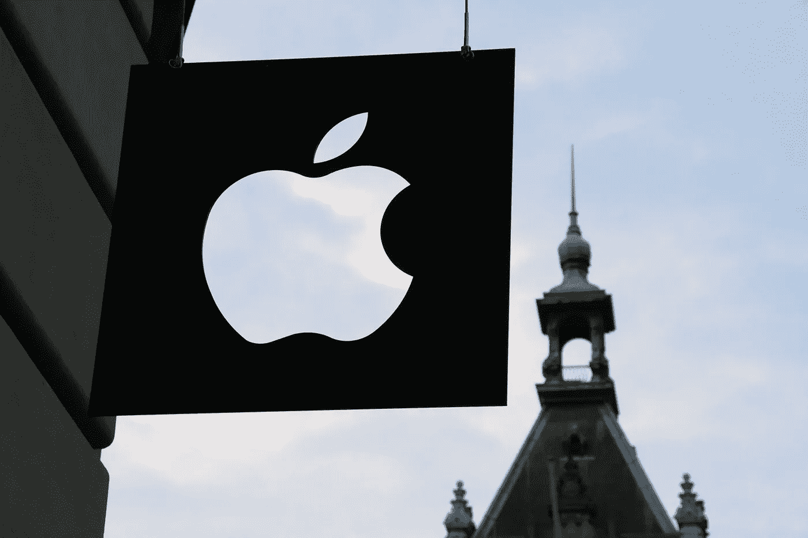
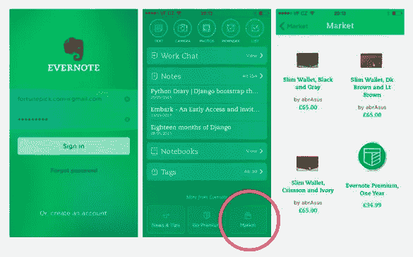
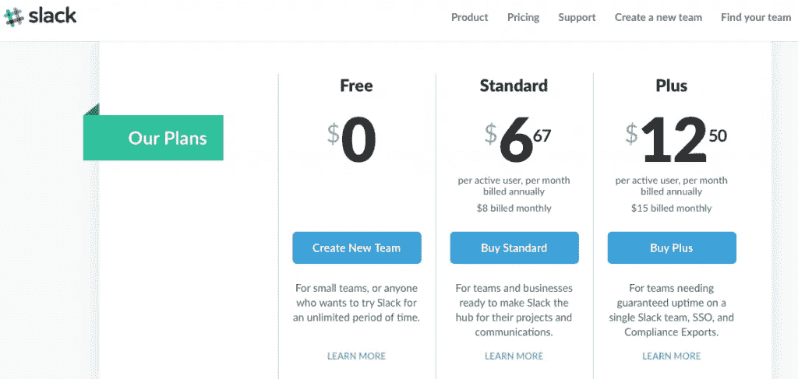

# 如何增加你的创业收入

> 原文：<https://medium.com/swlh/how-to-grow-your-startup-revenue-921f5742172>

Originally published at [http://www.appsterhq.com](http://www.appsterhq.com/?utm_source=CP&utm_medium=Medium)

史蒂夫·布兰克(Steve Blank)坚持认为，创业公司是“为寻找可重复和可扩展的商业模式而成立的组织”,那些努力相对快速增长和扩展的企业注定会失败。

当然，oney 是这种增长最终所依赖的头号资源:一家无法获得正现金流的初创公司根本无法维持自身。

如果你发现自己的创业公司正在创造一些收入，但远远达不到你需要的规模，你该怎么办？

在这篇文章中，我将概述几个你可以用来有效提高创业收入的关键策略。

# 理解核心概念

在你开始实施不同的方法来增加创业公司的收入之前，你应该首先对创业公司赚钱的核心概念、策略和流程有一个坚实的理解。

因此，对于任何需要复习的人来说，这里有一个快速列表，列出了创业经济中需要牢记的一些最重要的要点:

1.  **市场动态最终决定了你能否赚到足够的钱来扩大你的创业公司的运营规模。你需要确定你的市场规模、对你提出的解决方案的需求(通过与现实世界中的人交谈)，以及你的理想客户的具体特征(即，追求你的“早期采用者”，而不是试图为你的行业中的每一个人创造一种产品)。关于这些事情的深度文章请看这里: [1](http://www.appsterhq.com/blog/early-stage-entrepreneurs-launch-profitable-startup) 、 [2](http://www.appsterhq.com/blog/markets-fancy-ideas-create-successful-start-ups) 、 [3](http://www.appsterhq.com/blog/costly-mistakes-avoid-first-time-entrepreneur) 、 [4](http://www.appsterhq.com/blog/3-crucial-features-high-growth-startups) 。**
2.  **有许多经过实践检验的真正的赚钱策略**，你的创业公司应该在适当的时候充分利用它们的潜力。这些货币化形式包括广告、联盟营销、电子商务和 SaaS(软件即服务)。点击[这里](http://www.appsterhq.com/blog/app-monetization-models)查看关于这个话题的深度帖子。
3.  **确保你充分利用病毒式营销，包括“病毒循环”。创业公司在很多方面都不同于传统企业。其中一个关键的区别来自于这样一个事实，即初创公司以独特的方式进行营销，使用一些几年前根本不存在的方法。利用病毒式营销的力量来最大化你的创业公司的知名度和收入。请看[这里](http://www.appsterhq.com/blog/startup-growth-viral-loops)有帮助的解释。**
4.  创业股本是创业公司赚钱的一个棘手但至关重要的方面。见[这里](http://www.appsterhq.com/blog/introduction-to-startup-equity)有一个非常有用的关于创业股权基础的介绍。
5.  **所有初创公司都应该密切关注一些重要的财务指标**。参见[此处](http://www.appsterhq.com/blog/4-financial-metrics-startups-measure)详细了解位于初创公司货币化核心的 4 个具体指标。

说完这些，现在让我们来考虑一下提高你的创业公司收益的 5 个具体技巧。

N 注:增加公司收入有两种基本方法，即降低客户获取成本(CAC)和增加每个客户产生的收入。

因为我以前多次写过关于 CAC 的文章(见这里: [1](http://www.appsterhq.com/blog/3-crucial-features-high-growth-startups) 、 [2](http://www.appsterhq.com/blog/app-user-onboarding) 、 [3](http://www.appsterhq.com/blog/startup-growth-viral-loops) )，今天我们将主要关注从你的现有客户身上赚更多钱的策略。

# 1.使用追加销售

增加客户交易支出的最常见方法之一是有效运用“追加销售”策略。

根据[businessdictionary.com](http://www.businessdictionary.com/definition/upselling.html)的说法，追加销售是:

> *“卖方为买方提供购买相关产品或服务的机会的一种销售策略，其唯一目的通常是为了扩大销售。”*

追加销售的典型示例包括:

*   除了销售电子产品本身之外，电子产品商店还提供延期保修服务；
*   域名提供商向购买者提供购买域名保护和其他附加服务(例如 https 证书)的机会；和
*   快餐店问顾客“你想配薯条吗？”汉堡包订单下达后。

作为一种策略，当平均交易规模增加和/或每位客户的平均消费金额增加时，追加销售会发挥作用。

电子商务企业经常使用追加销售，但如今移动应用和 SaaS 公司也越来越多地使用它。

两个具体的例子是亚马逊和 Evernote。

早在 2006 年，亚马逊就在其平台上引入了追加销售:将短语“**购买该商品的顾客也购买了**”与其他产品的链接[配对，据报道，作为交叉销售和追加销售努力的直接结果，亚马逊的销售额增加了 35%](http://neilpatel.com/blog/15-persuasion-lessons-you-can-learn-from-amazons-upsell-strategy/) 。

直到 2016 年，笔记记录、整理和归档应用 Evernote 将其免费增值模式与额外的电子商务收入相结合，通过 Evernote 市场销售实物产品。

Evernote 市场是一个在线商店，出售包、钱包、笔、笔记本，甚至袜子。

据报道，该市场在运营的前 10 个月就创造了 1000 万美元的收入，收入增长了 45%。

Evernote [于 2016 年停止了电子商务业务](https://techcrunch.com/2016/02/01/evernote-will-shut-down-market-its-e-commerce-effort-on-wednesday/)。

Evernote 现已停产的电子商务市场截图:

# 2.增加交易的可能性

一个赚更多钱的简单方法是说服你的客户以更可靠的方式购买你的产品或服务。

根据您的业务模式，这可以通过各种方法实现。

例如，基于订阅的业务可以营销和推广 ***年度*订阅计划**，而不是依赖按月计费。

R 与每 4 周向客户重新销售您的产品并因此承担他们每年 12 次无法支付账单和/或取消合同的风险不同，您鼓励您的客户提前支付 12 个月的费用(例如，通过向他们提供与每月价格相比的折扣)。

这种方法保证你的客户至少在一年内保持付费用户。

Slack 是一种流行的基于订阅的服务，它使用分级定价，非常强调年度计费。

请注意 Slack [是如何通过 1)将其年度成本与其月度账单进行比较，并 2)直接说明“每年每月账单”来明确推广](https://slack.com/pricing/slack-for-teams)的年度账单的:

另一种巩固交易的方式是使用自动支付，这有助于减少客户流失，从而增加你的收入。

总的来说，人们抗拒改变、对抗和必须付出巨大努力才能实现的事情。

任何客户都懒得取消订阅，即使是他们实际上并不使用的产品或服务，但出于同样的原因，他们通常不会手动续订订阅，即使是他们喜欢使用的产品或服务。

为了利用这些动态，最好是让你的付费客户尽可能容易地保持付费客户，使用自动支付是实现这一点的一种有效方法。

# 3.提高你的价格

虽然这是一个显而易见的策略，但令人惊讶的是，许多公司对提高价格犹豫不决，可能是因为害怕这样做会导致他们失去客户。

提高你的商品或服务价格的一个方法是在现有选项的基础上创造和营销更新的“优质”选项，让你的客户在各种选项中进行选择。

例如，SaaS 的一家免费增值初创公司[提到](https://mention.com/en/)，仅仅通过从免费增值模式转向完全付费模式，就成功地将其平均每账户收入(ARPA)提高了 296%。

提及停止宣传其免费计划，而是把所有的努力集中在吸引客户付费选项。

据 [Mattieu Vaxelaire](https://mention.com/blog/3-little-changes-increased-average-revenue-per-account-arpa-296/) 称，提提的首席执行官:

> 通过如此积极地宣传我们的免费计划，我们在拿我们软件的感知价值冒险。最重要的是，这使得我们的企业计划更难推销。
> 
> 根据我们新的定价结构，我们决定保留免费计划，但不再大力宣传。
> 
> *外卖是什么？不要低估你付费计划旁边的免费计划的后果，尤其是如果你也瞄准了有免费计划的公司。"*

# 4.鼓励客户投资

“客户锁定”(也称为“[供应商锁定](https://www.techopedia.com/definition/26802/vendor-lock-in)”)是一种现象，通过这种现象，甲方很难(如果不是不可能的话)放弃使用乙方产品和/或服务的承诺，而不会导致重大资源损失(金钱、时间等)。).

这是一个有争议的，**道德上有问题的**，潜在地**法律上有问题的方法**，应该小心使用，如果有的话。

对于我们的目的来说，重要的是客户锁定背后的*精神*或*基本理念*:作为一家初创公司，你应该寻求创造产品和/或服务(在有机、道德和法律上)来劝阻你的客户放弃你的公司。

T 重点不是制造不公平和不可逾越的障碍，阻止你的客户离开你的公司，如果他们想离开的话，而是建立技术，让你的客户自然不想离开你的平台。

我们在非数字领域一直看到这种情况。

例如，考虑一下雀巢公司提供的专有咖啡机系列。

Nespresso 的咖啡机需要专门为其机器制作的特殊咖啡胶囊。

如果顾客想用 Nespresso 咖啡机冲一杯咖啡，那么她别无选择，只能购买和使用专有的咖啡胶囊。

据报道，仅在这些胶囊上，该公司每年的全球收入就超过 30 亿美元。

这如何应用于像应用程序这样的数字产品？

关键是鼓励用户投资，从而提高用户保留率。

我已经就这个话题写了一整篇文章。说到增加收入，关键是利用所谓的"[沉没成本陷阱](http://www.investopedia.com/terms/s/sunk-cost-trap.asp)"来确保你的客户继续购买(更多)你的产品。

沉没成本陷阱指的是这样一种现象:a)人们越不愿意放弃承诺 b)他们投入的资源(时间、金钱、精力)越多。

正如我最近解释的那样:

> *“成功的创业公司创造了增长循环，在这个循环中，他们的客户使用他们的产品越多，他们的客户就越不可能永久放弃他们的产品。*
> 
> *——如果你已经花了，比如说，两年时间来建立你的 Instagram 个人资料并使用特定的标签，你就不太可能放弃 Instagram 并加入一个竞争对手的手机摄影应用。*
> 
> 与过去 10 个月相比，如果你只使用 Dropbox 几天，你更有可能放弃 Dropbox，去加入一个竞争对手的在线文件存储服务。在你所有的设备之间移动、重新组织和重新共享你已经在 Dropbox 上存储了近一年的文件简直太麻烦了。
> 
> *-你在脸书上积累的朋友越多，你就越不可能关闭你的个人资料。”*

试着将这些策略应用到你自己的创业中，以建立一些你的客户自然不愿意离开的东西。

随着更多的用户成为长期客户*和*帮助向他们的朋友、家人和同事介绍你的产品或服务，你的收入肯定会增加。

# 额外收获:获得新客户

由于本文主要关注如何通过瞄准现有客户来增加收入，所以让我简单地讨论一下增加收入的最后一个策略，即通过招募新客户来增加为你的产品或服务付费的客户总数。

你的目标应该是尽可能低成本但有效地增加客户数量。

吸引新客户的两种有效方法是 1)利用病毒式营销技术(见[此处](http://www.appsterhq.com/blog/startup-growth-viral-loops))和 2)创建推荐计划，奖励成功为你的公司带来新用户的现有用户。

Airbnb、DropBox、Evernote、Lyft、PayPal 和优步都是成功利用推荐计划大幅增加用户群的创业公司。

无论是折扣、免费产品、礼品卡、可兑换积分，甚至是免费资金，你都可以通过激励现有用户将他们的朋友、家人和同事吸引到你的公司，并将他们转化为新的付费用户，从而增加使用你的产品或服务的人数。

//

## 感谢阅读！

# 如果你喜欢这篇文章，请随意点击下面的按钮👏去帮助别人找到它！

> 最初发表于[http://www.appsterhq.com](http://www.appsterhq.com/?utm_source=CP&utm_medium=Medium)

