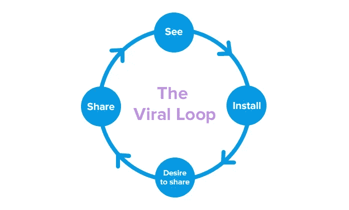
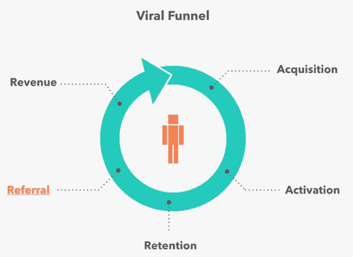
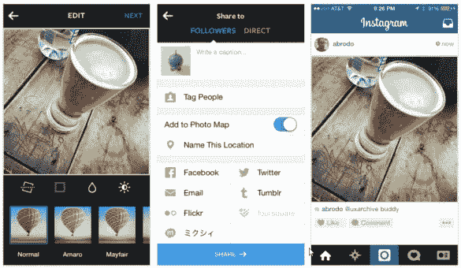
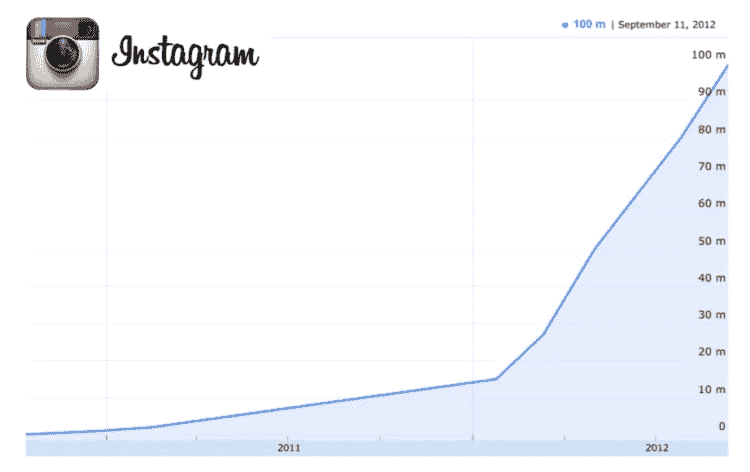
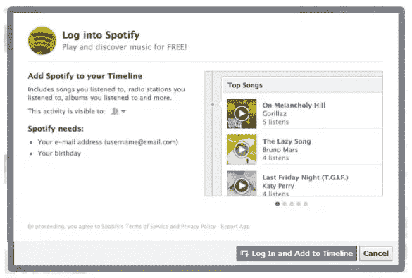
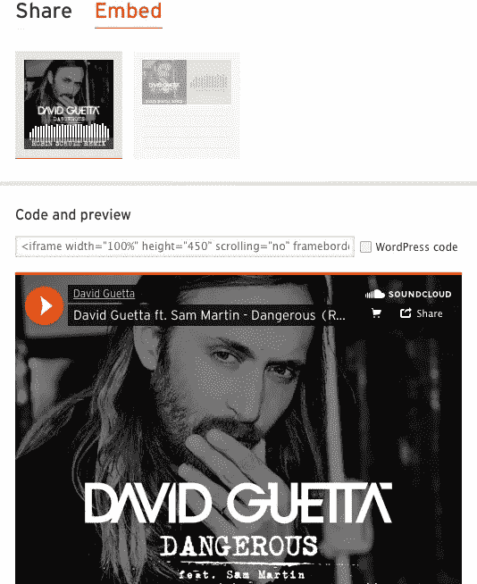
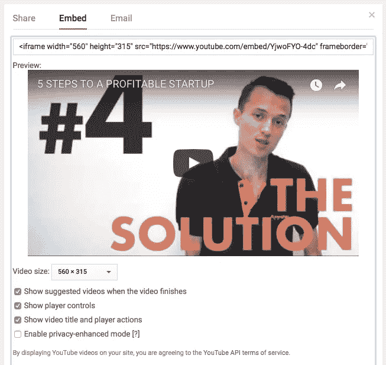
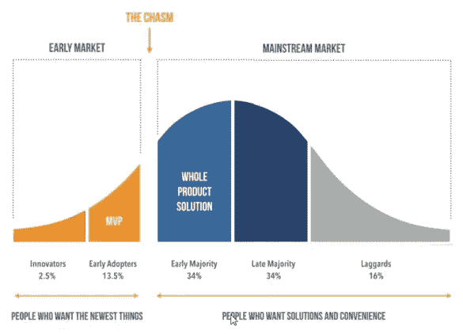

# 如何用“病毒循环”发展你的创业

> 原文：<https://medium.com/swlh/how-to-grow-your-startup-with-viral-loops-973c3d5b1ce5>

Originally published on [http://www.appsterhq.com](http://www.appsterhq.com/?utm_source=CP&utm_medium=Medium)

从本质上来说，21 世纪的科技初创公司从根本上关注的是增长。

通过展示规模经济，追求大市场，使用非传统的营销方法，初创公司寻求建立具有全球影响力的业务，创造数百万美元的收入。

今天最成功的高增长创业公司使用“病毒循环”来传播他们的创新产品和扩大他们的用户群。

但是，到底什么是“病毒循环”？

为什么创业公司的创始人应该关心这个战略？

我将在本文中回答这些(以及一些相关的)关键问题。

# 高成本扼杀创业

超过 90%的创业公司最终都失败了；这些失败中有将近一半是由与“现金耗尽”和“价格/成本问题”相关的问题造成的(来源: [1](https://www.forbes.com/sites/brentgleeson/2016/11/02/7-reasons-why-90-of-start-ups-fail-and-how-to-be-the-10/#f9c4647372a5) 、 [2](http://www.appsterhq.com/Applications/Microsoft%20Office%202011/Microsoft%20Word.app/Contents/cb%20insights%20startup%20failures) )。

在 Appster 与数百家初创公司[合作，我们经常看到的这种经济困境的关键原因之一是不可持续的高客户获取成本](http://www.appsterhq.com/?utm_source=CP&utm_medium=Medium)[(CACs)。](http://www.appsterhq.com/blog/3-crucial-features-high-growth-startups)

Kissmetrics [为](https://blog.kissmetrics.com/customer-acquisition-cost/)提供了 CAC 的有用解释:

> *“CAC 是说服潜在客户购买产品或服务的成本。你的 CAC 可以通过简单地将获得更多客户所花费的所有成本(营销费用)除以在花费这些钱的期间所获得的客户数量来计算。*
> 
> *例如，如果你的公司一年花了 100 美元做营销，同年获得了 100 个客户，你的 CAC 就是 1.00 美元。”*

正如我最近指出的那样，“对于初创公司来说，高 CAC 往往是致命的。”

为什么？

因为花费太多的钱来获得新客户，高速增长是不可能的，正如我们之前讨论过的，初创公司都是关于快速增长和扩张的(见这里:[1](http://www.appsterhq.com/blog/3-crucial-features-high-growth-startups)[2](http://www.appsterhq.com/blog/realities-21st-century-start-ups)[3](http://www.appsterhq.com/blog/vertical-horizontal-business-growth)[4](http://www.appsterhq.com/blog/4-crucial-steps-expanding-startup-internationally))。

一些非常基本的、[具体的数字](http://www.appsterhq.com/blog/3-crucial-features-high-growth-startups)证明了这一点:

> *“一般的在线公司，如电子商务商店，可能需要支付 200 美元甚至 300 美元才能通过传统营销和广告获得一个新客户。*
> 
> *从这个角度来看，试着想象一下 Dropbox 和 Instagram 各自支付 400 亿到 600 亿美元来积累他们的 2 亿用户群！”*

显然，没有一家公司会(或能够)花费 600 亿美元来获得它的客户群。

那么，像 Airbnb、脸书和谷歌这样的初创公司是如何在不支付巨额费用的情况下积累如此多的用户的？

他们利用*病毒营销*的力量，特别是*病毒循环*。

# 病毒式营销简介

“病毒式传播”，这是所有现代初创公司为了实现指数级增长而必须确保的，可以从两个方面来理解:

1.  **作为应用于互联网的一般术语:**“图像、视频或信息片段从一个互联网用户快速、广泛地传播到另一个互联网用户的趋势；被病毒感染的性质或事实。
2.  **作为应用于客户获取的特定术语:**“一种用户获取其他用户的现象，通常是通过一些内置于所提供产品中的推荐机制”([来源](https://s3.amazonaws.com/startupcompass-public/StartupGenomeReport1_Why_Startups_Succeed_v2.pdf))。

我们可以通过观察传统和非常规营销渠道来理解病毒式营销的基础。

*   **传统营销漏斗:**企业支付大量资金来为他们的产品(网站、应用等)吸引流量。)努力将一小部分流量转化为活跃的付费客户。
*   **病毒式营销漏斗:**不是大量的潜在客户转化为少量的实际客户，而是少量的实际客户帮助带来指数级的更多客户。

有了病毒式营销，每个新用户带来一个或多个新用户，然后新用户自己带来一个或多个新用户，以此类推:

病毒式营销植根于:

*   在产品的使用中(例如，新脸书用户有意识地建议她的朋友尝试社交媒体网站)和/或，
*   在推荐系统的操作中(例如， [Lyft 用户](https://help.lyft.com/hc/en-us/articles/214216977-Refer-New-Passengers-and-Get-Rewarded)传播推荐代码，该代码允许他和将他的代码应用于每笔现金的人免费乘车)。

当谈到病毒式营销时，目标是实现强大的“ [**病毒系数**](https://www.geckoboard.com/learn/kpi-examples/marketing-kpis/viral-coefficient/#.WWVjJHfMyRs) ”，即每个现有用户为你的公司带来的新用户数量。

例如，病毒系数为 2.0 意味着平均而言:

*   100 个用户指额外的 200 个用户
*   这 200 个用户又带来了 400 多个用户，以此类推。

将病毒系数保持在 1.0 以上，可以显著降低你对任何种类的大量营销预算的依赖，以保持增长。

一个和**“病毒循环”**是用来描述一个用户从第一次接触到你的产品，然后被激励向别人推荐这个产品的过程(来源: [1](http://andrewchen.co/whats-your-viral-loop-understanding-the-engine-of-adoption/) 、 [2](https://www.apptamin.com/blog/app-viral-loop/) 、 [3](https://www.inc.com/sujan-patel/creating-viral-loops-to-drive-your-2017-business-growth.html) )。

从某种意义上说，这是一个循环，它是一个持续不断的扩展过程，越来越多的用户被带入不断增长的用户群。

正如亚尼克·费德指出的，病毒循环必须有足够的速度、范围和自我持续性，才能保持成功运作，从而让你的创业公司成长。

Tapdaq 的萨姆·休金斯做了一个简单的图解，概述了病毒循环过程:

O 运营一家病毒式创业公司不一定涉及传统的用户获取方式，即支付流量，将少量流量转化为潜在客户和实际用户，然后购买更多流量来重复这一过程。

相反，病毒式收购涉及获得一些初始流量，以吸引一些人关注你的产品，并获得一些初始用户，以便让这些首批用户在不增加公司成本的情况下带来更多流量——这是一个不断重复的过程:

设计和启动一个有效的病毒循环的最重要的方面之一是提供一个或多个功能或奖励，*鼓励用户与他人分享你的产品。*

作为一家初创公司，我们的目标应该是与向用户发送令人讨厌的垃圾广告和其他损害公司声誉的联系方式完全相反。

相反，你必须为你的用户提供一些有价值的东西，也就是说，一些有形的、直接的东西，让他们愿意带他们的朋友、家人和/或同事来看你的产品。

让获得奖励的过程易于理解和完成也很重要，否则你可能会因为让活动变得太混乱而失去扩大用户群的机会。

现在让我们来看看一些著名的创业公司的例子，它们抓住了病毒循环现象。

这些案例中有许多展示了尽管很少(如果有的话)使用直接面向客户的广告/营销，初创企业也能变得多么成功:

1.  Groupon:团购网站 Groupon 为用户提供了在有吸引力的交易上节省大笔费用的能力，但前提是有一定数量的买家可以激活交易。多年来，Groupon 一直使用这种策略来扩大用户群，说服现有用户邀请他们的朋友，以便利用从食品和娱乐活动到美容体验和服装的各种优惠。
2.  Dropbox 和**优步**:超受欢迎的文件共享网站 Dropbox 和世界上最大的拼车服务网站优步都为推荐他人到他们平台的用户提供诱人的奖励。Dropbox 在首次推出时为所有推荐用户提供免费存储空间，帮助该公司在运营的前 7 个月在[获得了 100 万用户。优步的双向推荐代码系统非常成功，大约 50%的新优步客户都是通过推荐获得的。根据该系统，当同样获得 20 美元骑行积分的 B 使用 A 的唯一推荐代码注册优步时，A 将获得 20 美元的免费骑行积分。](https://techcrunch.com/2011/11/01/founder-storie-how-dropbox-got-its-first-10-million-users/)
3.  **Instagram** 应用了[交叉发布](https://help.instagram.com/365696916849749)功能，用户可以自动与他们的脸书和推特好友分享他们的照片，从而鼓励其他社交网站的人注册 Instagram，以便喜欢、评论和分享他们自己的照片。
4.  **脸书**:这个极其成功的社交媒体平台是首批利用电子邮件邀请的网络创业公司之一，它允许新用户方便快捷地邀请他们所有的电子邮件联系人加入网站。同样，像 Instagram 一样，脸书用户被鼓励把他们的朋友带到这个平台上，因为 a)这非常容易做到，b)这让脸书的体验更加愉快(通过允许人们与更多的朋友、家人和同事分享他们的在线生活)。
5.  Airbnb 通过使用一个允许 Airbnb 新用户与其他人分享其房源的机器人来“入侵”Craigslist，从而创造了一个吸引其他人的网络效应，从而实现了大规模扩张。
6.  Hotmail 刚推出的时候，只有 7000 万人是互联网用户。然而，随着时间的推移，Hotmail 通过在每封通过 Hotmail 服务器发送的电子邮件的页脚添加标语“PS:我们爱你，在 Hotmail 上获得免费电子邮件”,成功地增加了用户数量。Hotmail 和它的用户都不需要付费就可以在互联网上传输如此简单的信息。Hotmail 在这个过程中有效地创造了第一个病毒循环，达到了 6600 万用户(几乎是当时的整个市场)。

Instagram 的跨平台功能鼓励用户在各种社交网络上分享搞笑帖子:

Instagram 在 2012 年的大规模用户群扩张发生在上述交叉发布功能实施之后(转换率的提高是因为大多数 IG 档案在默认情况下是公开的，因此允许该功能立即显示给新的流量):

# 3 更多创业成长的例子

这里有 3 个通过利用病毒式营销战略和战术来实现创业成长的技巧的例子。

## **1。利用伙伴关系:Spotify 的案例**

Spotify 现在的估值为[130 亿美元](http://www.reuters.com/article/us-spotify-ipo-idUSKBN18821T)，拥有[5000 万付费用户](https://techcrunch.com/2017/03/02/spotify-50-million/)，在脸书之上迅猛增长。

Spotify 通过整合脸书的 Open Graph 平台，与社交网站建立了合作关系。

这一加速增长的举措并非偶然:Spotify 的创始人说服脸书的创始人之一肖恩·帕克成为 Spotify 的顾问。

potify 通过让用户能够使用活动(听的歌曲、创建的曲目列表等)分享他们的 Spotify，成功实现了大规模扩张。)和其他脸书人一起。

建立合作关系并在其他网络上发展显然是 Spotify 营销策略的一部分。

早在 2014 年， [Spotify 与优步](http://www.businessinsider.com/uber-partners-with-spotify-to-personalize-music-in-rides-2014-11)达成了一项协议，将这两个应用程序连接起来，这样优步的乘客就可以在乘坐优步汽车时收听定制的 Spotify 播放列表。

## **2。新的商业发展技术:YouTube 和 Soundcloud 的案例**

完成一笔合作交易，比如优步和 Spotify 之间的交易，通常需要打很多电话、开会、推荐和谈判，尤其是如果你的公司还不是非常成功的话。

许多早期创业公司缺乏与大公司达成大规模交易的人脉、信誉和资源。

为了巧妙地应对这种情况，越来越多的初创公司正在利用新的业务开发技术，通过应用编程接口([API](https://medium.freecodecamp.org/what-is-an-api-in-english-please-b880a3214a82))、feeds、爬行技术、嵌入代码，甚至逆向工程(见上文 Airbnb 的案例)等工具来开拓新的分销渠道。

YouTube 和 Soundcloud 是两家著名的公司，它们通过使网站内容易于嵌入，成功地大幅增加了用户群。

让您的用户能够轻松地在个人网站、社交媒体页面等上分享自己和/或他人的内容。让您的用户很容易成为您公司的形象大使，因为他们自然会与他人分享您平台的内容。

例如，可以想象的是，如果这意味着视频不能嵌入乐队自己的网站，乐队可能会放弃将音乐视频上传到 YouTube。

## **3。学习何时“跨越鸿沟”:脸书、领英和优步的案例**

正如我在过去的[中所讨论的](http://www.appsterhq.com/blog/realities-21st-century-start-ups)，初创公司成功地达到了规模，当他们:

*   为利基市场发明产品；
*   从特定消费者那里收集真实世界的反馈，并适当地微调产品；
*   获得早期采用者的信心和信任；和
*   利用这些建立声誉的过程来更广泛地推销他们的产品。

这么多成功的创业公司使用这些策略并不是巧合。

相反，它与杰弗里·摩尔的工作不谋而合。

摩尔的书《跨越鸿沟》(T8*)延伸了埃弗雷特·罗杰斯(Everett Rogers)的颠覆性技术(disruptive technologies)[理论](https://ondigitalmarketing.com/learn/odm/foundations/5-customer-segments-technology-adoption/)，该理论坚持认为不同类型的人以不同的程度和不同的速度欢迎革命性技术。*

*本质上，摩尔认为，在试图通过在主流市场寻求成功来“跨越鸿沟”之前，初创公司必须专注于有效地主导早期采用者市场——修复漏洞，回应客户问题，赢得用户的心，并逐步建立品牌声誉。*

*鸿沟是将创新者和早期采用者与主流客户分开的重要鸿沟:*

**

*[正如我最近提到的](http://www.appsterhq.com/blog/4-startup-myths-entrepreneurs-success):*

> *成功的创业公司避免向主流客户营销，因为这些客户通常*不信任新技术:他们寻求安全、保障和品牌声誉，而大多数创业公司至少在早期是漏洞百出、不为人知、相对未经证实的**

*因为主流消费者关心两个基本的东西，即公认的品牌和安全性，他们通常不会购买新的东西，除非其他人已经在使用(并推荐)它们。*

*然而，早期采用者并不在乎你的公司/品牌是否闻所未闻，有待证实，或者是否存在销售新产品的风险。*

*事实上，他们是被这些非常新奇和激进的品质吸引到你的冒险中来的。*

*总体而言，瞄准小客户群和现有市场子集的初创公司往往比那些一开始就试图占领大规模市场的公司做得更好。*

*脸书、LinkedIn 和优步都取得了巨大的成功，这在很大程度上是因为他们准确地知道何时以及如何跨越各自的市场鸿沟:*

*   *马克·扎克伯格和他的同事们从一开始就没有瞄准大众市场。相反，脸书试图赢得常春藤盟校学生的支持(从哈佛开始)，只是在很久以后才扩展到大学之外；*
*   *LinkedIn 最初的目标是旧金山的科技行业，在赢得那里的用户后才扩展到其他领域；和*
*   *优步也首先在三藩市推出，展示了一个城市接一个城市发展的能力，而不是一开始就试图接管整个美国。*

*//*

## *感谢阅读！*

# *如果你喜欢这篇文章，请随意点击下面的按钮👏去帮助别人找到它！*

**

> *最初发表于 http://www.appsterhq.com*

******