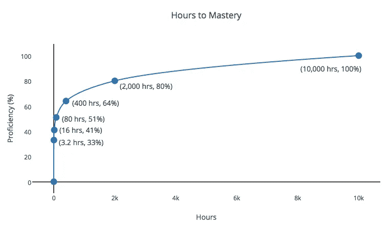

# 如何破解 10000 小时规则

> 原文：<https://medium.com/swlh/how-to-hack-the-10-000-hour-rule-9dddc9ecf6d1>

有没有想过成为武术高手，幻想像伦勃朗一样画画，或者希望你能像戈登·拉姆齐一样烹饪？正如现在流行的理论所说，你需要积累 10，000 个小时才能精通一个领域。因此，如果你决心每天 10 小时，每周 5 天埋头苦干，你将需要 3 年 10 个月零 6 天才能达到 10，000 小时。当然不容易，但绝对可以实现。

这个简单“规则”的魅力在于，它让任何事情都感觉可以实现，而不是让任何事情都可以实现。理论上，你所要做的就是选择你想掌握的东西，投入，增加时间，瞧，我们已经有了一个新的大师。一旦你接受了这条规则，命运就是你的了。

虽然我确实意识到由于基因限制，这个规则也有例外(不管我尝试多少次，我可能永远也不会像勒布朗那样扣篮)，但我喜欢这个规则，因为它简单又鼓舞人心。然而，我也艰难地认识到，我对下一个闪亮的潜在技能太感兴趣，以至于不能日复一日如此勤奋地致力于一件事。对我来说幸运的是，还有一个我也倾向于高度重视的规则，是的，你猜对了…80/20 规则。80/20 法则也被称为帕累托原则，它简单地说明了 80%的结果通常是通过 20%的努力获得的。

好的，那么如果我们把这两条规则合并起来，尽可能地掌握新的技能，同时尽可能地少花时间，会发生什么呢？

10，000 小时* 20%的努力= 2，000 小时(或 9 个月零 11 天，每天 10 小时/每周 5 天的练习)

换句话说，虽然 100%掌握一项技能需要大约 3 年零 10 个月，但只需要大约 9 个月就可以达到 80%!听起来是不是很划算？对我来说很重要。我可以花同样多的时间来达到 5 种不同技能的 80%,而不是花所有的时间去达到 1 种技能的 100%!我敢打赌，将 5 种不同的技能结合起来所产生的协同效应，就其本身而言，至少可以产生与那些 100%掌握了 1 种技能的人一样令人敬畏的东西。

如果我们再次应用这个规则会发生什么？你又说 8020 博士？！这是什么魔法？好的，我们开始吧…

2，000 小时* 20%的工作量= 400 小时(2 个月，每天 10 小时/每周 5 天)

80%技能水平* 80% = 64%技能水平

因此，结果就是花少得可怜的 2 个月时间达到 64%的技能掌握程度。相当酷。我被这个发现逗乐了(也有一点书呆子气),最后我做了一张图表，看看继续掉进这个兔子洞，并把这个规则应用到自己身上会是什么样子。看看这个:

所以从理论上来说，虽然达到 10000%掌握一项技能可能需要 10000 个小时，但你只需要花 3 个多小时就能达到 33%。如果你问我的话，这是一个不错的投资回报。听起来就像在任何一个领域上 3 个半小时的入门课一样简单。然而，收益递减法则很快就生效了，你必须再增加 397 个小时才能使技能水平翻倍，达到 64%。

现在你知道了，通过结合这两条规则，我们看到，成为真正的万事通的途径是收获高回报的回报，这种回报来自于对一项新技能的最初几个小时的刻意练习。喜欢缓慢而专注的精通之路？我当然尊重这一点，世界因为你的努力而更加丰富多彩。就我而言，我将在接下来的几个小时里最终将我的绘画技能从自二年级以来一直停留的斯蒂克曼式阶段转移出去。

快乐学习！

当有新帖子发布时，想收到我们的消息吗？下面订阅

## 这个故事发表在[的创业](https://medium.com/swlh)上，这是 Medium 最大的创业刊物，有 328，729+人关注。

## 订阅接收[我们的头条新闻](http://growthsupply.com/the-startup-newsletter/)。

