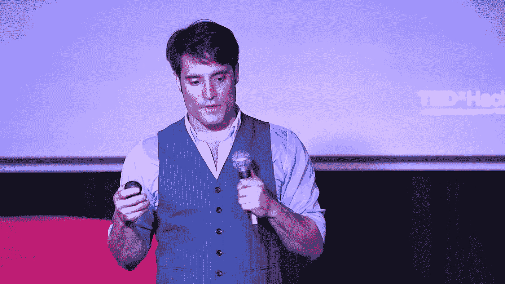
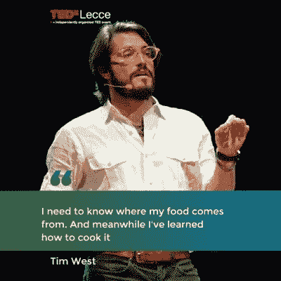

# 如何破解你的食物和生活[播客访谈]

> 原文：<https://medium.com/swlh/how-to-hack-your-food-and-your-life-podcast-interview-52645a6400c9>

## 在与一个食物和生活黑客的对话中

TEDxHackney

> **食为药***——*[*添西*](https://medium.com/u/ba6a1fe54fe3?source=post_page-----52645a6400c9--------------------------------) *。*

在这个 [**播客**](https://isragarcia.com/category/podcast)——访谈中，你会发现 [**【颠覆】**](https://isragarcia.com/category/disruption)[**【颠覆】**](https://isragarcia.com/3-new-economic-forces-in-the-digital-human-era) 思维(和行动) [**optima**](https://isragarcia.com/category/high-performance) l 营养、创业和效用，很多价值。

# 蒂姆·韦斯特——一个颠覆者，一个黑客

2013 年，蒂姆·韦斯特(Tim West)被公认为 30 岁以下 [**30 岁以下**](https://30under30.zagat.com/) 扎加特之一，他是一名慢餐厨师，转型为一名社会企业家。他是美国烹饪学院的毕业生，也是多力多滋的发明者 [**阿奇西**](https://en.wikipedia.org/wiki/Arch_West) 的孙子。蒂姆在纽约瑞吉酒店的厨房里长大，后来继续在加利福尼亚州的脸书工作。然后，他开始了他作为企业家的冒险。

然后 [**Tim**](https://www.linkedin.com/in/timmywest) 推出 [**美食黑客马拉松**](http://foodhackathon.co/) (+ Forum)作为当前教育体验的替代，基于更具协作性和启发性的方法论。目标是激励、装备和教育企业家，面对更重要的问题。
几年前，蒂姆创建了 True West Ventures，这是一家教育体验和咨询机构，专门围绕食物创造价值:食物系统、 [**食物黑客**](https://video.vice.com/es/show/food-hacking) 、企业家的食物和食物文化。

Tim 设计了学习旅行，作为演讲者参加了不同的论坛，为 Airbnb、Mars、The Center of the Edge @ Deloitte、Singularity University、The Institute for the Future、Barnraiser 和 inquisitive 等品牌提供建议并与之合作。

## TEDxHackney 的 Tim West 破解思考的食粮

# 打乱所有礼物，蒂姆·韦斯特

> **卡路里并不是你保持活力所需要的唯一东西***——蒂姆·韦斯特。*

这是一次采访，蒂姆用他的证词和经历带来了许多神奇、天才、经验、颠覆和智慧。讨论探讨了如何烹饪食物的基本方面，使其更加有效和强大，然后，更多的个人因素蒂姆，生活方式，建议，未经请求的建议和提示。

> ***如果你照顾好自己的身体，你的身体也会照顾好你***”—蒂姆·韦斯特。**

# *[> > >听这里的< < <](https://isragarcia.es/disrupt-everything/?name=2018-06-15_39_dep_-_tim_west.mp3)*

**特别提示*:我为蒂姆前 12 分钟的爆音道歉。我意识到这变得非常恼人和难以倾听。积极的一面是 12 分钟后恢复正常。我认为这是由于蒂姆讲话和接收信号的地方的某种设备。我决定离开原来的汽车，因为重新采访蒂姆很困难，而且以最有机的形式采访很有价值和真实性。*

# *蒂姆·韦斯特采访*

***目录索引**:*

1.  *决定性的时刻*
2.  *如何改变一切从头开始？*
3.  *食品黑客:问题与解决方案。*
4.  *食物黑客马拉松:灵感、目标和结果。*
5.  *最佳喂养计划。*
6.  *下一个项目。*
7.  ***:其影响，以及对初学者和新人的建议。***
8.  ***个人和职业挑战。***
9.  ***可笑的习惯和怪癖。***
10.  ***健康生活的建议。***
11.  ***给年轻一代的信息。***
12.  ***最好的训练计划。***
13.  ***无法反应时如何反应***
14.  ***对抗挫折的诀窍。***
15.  ***如何对抗焦虑？***
16.  ***自爱、脆弱和不完美。***
17.  ***令人印象深刻的书。***
18.  ***菜谱和喜欢的食材。***
19.  ***更多关于蒂姆·韦斯特的个人事实。***

> *******如果我吃了大便的东西，我觉得自己像大便****—蒂姆·韦斯特。*****

# *****你也可以直接从 [Disrupt Everything 播客系列主页](https://isragarcia.es/disrupt-everything/)收听。*****

*****【本帖首发于**】*******

# *******只有当你觉得值得的时候，才让这个故事震撼吧！如果你发现任何有价值的东西，请鼓掌。*******

> *******Isra Garcia = 55 个客户，48 家企业，400 次演讲，3.574 篇帖子，24 个项目，6 本书，380 场讲座，6 家公司，17 次冒险，26 次实验，∞失败。到目前为止…*******
> 
> *******[有一手](https://isragarcia.com/wp/marketer)。顾问。扬声器。作家。教育家。经理。在 [IG](http://thisisig.com) 的负责人。博主。企业家。颠覆性创新。数字化转型。高绩效者和生活方式实验者。*******

# *******行动号召>>点击[这里](http://feeds.feedburner.com/isragarcia)订阅更多类似的文章！*******

**************

## *******这篇文章发表在 [The Startup](https://medium.com/swlh) 上，这是 Medium 最大的创业刊物，有+ 370，107 人关注。*******

## *******在此订阅接收[我们的头条新闻](http://growthsupply.com/the-startup-newsletter/)。*******

**************