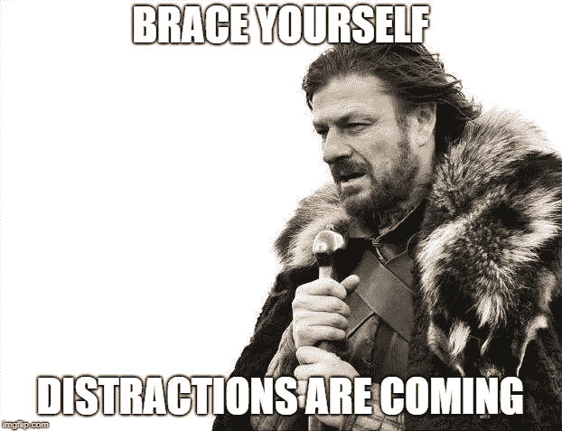
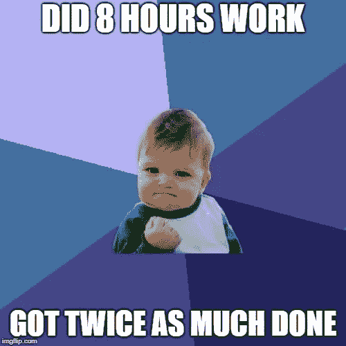

# 22.如何修改你的时间表，完成两倍的工作——30 天中等

> 原文：<https://medium.com/swlh/how-to-hack-your-schedule-and-get-twice-as-much-done-30-days-of-medium-441a509dc9be>

30 Days Of Medium

欢迎回到 **30 天介质。**

感谢迄今为止**一直在阅读、鼓掌和评论**的每一个人！今天的话题是——**你的流量来自哪里？**

如果你错过了下面的我的 30 天中等挑战的前 21 天，你可以补上:

## [0。30 天的培养基](/swlh/30-days-of-medium-c7ab34953c6c)

## [1。建立自己的网站需要什么？— 30 天中值](/swlh/1-what-do-you-need-to-build-your-own-website-30-days-of-medium-1ed1ad4e505c)

## [2。如何找到你热爱的事业——30 天的媒介](/swlh/2-how-to-find-a-business-you-love-30-days-of-medium-cb7a4a702d1b)

## [3。如何建立自己的网站—媒体 30 天](/swlh/3-how-to-build-your-own-website-30-days-of-medium-587f994672ec)

## [4。如何衡量你网站的表现——30 天媒体](/swlh/4-how-to-measure-your-websites-performance-30-days-of-medium-75e650969695)

## [5。如何通过回答他们的问题获得更多的客户-30 天的媒介](/swlh/5-how-to-get-more-customers-by-answering-their-questions-30-days-of-medium-b462d237533e)

## 6。成功的商业网站备忘单——30 天的媒介

## 7。如何衡量成功——30 天介质

## 8。了解在线销售漏斗——30 天媒介

## 9。什么是流量，为什么流量很重要？— 30 天的培养基

## 10。什么是 Google URL Builder，为什么要使用它？— 30 天的培养基

## [11。通过自动化您的社交媒体日程，让您的流量翻倍——30 天中等](/swlh/11-double-your-traffic-by-automating-your-social-media-schedule-30-days-of-medium-ac9aa74f7927)

## [12。如何辨别什么好卖— 30 天介质](/swlh/12-how-to-tell-what-sells-30-days-of-medium-ba3291d029d2)

## [13。我如何在 6，500% — 30 天的培养基中培养我的培养基](/swlh/13-how-i-grew-my-medium-following-6500-30-days-of-medium-c9d2d6f80b51)

## [14。你如何看待事情很重要——30 天中期](/swlh/14-how-you-look-at-things-matters-30-days-of-medium-f641b9733b90)

## [15。如何向小型企业销售服务— 30 天中等](/swlh/15-how-to-sell-services-to-small-businesses-30-days-of-medium-d6604c63b3b7)

## [16。如何通过有效的提案赢得更多交易— 30 天的媒介](/swlh/16-how-to-win-more-deals-with-effective-proposals-30-days-of-medium-481f16bbc86f)

## 17。如何在 10 分钟内建立一个网上商店——30 天的媒介

## [18。如何在任何地方工作— 30 天介质](/swlh/18-how-to-work-from-anywhere-30-days-of-medium-1c9cfa2d662f)

## [19。为什么你的网站会破坏你的销售——30 天媒体](/swlh/19-is-your-website-sabotaging-your-sales-30-days-of-medium-f63bdbdb350)

## [二十。你的流量从哪里来？— 30 天中值](/swlh/20-where-does-your-traffic-come-from-30-days-of-medium-a9b2d2c088bb)

## [21。如何真正识别倦怠——30 天中等水平](/swlh/21-how-to-actually-recognise-burnout-30-days-of-medium-7972a7a7a89e)

## [22。如何修改你的时间表并完成两倍的工作——30 天中等时间](/swlh/how-to-hack-your-schedule-and-get-twice-as-much-done-30-days-of-medium-441a509dc9be)

## [23。不要模仿你的竞争对手——30 天的媒介](/swlh/23-dont-copy-your-competitors-30-days-of-medium-56382b7ba8ed)

## 24。如何 SEO 优化一篇博文——30 天的媒介

## 25。独特或被遗忘——30 天的媒介

## 26。跟着感觉走——30 天中等水平

## 27。人们不支付平均 30 天的中等费用

## 28。如何做关键词研究— 30 天介质

## [29。为什么帕累托原则是世界上最大的诀窍——30 天中期](/swlh/29-why-the-pareto-principle-is-the-worlds-biggest-hack-30-days-of-medium-1c225f5c8aa1)

## 三十岁。你的内容比你的电话更有利可图——30 天的媒介

# 不是所有的时间都是生产时间

在我昨天写完关于**倦怠的文章后**，我想写一篇关于侵入你的时间表的后续文章。

让我先说，并不是所有的时间都是**生产时间**。

在一天中的某些时候，你比其他人更有效率。

你还会发现，在一天中的特定时间，你更擅长于特定任务。

那么，你如何利用这一优势，让自己事半功倍呢？

# 分析你的生产力

Medium 的一个好处是，企业家和与你做同样事情的人可以自由获取信息。

如果我在刚开始工作的时候就知道媒体，也许我会省去很多麻烦。也许不是。创业者终究是固执的。

无论如何，为了削减你的时间表，我发现你需要按任务分析你的效率。

例如:

*   **什么时候写内容最容易？对我来说，是每天早上 7-9 点。**
*   你的**客户**或**客户什么时候工作最轻松？我通常在每天下午 1 点之前完成大部分工作。取决于我有多忙，这可能需要一整天。**
*   如果你在特定的时间起床，你会更有效率吗？我讨厌早上，但不幸的是，如果我在 7:30 前起床并开始工作，我会非常有效率。我已经尝试过各种计划，包括起床和晚一点开始，但对我来说似乎没有什么能打败这个。
*   记下你什么时候最擅长某些任务。不管怎样，有些事情你在特定的时间不得不做，但这是让事情加倍完成的途径。

# 安排一切

我一直讨厌**计划和安排。**

我不知道为什么。可能是从小就有，讨厌学校那种告诉你什么时候做**什么事情，怎么做的经历。**

我的任务清单一直是我最好的朋友。

使用大卫艾伦提倡的**桶法&下一步行动**法。

除此之外，我讨厌提前安排所有事情的想法。

然而在过去的一年里，我越来越看到自动化和计划的价值。

最近，**我提前预定了我接下来的 90 条内容。**

没过多久，我就草草记下了**的标题**和在某些情况下**的 1 个小要点摘要。**

对于我的**网站博客文章**，我用一个长尾关键词匹配它们。

随着我变得越来越忙，这种提前安排让我在时间上变得非常有效率。

我还**创建了一个每日时间表**(受客户紧急变化或我无法控制的事情的影响)，每天我都相应地划出时间，完成我需要完成的任务。

# 只做你绝对必须做的事情

第一次创业的人或新企业主因在不必要的任务上浪费时间而臭名昭著(相信我，6 年前我也是其中之一)。

**只做有助于发展业务或改善客户体验的事情。**

剩下的都是**垃圾。直到你可以轻松地开始雇人或外包主要任务。**

例如，您的时间分割应该如下所示:

*   你一天中 25%的时间应该花在销售和营销上
*   25%应该花在服务你的客户/顾客上
*   25%应该花在计划、研究、流程和改善你的业务上
*   25%的时间应该是“自由浮动时间”,可以分配给上述三个领域中的一个，这取决于那天最需要关注的是什么。

诀窍是**分析你所做的一切。**

**明确什么能为你带来新业务。然后就这么做，丢掉那些没用的东西。**

并找出是什么让你的顾客爱你。

如果你能够**找出为你带来新业务的具体任务**以及如何让你的现有客户满意，这就是一个长寿的**小企业的成功公式，并且可以在未来轻松扩展。**

它还能让你一天专注工作 8 小时，享受健康的工作生活平衡，同时事半功倍。

## 你可能也喜欢这个:

## [为什么 WordPress 是在](/swlh/why-wordpress-is-the-best-platform-to-build-your-business-or-startup-website-on-df3fe932fad7)上建立业务或创业网站的最佳平台

## [如何建立网站——终极指南](https://www.squareinternet.co/how-to-build-a-website-ultimate-guide/)

## 如果你喜欢这个故事，请点击👏按钮，并跟随我的其他 30 天的媒介。

## 这篇文章发表在 [The Startup](https://medium.com/swlh) 上，这是 Medium 最大的创业刊物，拥有 336，210 多名读者。

## 在这里订阅接收[我们的头条新闻](http://growthsupply.com/the-startup-newsletter/)。

