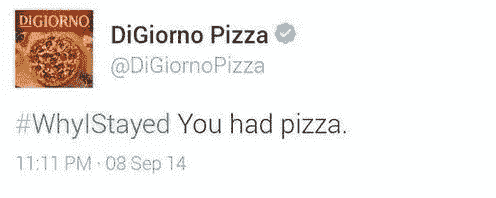

# 如何处理社交媒体危机

> 原文：<https://medium.com/swlh/how-to-handle-a-social-media-crisis-43c4aff527ff>

**注:**这篇博文最初发表于 borismustapic.com

虽然建立一个好名声可能需要几年时间，但毁掉它只需几秒钟。如今，一个愤怒的顾客就能引发你公司的社交媒体危机。

社交媒体危机的真正危险在于其迅速传播的能力。以下是你需要采取的步骤，以应对社交媒体危机，并防止它对你的公司和品牌造成更多损害。

# 立即行动

社交媒体危机需要立即处理。你尽快承担责任是很重要的。你的团队中也应该有人随时准备应对工作时间以外可能发生的事件。

英国航空公司面临一个事件，一名不满意的客户在 Twitter 上抱怨他们的服务，然后推广该推文。在成千上万的人已经看到这个问题之后，英国航空公司的团队解决这个问题为时已晚。没有及时解决问题导致他们失去了客户。

# 完全诚实和透明

如果社交媒体危机是由你或你团队中的某个人的错误造成的，你应该坦诚面对，并向你的观众道歉。

这正是凯膳怡美国公司所做的，当时他们的一名员工不小心在公司的官方 Twitter 账户上发布了一条攻击性的推文，而不是在他们自己的个人账户上。

这有助于澄清凯膳怡在顾客心目中的声誉。

# 将讨论转移到私下进行

当处理愤怒顾客的评论时，你绝不能忽视或隐藏他们的评论。然而，你应该把讨论转移到私密的地方(电子邮件、脸书收件箱、Instagram DM 等)。)尽快。

一旦你开始与你的客户进行私下讨论，解决他们的问题，并尝试机智地处理这种情况。

# 重新考虑你的时间表

确保重新安排或暂停所有本应在危机发生前上线的内容。在社交媒体危机中，你能做的最糟糕的事情就是试图推广你的产品或服务。

# 在你的网站上发布一份官方声明

在重大危机的情况下，你应该仔细起草一份官方声明，并发布在你的网站上。务必详细解释事件，并说出你的观点。

# 从经验中学习

你的社交媒体危机很可能不会持续超过 24 小时。然而，重要的是你要试着从经历中学习。想一想是什么导致了这场危机，以及你如何有可能防止它在未来再次发生。

# 如何为社交媒体危机做准备

虽然上述建议有助于应对一旦发生的社交媒体危机，但最好是提前为潜在的危机做好准备。这里有三件你应该做的事来为社交媒体危机做准备。

# 建立一支“危机团队”

培训一个员工团队，一旦危机发生，他们将负责社交媒体。这些人应该做好危机一发生就做出反应的准备。

# 创建危机管理计划

制定一个危机管理计划可以让你快速有效地处理社交媒体危机。在你的计划中，一定要包括公司每个成员在危机中应该做什么的详细说明。

# 模拟社交媒体危机

通过模拟不同的危机情况来练习处理危机。这将有助于你公司的每个人在真正的危机发生时做好准备。

# 如何防止社交媒体危机

你已经学会了如何应对和准备社交媒体危机。如果你能阻止它发生，那不是很好吗？使用以下建议来确保你的公司永远不会经历社交媒体危机。

# 创建社交媒体政策

为你的公司制定一个清晰的社交媒体政策，并确保让所有员工都熟悉它。良好的社交媒体政策应包含以下方面的指导原则:

*   什么样的内容可以在社交媒体上发布(什么样的内容不可以)
*   如何处理关于你公司的问题和评论
*   一般社交媒体礼仪

# 关注社交媒体对贵公司的提及

使用社交媒体工具，如 [Social Report](https://www.socialreport.com/) 来帮助你监控其他人对你的品牌或公司的评论，并在潜在的社交媒体危机发生之前识别它。

您应该监控社交媒体，看是否有任何提及以下内容的内容:

*   您的公司名称
*   您的产品
*   竞争
*   特定于行业的关键词

# 随时了解时事

许多品牌犯了这样的错误:没有及时了解最新的时事，在悲剧或重要事件发生时在社交媒体上发布促销或娱乐内容。

处理你的社交媒体的人应该掌握当前的事件和趋势，以防止可能导致社交媒体危机的错误。

# 不要试图利用悲剧事件

这似乎是常识，但品牌不断犯这个错误。像 9/11 这样的悲剧事件不应该用来推销你的产品。

Just no.

2014 年，标签#WhyIStayed 开始在 Twitter 上流行。它被家庭暴力的受害者用来讲述他们的个人故事。DiGiorno Pizza 认为利用这种趋势来推广他们的披萨是个好主意。

It wasn’t.

# 避免有争议的话题

虽然你可能认为你的客户在某个特定话题上与你观点一致，但使用你公司的社交媒体账户讨论有争议的话题几乎从来都不是一个好主意。你应该避开的一些话题包括:

*   宗教
*   政治
*   外交政策
*   大多数社会问题

# 结论

即使是最大的品牌有时也不知道如何正确处理社交媒体危机。最重要的事情是尽快解决危机，并对你的观众诚实。你也应该通过创建一个危机管理计划和培训一组员工正确处理危机的方式来为社交媒体危机做准备。完成这些步骤将使你和你的团队具备成功应对社交媒体危机的必要技能。

*最初发表于*[*【borismustapic.com】*](https://borismustapic.com/social-media-crisis/)*。*

## 这篇文章发表在 [The Startup](https://medium.com/swlh) 上，这是 Medium 最大的创业刊物，有+398，714 人关注。

## 在这里订阅接收[我们的头条新闻](http://growthsupply.com/the-startup-newsletter/)。

