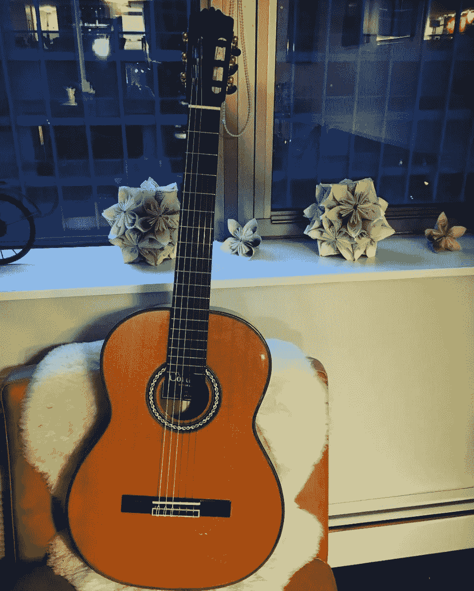

# 如何利用深度实践的力量来掌握任何学科

> 原文：<https://medium.com/swlh/how-to-harness-the-power-of-deep-practice-to-master-any-discipline-e906c85e46f2>

## [作者:艾丽达·米兰达-沃尔夫](http://www.alidamirandawolff.com/)

Playing my first-ever guitar. Ignore the terrible form. (Photo Credit: Hilary Higgins)

我一天练两次吉他，一周六次。每个月都会有几次好心的朋友和导师让我辞职。

因为我不喜欢弹吉他。

他们坚持说，“淘汰不适合你的。”它们迎合了我对自己企业的强烈责任感，并建议道:“作为一名企业家，你应该把你的时间奉献给建立你的企业，不管你剩下多少时间，都要奉献给你所热爱的事情。”

然而，在我的生活中，除了练习吉他，我想不出还有什么练习能更好地为我服务，切实增强我的创业技能，或者增强我做自己更喜欢的事情的能力。

我已经玩了四年了，但是在最近一年，我的进步速度加快了。这是我新练习时间表的功劳，但更重要的是，是我练习*方式*的功劳。

通过实施丹尼尔·科伊尔(Daniel Coyle)所说的“深度练习”，我实际上增加了我大脑中神经学家认为是天才的材料的储存量，提高了我每天只需 35 分钟活动的学习和思考能力。

虽然我肯定不是天才——尤其是在吉他方面——但我并不是唯一一个致力于深度练习的人。你最崇拜的艺术家、创新者、科学家、音乐家、运动员和领导人有可能通过这种独特的形式获得成功。

# **什么是深度修行？**

一位著名的美国作曲家、一位无畏的尼姑和一位当代布鲁斯民谣歌手有什么共同点？

90 年代初，瑞典心理学家安德斯·埃里克森(Anders Ericsson)将“刻意练习”的概念[与提高表现和掌握能力联系起来，这是一种练习模式，涉及改进技术、征求稳定的批评性反馈以及完善弱点。](http://projects.ict.usc.edu/itw/gel/EricssonDeliberatePracticePR93.PDF)

从那以后，许多作家、研究人员和心理学家通过研究跨学科的精英表演者扩展了这一观点。

丹尼尔·科伊尔(Daniel Coyle)是这一群体中的一员，他是《天赋代码》和《天赋小书》的作者，他在神经科学的最新发现中采用了刻意练习和分层的观点，并对天赋温床进行了研究，这些领域产生了许多优秀的表演者。

其结果是一种“深度实践”的理论，这种理论包括通过有针对性的努力来实践。正如科伊尔在《天赋代码》中写的那样，“在你能力的边缘运作，在你犯错的地方，让你变得更聪明。”

为什么犯错会让你更聪明？

答案是神经学上的。髓磷脂是一种神经物质，像串珠一样包裹并隔离你的神经细胞纤维，提高生物电信号(换句话说，思想)在大脑中传播的速度和准确性。

> 思维的速度和准确性，以及大脑的广泛髓鞘化，都是天才的标志。

这对任何渴望成为天才的人来说都是好消息，因为与你的头部大小或神经元数量不同，你大脑中的髓磷脂数量在成年后并不固定。你通过挣扎和超越你的舒适区来生长髓鞘。

以当代蓝调民间音乐家雷·拉蒙塔涅为例。

两年来，[雷·拉蒙塔涅把自己关在公寓里，放着奥蒂斯·瑞丁和雷·查尔斯的唱片](http://danielcoyle.com/2009/04/04/ray-and-otis/)，练习模仿它们，直到练就了自己的嗓音。通过解构他们的作品，倾听自己的声音——他形容自己的声音很糟糕——并深入倾听，以拉长元音，增强沙哑，并令人信服地表达情感，他成为了一名获得格莱美奖的音乐家。

在世界的另一端，[传奇尼姑丹增·帕尔莫隐居在喜马拉雅山的一个山洞里 12 年](http://tenzinpalmo.com/jetsunma-tenzin-palmo/)，磨练了她的冥想技巧和精神能力，其中三年她都是在完全的寂静和隔绝中度过的。

帕尔默在洞穴里遵循严格的常规，白天冥想三个小时，晚上坐在她的冥想盒里，冥想而不是睡觉。当她出现时，她已经达到了一种修行的水平，并且接近开悟，这是以前任何一位知名女性所没有的。

此外还有 20 世纪作曲家莫顿·费尔德曼，他以开创不确定音乐而闻名。

费尔德曼通过写一小段时间，停下来，然后抄写他写的东西来完成他的作品。这一过程出现了新的变化、补充和想法，改善了整体作品，为实验性纽约作曲家的崛起铺平了道路。

但是深度练习并不存在于真空中。正如丹尼尔·科伊尔对深度练习的解释，另外两个要素也是必要的:激情和大师指导。

# **实现点火**

It took calling myself a “guitar player” and watching my husband play to achieve the ignition necessary for deep practice. (Photo Credit: Hilary Higgins)

点火本质上是激情和坚持。这是一种经常在瞬间发生的现象，激励人们为了兴趣和决心而追求更长时间的练习。

点火有多种来源。

归属的渴望可以点燃火花，特别是想成为特定团体、团队或阶层的一部分。这听起来更像是“我想成为巴塞罗那足球俱乐部的一名足球运动员”，而不是“我想踢足球”

同样，看到其他人取得成功可能会点燃激情，尤其是如果那个人看起来没有那么不同的装备(例如，在被普遍认为平庸的安娜·库尔尼科娃开始获得国际冠军后，俄罗斯女网球运动员出现了繁荣)。

最后，对一个地区真正的兴趣可以引发点火。对基因工程的痴迷可能会引发在实验室里长时间的学习和实践，从而掌握开源科学。

> 没有点火，深度练习就无法存在。激励的内在火花穿过一个通常是痛苦和具有挑战性的过程，产生持续的承诺。

我第一次尝试弹吉他是在对阿巴拉契亚部落极度痴迷的时候，之后在我帮助组织的一次音乐节上偶然遇到了一位著名的班卓琴演奏家。在我们的谈话中，我当场决定学习班卓琴，但在努力寻找团体课程后，我转而学习吉他。

在那一点上，吉他没有坚持。在合奏了大约一年后，我休息了六个月。

仔细看看是什么火花点燃解释了为什么我最初尝试掌握吉他失败了。我没有想象自己是一名吉他手，没有看到其他激励我进一步推动自己的人，也没有体验到对乐器本身的浓厚兴趣。

然而，在我停止弹吉他六个月后，我决定再试一次。这一次，我的动机不是对某个话题的痴迷，也不是与一个班卓琴演奏者的偶然相遇。相反，在看到我丈夫通过定期练习提高了自己的技术后，我想象自己比以前打得更好了。我相信我也能做到。

但是，如果我没有找到一个优秀的教练，那一刻的激情可能不足以让我坚持下去。

# **识别蔻驰大师**

教练是一种独特的人，但经常与导师混淆，因为两者都有助于指导我们的生活。

然而，正如亚当·费舍尔在*导师部落*中解释的那样，教练“首先关注你”。导师正确地首先关注自己，其次才是你……一个好的教练会像导师一样，建立旨在让你变得更好的方案(而不是简单地提供建议)。”

> 教练关心他们指导的人的表现——他们的生活经历、技能、盲点等等。大师级教练真正了解他们所辅导的人，并为他们量身定制练习、练习、反馈和行动。

在很多方面，大师级教练就像是佛教的上师。

正如维基·麦肯齐在*雪中洞穴*中所写的:

> “古鲁是一位比任何人都更了解弟子内心的向导，他能够指引弟子的道路，并为其量身定制道路，以确保在她有生之年最大程度地走向开悟。”

大师级教练对深度练习至关重要。

它们可以成为点燃背后的催化剂。通过对他们指导的人设定高期望，他们可以更努力地工作，表现得更好。有了赞扬和爱，他们可以激发学生继续练习所需的忠诚、投入和归属感。或者作为掌握的活生生的例子，他们可以代表什么是可能的。

Nightly practice at my music stand.

两年半前，当我第一次开始和我的吉他大师老师一起工作时，我的演奏开始改变。我想让 T1 每天练习。我会在晚上 10:00 结束工作回到家，没有吃东西，仍然拿起我的吉他，继续我的音乐。Instagram 上甚至有一个我在派对后练习的视频，随着柴可夫斯基葬礼进行曲的曲调嗡嗡作响。

但是记住，我没有*喜欢*练习。

我的导师做了什么促使我做出这些选择？

首先，他在上课前用他正在创作的作品热身，这些作品非常复杂和美丽。这些热身运动告诉我，通过足够的练习，我也可以达到那个水平。

事实上，他肯定事实正是如此。

有一次，我和他分享说，我以前被告知我“没有耳朵”，因此永远不会伟大。他驳斥了这一评论，强调耳朵来自实践，他本人多年来并不擅长音乐。知道他并不总是有才华，但已经达到了专业水平——他的职业是音乐家，兼职教书——让我相信我也能做到。

大师教练也提炼深度练习。通过真正了解他们指导的人，他们为学习创造了确切的条件。

正如丹尼尔·科伊尔在《T4》中反复展示的人才准则(T5)，最好的教练不会提供大量的负面或正面反馈，而是提供信息丰富的反馈，帮助纠正、修改和提高。

例如，传奇篮球教练约翰·伍登很少给予负面或正面的赞扬，而是不断提供调整和声明，如“做这个”、“试试那个”、“多点 X”或“少点 y”

然而，根据玩家的不同，Wooden 可能会提供更多积极或消极的反馈，只要它能激发玩家想要的行为。他的中立性不是均匀分散的，因为它不是均匀要求的。

> 教练不是把你打倒在地让你振作起来的人，也不是表现得像个密友的人。教练专注于提供根据你的需求定制的信息，无论这意味着支持还是严厉。

# **实施深度练习**

深度练习建立在对基础的关注上，将活动分解成最小的动作，持续的强化学习，休息和恢复。

Investing in my luthier guitar sparked a greater commitment to deep practice.

我练吉他的时候，把练习分成两个时段:早上一个，晚上一个。在第一次 20 分钟的练习中，我将重点放在技术元素上，而在第二次练习中，我将重点放在更具艺术性和解释性的元素上。我是在阅读了丹尼尔·平克在《T2》中的研究后发展出这个模式的，该研究表明人们在早上最善于分析，在晚上最有创造力。

我也隔离区域，而不是播放整首歌。我可能会在整个过程中演奏相同的两个小节，仔细注意每个重复的手指位置、笔画持续时间、音符之间的连接、音调以及完美演奏所需的任何其他元素。

这只是我个人的深度练习模式，可能会随着时间和我的能力而改变。

要培养你自己的深度练习养生法，请关注以下几点:

## **1。问问你想成为谁，然后看他们表演**。

你欣赏谁，为什么？如果是一个你可以效仿的网球运动员，那么就开始在 YouTube 上观看她的比赛视频。或者，如果是登陆 SNL 的高中好友，看他的小品。秘诀是每天看大师表演 15 分钟。即使你不改变你的做法，这实际上也与增强的表现有关。人类是天生的，无意识的模仿者。

## **2。** **找出你身边取得成功的人**。

点火往往始于这样一个问题，“如果他们能做到，为什么我不能？”看看那些触手可及，已经取得成功的人。通常确定某人有共同的身份，或者坦率地说，他并不显著，这足以激励深入的实践。

## **3。** **找一个体现这个词两种意思的教练。**

教练不仅仅是拥有你想要获得的技能的人；他们也足够强大、可靠和值得信赖，可以带你达到最终目标。你知道，就像四轮马车，也叫马车。

## **4。** **拥抱故障。**

或者更准确地说，分解事物。从大图开始，把它分解成最简单的元素。通过将最简单的元素一个接一个地放在一起，开始朝着大方向努力。

## **5。** **忘记大的改进，专注小的。**

正如约翰·伍登所说，“一天一次寻求小小的进步。这是它发生的唯一方式——当它发生时，它会持续下去。”换句话说，你能采取的改善的最小步骤是什么？可能不是大坏小节和弦，而是多了一点手指独立性。

## **6。** **不停地问这一个问题。**

“如果我尽我最大的努力，我能*几乎*做什么？”答案是你需要在哪里指导你的深度练习。最终，你将能够达到那个目标。

## **7。** **爱高原**。

虽然练习应该包括增量，但你的进步不会。很可能你会经历一段难以置信的学习，然后就一无所获了。只要你在向能力的边缘延伸，你就在积累你需要的才能。记住，更多的挣扎，更多的髓鞘。

## **8。** **成为李小龙的噩梦**。

李小龙有句名言:“我不怕练过一万次的人，我只怕练过一万次的人。”重复是你最伟大的老师。

# **临别赠言**

在亚马逊系列*中，丛林中的莫扎特*，这个虚构的纽约交响乐团，有抱负的双簧管吹奏者 Hailey Rutledge 报名参加私人课程来加强她的能力。

她习惯了每天练习五个小时，在音乐会和比赛中演奏，她不愿意把一本儿童音乐入门书作为她上课的主要工具。然而，正是这种对基础的关注最终将她的演奏提升到了新的高度。

这与丹增·帕尔莫在《雪中洞穴》中对她自己的基本冥想技巧的类比相吻合:

> “虽然一个音乐会钢琴家的演奏技巧非常娴熟，但他的困难仍然存在。他们可能处于更高的层次，对其他人来说不明显，但他看到了自己的问题。”

深度练习提醒我们，精通来自持续的练习和密切的关注。变得更好意味着发现别人看不到的错误，并对这门手艺投入足够的精力，无论如何都要把它们消除掉。学习和发展是一个持续的过程，而不是一个封闭的目标。

对我来说，这就是为什么我需要每天练习两次吉他。是的，我正在提高我在那个特定学科的能力。

> 我也在学习如何学习，培养耐心，并提醒自己，无论我在生活的另一个领域有多好，我总能做得更好。

我的研究日志如何改变了我的写作和我的生活

## 这个故事发表在 [The Startup](https://medium.com/swlh) 上，这是 Medium 最大的创业刊物，拥有 329，974+人关注。

## 在这里订阅接收[我们的头条新闻](http://growthsupply.com/the-startup-newsletter/)。

