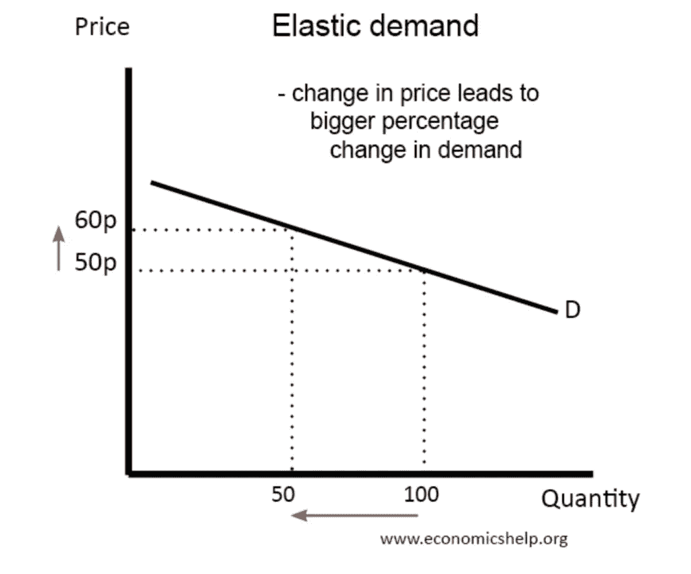
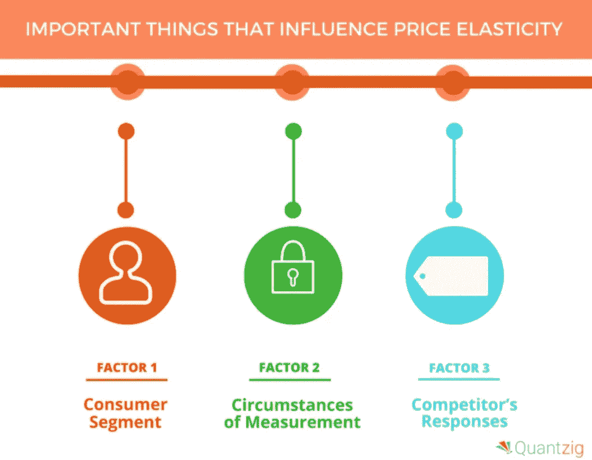
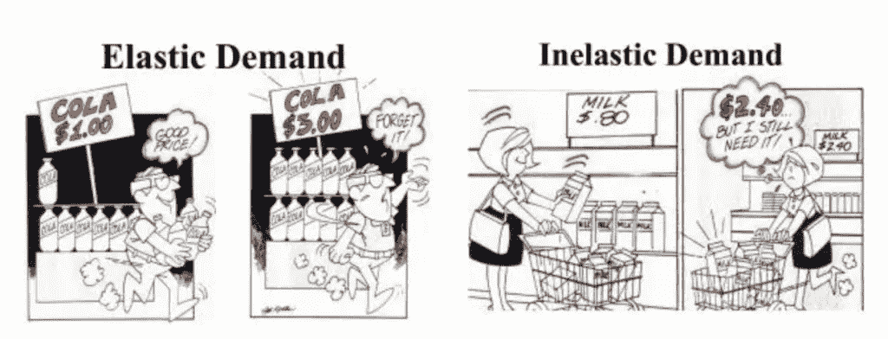

# 如何对你的网上商店实施电子商务价格弹性

> 原文：<https://medium.com/swlh/how-to-implement-ecommerce-price-elasticity-to-your-online-store-26b5582129f2>

无论你是一个拥有多年经验的资深电子商务所有者，还是一个游戏新手，无论你在哪个领域经营，整个行业的竞争都将很快变得显而易见。

这就是为什么我们鼓励你考虑各种不同的定价策略，你可以用这些策略来增加你的利润并在竞争中占据优势。

因此，在这篇文章中，我们将看看电子商务的价格弹性。价格弹性有时被称为“需求的价格弹性”,指的是特定产品的需求量。它的工作原理是，当一种产品具有超弹性时，价格的微小变化最终会彻底改变需求。但反过来，对于一个弹性很小甚至没有弹性的产品，当价格变化时，需求不变。

在这篇文章中，我们将看看价格弹性的一些好的用例，如何在你自己的电子商务商店中使用它，以及如何计算出你的产品的弹性。

# 什么是电子商务价格弹性？

正如我们已经确定的，价格弹性指的是对特定产品或物品的需求。总的来说，当一个产品的价格很高时，很少人会买，当它的价格很低时，更多的人会买。

但你需要明白的关键是，当价格降低时，有多少人会购买，当价格上涨时，有多少人会购买。价格弹性有助于回答这个问题。

因此，产品的弹性与给定的特定价格增量变化对购买量的影响有关。

这是一种定量(通过某种东西的数量而不是质量来衡量)的方法，用来衡量消费者在市场上以特定价格购买某种产品的可能性。

弹性水平高的产品，通过价格的微小变化，需求会有很大的变化。而弹性小的产品不会受到任何价格变化的影响，不管价格变化有多小。

作为电子商务业主，你知道给你的产品定价有多难。你不希望定价过高，冒着被挤出市场的风险，相反，你也不希望定价过低，降低整体利润率。

我们在 [Prisync](https://prisync.com/) 花费了大量时间，谈论[动态定价](https://blog.prisync.com/advantages-disadvantages-dynamic-pricing/)作为优化你的商店价格的一种方式的优势，因此现在转向价格弹性是有意义的。

当你对价格弹性及其与产品的关系有了很好的理解后，你就能更好地进行定价测试，并就如何优化你自己的定价提出明智的想法。

# 如何计算电子商务价格弹性

计算价格弹性需要使用一个公式**(不是猜测)**。要计算特定产品的需求价格弹性，请遵循以下公式:

**需求价格弹性=需求数量变化百分比/价格变化百分比。**

但是在我们更详细地研究这个公式之前，首先知道为什么我们需要计算它是很重要的。不同的产品会有不同程度的弹性，这意味着它们会对巨大的变化做出反应，在许多情况下，会立即做出反应。对你要销售的市场有一个很好的理解会让你更好的理解为什么一个产品在一个价格点卖的很好，但是在另一个价格点卖的很差。

然而，在很大程度上，产品可能具有弹性的一些常见原因包括:

*   你的价格已经超过了你的市场。如果你所在行业的其他人每支笔要价 1 美元，而你对同一支笔要价 8 美元，你可能会发现销量会下降。这是基于你的竞争对手的外部需求。
*   你的物品不是日常生活的必需品。非必需品通常非常有弹性，对价格的任何微小变化都非常敏感。这是因为该商品不是必需品，价格会上涨到消费者拒绝购买的程度。
*   他们可以选择类似的项目。考虑买手机。如果你有两部功能相似的手机，突然其中一部涨价 400 美元，更多的人会选择另一部。

一些产品天生缺乏弹性，这意味着当价格上涨时，需求通常会停留在同一点。一个很好的例子就是人们为他们的汽车购买燃料。他们知道他们需要开车，所以如果燃料价格上涨，需求通常会保持在同一点。

回到我们的公式:

**需求价格弹性=需求数量变化百分比/价格变化百分比。**

我们将用一个例子来帮助说明如何在现实生活中使用这个公式。

想象一下，你拥有一家五金店。

你将电钻的价格从 100 美元提高到 165 美元。这是涨价 **65%** 。你可能预料到的是，由于价格上涨，电钻的销售会下降。

如果我们然后计算数量变化，我们可能会看到价格上涨导致销售从 100 单位下降到只有 30 单位。需求下降的百分比为 **-70%** 。

我们现在有了所有需要输入公式的数字。

数量百分比变化**(-0.70)/价格百分比变化(. 65) = -1.08**

所以我们知道电钻的价格弹性是 **1.08** (注:如果得到负数，忽略负数，只关注实际数字)。

你不关心这个数字是负数还是正数，你关心的是这个数字离零有多近。

**接近零的数字** =无弹性

**远离零** =有弹性。

为了让你有个概念，分析师通常把结果分成三类。

**0–1**当你的电子商务价格弹性在这个范围内时，产品在很大程度上是没有弹性的，因此价格的变化会导致消费者需求数量的微小变化。在这种情况下，尽管价格较高，但消费者不太可能选择不同的产品。此类产品通常被定义为明确必需的产品，例如哮喘患者的吸入器。

价格弹性得分为 1 的产品被称为“单位弹性”，这些产品的价格百分比变化与需求数量的同等百分比变化相匹配。

当一种产品的价格弹性大于 1 时，它们被认为是有弹性的。价格的增量变化将对消费者的需求量产生直接影响。如果你的产品属于这一类，你可以得出结论，它通常有广泛的替代品。比如口香糖。如果你突然把价格提高 140%，需求就会下降，因为消费者可以购买市场上的任何其他口香糖。

# 如何用自己的产品测试电子商务价格弹性

但是仅仅知道你的产品有多大的弹性是没有用的，除非你真的用你收集的数据做些什么。

您可以使用这些数据来帮助您就如何测试特定产品的价格做出明智的决策。

具有高弹性的产品将不得不进行大量的测试来找到最优价格，而无弹性的价格将有一个小得多的价格优化窗口。

因此，当你很好地理解了你的产品的弹性后，如果你想改变它们的价格而不影响需求，你可以考虑建立一个更强大的品牌形象。

如果你能把你的特定产品定位为必需品，当你涨价的时候，你知道你不会失去客户。

# 电子商务价格弹性的最终想法

深入了解电子商务价格弹性需求，对于准确预测您的产品价格以及价格变化将如何影响您的整体收入至关重要。如果你希望提高利润率，这是一个很好的工具。

将电子商务价格弹性公式应用到您的电子商务策略中，可以让您在制定有效的价格策略时变得主动，而不是被动。

当你了解你要销售的市场和你的产品弹性时，你就能更清楚地知道根据你自己的目标受众，你能增加或减少多少产品。

消费者现在有了更多的选择。他们花越来越多的时间寻找最佳交易。因此，大多数产品将属于弹性范畴。但目标应该是围绕你的产品建立一个品牌，这样你就可以让特定的产品失去弹性。

通过让你的产品在众多销售相同产品的竞争者中脱颖而出，你就可以提高价格，而不会阻碍人们的购买需求。

您可以通过特性、产品或支持来区分您的产品。

***你的产品弹性如何？今天就去了解一下吧！***

## 这篇文章发表在 [The Startup](https://medium.com/swlh) 上，这是 Medium 最大的创业刊物，有 348，974 人关注。

## 订阅接收[我们的头条新闻](http://growthsupply.com/the-startup-newsletter/)。

