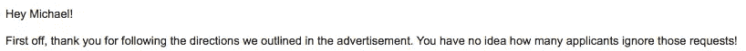

# 如何给你的客户留下深刻印象

> 原文：<https://medium.com/swlh/how-to-impress-your-clients-without-ever-really-trying-134b32808a24>

Photo by [Daria Nepriakhina](https://unsplash.com/photos/i5iIhHSAtp4?utm_source=unsplash&utm_medium=referral&utm_content=creditCopyText) on [Unsplash](https://unsplash.com/search/photos/working-computer?utm_source=unsplash&utm_medium=referral&utm_content=creditCopyText)

无论是谁提出了自雇意味着自己当老板的荒谬观点，他显然都没有任何客户。如果你正在创业，独立承包，或者提供任何种类的服务，你不仅仅只有一个老板。

**你有几个。**

与直接上司相比，与几个客户合作的困难在于，你要给不止一个人留下深刻印象，而且当你失败时，你更有可能被别人抛弃。

当你把推销、与当前客户的电子邮件通信以及解决你可能已经有的任何问题都考虑在内的时候，你可能已经做了比实际做委托给你的工作更多的事情来让你的客户满意。

**这是假设你已经长期锁定了这个客户。**

给你现有的和潜在的客户留下深刻印象是你从看不见的竞争中脱颖而出并保持稳定收入的众多方法之一。这就引出了我的第一点:

## 如果你和他们交谈，他们就是你的客户。句号。

我不在乎他们是否询问了你的价格或者发了一封电子邮件问你到底能为他们做什么。他们是你的客户，你需要这样对待他们。

像对待二等公民一样对待潜在客户只会让你永远无法与他们保持长久的关系。只要经济上可行，尽可能多花时间在你的客户身上。

这是一个简单的事实——如果你想不用努力就能给你的客户留下深刻印象，那就关注他们。停止说话，开始倾听。**就这样。**

这个答案可能会让你失望。当你点击这个标题的时候，你可能正在寻找其他的解释。但是如果可以的话，让我*给你展示一下*为什么关注和倾听那些没有说出来的需求对我的帮助比我想象的要大。

我已经在一家数字营销机构工作了一段时间。没什么特别的——我看着他们的需求，写一些文章和稿子，然后把它们寄给一个编辑，由他来接手。这是简单的工作，也不是特别赚钱，但它始终如一，编辑是我最喜欢的联络人和客户。

过了一会儿，我注意到她已经把我关于协作驱动的文章重新格式化成一种新的风格——这是我以前没有见过的，但很可能是为了支持他们机构的任何工作流程。因此，在发送下一个项目的文章之前，我改变了格式以匹配她的。

**这带走了我，什么？十秒完成？**

又过了三个小时，我得到了这样的回应:

我得到的不仅仅是赞美。此后不久，我的工作量增加了一倍，客户倾向于我的日程安排，而不是相反。通过关注，我得到了两倍的工作和两倍的自由。

## 这是另一个例子:

我需要另一个机构来填补一些空闲时间，并帮助我支付一些账单。一旦我找到一家似乎与我的定位相近的中介，我注意到他们给了我非常具体的申请说明。

我没有复制粘贴我通常的冷提议(这在过去被证明是非常有效的)，而是写了一个新的。同样，这花了我不超过 5 分钟。我很快得到了回复:

通过做**最起码的期望，**我从无数的申请者中脱颖而出，把我的申请推到了最前面。

**是的——我得到了那份工作。**

因此，在与客户交谈或推销潜在客户时，不要盲目乐观。**你不是在给某个拿你的钱做人质的仁慈的人发邮件——你是在和一个人说话。**

给你的网上信件注入一点人性。不要害怕提及一些小趣闻，比如天气预报，甚至是时事。我不是说不专业，而是告诉你要正常。

为自己工作的光荣本质的一部分是将你的个性变成你个人品牌的一部分的能力。**不要否定那个能力。放松一点，如果你在现实中就是这样的话。或者简洁直接。对你最诚实的事。**

通常，你只有一次机会打动客户。所以要让它有价值。成为人们真正想一起工作的人。谁知道呢？

也许你也会想和他们一起工作。

## 这篇文章发表在 [The Startup](https://medium.com/swlh) 上，这是 Medium 最大的创业刊物，拥有 298，432+人关注。

## 在此订阅接收[我们的头条新闻](http://growthsupply.com/the-startup-newsletter/)。

