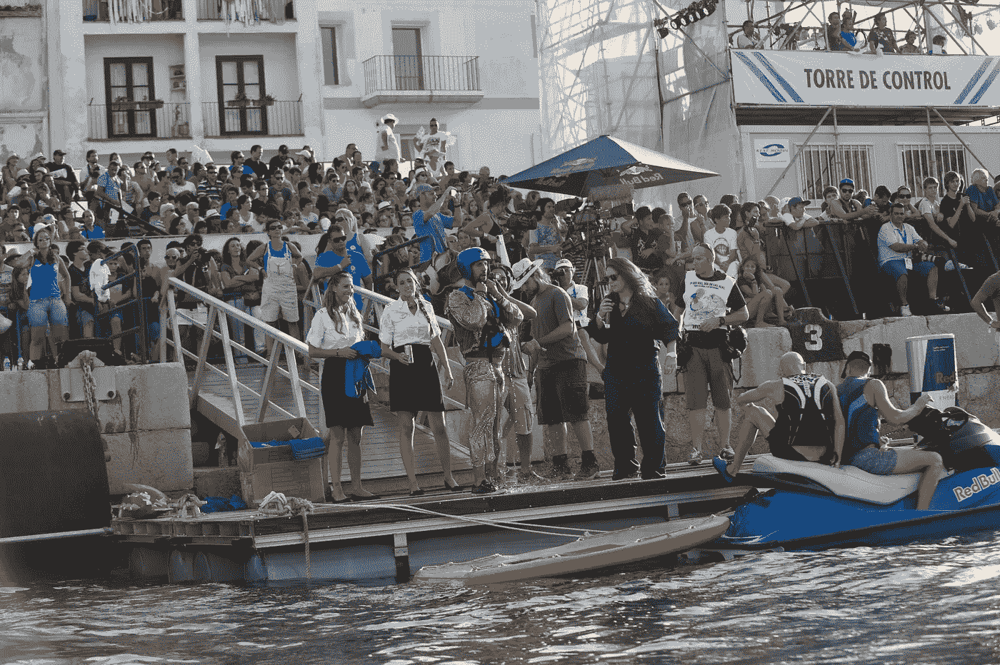
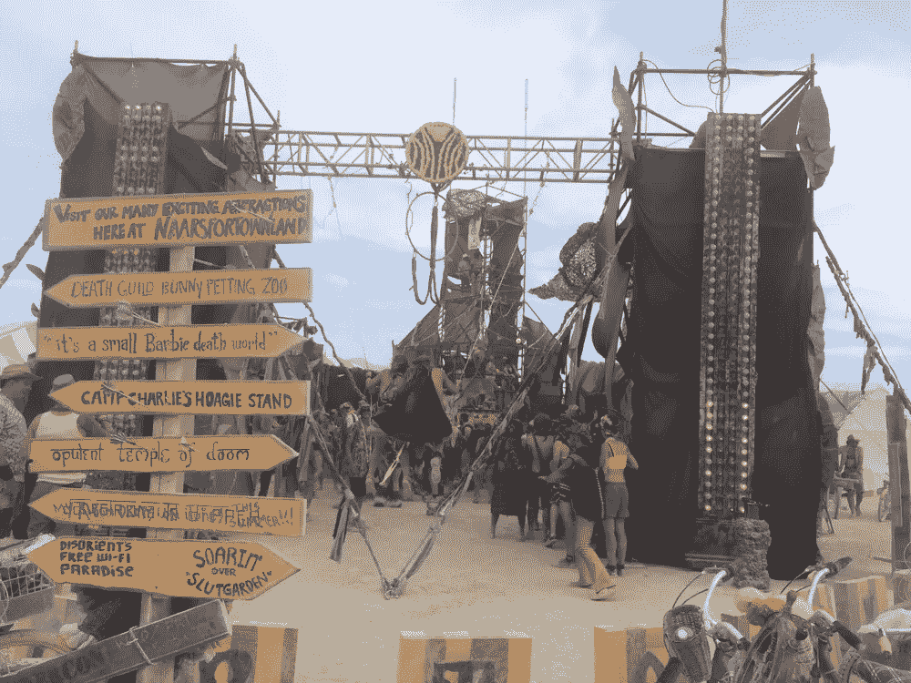

# 如何改善和促进你的营销:14 个令人信服的想法

> 原文：<https://medium.com/swlh/how-to-improve-and-boost-your-marketing-14-compelling-ideas-d865eef4b586>

[https://flugtag.redbull.com/es/es/](https://flugtag.redbull.com/es/es/)

## 如何创造更好的互联营销体验

在我工作和提供建议的公司和组织中，每天我都发现自己的任务离互联网更远，离我从事营销工作的方式更近。互联网是一个无限的选择和替代资源，可以最大限度地发挥我们的努力，但如果你做的营销与你的业务不一致，数字经济就会变得一无所有。那么改善和提升你的营销就变得势在必行。

# 点亮并提升你的营销

这里有 14 个促进营销的方法:

# 1.创建一个博客，写下你所做的事情(你的产品或服务)如何能改善你接触到的人

写下可能吸引那些对你的生意感兴趣的人的东西。除了致谢或成功之外，还要写一些东西，展示你是如何解决与客户之间的误解的，你是如何挽回失去的销售的，或者描述谁是图形、营销、财务或分销的幕后推手。告诉读者让你与众不同的过程，你如何谈判，你如何吸引客户，你如何准备活动或发布会，以及出现问题时会发生什么。

# 2.寻找问题的解决方案，深入了解顾客不再购买的原因

因为你的网站不接受访问，或者因为你最喜欢的产品不再被访问。解决员工缺乏动力或部门间沟通不畅问题。允许顾客和员工告诉你他们的问题，然后去解决它们。

# 3.最好的投资回报，你银行账户里的钱

在隧道的尽头，将你的银行账户视为你所做的营销有积极、中立或消极结果的最佳指示器。

# 4.专注于艰苦的工作

如果你要谈论乐观主义或幻觉，动机是极好的，但如果你必须增加汽车、应用程序或销售更多瓶葡萄酒，或设计一款新衣服，除了灵感冲动，你还需要不断地工作、计数和计划。

# 5.你最好的资产是项目本身

一旦你意识到你生活的环境，围绕一个项目、想法、业务或超级大国创建你的品牌，并开始强化它。这是为经理，学生，家庭主妇或行政人员等。

# 6.表现出脆弱和不完美

用弱点来与世界产生共鸣，用好的和坏的时光来讲述人类的故事，不要把自己局限于出售成功、日落和非常合适的食物。它包括雨天，会议或非生产性的一天，失败和烧焦的玉米粉圆饼或如此多的放荡的后果。也许你不会得到那么多的喜欢或评论，但你会更有人情味，这连接着灵魂。

# 7.请交叉营销

将社交媒体放在一边，作为你的商业战略的宣传中心，通过采用在线和离线流程，并将其融入到你的组织模式的运营中，打开基本数字化转型的大门。

为社交网络的每个工具或平台定义一个有两三种用途的目标。否则，你最好什么都不要做。

# 8.最好的营销是嵌入你的产品或服务

如果你的服务是不幸的，你的产品是有缺陷的，或者你的客户是不满意的，你会在网上建立一个坏名声，即使是最好的顾问也帮不了你。否则，如果你的服务很好，产品准时到达，质量非常好，你对待你的客户比你的情人更好，你的网上声誉会很高，就这么简单。

# 9.问简单的问题

在复杂和专家面前选择无知和直率。第一种是稀有的、稀少的和有价值的，第二种已经被很多人做过了。

# 10.[嘉宾体验](https://www.entrepreneur.com/article/206760)宝贝

然而，接触那些目前是顾客的观众，给他们的生活带来积极的变化:在你的酒店给他们提供一个免费的周末。或者邀请他们在你的餐厅参加一个私人晚宴，创作并奉献一首歌，或者给他们一个奖励，比如去一个乡村小屋旅行，或者如果你有旅行社或葡萄酒厂的话，给他们一个品酒会。

# 11.人类品牌

做一个 [**人类品牌**](https://isragarcia.com/17-habits-for-staying-human) :通过情感联系你的客户或观众:讲述你的故事，了解他们的挑战，让他们参与服务或产品之外的冒险或体验。

# 12.实践最成功的策略:承诺

说到做到，准时到达，向你的客户承诺并实现它。在不到 24 小时内发送产品，并尝试让它比预期来得早。承诺服务质量，以难忘的体验超越。不收取外部服务费用，并提供其他额外服务。

# 13.市场来自内部

在你的组织或品牌内部创建你的营销部门，如果做不到，自己学习，自己做。切断执行链，与按目标行动的专业人士合作，而不是按月付费，是的，给他们应得的奖励。

# 14.教人如何感动和改变他人

营销是改变，而不是操纵或卖淫，把这一点教给所有组成你的企业的人(甚至是供应商或合作者)，不会有比这更强大的营销了。

[https://burningman.org](https://burningman.org)

# 提升你的营销是一件令人愉快和迷人的事情

如果你的营销是为了迷惑你的客户，那么你是使用脸书、推特还是竹签都没关系。改善和促进你的营销是做需要做的工作。就是这样。

【*本文首发于*

# **只有当你觉得值得的时候，才让这个故事震撼吧！如果你发现任何有价值的东西，请鼓掌。**

> **Isra Garcia = 53 个客户，48 家企业，398 次演讲，3.454 篇帖子，24 个项目，6 本书，380 场讲座，6 家公司，16 次冒险，25 次实验，∞失败。到目前为止…**
> 
> **[营销人员](https://isragarcia.com/wp/marketer)。顾问。扬声器。作家。教育家。经理。在 [IG](http://thisisig.com) 的负责人。博主。企业家。颠覆性创新。数字化转型。高绩效者和生活方式实验者。**

# **行动号召>>点击[此处](http://feeds.feedburner.com/isragarcia)订阅更多类似的文章！**

****

## **这个故事发表在 [The Startup](https://medium.com/swlh) 上，这是 Medium 最大的创业刊物，拥有 312，043+人关注。**

## **在这里订阅接收[我们的头条新闻](http://growthsupply.com/the-startup-newsletter/)。**

****