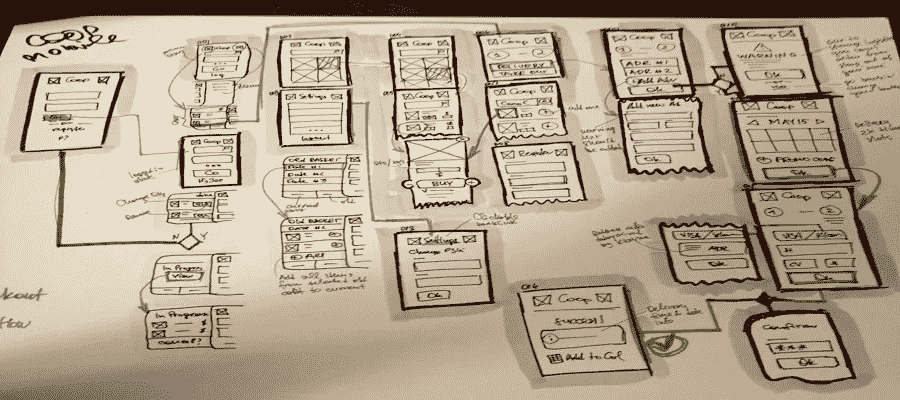
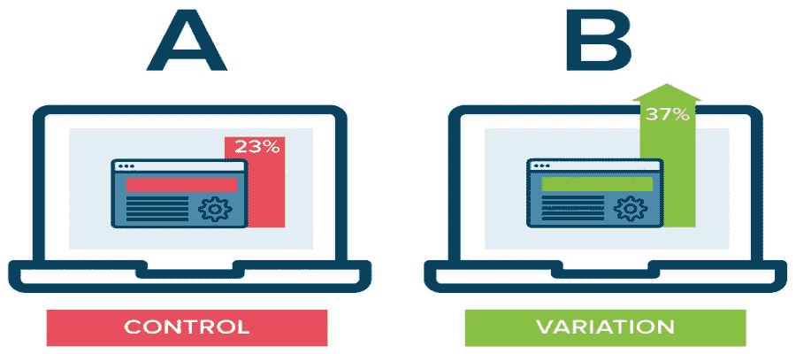
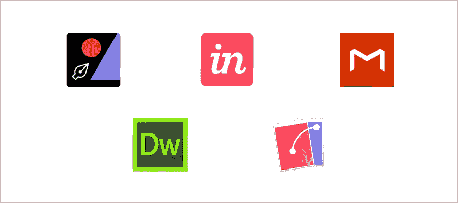

# 如何提高和完善你的 UX 技巧

> 原文：<https://medium.com/swlh/how-to-improve-ux-skill-7-best-ux-tips-to-refine-ux-design-skills-2f9dca24e561>

你对自己目前在这个行业取得的成绩满意吗？你有没有努力提高过自己的设计技巧？你有没有被这个竞争激烈的设计行业搞得不知所措？嗯，即使像唐·诺曼这样的顶级设计师都比你努力工作，你怎么能被落下呢？作为一名 UX 设计师，我经常寻找提高自己设计技能的方法，但是如何提高 UX 技能呢？在这里，我列出了**业内顶尖设计师推荐的 7 个最佳 UX 技巧**，它们将帮助你提高你的 **UX 设计技巧**。

# 1.多画些素描

素描不是为了好看，而是为了保留设计师头脑中的想法。多写生，你会理清思路和设计思路。纸笔或者白板都可以做[低保真原型。](https://www.mockplus.com/blog/post/prototyping-design-low-fidelity-prototype-is-everything/?r=cherry)

# 2.重新处理您的设计

老实说，你的产品永远不会完美。人们总是找到问题来批评你的设计。重新处理您的设计可以帮助您发现更多您可能在一开始没有发现的问题，您可以组织这些问题并在到达最终阶段之前开始修复它们。

# 3.测试您的设计

你的设计需要测试。如果你有足够的时间，那么 [A / B 测试](https://en.wikipedia.org/wiki/A/B_testing)将是测试你的设计的最推荐的方法。但是当时间有限的时候，你可以把你的设计发给你的团队成员或者你的目标用户群来测试设计问题。他们会发现一些你自己不容易发现的问题。一旦得到反馈，您可以立即对其进行审查，以提高设计和工作效率。

# 4.尝试一些新的设计工具

工具在设计过程中是必不可少的。这将导致低水平的生产力和浪费更多的时间不使用工具。学习更多的工具将帮助你提高工作效率和表现。这里我列出了一些最好的设计工具，可以帮助你提高 UX 的设计技巧:

# UX 原型工具:

**Mockplus**

一个简单易用的原型工具，内置 3000 个图标和 200 个组件。通过简单的拖放，您可以轻松实现交互。在 3.2 版本中，Mokcplus 支持导出草图文件、UI 流程图、“repeater”等诸多新功能。“复读机”是我最喜欢的功能。有了中继器，我们只需调整其中一个电池，它就能自动同步调整其他电池。更多详情: [3.2 新特性](https://www.mockplus.com/blog/post/mockplus3-2/?r=cherry)

**UXPin**

UXPin 是为不擅长 UX 设计的人设计的。UXPin 经验丰富的 UX 设计师为 UX 初学者提供了一整套实用的设计元素和模式。

**视觉**

InVision 可以快速创建令人印象深刻的高保真原型。通过使用这个工具，用户可以链接他们的 UX 草图、设计和框图，并与团队中的其他人共享。

# 可用性测试工具:

**概念反馈**

它通过在线专业团队对网站设计、可用性和营销提供快速反馈。对于公众意见，专业人士会给你一个整体的看法。对于私人反馈，您可以邀请特定的专家提供反馈并组织图形结果。专业反馈来自设计、可用性和营销领域的专家。

**用户回应**

它用于帮助收集顾客的反馈，听取顾客的意见以改进产品和服务。

**验证**

它用来收集用户对设计或原型的反馈，形成收集的统计数据来指导和改进设计。

**银背鹦鹉**

一个供设计人员和开发人员通过捕捉屏幕活动来执行可用性测试的软件，它可以记录测试人员的面部和声音。该软件最大的优点是它可以输出音量数据，并且可以显示任何值得注意的时刻。

**用户测试**

用来观察用户在自己环境中的活动，听听他们的想法，然后形成结论。官方对这个工具的介绍是用最快最划算的方式找到用户为什么离开你的网站的答案。

# 思维导图工具:

**Mindnode**

它有简单和舒适的风格。它的无限延伸功能可以算是最好的思维导图工具之一，你可以在链接中做出不同的连接点。MindNode 支持 iOS 和 Mac 的最新操作版本。

**思维导图**

这是第一款使用 3D 显示模式的思维导图产品，以 3D 视角全方位展示您的思维。

Xmind

它有专业的拼写检查，搜索，加密甚至音频笔记功能，支持直接导出到 PPT。

# 5.与工业设计师交流想法和经验

定期与工业设计师交流分享自己的学习经验或设计理念。Quora 和 UX 设计论坛是扩大你自己职业 UX 圈子的好地方，[脸书和 LinkedIn groups](https://www.mockplus.com/blog/post/ui-ux-graphic-professionals-best-facebook-and-linkedin-groups-to-join/?r=cherry) 是你扩大社会关系的最佳渠道。

# 6.学习新的设计理念，跟上最新的设计趋势

作为一名 UX 设计师，了解最新的设计趋势和新闻是至关重要的。如果你不熟悉行业和市场，那么你设计的产品就不会被用户使用。以下 UX 设计网站和博客是我的最爱:

**砸弹匣**

这个网站总是提供丰富的设计资源和高质量的文章。我想大多数设计师都熟悉这个网站，每个 UX 设计师都应该收藏这个网站，你会从中受益匪浅。

**中等**

Medium 是一个综合性的博客平台，设计版块一直在这里提供丰富的设计资源和新闻。这个网站是我最喜欢的一个，我通常每天花 2 个小时在这个网站上学习其他设计师的经验和行业趋势。每个人都会从中受益。

这里有更多 UX 设计资源: [UI / UX 设计资源学习网站](https://www.mockplus.com/blog/post/146-top-20-ux-design-blogs-and-resources-you-should-follow-in-2016/?r=cherry)

# 7.提高你的沟通技巧

智力、知识或经验很重要，可能会让你得到一份工作，但强大的沟通技巧会让你得到晋升。——米蕾尤·吉利亚诺

每一个 UX 设计师都应该成为一个多方面的沟通大师。他们不仅能谈论设计，而且有说服人的能力。他们要有使用行业语言与其他设计师顺畅交流的能力，能使用简单的编码语言向开发者解释设计过程；然而，对于客户或用户来说，他们也可以通过使用简单的语言而不是技术术语来与他们交流。

# 要点:

你可以在推特上关注 UX 的顶级设计师，了解他们的设计思维。如果你能找到一个愿意在 UX 设计行业指导你的顶级导师，你会事半功倍。

# 结论:

设计还有很长的路要走。改善用户体验的方法有很多，但学习是帮助你成为一名[优秀的 UX 设计师](https://www.mockplus.com/blog/post/whats-your-next-step-to-be-an-advanced-ux-designer/?r=cherry)的唯一途径。如何提高 UX 技巧？我知道看完这篇文章后你一定得到了你的答案。

## 这个故事发表在[的《创业](https://medium.com/swlh)，这里有 263，100 多人聚集在一起阅读 Medium 关于创业的主要故事。

## 订阅接收[我们的头条新闻](http://growthsupply.com/the-startup-newsletter/)。

