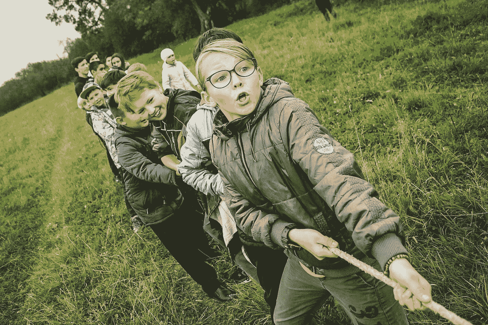

# 如何使用单一工具改善您的应用团队的协作

> 原文：<https://medium.com/swlh/how-to-improve-your-app-teams-collaboration-with-a-single-tool-bac3b87592ad>

***手机 app 并不是轻易出世的。***

每个成功的应用背后都有一个精疲力尽的团队，他们都在不知疲倦地工作，解决 bug、崩溃、设计和可用性问题，一次又一次地测试。他们经受住了争论和[误解](https://blog.prototypr.io/in-their-shoes-designers-understanding-developers-30096c5cb4c1)，错过最后期限，以及不太满意的利益相关者。他们参加过会议，会上没有人就任何事情达成一致，问题越来越多，但解决方案却很难确定。分歧和沟通失误是应用程序制作过程中的一个自然副作用。

但是一定要这样吗？

# 为什么跨团队协作这么难？

不同团队之间的不和谐，例如[开发人员](https://codeburst.io/7-things-i-wished-developers-did-more-of-when-working-with-designers-57cfcb2d4524)和[设计人员](https://medium.muz.li/7-things-i-wished-designers-did-more-of-when-working-with-developers-2c6fb251fce)之间的不和谐，在团队就一个多方面的项目进行合作时必然会发生。每个团队都关心自己的 KPI 集，导致在区分特性和过程的优先级时发生冲突。

跨团队沟通不畅的最大悲剧是失去了应用程序开发团队拥有的最宝贵的资源:时间。花在尝试就策略达成一致，从几个选项中选择一个功能，或者决定一个按钮应该放在哪里的时间可以用来解决性能和可用性问题。这可能意味着一个成功的应用程序和一个失败的应用程序之间的区别。

我们需要的是一个数据驱动的、公正的、知识渊博的第三方——能够帮助更快地做出决策，并回答关于应用质量的棘手问题的人。

app 开发团队之间有一个潜在的和事佬，而且不是你想象中的那种: [**定性**](https://usabilitygeek.com/quantitative-qualitative-analytics-data-power-couple/) 分析。

# 用定性分析回答“为什么”

当很明显有一个问题需要解决，但没有人知道如何解决它，甚至不知道如何定义它时，团队之间的分歧经常出现。这是最关键的地方，不仅要关注正确的数据(T1)，还要让 T2 正确使用数据(T3)。团队很容易陷入陷阱，比如收集太多或太少的数据，而不是简单地拥有*正确的*数据。这会导致分析瘫痪、草率或被误导的决定、错误和每个人的紧张。

下载次数、崩溃次数、MAU/DAU 和其他量化 KPI 是合乎逻辑的第一步，但它们只能显示这么多。它们揭示了一个问题存在的事实，但不是如何解决它。它们显示的是“多少”，而不是“为什么”。定性分析通过使用一套独特的工具来回答这些“为什么”来完成这个难题。这些工具超越了传统分析的数量，增加了对用户行为方式及其行为原因的深入了解:

**用户会话记录**

在单用户层面上放大用户行为，[会话记录](https://www.appsee.com/features/user-recordings?utm_source=medium&utm_medium=link&utm_campaign=thestartup_teamwork&utm_content=user_recording_feature&cpnid=701b0000000Wd7c)向团队*确切地展示了用户如何体验应用*，并分解了用户的动作，以给出他们交互和行为的详细演示。这一定性功能消除了应用分析中的猜测。这样，团队可以更好地沟通并做出更好的决策，而不是必须解读数字 KPI 的言外之意，并对他们遇到的任何问题的原因持不同意见。例如，也许开发团队和产品经理找不到崩溃的原因。会话记录分解了用户在崩溃发生前采取的行动，以两个部门都能理解的方式揭示了问题。

**触摸热图**

如果用户会话记录在单用户层面上提供定性分析，那么 [touch heatmaps](https://www.appsee.com/features/touch-heatmaps?utm_source=medium&utm_medium=link&utm_campaign=thestartup_teamwork&utm_content=touch_heatmaps_feature&cpnid=701b0000000Wd7c) 通过显示用户在每个屏幕上与应用程序交互的位置，从总体层面上获取用户体验并绘制出来。这个彩色地图有助于解决应用程序功能和广告的 UI 和可用性问题，并指出用户喜欢或不喜欢应用程序的什么。例如，UX/UI 团队和营销团队可能正在处理插页广告的可用性问题。触摸热图将为用户互动最多的屏幕区域着色，将无反应的手势和设计错误等问题立即提请团队注意。团队不会在屏幕上搜索放弃率的原因，也不会就此产生分歧，而是会立即知道发生了什么:导致用户关闭应用程序的手势问题，超出用户屏幕限制的布局，或者被误解的 CTA。

# 使用定性分析改善团队合作

定性分析工具几乎可以被公司的每个团队或个人使用——从开发人员到客户支持代表。每个团队都可以从更多的数据驱动中受益。将定性数据添加到数量下载和 MAU/DAU 等指标的定量数据中，可以发现强大的优化机会。公司作为一个整体，更有能力做出良好的、数据驱动的决策，而不是就可能的问题和解决方案进行争论/沟通不畅，并踩在对方的脚趾上。下面是一些定性分析可以解决的跨团队争议/困惑的例子:

**开发团队和设计团队在争论:这是性能问题还是可用性问题？**

所有开发人员都使用崩溃分析来尝试并查明需要编辑的代码行。开发人员可能会怀疑为什么 UX 分析对他们有用，但他们也可以使用定性的会议记录——作为一个崩溃的娱乐工具。定性分析还可以帮助解决那些难以发现的性能问题，或者可能源于可用性问题的性能问题，例如[无响应手势](https://blog.appsee.com/unresponsive-mobile-gestures-your-mobile-apps-hidden-troublemakers/?utm_source=medium&utm_medium=link&utm_campaign=thestartup_teamwork&utm_content=blog_post_unresponsive_gestures_hidden_troublemakers&cpnid=701b0000000Wd7c)或 [ANRs(应用程序无响应)](https://android.jlelse.eu/app-not-responding-now-what-fc44732a53eb)。有了触摸热图和用户会话记录，发现这些狡猾的麻烦制造者的原因变得很容易，只需一瞥。

**产品经理和营销人员不知道是什么导致了参与度的下降**

当公司未能达到其设定的关键绩效指标时，每个人都知道这一点:这很容易看到，也很容易让人感到压力。理解下降的原因要困难得多。是否存在隐藏的性能或可用性问题？一个完全不相关的广告出现并破坏了体验吗？用户是对新功能不满意，还是不满意？定性分析通过向营销人员和产品经理提供一些相关的会议记录来帮助解决这个问题。他们可以观察那些从启动应用的那一刻起就没有良好体验的用户，看看是什么让他们无法留下来并转化。也许用户没有理解弹出消息中的内容。也许他们中的许多人浏览菜单寻找某个功能，但找不到它，营销团队可以调整他们应用程序的副本，以更好地反映现有的功能。在任何情况下，在定性数据的帮助下，找到解决方案并进行测试都要容易得多。

**营销团队和 UX 团队想不出用户在观看应用内广告后退出的原因**

如果没有适当的监控，应用内广告可能会成为危险的应用雷区，而质量差的广告会让用户流失。处理可能有问题的广告的最好方法是什么？通过定量分析，营销团队和 UX 团队将分别从应用内广告屏幕上查看退出的人数，然后必须尝试猜测用户离开的原因。是他们不喜欢这个副本，还是有可用性问题让他们别无选择，只能“[杀死”这个应用](https://codeburst.io/why-users-kill-mobile-apps-33817ba1140f)？定性分析让这个问题变得更加清晰:如果用户遇到可用性问题，比如丢失链接或没有反应的按钮，触摸热图和会话记录会实时显示其中任何一种情况。

# 概括起来

就像任何家庭一样，移动应用团队可能会遭受沟通不畅和关系紧张的困扰。好消息是:这些事件中的许多都可以通过[更好的沟通](https://www.dtelepathy.com/blog/business/developers-designers-should-work-together)和良好的领导来解决。其他的只是浪费时间，可以通过减少猜测的定性数据来解决。借助用户会话记录和触摸热图等定性工具，许多导致团队间不和的问题都可以得到解决。定性分析可以显示问题的*根源*，而不仅仅是提醒团队问题确实存在。总而言之，跨团队的努力受益于保持对同一个目标的关注:用户。

如果这个故事激励了你，给它一些掌声，这样其他人也能发现它并受到激励！

## 这篇文章发表在 [The Startup](https://medium.com/swlh) 上，这是 Medium 最大的创业刊物，拥有 356，974+人关注。

## 在此订阅接收[我们的头条新闻](http://growthsupply.com/the-startup-newsletter/)。

