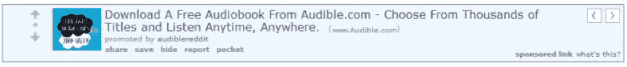

# 如何通过内容营销增加电子商务销售额

> 原文：<https://medium.com/swlh/how-to-increase-ecommerce-sales-with-content-marketing-dfdc9c0f033f>

推广你的电子商务业务变得越来越有挑战性。网络嘈杂，消费者持怀疑态度。如果你过于频繁或公开地向他们推销产品，他们可能会反其道而行之。

你是如何在不让人厌烦的情况下保持头脑清醒的？

这就是内容营销的切入点。

内容营销已被证明是增加电子商务销售的有效策略。它通过以下方式做到这一点:

*   建立品牌意识
*   驾驶交通
*   将潜在客户进一步推向漏斗下方
*   优化购买流程
*   建立信任和关系
*   提高客户忠诚度
*   将您的企业定位为权威之声

内容营销不仅是一种有效的策略，而且很容易省钱。与传统广告相比，它的成本降低了 62 %,并产生了三倍多的潜在客户。

然而，这并不意味着你可以在你的网站上发布一些博客文章，祈祷销量飙升。

随着越来越多的营销人员利用内容营销的力量来产生线索和推动销售，消费者变得越来越挑剔。你需要对你的[内容创作和推广](https://conversiongiant.com/using-content-to-increase-ecommerce-sales/)进行战略规划，这样你就能保持领先，[推动高质量的流量](https://simplymeasured.com/blog/identify-create-promote-retain-repeat-how-to-drive-more-blog-traffic/#sm.0001cqm6cvk6xcpavdj2ji6sptaz1)，并将其转化为销售额。以下是方法。

# 1.专注于结果驱动的策略

在内容营销中，你可以做很多事情，并不是每一种策略都会产生与你的业务最相关的结果。

为你的内容营销努力定义一个方向，以确保你把时间和资源花在最能推动销售的活动上。

记录您的内容策略，应包括以下内容:

*   长期和短期目标
*   与您的目标相关的关键绩效指标(KPI)
*   买方角色
*   关键词或关键短语
*   编辑日历(考虑节假日、季节性事件和贵公司的营销日历)
*   促销时间表，可能包括社交媒体、影响者和电子邮件营销

像 simple Measured[Social Listening](https://simplymeasured.com/product-listening/#sm.0001cqm6cvk6xcpavdj2ji6sptaz1)这样的社交倾听解决方案提供了对你的受众在社交媒体上进行的对话类型的有意义的洞察。通过这种洞察，您可以为您制作的内容类型定义一个战略方向，确定可以向更多受众传播的影响者，并制定符合社交空间趋势的战略。

# 2.用内容类型分支

文本(如博客文章)只是众多内容类型中的一种，可以作为内容营销策略的一部分进行部署。

使用多种内容格式将使你有机会吸引不同的受众，并有助于提高参与度。

一些例子包括信息图、迷因、视频、产品评论、[用户生成的内容](https://simplymeasured.com/blog/how-to-encourage-user-generated-content-on-social-media/#sm.0001cqm6cvk6xcpavdj2ji6sptaz1)、案例研究、客户评价、电子书、播客和幻灯片。

如果你使用图片，确保包含关键词丰富的 [alt 标签和 title 标签](https://yoast.com/image-seo-alt-tag-and-title-tag-optimization/)，这样搜索引擎就能“看到”你的内容。

不管内容类型如何，请记住，创建内容应该是为了让你的受众参与到你的品牌中，提高你网站的搜索引擎优化，并让你的潜在客户沿着[买家之旅](https://www.i-scoop.eu/content-marketing/defining-content-marketing-strategy/content-marketing-strategy-content-formats-changing-buyer-journey/)前进。

# 3.在上下文中展示您的产品

内容营销首先是通过有价值和信息丰富的材料建立信任和关系。但这并不意味着你不能提及你的产品或服务，如果它们与帮助你的受众达到内容中讨论的结果相关的话。

假设你正在销售补充剂，并想推广一系列维生素 C 产品。你可以发表一篇题为“在这个感冒和流感季节提高免疫力的 X 种方法”的文章，并提到服用维生素 C 补充剂是避免生病的一种方法。你可以包括一个链接到你的维生素 C 产品页面，以及推荐，而不会显得明显的促销。

视频是展示你的产品的另一个很好的媒介。 [43%的人希望看到更多视频内容](https://blog.hubspot.com/marketing/visual-content-marketing-strategy)，51.9%的营销专业人士认为视频是投资回报率最高的营销工作。

可以为[销售漏斗](https://simplymeasured.com/blog/webinar-highlights-how-to-make-full-funnel-impact-with-social-media/#sm.0001cqm6cvk6xcpavdj2ji6sptaz1)的每个阶段制作视频，从认知一直到转化。视频内容的一些想法包括产品演示、操作视频、客户评价和个性化销售视频。

你也可以将较短的视频用于社交媒体。脸书和 Instagram Live、Snapchat 和 YouTube 是建立知名度、吸引观众和增加流量的绝佳渠道。

# 4.充分利用博客

博客仍然是屡试不爽的内容营销策略。然而，许多企业没有最大限度地发挥每个帖子的潜力，以推动流量，产生线索，并转化销售。

在你开始写作之前，做一些[关键词研究](https://moz.com/beginners-guide-to-seo/keyword-research)来了解潜在客户在网上搜索什么关于你的产品或服务。您可以使用这个关键词列表来充实您的主题和标题。

当你发表了一篇文章后，不要只是坐以待毙，希望人们会涌向你的网站。为了获得高质量的流量，你需要努力推广你的帖子。

你的博文推广可能包括:

*   在社交媒体上分享
*   在社交媒体群中分享
*   电子邮件营销
*   直播带货
*   企业联合组织
*   书签
*   评论其他博客
*   付费推广

此外，请记住，大多数流量不会立即转化为客户。你应该在你的网站上建立某种线索捕捉机制，让访问者注册你的邮件列表，这样你就可以继续与他们建立信任和关系。

此外，您可以通过提供限时折扣或免费送货服务，将更多流量转化为潜在客户和客户，从而加快访问者的购买路径。

最后但同样重要的是，不要忘记使用[重新定位](https://www.brandlabs.us/ecommerce-tips/retargeting-for-ecommerce)来吸引那些已经消费了你的内容但还没有转化为顾客的访问者。

使用简单测量的[转换跟踪](https://simplymeasured.com/product-conversion-tracking/#sm.0001cqm6cvk6xcpavdj2ji6sptaz1)，可以跟踪您的博客上或通过您拥有的社交简档共享的内容，通知您表现最佳的社交渠道以及它们如何直接贡献商业价值。

以上是简单测得的转化追踪截图。根据其贡献的商业价值，我们可以确定脸书是该品牌最具影响力的社交平台。Twitter 和黑暗的社交渠道也对这个品牌的商业价值产生了影响，如果你更深入地研究这个应用程序，这种影响是可以量化的。

# 5.建立和利用关系

在你的理想客户经常光顾的网站上发布客座博文，以吸引新的受众。客座博文还能帮助你建立品牌知名度，增加网站流量，并通过反向链接提高搜索引擎优化。

确保找到合适的网站(就受众和主题而言)，然后投入时间创建高质量的内容。这些网站应该有一个既定的观众和推广客座博文的计划。

如果指南允许的话，在你的网站(或产品页面)中加入一到两个相关链接。不要忘记精心制作一份有趣的简历，并在“关于作者”部分加入你的网站链接。

客座博文只是面对新观众的众多方式之一。你可以与你所在领域的有影响力的人建立关系，请他们推广你的内容(文本、图片、视频等)。)给他们的追随者。

你也可以让有影响力的人为你的博客写内容。一旦他们的文章发表，请他们与他们的追随者分享链接，以推动交通回到你的网站。这种策略被称为“反向客座博文”

在适当的时候，在帖子中添加插图或促销图片，分享相关产品，并在上下文中推广它们。

Simply Measured 有一个强大的客座博主计划，并经常寻求行业专业人士分享他们对社交媒体最新趋势的想法和观点。这些客座博主通过社交营销者和内容营销者的视角，为社交营销提供了新的视角和见解。

# 6.在社交和付费媒体上分享非促销内容

你花了时间和精力去创造内容。现在是时候让它为你更加努力了。事实上，最好的内容营销人员花 20%的时间创造内容，80%的时间推广内容。

分享帖子时遵循 80/20 规则:80%的帖子应该是提供价值的无品牌内容，20%可以是以品牌或产品为中心的。

非促销内容帮助你建立信任和品牌意识。当你分享有价值的、信息丰富的或有教育意义的内容时，也更容易让人们点击进入。

有机到达有时会很慢且不可预测。你可以在几乎所有的社交媒体平台上通过付费媒体(即广告和增加的帖子)增加流量和销售额，包括脸书、Instagram、Twitter、Pinterest、Slideshare 和 Snapchat。

确保在买家角色上做足功课，以帮助决定哪些平台会让你接触到你的理想受众。这将有助于确保您在正确的时间处于正确的位置，这样您就可以传递正确的信息并最大化投资回报率。

一个经常被忽视的推广渠道是 Reddit。它并不适合每一个细分市场，但对于合适的受众来说可能非常有效，因为平台上的参与度更高，噪音更少。

Reddit 吸引了不同类型的用户。以下是[在 Reddit](https://moz.com/blog/the-advertisers-guide-to-surviving-reddit) 上做广告时要记住的:

*   为社区贡献价值
*   保持透明——不要试图欺骗用户点击或玩弄系统
*   要有幽默感——人们去 Reddit 是为了娱乐和社交
*   说语言——Reddit 允许你瞄准特定的亚文化，所以好好利用这一点
*   逆来顺受——Reddit 用户可能非常诚实。回应他们的评论，解决任何问题，并使用反馈来通知您的下一轮

通过付费社交广告或赞助帖子，你可以创建高针对性的内容来吸引观众的注意力，并将他们引向你的网站，在那里他们可以更多地了解你的品牌(及其产品)或进行购买。

# 内容营销是一场持久战

你可能不会在发表第一篇文章的时候就在网上出名。建立声誉、品牌意识和 SEO 汁液需要时间——通常是 6 到 12 个月——即使是最好的内容营销者。

让内容营销为您的电子商务业务服务的关键是始终如一地创建和推广内容，并根据您的战略中确定的目标和 KPI 来衡量您的结果。

通过月度报告跟踪您的进展，与您的销售和营销团队协作以改进您的工作，并在必要时进行纠正以确保您达到目标。

如果你正在寻找更多的灵感来提高你的内容营销游戏的有效性，看看我们的帖子 [8 内容营销人员头脑风暴资源](https://shanebarker.com/blog/content-marketing-trends-weekly-roundup/)。

【simplymeasured.com】最初发表于**。**

***关于作者***

*谢恩·巴克是[内容解决方案](https://contentsolutions.io/)和[礼品公司](http://gifographics.co/)的创始人兼首席执行官。你可以在[推特](https://twitter.com/shane_barker)、[脸书](https://www.facebook.com/ShaneBarkerConsultant/)、 [LinkedIn](https://www.linkedin.com/in/shanebarker/) 、 [Instagram](https://www.instagram.com/shanebarker/) 上和他联系。*

**

## *这个故事发表在 [The Startup](https://medium.com/swlh) 上，这是 Medium 最大的创业刊物，拥有 326，962+人关注。*

## *在这里订阅接收[我们的头条新闻](http://growthsupply.com/the-startup-newsletter/)。*

**