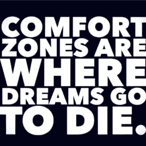
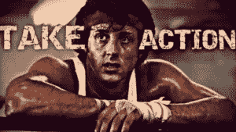
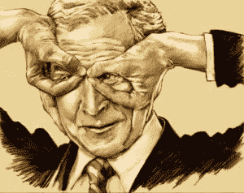

# 如何通过不给 A F 影响人们#@&

> 原文：<https://medium.com/swlh/how-to-influence-people-through-not-giving-a-f-a81bc3ed3995>

*Image Credit: Shutterstock*

我们都想成为千篇一律的好公民，纳税，早点结婚，生两个完美的孩子，开一辆完美的车，在正确的时间说正确的话，能够让人们发笑，赚很多钱，这样我们就可以买我们不需要的无用的垃圾。

这个梦是一个笑话，所有读到这个的人都知道。最近，我的眼界开阔了，知道如何打破常规，做你自己。对此我要感谢的先生们是知名博主马克·曼森。

坦白地说，直到几周前，我才听说过查尔斯·曼森的哥哥，但尽管他的家族名声不好，我还是愿意听听这个家伙要说些什么(顺便说一下，他不是查尔斯·曼森的哥哥，我只是想用一些戏剧来活跃一下气氛)。

现在，这些家伙的嘴巴就像你以前从未听说过的一样，这也是为什么这篇文章的标题中有 F 字，这和我很不一样。

我想我想尝试一下这种不给自己 F 的东西，我不得不承认，这家伙让我有点着迷。

通常，我会谈论为什么马克·曼森是自面包片以来最伟大的人，但今天我不想这么做。

我要做的是强调他的态度和他交流的方式是如何影响数百万人向他学习如何成功的。

## 所以今天的课是关于 6 种你可以通过不给 F#来影响别人的方法&就像马克·曼森一样:

# 1.打破你的外壳

马克最擅长的是说出自己的想法，并保持真实。互联网上充斥着看起来都一样的书面文章和视频。

语言打磨，语法无懈可击，照片惊艳等等。

马克对所有这些都竖起中指，张贴不完美的照片，写下如此长的句子以至于没有办法做到语法正确，说出自己的想法并提出有争议的话题，以第三人称谈论自己，以及许多令人讨厌的滑稽动作。

他不做这些是因为他是个可怕的人。他这样做是因为他试图影响人们改变他们的生活，而改变需要不同的方法。

通过打破常规，他在说一种 35 岁以下的人能理解的语言，这一点很重要。

为了让你复制他的结果，**你需要做同样的事情，打破龟壳，这个龟壳从你小时候起就粘在你的背上，是你妈妈绑在你身上的。**

向世界展示你是谁，用舒适的声音说话。这就是你激励人们的方式。

# 2.要自信

随着我越来越多地阅读马克的作品，我开始看到他的自信光芒四射。

> “我已经意识到，除非你真的相信你是那个能让他们改变的人，否则你永远不会激励或激发他们去改变他们的生活”

如果下一任美国总统站起来说:*“我想我可以保护你们所有人，让这个国家繁荣，但我只是不确定，因为你知道，我以前没有这样做过，这有点像我的第一次——你知道吗？”*

你会为这个人投票吗？绝对不可能，我也不会。我从马克那里学到的是，如果你想激励别人，没有自我和脆弱的自信是一块值得烘烤的蛋糕。

自信是一切开始的地方，它只能来自于你相信你有值得分享的东西。马克在他的博客上给出约会建议，说实话；很容易怀疑他在这方面有什么技能。

这在一天结束时并不重要。他相信他的建议会有听众(确实有)，所以他以自信的笔调尽可能地传递价值，希望他能真诚地帮助他人。这有什么不好？

什么都不是，只要意图来自给予的艺术，而不是出于某种形式的自私来赢得社交媒体的流行竞赛。

# 3.当你不知道时，就采取行动

不给 F 的全部意义在于采取行动，尽管你可能有恐惧和不确定性。

马克有这些相同的感觉，我也有，你也有；有影响力的人和没有影响力的人之间的区别在于有影响力的人会采取行动。

我的意思是，在过去的五年里，马克一直在尽他所能写最好的博客。他第一个承认辞去工作独自创业可能是一个大胆的举动。但是，他用了自己的建议，没有给一个 f。

我们都可以从这种方法中学到的是，我们不需要知道通往成功的道路是什么样的。

这条路是不平坦的，充满了狗屎，它有巨大的卡车朝你驶来，甚至不应该在这条路上，当你走的时候，有蛇藏在灌木丛中，有这么多血腥的雾，你只能看到你前面几米。

这就是成功之路的样子。我们所需要做的，也是马克通过他的作品所展示的，就是我们只需要开始走在这条路上，并在障碍不知从哪里冒出来并几乎把我们的眼睛炸出眼眶时调整我们的方法。

**不要试图等到一切都好了，不要再打 f 了。**开始某件事，任何事，然后像任何优步式的创业公司一样，根据你的需要进行调整。这种存在方式激励人们去做同样的事情。

> 当人们看到你和他们一样是盲、聋、哑和不完美的时候，他们就会聚集在你的周围，寻求你的建议，这样他们就会受到鼓舞

# 4.接受你的个性

我第一个承认自己有点古怪。我的意思是，有什么不爱；我主要吃蔬菜，看 100%关于成功和激励主题的纪录片，喝不含咖啡因的茶，穿显眼的衣服，参加看起来像邪教的活动，我试图总是在脸上挂着大大的愚蠢的微笑。

与世界上的其他人相比，我可能看起来像某个痴迷于自助的大师，热爱素食，穿着 Bob 服装，过度积极，穿着修身、高价西装的精神病患者。

你猜怎么着？我大概就是这样的人，没关系。就像你是你自己也没关系。马克通过他的博客告诉我们，我们越有个性，就会有越多的人回应我们的信息。

**做你自己，暴露你所有的缺点，你会变得更有亲和力，成为人们钦佩的人。**除非你发现自己是谁，并且愿意分享整个包裹——划痕、损坏等等，否则你无法激励任何人。

# 5.不要把生活看得太重

**特别是在个人发展的世界里，人们很容易沉迷于过于严肃的生活。**

在这种生活中，你必须每天早起，工作到筋疲力尽，并且每天以 300%的速度不断成长。

这不是真正的个人发展，马克向我们展示了为什么我们不需要太认真地对待生活。是的，你需要集中精力，知道你的目标是什么，但你不可能 24/7 都很棒。

我喜欢马克的作品是因为他让我发笑，在他所有的幽默之下是一个真实的信息，试图让你以不同的眼光看待生活。当你改变你用来看世界的镜头时，你开始看到你以前没有见过的东西。

我读过的所有公共演讲书籍都说，在你所做的事情中加入幽默将有助于巩固你的信息，让人们注意到你。

这并不意味着你需要成为想出笑话的金·凯利；这只是意味着你应该试着去发现事物中的幽默。最重要的是，你应该偶尔尝试在自己身上看到幽默。

# 6.丢掉固定的思维模式，学会犯错

通过我读过的马克的所有博客帖子，我注意到他经常改变他的观点或对事件的解释。

这是因为他有一种成长的心态，而不是固定的心态。

有了成长的心态，我们可以学会适应并理解没有永远正确的想法。地球和我们的成功每天都在变化。

为了激励人们，你需要不断改变你能教授的东西，并有新的信息要传播。

否则，你就完蛋了，过时了，无关紧要了。那些认为他们什么都知道的人真的让我很生气，我相信他们对你也一样。

这就是为什么有时候我不得不吃一片镇静剂，接受我自己的建议，不要把每件事都看得那么严重。

个人发展教给我们的很多东西是，除非我们首先改变自己，否则我们无法激励他人。我们改变自己的唯一方法是对我们接触到的一切都敞开心扉。

世界上有如此多的旧模式，以至于人们没有任何好的理由继续按照这些模式生活。马克经常在他的作品中取笑这些模型，并鼓励人们学会犯错。如果你一直认为无糖汽水是健康的，然后你发现它并不健康，这没关系。

别忘了，我是那个喝得太多，去了太多夜总会，吃了人类所知的高糖食物的人。女士们先生们，错了也没关系。我们永远不会 100%正确，如果我们是对的，那么我会给你一个诺贝尔奖，并告诉你退休(顺便说一下，这是不可能的)。

是时候我们克服自我和自我，采取一种成长的心态了。我们可以做任何我们想做的事情，没有什么是不可能的。你打算如何改变自己，影响世界？

*原贴于*[*【Addicted2Success.com】*](https://addicted2success.com/success-advice/how-to-influence-people-through-not-giving-a-f/)

# 行动呼吁

如果你想提高你的工作效率，学习一些有价值的生活窍门，那就订阅我的私人邮件列表吧。你还将获得我的免费电子书，它将帮助你成为改变游戏规则的在线影响者。

[**点击这里立即订阅！**](http://timdenning.net/free-ebook)

## 这个故事发表在 [The Startup](https://medium.com/swlh) 上，这是 Medium 最大的企业家出版物，拥有 296，127+人。

## 在此订阅接收[我们的头条新闻](http://growthsupply.com/the-startup-newsletter/)。

