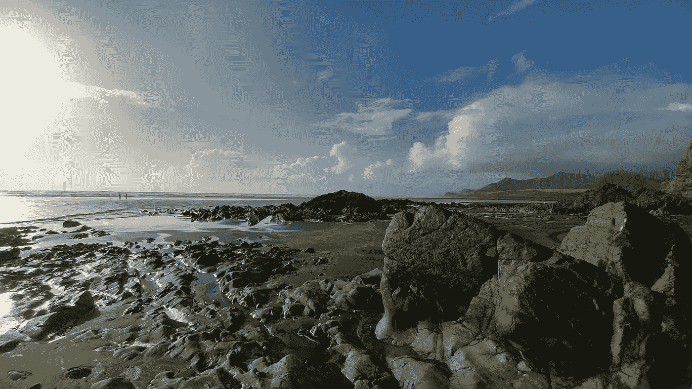

# 如何在不跌入谷底的情况下激励他人

> 原文：<https://medium.com/swlh/how-to-inspire-others-without-hitting-rock-bottom-e1f919d49ac9>

Black sand beach in New Zealand

为了激发灵感，我们需要受苦并被视为受苦吗？

我是一个白手起家的故事迷。我喜欢名人的故事，他们与无家可归者斗争，跌到谷底，然后重新振作起来。那些把自己从黑暗的边缘拉回来的人，那些在世界反对他们的时候坚持下来的人，套用 J.K .罗琳的话，“从谷底建立基础”。

是什么让他们的故事如此鼓舞人心？

是因为他们能够把自己从人生的最低谷拉出来，战胜困难吗？

我们是否被他们坚强的意志和毅力所激励？

这是他们通过人性和创造力接触他人的能力，尽管他们被拖进了泥淖？

可能是所有这些事情，也可能不是这些事情。没有人能决定别人会受到什么启发。我不否认这些故事是为电影而创作的，但这也让我不禁要问——我们真的需要被虐待、无家可归和破产来激励他人吗？

我们这些“普通”人的故事还不够激励人心吗？不够鼓舞人心？还不够悲伤？

如果我们没有一个白手起家的故事，我们能做大事吗？更重要的是，我们需要一个吗？

> “你不应该为了让别人完整而把自己撕成碎片”——未知

我不想为了激励自己而得一种使人衰弱的疾病，家人突然死亡，无家可归或负债数千美元。我不想跌到谷底，我也不希望你这样。然而，有一种误解，认为我们的生活只能开始，我们只能改变，如果我们经历任何或所有这些事情。我们当中有多少人真的希望这些发生在自己身上？我们不会对自己说，“我希望我现在有 2 万美元的债务。这将成为一个伟大的故事。”

当我们想到最底层的时候，这些通常是我们想到的场景，如果没有经历过这些，我们相信我们的故事不足以打动人们。

但也许你的底线是:

*   不相信自己，不停地斥责自己
*   处于无爱的关系中
*   每天不得不去做你讨厌的工作

我们都经历过绝望、悲伤和自尊的挣扎。我们的经历和感受很重要，我们不应该因为某人有更糟糕的经历就轻视它们。我们已经变得如此习惯于将自己与他人进行比较，以至于我们甚至不得不比较我们的生活有多糟糕。我们相信，为了有一个真正的成功故事，我们需要从灰烬中重生，但我在这里告诉你，你不需要一个白手起家的故事，你已经有一个故事要讲了。

别人不能决定你的故事要有多悲伤才能有灵感，你可以自己决定。你要讲述你的故事。

**我们都有自己的人生低谷，我们有责任分享自己的故事，而不是试图复制别人的故事。**

尽管我很喜欢阅读《从贫穷到富有》的故事，但如果我想用一个故事来激励人们，我宁愿是我的故事。

PS。如果你喜欢这篇文章(即使你不喜欢，我也希望收到你的来信)。一个掌声或评论对我来说意味着整个世界。

PPS。注册我的免费时事通讯，获取更多类似的文章和我对 www.possiblepursuits.com 的随机思考。

## 这个故事发表在[的创业](https://medium.com/swlh)上，这是 Medium 最大的创业刊物，有 328，729+人关注。

## 订阅接收[我们的头条新闻](http://growthsupply.com/the-startup-newsletter/)。

