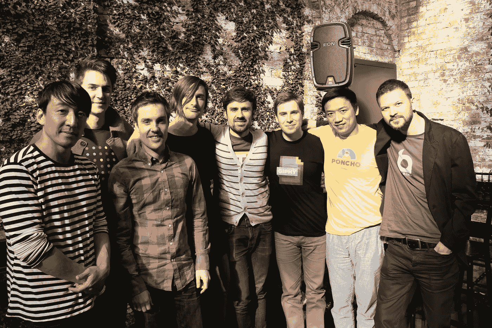

# 如何加入最好的风投公司

> 原文：<https://medium.com/swlh/how-to-join-the-best-vc-firm-d68ad031786b>

本月，我从经营者跃升为投资者，加入了欧洲最成功的风险投资基金之一，Northzone，成为他们在伦敦的最新合伙人。我很高兴加入这个团队，并开始与创始人一起工作，但通往这里的道路几乎是非线性的。

为什么要冒险？为什么是伦敦？为什么是 Northzone？我花了很长时间来回答这些问题，先从最重要的问题开始。

## 为什么要冒险？

大约 15 个月前，我开始去见一位高管教练，[梅雷迪思·哈伯菲尔德](https://www.meredithhaberfeld.com/)。不知道会发生什么，她来的正是时候。在一周内，我为 Dots 建立的一个非常高调的名人合作关系从惊人变成了灾难性的，特朗普当选了，我们发现我们 1 岁的女儿必须接受一次非常严重的手术。那一刻，我生活中的一切都变得一团糟。她帮助我退后一步，想出如何处理一切。

当你为了一个特定的问题去看教练或治疗师时，你的注意力会很快转移到其他更基本的问题或机会上。我们每周的谈话最终转向了长期的职业和个人目标。在这个过程中，我意识到我是多么喜欢向其他创始人学习，当我能帮助他们避免我犯下或目睹的错误时，我会更加喜欢。我已经在每年进行一到两次种子投资，并且在任何一周内，我都会与多家初创公司会面，向他们学习，或者尽我所能帮助他们。在这个过程中，我意识到我更关心看到世界上存在的令人惊叹的产品和公司，而不是成为创造它们的人。如果我能帮助世界上更多伟大的产品、团队和企业，我知道我会很满意。

我还得出了一个结论，当我在一个非常具体的问题上变得宽泛而不是狭隘时，我自己的结果是最高的。我曾经在 Betaworks 担任的角色让我加入了 1-2 人团队，在短短几个月的时间里，同时创建了 Dots 和 Giphy 等优秀公司，以及其他六家非常不同的初创公司。我发现我们处理的行业的广度和我们建立的团队的质量确实令人鼓舞。

Founders from startups at Betaworks in 2013

在做出这一举动之前，我咨询过一些人，他们告诫我，运营投资者往往会因为无法深入了解初创公司的业务而感到厌倦或沮丧，让他们对团队或产品的热爱压倒了初创公司的投资回报。具有讽刺意味的是，这种所谓的对产品痴迷的阿喀琉斯疗法给了我信心，让我相信我会做好这份工作。虽然我肯定一个人对产品的痴迷可能会忽视其他非常重要的问题，但很少有投资者会花时间去正确理解一家初创公司的产品，我认为这是一个巨大的机会。

## 为什么是伦敦？

这花了一些时间和很多思考，但最终我决定投资是正确的道路。当需要确定地理上的关注点时，答案就简单多了。2018 年创业世界的美妙之处在于，你不再需要呆在硅谷。随着纽约创业生态系统在过去十年中的爆炸式增长，我亲眼目睹了这一点，并在许多方面相信湾区以外的创业公司可以受益于多重重大优势。在比美国更强大的开发商生态系统的支持下，类似的增长正在英国和欧洲以更大的规模发生。

My daughter at the Women’s March in NYC

在更私人的层面上，我的妻子和我是为数不多的认真的“如果 T2 和他当选，我们将离开这个国家”的人之一。对我们来说，这不是对一场不按我们的方式进行的选举的轻率回应，而是我们在他的竞选接近尾声时得出的一个相当合乎逻辑的结论。我们决定离开不是因为特朗普(他就是他)，而是因为支持他的人数。有太多的人支持他的观点，这与我们希望灌输给女儿的价值观背道而驰。

鉴于他所获得的巨大支持，我相信这个国家需要几十年，而不是一两个选举周期才能完全恢复。虽然英国也有自己的问题，但比美国少得多。我不会放弃美国，尤其是纽约。我努力寻找一个机会，让我能够与令人难以置信的纽约创业社区保持联系。

## 为什么是 Northzone？

过去五年里，我与 Northzone partners 在多个投资组合公司中合作过，我对这些基金的了解很少。所以从一开始，诺桑的优势就非常明显，我知道*如果*他们想让我加入，我很难错过这个机会。他们是为数不多的跨大西洋基金之一，非常适合我的关系网，我认识他们已经很多年了。

但对于任何走上风险职业道路的人来说，你会知道这是你可能做出的最大的职业承诺。在大多数情况下，你不知道自己是否擅长投资一个基金周期(8-10 年)。所以，如果你想去冒险，你会看到一个 10 年以上的承诺，如果你擅长的话，这比美国全国婚姻长度还要长！不用说，这不是任何一方可以轻易做出的决定。知道了这一点，我小心翼翼地接近市场，会见了欧洲一些真正令人难以置信的风险公司，试图找到最合适的。

在这个过程中，我意识到风险投资在基金之间的合作几乎和竞争一样激烈。所以这个发现过程也给了我难以置信的洞察力，当机会出现时，我可以看到这些公司成为好的合作伙伴。在过去的十年里，我几乎完全专注于团队建设，我知道找到一群我想和他们一起工作，并且愿意和我一起工作很长时间的人对我来说有多重要，这让我回到了 Northzone。我也碰巧喜欢他们的品牌。

## 那么，到底怎么加入最好的 VC 呢？

我的旅程让我明白，成为投资者最重要的是时机。这是我一直认为自己想做的事情，但直到最近，我才感觉到自己的职业生涯达到了转折点，我学到了足够多的东西，可以帮助一家快速增长的初创公司。如果或者当你决定走这条路的时候，我唯一的建议是为了最强的个人适合而优化。这和加入一家公司是不一样的，因为衡量你的标准仅仅是你个人的成功和失败。如果你不执行，但公司执行，你将无法躲在角落里安然度过。良好的初创企业声誉和强大的有限合伙人基础是赌注，符合这些标准的基金也不少。

> 最好的基金是双方都觉得合适的基金，有一群你愿意与之长期合作的人。

现在怎么办？带着一套[的经历](/swlh/the-case-against-entrepreneurship-10c1e40b02b1)，我希望能带来创始人欣赏的视角，以及我多年来遇到的所有投资者中我喜欢(和讨厌)的一长串东西，我要去会见欧洲和纽约的优秀团队了。就像我加入的公司一样，我知道我会非常兴奋和乐于与低自我、乐观的创始人一起工作，有点天真地试图解决看似不可克服的问题。

## 这篇文章发表在[《创业](https://medium.com/swlh)》上，这是 Medium 最大的创业刊物，拥有 294，522+读者。

## 在这里订阅接收[我们的头条新闻](http://growthsupply.com/the-startup-newsletter/)。

