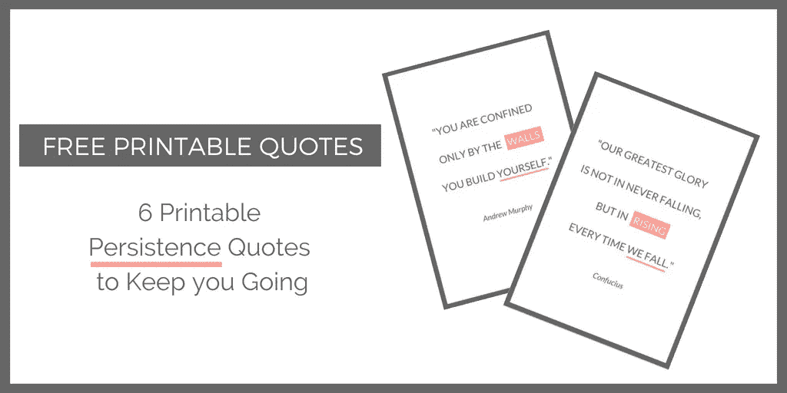

# 当困难来临时，如何作为一个企业家继续前进

> 原文：<https://medium.com/swlh/how-to-keep-going-as-an-entrepreneur-when-sh-t-gets-tough-40a71bdf4ddf>

Photo by [Ethan Sykes](https://unsplash.com/photos/TdM_fhzmWog?utm_source=unsplash&utm_medium=referral&utm_content=creditCopyText) on [Unsplash](https://unsplash.com/search/photos/depressed?utm_source=unsplash&utm_medium=referral&utm_content=creditCopyText)

企业家是一个非凡的物种:他们远远跳出自己的舒适区去追逐自己的梦想——即使其他人认为他们很疯狂。他们每天都在做别人不愿意做的事情——即使没人理解。他们面临着巨大的不确定性，有时甚至是更大的风险和障碍。但是他们有一种与生俱来的动力，不管付出多大的代价，都要不断努力实现自己的梦想。

但是有时候，即使是最有动力的企业家也会碰壁。

一轮融资告吹。一个新产品被证明是一个彻底的失败。大客户推销是一场灾难。一名关键员工离职。

这些东西很痛。很多。

他们质疑你对自己、你的视野和这个世界的信任。

他们让你想放弃。

但是不要。

再站起来，继续走。

以下是方法:

# 善待自己

接受你正在受苦。

不管是发生在你身上的事情还是你自己搞砸的事情——你都值得同情。

无条件的善待自己。

因为苦难是我们不完美的人性中不可避免的一部分。这让我们天生就值得同情。

抵制自怜或自我惩罚的冲动。

停止破坏性的行为和消极的自言自语，给自己温暖的、支持性的关怀，这是你此时此刻最渴望的。

# 对生活有一些看法

走在大自然中。感受宇宙的浩瀚。

看一部关于气候变化或身患绝症的人的纪录片。

对你的问题有一些看法。

这不是世界末日。

# 重新连接你的视觉

你这样做是有原因的。

你的目标背后有一个目的。你计划背后的魅力。

发现*为什么又是*。

沉思一下。看你的眼光。

与你更高的目标重新连接。启发你的更大的想法。

# 改变你对障碍的信念

障碍不是问题。你对此的反应是。

要明白没有什么有价值的东西会轻易到手。这注定是艰难的。

你把自己放在那里，把你的船从港口带走。你知道你不可避免地要面对风暴。因为它们是自然的一部分。

每一个都让你变得更强大。

在风暴中找到你的力量。障碍中的一线希望。

# 改变你对失败的信念

失败从来不是致命的。这是可以克服的。

失败了也不是问题。如果你不从失败中吸取教训，那才是问题。

将失败视为东山再起的铺垫。你的下一次成功。

# 再次爱上这个过程

不要再纠结于事情没有像你想象的那样发展。

放下结果，专注过程。

因为旅程才是目的地。

记住你是在跑马拉松，不是短跑。

没有一夜成名的事情。

成功从来都不是一个宏大的行动。这是一致的，复合的努力。

这是关于耐力，而不是强度。

所以不要忘记热爱你正在做的事情，享受旅途的乐趣。

因为现在是你所拥有的一切。

而且你是长期的。

# 倾听你的心声

没有办法知道这是否有效。

但无论如何你都要坚持下去。

相信自己，愿意为成功做任何事。

但是不要固执。毅力和固执之间只有一线之隔。

检查你的结果——看看你所做的是否有效。

如果没有，调整你的策略。你的方法。你的心态。

但是不要改变你的视野。

坚持你的目标。

但是要保持开放的心态。

倾听你的心声。

# 需要更多动力？

下载可打印的 pdf 格式的 6 条最佳持久性名言！把它们挂在你的墙上。把它们贴在冰箱上。把它们记在你的日记里。把它们带到你需要的地方。

在这里下载:[http://bit.ly/persistencequotes](http://bit.ly/persistencequotes)

[http://bit.ly/persistencequotes](http://bit.ly/persistencequotes)

## 这个故事发表在[的创业](https://medium.com/swlh)上，这是 Medium 最大的创业刊物，有 336，210 多人关注。

## 订阅接收[我们的头条新闻](http://growthsupply.com/the-startup-newsletter/)。

