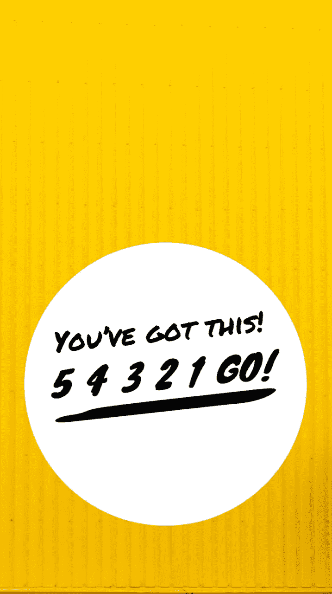

# 如何让你的伟大想法不至于消亡

> 原文：<https://medium.com/swlh/how-to-keep-your-great-ideas-from-dying-b0e4e7875a12>

## 一个绝对会改变一切的问题

Photo by Ashes Sitoula via Unsplash

当你有了一个好主意时，你会怎么做？

你会先激动吗？

我知道我有。

> 我开始想象各种可能性。前途无量。这可能会改变一切。如果我把这个想法付诸行动，我可以接管世界。我几乎控制不住自己。我告诉我的朋友，我的家人，甚至我的狗！

然后它发生了。

# 所有思想的敌人

你的一个想保护你的好心朋友试图阻止你前进。

这些警告一开始是很无辜的。

*这可能行不通。*

*你可能会失败。*

你看起来会像个白痴。

*你疯了吗？*

*你不能这么做！*

> 哦，他们是好意。他们只是想让你免受伤害。这不是爱吗？这不是对你最有利的吗？

当然，他们错过的是他们已经伤害了你。

# 也许是你

有些人不需要别人来破坏我们。我们带着恐惧和自我怀疑对自己这样做。

> 我们开始列出这些行不通的原因。我们不相信我们的想法，因为我们还不是大玩家。我们看到自己在顶端之下，用怀疑来确保我们呆在那里。

然后恐惧进入了缺口。为什么不呢？怀疑只是打开了我们的思维之门。

除非你阻止这个循环继续下去，否则你会被锁得很紧，永远无法挣脱。

你通过问和回答一个简单的问题来打破这个循环。

What one question did to change my attitude about taking risks.

# 如果我错了呢？

为什么当我们思考一些事情时，我们从不质疑自己？

也许是因为我们把所有的精力都花在抱怨事情的现状，担心可能会出什么问题，或者为我们的生活方式寻找责备的人或事。

**问自己“如果我错了怎么办”是激进的。**

> 问自己“如果我错了怎么办”会迫使你抛开自我怀疑。如果我错认为自己是个失败者呢？如果我错估了我的销售额会有多低呢？如果我对人们的反应判断错误呢？

答案可能会引发另一种恐惧——对成功的恐惧。

*   当那些崇拜你的粉丝来敲你的门时，你会怎么做？
*   当你赚了很多钱，不得不雇一个理财经理来帮你打理时，你会怎么做？
*   当你有如此大的影响力，人们开始越来越多地来找你时，你会怎么做？

这是一个相当可怕的问题，对不对？

在那之前，大胆一点。

推动自己开始。

当冲动袭来时，做点什么，而不是只想着做点什么。

# 一切伟大的事情都始于一个想法

想法很棒，但老实说，光有想法是不够的。

> 当一个伟大的想法变成现实时，它就会变得伟大。

在教室里学习市场营销是一回事。如果能做一个模拟营销项目，去品尝一下营销是什么样子的，那就更好了。但是直到你创造出一些东西并提供给人们，你真的不知道你学到的东西是否有用，不是吗？

我以前也对书这么做过。

> 事实上，写一本书对我来说是别人的主意——一个建议，真的。但我是负责这件事的人。是我让它变成了现实。无论你坐在那里思考多少可能性，都不会在纸上写下一个字。

**行动做到了。**

这里有一个我现在所处的赛季的类比。我住的地方现在是夏天。去游泳池凉快一下，免受烈日的暴晒，真是令人神清气爽。

*光想想去泳池就够了吗？*

没有。

*当我去游泳池的时候，如果我站在旁边盯着它，我会凉快吗？*

没门儿。

为了充分享受游泳池带来的放松，我必须进去。

这个选择分成两个选项。我会爬下梯子，用冷水和热空气之间的温差折磨自己吗？或者我应该跳进去，通过压缩成十秒钟的冲刺来避免长期的冲击？

我选择跳进去。

Photo by [Eleanor Carter](https://unsplash.com/photos/2Wyi2hseKAk?utm_source=unsplash&utm_medium=referral&utm_content=creditCopyText) on [Unsplash](https://unsplash.com/search/photos/swimming?utm_source=unsplash&utm_medium=referral&utm_content=creditCopyText)

# 现在轮到你了

什么想法一直在你脑海中盘旋，等着你去付诸行动？

你会让它永远沸腾并逐渐消失吗？

或者你会在今天，甚至是现在采取行动吗？

这里有一个智能手机的背景，它会激励你一次做 5 秒钟的事情。

Created with Typorama

# 在回复中分享你的故事吧！

除非你有所行动，否则不会有什么大事发生。

测试一下，让我知道它是如何进行的！

*喜欢你刚刚读的吗？请尽情鼓掌，与朋友分享！*

## 这篇文章发表在 [The Startup](https://medium.com/swlh) 上，这是 Medium 最大的创业刊物，拥有 336，210 多名读者。

## 在此订阅接收[我们的头条新闻](http://growthsupply.com/the-startup-newsletter/)。

