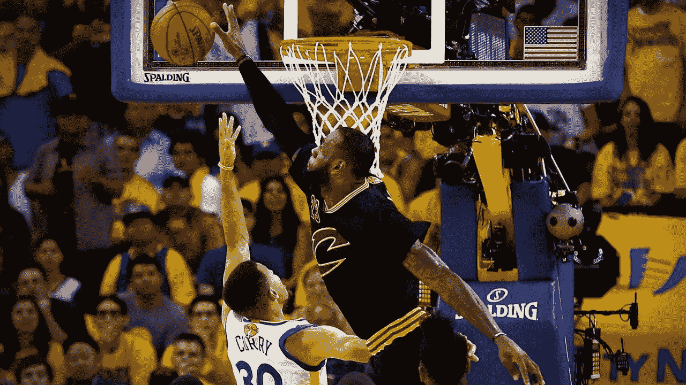

# 如何让你的营销信息不被拒绝

> 原文：<https://medium.com/swlh/how-to-keep-your-marketing-messages-from-being-rejected-5ea9efd710b7>

Photo Source: [Business Insider](http://www.businessinsider.com/amazing-photo-of-lebron-james-block-on-derrick-rose-2015-5)

你的营销信息是你生意中最重要的方面之一。他们是贵公司沟通的前线。它们是你的客户在你的网站、社交帖子、广告、时事通讯以及你选择的任何其他交流场所阅读的第一件东西。

这些小小的信息片段对你事业的成功有着巨大的影响。他们必须为为什么有人应该关心他们所描述的“事物”创造一个清晰、简洁和令人信服的论点。

而那个“东西”是你的事。这是你的生计。不要夸大其词，但是你的职业生涯在很多方面都取决于你有效传达那个“东西”的价值的能力。

有了如此重要的东西，用工具来帮助创建你的信息应该是一件很容易的事情。但是我们有吗？

当然，有很多关于写标题的资源。特别是，有一个很大的重点是如何为博客文章或电子邮件写标题。

问题是这些内容中有太多直接跳转到提示和策略，比如:

*   使用号码列表
*   使用这个特殊的“权力”词汇列表
*   发表大胆的声明
*   从“如何做”开始(是的，就像这篇文章)

许多这些想法都有合法的数据支持，这些数据表明是什么引起了读者的参与。通过分析数以百万计的例子，我们识别模式。然后，我们可以利用这些模式来激起客户的好奇心。

从这些数据和我们从中提取的策略中，我们可以学到宝贵的经验。但这还不够。

这些策略针对的是一般的人类行为，而不是你企业的具体情况。

虽然数字列表可能是一篇博客文章的好标题，但对你的整个企业来说，什么是最好的标题呢？你如何将你所做的一切的价值主张具体化？

对于如此重要和复杂的东西，你需要的不仅仅是“5 个快速修复拷贝的技巧”。你需要考虑你的企业为谁服务以及你如何为他们服务的基本原则。

# 表层技巧与策略基础

想象一下，你必须和勒布朗·詹姆斯进行一对一的篮球比赛。

你的工作很简单:在他面前得分。

[Photo Source](https://cavaliersnation.com/2017/08/16/sources-close-to-lebron-james-say-reports-of-him-leaving-are-100-percent-false/)

他看起来是个很好的人。这应该很好玩！

为了做好准备，你可以获得一份专家支持的最佳击球技巧列表:

*   找到轮辋
*   保持双脚与肩同宽
*   挺起你的肩膀
*   用你的射击手臂形成一个 90 度的“L”
*   将你的非投篮手放在球的侧面，仅作为引导使用
*   当你跳起时，放开球
*   投篮后保持手腕放松，手指指向篮圈

**这就对了！让我们下雨吧！**

[Photo Source](https://www.youtube.com/watch?v=JREPxbnCIV0)

[Photo Source](https://ftw.usatoday.com/2015/06/lebron-james-goes-crazy-after-logging-another-triple-double-in-ot-game-2-win)

[Image Source](https://emojiisland.com/products/surprised-face-emoji-icon)

我的天啊。

尽管事实上你已经有了清晰的、经过验证的投篮技巧，但球最终还是落在了看台的第六排。

更糟糕的是，你不会带着对失败原因的更好理解离开那次经历。根据你的清单，你检查了所有正确的成分。

> 用商业术语来说，**你的** **出手就是你的消息****你的** **客户就是勒布朗**。

如果你成功了，那么你就和你的顾客建立了有意义的联系。但就像勒布朗一样，你的客户是一个全明星球员，可以击败你的企图。

是的，如果你仅仅依靠基本的提示，你可能会幸运地得到一个。但是它是可重复的吗？这是你可以依靠的东西吗？

这并不是说这些建议是错的或不好的，而是它们本身是不够的。

这就是基础的来源。

要持续得分，你需要的不仅仅是教科书式的跳投。重要的是你的球衣下面有什么。你足够强壮，足够快，足够聪明吗？

[Photo Source](https://waitingfornextyear.com/2016/05/espn-steph-curry-lebron-james-coverage/)

在商业方面，这等同于你的信息的清晰度、效率、吸引力和力度。

这些都是你可以积极改善的事情。它们反映了你的业务和你的客户，而不仅仅是一般人的习惯。

以下是你需要锻炼的几种“肌肉”,以创造出能与顾客产生联系的有效信息:

*   你的客户的**动机是什么**？
*   你的客户希望实现什么样的**结果**？
*   在竞争格局中，你拥有什么样的**独特地位**，进而在你的客户心目中占据什么样的地位？
*   您的哪些**功能**最有助于您的客户在挑战中取得进展？
*   什么样的**语气**最能吸引你的顾客？
*   你业务的哪些方面会让你的客户从他们现在做的转向你提供的？

如果你了解你业务的这些部分，你可以利用它们与你的客户建立有意义的联系。这些都是你表达一个强有力的价值主张所需要的要素。

这些不是事后的想法或美好的愿望。这是你需要开始的地方。

有了这些要素，现在你就可以在你的信息上取得有意义的进展了。如果你写的东西没有效果，你可以追溯到你的业务和战略。

> 现在的问题不再是哪种技巧可能最有效，而是我如何让我的生意做得最好。

这并不意味着你不应该理解为什么这些策略有效，以及如何应用它们。那些战术可以成为你基础的很好补充。

但它们不能替代基金会。

如果你想要一个简单的方法来根据你的业务基础写有效的信息，我创造了一个工具来帮助你。它叫做[**strat pack**](https://getstratpack.com/?utm_source=medium&utm_medium=article&utm_campaign=no-rejection)**，你现在就可以免费试用:**

[getstratpack.com](https://getstratpack.com/?utm_source=medium&utm_medium=article&utm_campaign=no-rejection)

# [点击此处创建精彩消息。](https://getstratpack.com/?utm_source=medium&utm_medium=article&utm_campaign=no-rejection)

# 如果你做到了这一步，请给这篇文章一些掌声！它帮助其他人找到它！

## 这篇文章发表在 [The Startup](https://medium.com/swlh) 上，这是 Medium 最大的创业刊物，拥有 338，320 多名读者。

## 在此订阅接收[我们的头条新闻](http://growthsupply.com/the-startup-newsletter/)。

