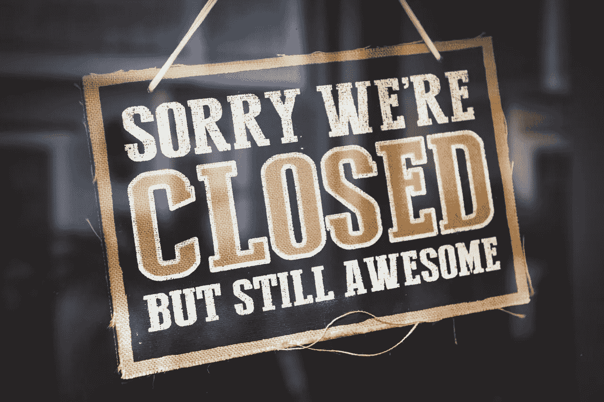

# 如何知道何时结束一项投资

> 原文：<https://medium.com/swlh/how-to-know-when-to-close-a-venture-d729304ed188>

## 本着拒绝围绕这个问题的禁忌的精神，这里是我使用的框架。

Credit: [Tim Mossholder](https://unsplash.com/photos/v5re1loi264)

两个相互关联的问题困扰着创始人。从我的经验来说，第一个问题是我正在建立一个伟大的企业吗？第二个问题是“我如何知道什么时候该结束一项业务”？

今年，我被多次问到第二个问题。通常引发这个问题的焦虑是显而易见的，创始人的疲劳和情绪也是如此。

我知道那种感觉。

现实是，如果你选择公司建设作为你的职业，你将在职业生涯中多次面临这个问题。

本着打破围绕这个问题的禁忌的精神，这里是我用来回答这个问题的框架。首先要明白，这个决定往往很复杂，但并不复杂。

# 复杂性和复杂化

这两个词经常互换使用，使得这个决定在心理上更加费力。

有趣的是，与创业不同，决定关闭一家企业是一个需要解决的复杂问题，而不是一个复杂的问题。

这种区别很重要，因为它有助于创始人认识到，尽管这个决定掺杂着各种情绪，但它是一个可以解决的问题。

我喜欢里克·纳森对此的解释。复杂的问题可能很难解决，但是它们可以通过规则和方法或者系统和过程来解决。然而，复杂问题的解决方案并不适合复杂问题。

复杂的问题涉及太多的未知和太多相互关联的因素，无法简化为规则和过程。他继续解释说，像区块链这样的技术破坏是一个复杂的问题。拥有创新商业模式的竞争对手——优步或 Airbnb——是一个复杂的问题。没有算法会告诉你如何回应。这就是为什么实验被用来为建立一个企业铺平道路。

# 制定结束交易的决策

了解到关闭一家合资企业的决定是一个可解决的(即复杂的)问题，我用四个原则来构建这个决定。

## 1.这是内部决定

关闭一家企业是公司董事的决定。在大多数创业公司中，董事的角色等同于创始人，而创始人通常也是大股东。尽管投资者、创始人和董事之间的这种相互作用可能导致多次、有时甚至是面对面的对话，但有一条规则是，董事必须以股东的最佳利益为重。

这意味着两件事。

首先，尽管外部声音可能很有说服力，但它们并不会要求关闭一家合资企业。客户、用户、供应商、媒体和围绕公司建立的社区的观点是输入。这说起来容易做起来难，考虑到带他们一起旅行的投资。

其次，在较小的创业公司中，董事和股东是同一个人，但所有权不平等，大股东可以行使与小股东不一致的权利。遵守开始时制定的规则很重要。

## 2.人们不使用你的产品，或者他们批评你的产品，这些都不是停止使用的理由

郑重声明，这些是**而不是**关闭合资企业的理由。

所有企业都面临逆风。重复、学习和应对批评是正常的。

企业家需要健康的视角和资本来实现雄心勃勃的愿景。

打破这两个因素，疲劳会影响视角。如果你非常累，你所能做的就是考虑你的生意，花比周末更长的时间休息一下，和让你开心的人在一起。

在资本方面，企业家的专长是获得资源和资本，让事情发生。问题是:为了获得资本以延长你在市场中的时间，你已经做了一切事情(我说的一切都是合法的，不会破坏业务)吗？

如果没有，那就继续努力。

如果是，可能需要进入对话以结束交易。

## 3.我们的想法有多少，它们有用吗？

我很少看到一个产品的第一个版本一开始就工作得很好。事实上，我们花了很多时间迭代和试验。这很好，直到你所构建的东西没有引起预期目标受众的共鸣，并且你用完了继续迭代的想法(和/或钱)。

我认为更常见的情况是，创始人和他们的团队意识到，虽然银行里还有钱，但他们的产品并没有像预期的那样发挥作用。根据定义，他们有一点点的气体留在油箱中，以纠正或枢轴。这听起来不错，直到他们意识到他们的想法已经枯竭。我以前也遇到过这种情况，结果证明这是疲劳影响视角的结果。在这种情况下，如果你还没有导师和投资者，请他们来帮助构思。它能让一切变得不同。

这种情况有三种可能性。首先，将剩余的资本和资源投入到新的想法中，并且它有效(不需要结束)。第二，没有想法来自构思，公司有剩余资本。第三，将剩余的资本和资源投入到行不通的新想法中。在后一种情况下，讨论如何关闭企业和归还剩余资本可能是下一步。

## 4.你的心在里面吗？

这是人们谈论最少的问题。在某个时候，创始人可能会遇到一个门槛，即环境的变化会调整他们对自己要解决的问题的看法。

这可能是他们接收到的信号逐渐累积导致他们达到这个阈值。或者，他们可能某天早上醒来，知道他们已经受够了。重要的是，该公司可能表现不佳，也可能表现很好。

不管怎样，这个门槛最好通过问一个问题来识别:你的心还在里面吗？

答案是二进制。如果答案是肯定的，这是个好消息。

如果答案是“不”，并且你休息得相对较好，那么接下来的两个直接想法可能是，“[插入姓名 A，B，C …]会怎么想？”“我该怎么告诉他们？”

不成为你生意的一部分可能是一件好事，它可能会使生意变得复杂，或者意味着生意需要关闭。无论事情如何发展，都要坚持创始人的基本原则。没有惊喜。

# 最后一件事…

在我写的一篇名为“[创业结束时应遵循的规则](https://philhsc.com/rules-follow-winding-venture/)”的文章中，我谈到了作为一名企业家，如何做出决策。

如果你让公司建造你的工艺，关闭一个企业不会发生一次。同样重要的是要明白，你开创未来需要投资和团队成长的企业的能力，在很大程度上取决于你的声誉如何在企业倒闭后存活下来。

到了收工的时候，要彻底坦诚，在不违反家庭或法律的情况下，尽一切努力让模型发挥作用。

作为创始人被铭记。

活下来，改天再战。因为正如我一次又一次听到的，成为企业家是一个数字游戏，你所需要做的就是做对一次。

## 关于作者

[菲尔·海斯-圣克莱尔](https://medium.com/u/d99e93af3a17?source=post_page-----d729304ed188--------------------------------)是一位连续创业者。他每周都在自己的博客[上写关于创业公司成长的文章，并制作](https://philhsc.com)[创始人对创始人播客](https://foundertofounderpodcast.com)。

## 这篇文章发表在 [The Startup](https://medium.com/swlh) 上，这是 Medium 最大的创业刊物，有+367，349 人关注。

## 在此订阅接收[我们的头条新闻](http://growthsupply.com/the-startup-newsletter/)。

