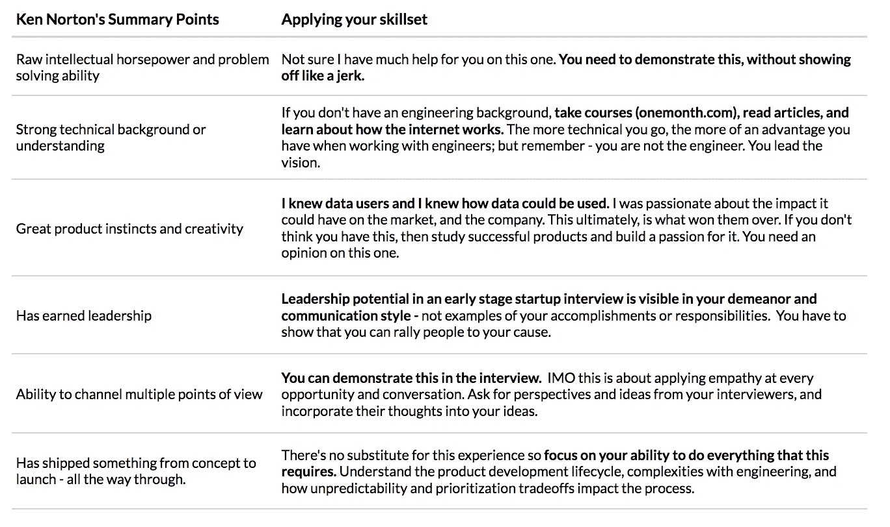

# 如何在创业公司找到一份产品工作

> 原文：<https://medium.com/swlh/how-to-land-a-product-job-in-a-startup-4b58f53f93e>

## 我的“非产品”经历是如何让我得到一份产品经理的工作的

大约四年前，我被聘为 Teems 的第一任产品经理，上个月[我们被 WeWork](https://techcrunch.com/2018/09/12/wework-makes-it-third-biggest-acquisition-to-date-shelling-out-100-million-for-a-software-startup-called-teem/) 收购。如果你想跳槽，这篇文章给出了一些关于如何找到软件产品经理工作的建议。

# 这是最好的工作(依我看)

我非常喜欢这份工作。这很难，压力很大，不被重视，但回报惊人，你可以对公司的愿景和成功产生难以置信的影响。稍后我会写更多的内容。

# 如何在创业初期找到一份产品经理的工作

## 1 —保持联系

对我来说，这是星星排列的地方。我坚持不懈地寻找工作关系，我有一个朋友瑞德·费林，我正在向他寻求职业介绍。在我没有从他在谷歌的联系人那里找到工作后，他建议我和他的联系人谈谈，他刚刚在犹他州开了一家公司。联系人是[扎克·霍尔姆奎斯特](https://medium.com/u/768c1818c4c8?source=post_page-----4b58f53f93e--------------------------------),[Teem](https://medium.com/u/dfb5a0cf1ef0?source=post_page-----4b58f53f93e--------------------------------)的联合创始人。

## 2 .知道他们需要什么，并满足他们的需求。

有趣的是，我实际上并不知道他们的需求；我赌了一把，运气不错。

除了由几段文字组成的[种子期公告](https://beehivestartups.com/eventboard-raises-1-5-fe85f9a866f4)之外，没有任何关于该公司的信息。但在公告中，他们提到了“分析”，我知道我比大多数人更了解这一点。我花了 4 年时间讲故事，用数据说服高管。

> 我不知不觉地证明了我可以满足他们的需求

一开始很尴尬，因为他们的第一个问题是“你想搬到犹他州吗？”对此，我本能地回答道:“不，一点也不——但我希望加入一个团队，并产生巨大的影响。”太老套了，但我是认真的。

在那次尴尬的交流之后，我插话建议他们把种子资金投资到他们正在收集的数据上。这就是我如何在不知不觉中证明我可以满足他们的需求。我提到了数据将如何告诉他们下一步要做什么，他们如何把它卖回给他们的客户，以及现在开始做将是以后的竞争优势。

我不知道的是，他们正在寻找一个人来建立一个数据产品。几周后，我飞到盐湖城去见这个由 13 人组成的团队。

## 3——明确你的技能

这是关于设定期望。我建议根据肯·诺顿 2005 年发表的 T2 清单来评估你的经历。这将有助于你在一个符合公司需求的框架中阐明你的技能。

在初创企业的早期阶段，产品经理的角色非常广泛。你没有配套资源。你的工作是接受一个想法，提炼它，验证它，设计它，测试它，迭代它，与工程合作来构建它，测试它，以令人信服的方式向市场展示它，并开始跟踪它，这样你就知道下一步该做什么。**在我过去的工作中，我做过很多这样的事情——但是我从来没有把它们放在产品开发过程中。**

*为了有所帮助，这里有一个 Ken Norton 列举的技能/能力的例子，以及一些关于如何在产品管理的心智模型中定位你的经验的想法:*

最终，我专注于我带来的东西，并赢得了他们的支持。我不得不提醒团队，我不是工程师，他们不应该期望我用 python 编码。

# 早期创业是艰难的——确定你想要它。

花点时间考虑一下为什么你想进入产品管理，为什么在创业初期。你可能不会有导师，相反，你会在前进中发现问题，并从错误中学习。我不确定对于大多数自负的人来说，快速的失败和重生是可能的。你必须深深地关心愿景和人们，才能继续前进。

这很有挑战性，也很值得。

-达尔

## 这篇文章发表在 [The Startup](https://medium.com/swlh) 上，这是 Medium 最大的创业刊物，有+ 379，306 人关注。

## 在这里订阅接收[我们的头条新闻](http://growthsupply.com/the-startup-newsletter/)。

