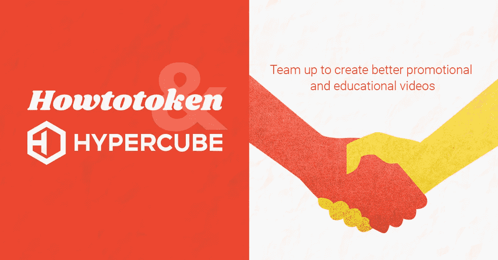

# 如何为区块链项目开展教育营销？

> 原文：<https://medium.com/swlh/how-to-launch-educational-marketing-for-a-blockchain-project-7311d8c7b466>

[Howtotoken video production](http://agency.howtotoken.com/video-production)

将区块链技术应用于日常生活的核心方面是该技术的易用性。

无论你是在建设一个需要招募新矿工的新区块链，还是在开发一个新的交易平台，最终你都需要让用户了解你的产品。

最好的是循序渐进和如何指南。以下是一些例子:

*   [如何用 PayPal 购买比特币](https://howtotoken.com/buy-and-trade/how-to-buy-bitcoins-with-paypal-ultimate-guide-2018/)
*   [如何套现 ICO 钱](https://howtotoken.com/explained/cash-out-ico-money-and-cryptocurrencies-for-businesses-and-private-users/)
*   [比特币淘金指南](https://howtotoken.com/for-miners/mine-bitcoin-gold-ultimate-guide/)

我们在 Howtotoken 的主要目标是为区块链的初创公司和 ico 提供教育内容——我们已经做了很多年了。

我们非常高兴地宣布我们与 Hypercube 的合作伙伴关系，他们将帮助我们为客户制作更多有价值的内容:宣传和教育视频。

你可以下订单，在这个页面上看到这个过程:[http://agency.howtotoken.com/video-production](http://agency.howtotoken.com/video-production)

## 这篇文章发表在 [The Startup](https://medium.com/swlh) 上，这是 Medium 最大的创业刊物，拥有+383，719 名读者。

## 在此订阅接收[我们的头条新闻](http://growthsupply.com/the-startup-newsletter/)。

## 关于作者:

基里尔·希洛夫——geek forge . io 和 Howtotoken.com 的创始人。采访全球 10，000 名顶尖专家，他们揭示了通往技术奇点的道路上最大的问题。加入我的**# 10k QA challenge:**[geek forge 公式](https://formula.geekforge.io/)。