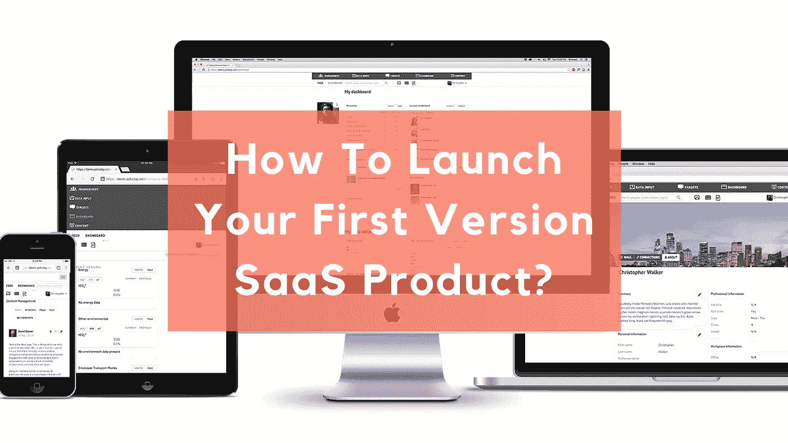

# 如何推出你的第一个 SaaS 产品版本？

> 原文：<https://medium.com/swlh/how-to-launch-your-first-version-saas-product-a66f73a98ce9>

除非你的产品真正具有革命性，否则不要指望人们会买你的产品。反正一开始不会。当你开始在 SaaS 创业时，你会很快发现你只是快节奏技术和创新理念宇宙中的又一个产品。刚开始时，可能没有多少人知道你公司的名字或你的职业，所以你的第一项工作是让你的名字在那里出现。有足够多的方法来营销 SaaS 的产品，从联盟伙伴关系和付费广告，通过内容营销和积极拓展媒体渠道。尝试这些方法的组合。密切关注什么对你有效，并且知道它可能会随着时间而改变。

# 最初，不要公开发布

从给你的朋友和家人报名开始。我们都以同样的方式开始。你不需要运用任何花哨的营销或技术才能接触到他们。请他们就他们的体验向您提供反馈。虽然这种反馈不一定是无偏见的，但它将是广泛的、真实的，并且常常是有见地的。这些人愿意花时间仔细考虑他们的反馈，并深入交谈。这并不意味着反对精益创业“根据客户反馈快速迭代”的建议。相反，这是承认根据你的发展阶段，有不同类型的反馈需要研究。

# 借助优质内容

如果你是第一次接触 [SaaS 产品](https://www.cognitiveclouds.com/custom-software-development-services/saas-application-development-company)世界，内容创作是你最好的朋友。开一个博客，写一些内容，告诉那些需要或者可能想要你的产品的人。这是一个很好的方式来抓住你的品牌和产品的注意力，同时在你想要的领域建立你的权威。有了一个运作良好的博客，你可以推销你的解决方案并获得即时反馈，在你的市场中发现并发展关系，确立自己的思想领袖地位，并提高你的在线搜索能力。要提供伟大的内容，你不一定要成为伟大的作家。开始制作内容，并观察你得到的回应。只要保证你的文章有深度，能带来价值就行。同时，不要期待立竿见影的效果。经营一个博客需要花费大量的时间和精力。即便如此，今天对 SaaS 的[公司](https://www.cognitiveclouds.com/custom-software-development-services/saas-application-development-company)来说，做内容营销尤为重要，而且价格也相对低廉。这是一种[营销策略](https://www.datadab.com),在过去十年里有了巨大的增长。

# 从 beta 测试开始

开始营销的一个很好的方法是推出一个测试产品。这也是在真正的东西出现之前学习的好方法。为你的应用或软件建立一个测试版本，一旦它没有错误并且功能齐全，就发布它。太多的 SaaS 公司通过在发布第一个版本之前不断添加他们“想要”的功能来推迟他们的发布。一旦它以一种可使用的和值得尊敬的形式出现，就把它推向市场，让你的测试用户给你提供反馈，帮助塑造软件的未来。在测试版中开放这项服务有很多好处。将会有问题，错误，不必要的复杂的用户流程，以及措辞不当的文本。在测试版中，你告诉人们产品还没有完成，并要求他们对你有耐心。这也是一个反馈请求和创造意识的机会。

# 向媒体推介您的测试版

不是所有的媒体都会关心甚至愿意报道测试版产品。许多主流媒体会希望报道完全实时的、有规模的、在市场上很重要的服务。然而，有一堆网站喜欢覆盖前沿，意思是覆盖测试版。

# 自己做公关

无论你是否有预算，做公关都是一个好主意。毕竟，没有人比你更了解你的业务。你也可以花些时间参加相关的网络社区。开始评论相关的博客文章，参加相关的讨论组，并致力于自己的博客。找出你的潜在客户在网上闲逛的地方，并努力在这些地方获得报道。

# 什么都做一点

有太多不同的方法来做你的营销，把它们都做好是不可行的，尤其是当你刚刚开始的时候。然而，你不会知道什么对你有效，除非你去尝试。尝试它们，看看每一个如何为你工作，然后选择最好的表现。说到营销，你必须试着把你的预算用在几个不同的广告渠道上。不要把所有的鸡蛋放在一个篮子里。这样，你就可以知道哪个营销渠道给你带来的价值最大。跟踪你的“转化率”,找出哪个营销渠道的转化率最高。一个好的在线活动应该包括社交媒体广告、付费搜索引擎广告、电子邮件营销和公关活动。

# 不要忘记现实生活中产品的价值

这甚至适用于 SaaS 公司。许多 SaaS 公司向他们最好或最忠实的客户发送贴纸或小“感谢”礼物。SaaS 产品预发布阶段的最后一个阶段是测试阶段。通过分享他们的反馈，早期采用者塑造了你的产品和业务的未来。一定要奖励他们的时间和努力。

# 客户入职

无论你的 SaaS 第一版有多简单，你仍然需要让用户使用你的应用。如果你做得好，新来者有可能会留下来，并在未来转化为付费客户。

# 始终传递价值

当你开始创业时，你的思想可能会倾向于渴望赚到众所周知的百万美元。抵制诱惑，不要追逐金钱，而是重新关注为一百万客户创造价值。不要让庞大的数字分散你的注意力。从小处着手。从为你最初的十个客户创造真正的价值开始，然后为下一个一百个客户创造真正的价值，并像这样不断提升。当你做得很好的时候，你的粉丝会通过带来更多的人来完成剩下的工作，钱自然会随之而来。它始于创建一个平稳的入职流程，当客户有问题时接听电话，当他们问你问题时尽快回复电子邮件，优先考虑保持透明，并为你所犯的错误和造成的不便公开道歉。这些都算价值。反应灵敏并保持你的个人接触是你击败更大、资金更充足、更成熟的竞争对手的潜在方法。

# 结论:

所有居住在同一个空间的公司都在激烈地争夺注意力。但是伟大的产品，背后有强大的团队，推销自己。某些产品被认为很棒的原因是它们专注于让客户成功。所以，如果你创造了一个伟大的产品，你的营销工作就完成了一半。祝你好运。

*原载于*[*cognitive clouds:SaaS 发展公司*](https://www.cognitiveclouds.com/insights/how-to-launch-your-first-version-saas-product/)

## 这篇文章发表在 [The Startup](https://medium.com/swlh) 上，这是 Medium 最大的创业刊物，有 291，182+人关注。

## 订阅接收[我们的头条新闻](http://growthsupply.com/the-startup-newsletter/)。

