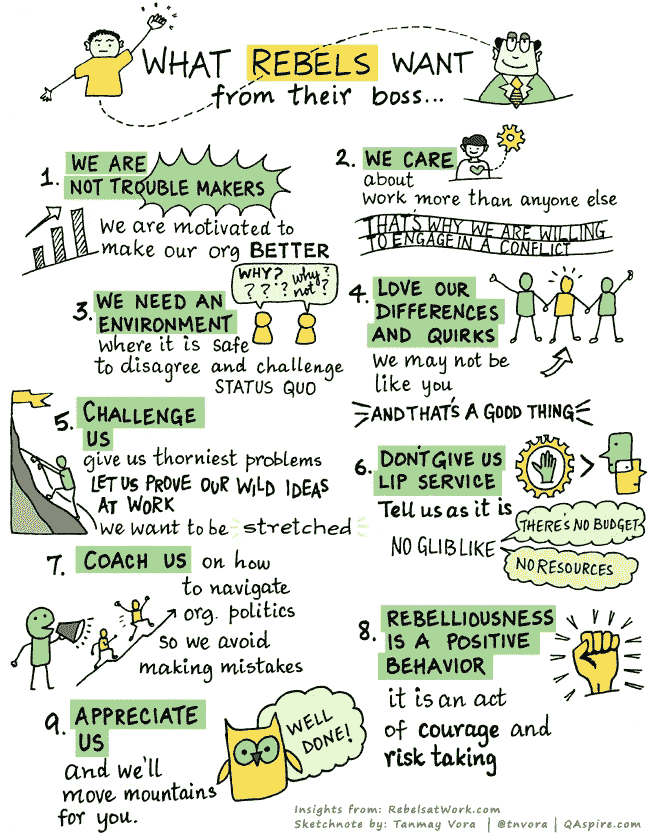

# 如何领导、挑战和指导企业反叛者

> 原文：<https://medium.com/swlh/how-to-lead-challenge-and-coach-corporate-rebels-26ac1a29afd9>

改变需要干扰。每个组织都需要质疑现状的人。作为弄臣或企业反叛者，他们引发建设性的愤怒，从而防止危险的停滞。在[十大原则](https://fuehrung-erfahren.de/en/2017/12/10-principles-for-corporate-rebels/)针对企业反叛者本身之后，现在自然出现了如何为建设性的反叛创造环境以及如何领导、挑战和指导反叛者的问题。

为此，Tanmay Vora 基于 Lois Kelly 和 Carmen Medina 在[Rebels in Work](https://www.rebelsatwork.com/blog/2017/04/19/what-rebels-want-from-our-bosses)的原始想法，在[Creative Commons CC BY-NC-ND 4.0](https://creativecommons.org/licenses/by-nc-nd/4.0/)许可下发布了以下美丽的 [sketchnote](http://qaspire.com/2017/05/19/sketchnote-what-rebels-want-from-their-boss/) 。

想要提拔反叛者的领导人会创造一种欣赏多样性的文化。它们创造了一个安全的空间，在这个空间里，质疑现状是人们所希望的，也是人们所欣赏的。这个空间远远超出了各个经理的实际职责范围。在组织的政治丛林中，有足够多的陷阱会立即引发系统或多或少的严重免疫反应。高管们有责任认识并避免这些陷阱，从而保护他们的反叛者。这也让他们成为了反叛者。

> *管理就是把事情做对；领导力就是做正确的事情。*
> 
> *~彼得·德鲁克*

Lois Kelly 和 Carmen Medina 的阵容中缺少一个关键方面，或者对他们来说很明显:反叛者需要自由，首先是能够质疑现状，其次甚至更重要的是能够思考和尝试新的、不同的、希望更好的东西。然而，如果不仅是少数选定的反叛者拥有这种自由，而是尽可能多的人拥有这种自由，让反叛的思想找到积极的共鸣，那将是非常棒的。通过持续关注基本要素和可持续发展文化来创造这种自由，在这种文化中，忙碌不会与生产力混淆，这也是高管们不可或缺的任务。

在这样的环境下，叛逆者安逸，想要，也应该被挑战。有时候，只需要一点点授权，脱水和僵化的文化就会再次绽放。微软首席执行官塞特亚·纳德拉在他的新书《Hit Refresh》中将这种授权描述为一个关键因素:

> 文化变革的关键是赋予个人权力。我们有时会低估我们每个人能做的事情，高估别人需要为我们做的事情。在一次员工问答中，当有人问我“为什么我不能用手机打印文件”时，我变得很生气我礼貌地告诉他，“让它发生。你有全权。”
> 
> *~塞特亚·纳德拉，* [*点击刷新*](https://www.fastcompany.com/40457741/satya-nadella-the-c-in-ceo-stands-for-culture)

你对这些领导任务思考的时间越长，你就越会得出这样的结论:这一切其实和造反派关系不大。或者换一种说法，每个员工都应该像一个叛逆者一样被领导。每个人都应该有尝试和学习的自由，而不会迷失在政治的磨砺中。每个人都应该有跳出框框思考和质疑现状的自由。每个人都应该被授权和鼓励去利用它。

*原载于 2018 年 1 月 3 日*[*fuehrung-erfahren . de*](https://fuehrung-erfahren.de/en/2018/01/how-to-lead-challenge-and-coach-corporate-rebels/)*。*

## 这个故事发表在 [The Startup](https://medium.com/swlh) 上，这是 Medium 最大的企业家出版物，拥有 291，182+人。

## 在这里订阅接收[我们的头条新闻](http://growthsupply.com/the-startup-newsletter/)。

