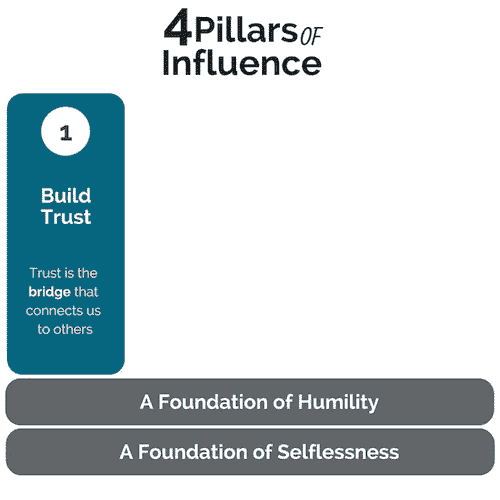
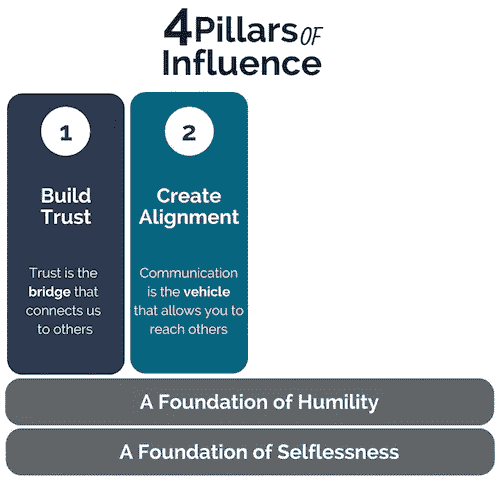
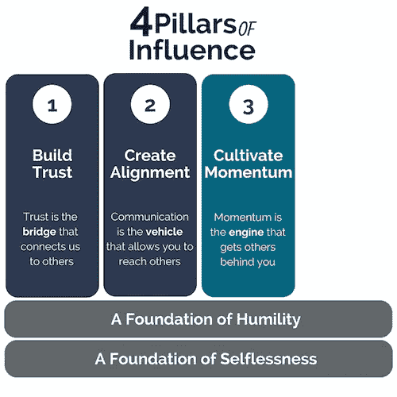
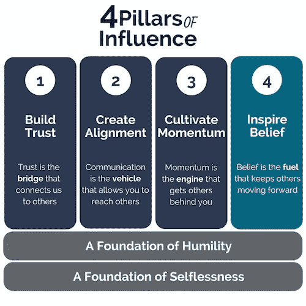

# 当你没有权威时如何领导

> 原文：<https://medium.com/swlh/how-to-lead-when-you-have-no-authority-9f22206356d4>

## 提升你在工作和生活中影响力的四大支柱

Photo by [Headway](https://unsplash.com/photos/5QgIuuBxKwM?utm_source=unsplash&utm_medium=referral&utm_content=creditCopyText) on [Unsplash](https://unsplash.com/search/photos/business?utm_source=unsplash&utm_medium=referral&utm_content=creditCopyText)

每个人都记得 2002 年的电影《T2:我盛大的希腊婚礼》。这是一个关于图拉(一个传统希腊家庭的女儿)努力恋爱和结婚的滑稽故事。

有一个特别的场景是图拉请求她父亲允许她上大学。她提出了一个很好的理由(正如你在下面看到的)，但是她的父亲用一种戏剧性的声音回应道:“你为什么要离开我！”。

这给图拉留下了希望，因为她的父亲是一家之主，他说什么就是什么……或者她是这样认为的。

这时，图拉的妈妈走了进来，说“别担心，图拉，我会和你爸爸谈谈的”，但图拉回答说:“妈妈，爸爸很固执，你知道他说什么，男人是一家之主。”

她妈妈回答道:“让我告诉你一些事，图拉，男人是头，而女人是脖子，她可以随心所欲地转动她的头。”

电影中这个令人捧腹的时刻其实抓住了一些强有力的原则。我知道这部电影是讽刺性的，过分刻板地塑造了角色，但是跟着我看这部电影，我认为有一些好的地方值得一提。

首先，母亲是**不骄傲的**。她不需要成为“一家之主”来领导。她认识到她可以通过自己的影响力发挥领导作用。

第二，母亲是**不利己**。她的动机完全是为了帮女儿上大学。她追求的不是自己的野心或利益，而是别人的利益。

请将这两个概念视为您在本文中阅读的所有内容的基础。这篇文章提出了如何在没有权威的情况下领导的四个支柱，但是我警告你，如果你试图使用这些支柱而不把它们放在这个基础上，它们就会倒塌。

事实上，除非把这些支柱放在谦逊和无私的基础上，否则它们是无法实施的；然而，如果你能接受这些原则，这些支柱将完全改变你的领导能力。你将被授权改变你发现自己所处的任何情况——无论你是否处于权威地位。

# 没有权威的领导

我第一次接触到没有权威的领导的概念是在我为一个高度不正常的组织工作的时候。我看着重大项目被遗忘，每个人都陷入焦虑和不信任的漩涡，人们似乎总是认为“别人”是他们问题的根源。

这对我来说是一段艰难的时光，因为我不知道如何改变我的处境。

当然，如果我是负责人，我可以做些什么，但事实并非如此。我的老板掌控着局面，而我却无能为力……至少我是这么认为的。

有人提出了没有权威的领导的概念，对我来说这听起来像是矛盾修饰法。如果我不负责，我怎么领导？尽管如此，这个概念还是引起了我的兴趣。

我总是对新想法和“跳出框框”的思维感到兴奋，但令我惊讶的是，这个想法一点也不新。这是领导圈子里广为流传的一种做法。

例如，[约翰·马克斯韦尔](http://www.johnmaxwell.com/blog/leading-from-the-middle-of-the-pack)(一位杰出的领导力专家)说:

> “领导力是你做出的选择，而不是你坐的位置。换句话说，领导力来自于影响力，而不是你的职位。出于这个原因，即使你不在前面，你仍然在领导你周围的人。”

许多其他著名领导人也说过类似的话。例如，[迈克尔·凯悦](https://michaelhyatt.com/leadership-control-vs-influence/)说:

> “领导力是影响力，而不是控制力。我不是第一个提出这种观点的人，但这值得重复一遍……有抱负的领导者最好不要再专注于控制，而是想办法扩大自己的影响力。”

这正是我发现自己的地方——专注于我无法控制的事情(比如我在组织中的位置)，而不是我可以控制的事情(比如我的影响力)。我认为改变我的处境的唯一方法是自上而下的*，但是传统的领导力智慧说的恰恰相反。它说改变我的处境的唯一方法是从底部向上。*

*没过多久我就体会到了那些话的智慧。我的意思是，拜托，如果我只是坐在那里说“等到我掌权，你就会明白，一切都会不同”那有什么好处呢？*

*不要坐以待毙，等待可能永远不会到来的一天。相反，选择现在就开始改变你的处境。你会惊讶地发现，朝着正确方向迈出的一小步会让你走得多远。正如老子的名言:*

> *千里之行始于足下。*
> 
> *——老子*

# *增强影响力的四大支柱*

*这篇文章总结了我在过去 15 年里在通过影响力进行领导这个话题上所学到的一切，并将其提炼为四个可操作的原则(或支柱)。我已经应用这些支柱很长时间了，它们在很多情况下给了我力量。*

*在我职业生涯的早期，当我还是一名没有权力的一线员工时，他们给了我影响组织方向的能力。*

*今天，我也一样经常使用它们，尽管我已经晋升到了一个相对高级的管理职位，在我的组织中有着更大的影响力。*

*我的观点是，这里没有废话或空话，这些支柱管理着人类的互动，因此，它们总是适用于你的情况。如果你没有权威，你可以利用它们通过影响来领导。同样，即使你有权力，你仍然可以利用它们通过影响来领导。*

*这是因为这些支柱使你能够赢得人心。他们鼓励其他人跟随你，因为他们想要，而不是因为他们 T2 有。*

*这优于权威，因为当人们想追随你时，他们总是会给你最好的；然而，如果他们只是因为不得不跟随你，他们总是会给你他们可以逃脱的最低限度。*

**

*Graphic created by [Matt Russell](/@PursueWhatMatters)*

# *1.建立信任:信任第一*

*没有什么比信任更重要。你可以有不可思议的才华，非凡的资历，甚至可以说所有“正确”的话，但如果人们不信任你，他们就不会追随你。*

*信任不是一个动作或者一份简历，它是别人对你的一种感觉。这种感觉来自两个方面:1)相信你把他们的最佳利益放在心上，2)相信你有能力帮助他们。*

*建立这种关系的一些最好的方法是向人们寻求建议并倾听他们的意见(每个人都想被听到)，对对他们来说重要的事情表现出个人兴趣(这证明了他们的价值)，并始终保持真诚(这向他们表明你没有议程)。*

*把信任当成连接你和他人的桥梁；有了它，他们会听你的，但没有它，他们不会。*

*这就是为什么信任必须放在第一位。当你和你周围的人——不管他们是你的老板、同事还是下属——一起建立这种关系时，你在组织中的影响力就会增加。*

*这种影响是关键，因为它给你机会带领他人向更好的方向发展。*

## *实际应用:*

> ***我是如何运用这一点的:**我清楚地记得有一个女人(我不会说出她的名字)过于好胜。为了获得成功，她会不断地贬低我，抬高自己。*
> 
> *尽管她不是我的老板，但她也比我有权威。*
> 
> *问题是我的老板听她说的每一句话，因为他整天关在办公室里，他没有任何质疑的依据。*
> 
> *这是不公平的，真的令人沮丧，但我拒绝让她得到最好的我。我没有以通常的方式应对这种情况，而是决定采取更高的姿态。毕竟，我可能无法控制局面，但我肯定可以控制我的反应。*
> 
> *以下是我所做的。我开始就我正在做的项目征求她的意见。*
> 
> *这让她大吃一惊。她真的不知道该如何回应。她的一部分在想“他在做什么？”另一部分是“他当然需要我的建议。”*
> 
> *但我没有错过任何一拍。我关注的是更大的图景——那就是增加我的影响力，改变我的处境。*
> 
> *这是最难的部分。我真心希望与她和解。如果我的努力不是真诚的，她会看穿我，我将一事无成。*
> 
> *我坚持不懈，随着时间的推移，它成功了！当我和她建立信任时，一切都变了。她不再让我的生活变得困难，甚至开始对我所做的事情给予肯定(谁预见到了这一点？).*

**

*Graphic created by [Matt Russell](/@PursueWhatMatters)*

# *2.创建联盟:沟通的力量*

*我发现令人惊讶的是，在几乎每个组织中，你都会发现人们从事着各种各样的活动，却朝着不同的方向前进。*

*这是因为缺乏沟通。在某种程度上，我们所有人都因为这样或那样的原因而感到内疚。*

*也许我们不会向老板(或其他人)提出问题，因为我们觉得这会困扰他们或让我们看起来无能。或者，也许我们对一个项目缺乏远见，看不到(或不知道)其他人在做什么。其他时候，我们只是太忙了，没有时间进行不必要的交流。*

*无论如何，我们缺乏沟通是一个错失的机会。*

*如果说信任是连接你和他人的桥梁，那么沟通就是载体。它使你能够将自己的行动和目标与周围的人保持一致。*

*好消息是任何人都可以做到这一点——无论你在组织中处于什么位置。只要你和别人有信任，那么你就和他们有一扇敞开的交流之门。*

*做到这一点的一些方法是定期或定期发送电子邮件，利用现有的(或开始新的)会议，与关键人物预约一对一的会议，或者只是在饮水机旁提起事情。*

**如何*并不重要(你会知道正确的时间和地点)，重要的是*你*发起对话。*

*这是生活中最基本和最简单的部分之一——我们每天都在交流——但是，当你用它来让别人朝着共同的目标前进时，它会给你改变自己处境的力量。*

## *实际应用:*

> *我如何运用这一点:在我职业生涯的早期，我有一种贪婪的“我能行”的态度。我总是想对新项目说好，几乎从不推后。*
> 
> *问题是我的时间管理意识也很差。我总是想，我只要努力，就能完成任务。但我错了。*
> 
> *一天中根本没有足够的时间。我有太多的事情要做，需要帮助。当然，我继续尝试独自完成这一切——就像任何固执和过于自信的人会做的那样——但是没有成功。*
> 
> *我的最后期限快到了，我差不多是时候放弃了。就在那时，我扔了一个“万福玛利亚。”*
> 
> *我给我的指挥链发了一封电子邮件，告诉他们我的项目进展到哪里了，还有什么剩余的——换句话说，我利用了沟通的力量。*
> 
> *结果…*
> 
> *他们指派了额外的人来帮助一些工作，我们在截止日期前全部完成了。唷…那还不算太糟。*
> 
> *现在，从一个经理的角度来回顾这一点，我可以有把握地说，尽早和经常沟通总是正确的选择。这有助于管理层帮助你。*
> 
> *此外，在评估时间到来时，你会看起来像一个超级明星，因为他们会认为你是一个负责任、积极主动的员工，总是让管理层“知情”*

**

*Graphic created by [Matt Russell](/@PursueWhatMatters)*

# *3.培养动力:采取行动，其他人会跟进*

*我经常感到惊讶的另一件事是，人们经常得到一个好主意，或者看到一些事情如何可以做得更好，但不付诸行动。*

*他们说他们不想“捣乱”，或者他们不确定是否允许他们做“这个”或“那个”。*

*通常，在这些情况下，你应该相信自己的直觉。如果对你来说这是个好主意，那么很可能对其他人来说也是个好主意。*

*我要再说一遍，每当你质疑是否应该对你认为是好主意的事情采取行动时，你绝对应该采取行动。*

*你的行动不仅会成为他人效仿的催化剂，还会让你的想法付诸行动。*

*一切变化的引擎是行动。值得注意的是，仅仅按照你的想法行事就能激励他人支持你的想法。*

*这是所有动力的来源。事实上，当你的想法开始成功时，其他人会跟随你，因为他们也想成功。他们对自己说，“如果他或她能做到，那么我也能。”*

*但是为什么要等别人给你铺路呢？你现在已经有能力按照自己的好想法行动了——无论你是否处于权威地位，你都可以这样做。*

## *实际应用:*

> ***我是如何应用的:**我想到的一个例子是我的组织发布了一份总体战略文件。那是在我还是一名流水线工人的时候。*
> 
> *我像其他人一样阅读这份文件，但我看到了一些不同的东西。我不仅看到了理论上的策略，我还看到了在我的工作单位中应用该策略的实际方法。*
> 
> *我的一部分说“我不知道…这更像是一个管理问题，不适合我这个级别的人”，但另一部分说“如果我不这样做，谁会呢？”*
> 
> *在这种情况下你会怎么做？*
> 
> *我决定放手一搏，结果大获成功！我的努力不仅将我的工作单位与更广泛的组织愿景联系起来，而且使我的整个管理链看起来像天才。*
> 
> *我的管理层把“引导员工”做到这一点的大部分功劳归于自己(没有权威的领导是很艰难的)。但他们仍然在年底给我加薪时照顾我，还为我的升职铺平了道路——所以我想最终一切都解决了。*
> 
> *记住，这是大局。*
> 
> *当其他人看到我的能力时，他们也纷纷效仿。他们开始实施自己的想法，将他们的努力与更大的组织战略联系起来。对他们中的许多人来说也是如此。*
> 
> *只需要一个人采取行动，让其他人效仿。为什么不做那个铺路的人呢？*

**

*Graphic created by [Matt Russell](/@PursueWhatMatters)*

# *4.激发信念:找到更大的目标*

*最后，也是我认为最重要的通过影响力进行领导的方法是激发信念。你通过帮助他人找到他们工作的更大目标来做到这一点。*

*在军队中，有一种高于自我的责任感——对战友、对使命、对国家的忠诚高于个人需求或目标。*

*我们在消防员、警察、甚至护理人员身上发现了同样的美德，当他们冲进燃烧的建筑物或危险的环境中去照顾那些需要帮助的人。*

*这些英雄之所以将使命置于自我之上，是因为他们相信自己所做的事情。他们深深意识到自己的工作很重要，并总是努力做到最好。*

*尽管商业世界中的风险通常要低得多，但你和我有同样的能力激发这种信念。*

*事实是，每个人——从会计师，到软件开发人员，到营销专业人员，等等。—希望对自己所做的事情有一种使命感(一种重要感)。*

*能够找到这个目标(并激发对它的信念)的人会对他们有一种天然的吸引力。他们会对每个人产生影响，因为每个人都会从他们身上寻找意义和灵感。*

*所有伟大的领导者都有这种品质，在他们处于领导地位之前*他们就有这种品质。**

*像马丁·路德·金、温斯顿·丘吉尔和特蕾莎修女这样的人一旦有了平台，就没有能力去激励他人；相反，他们被给予了一个平台，因为他们激励了其他人。*

*如果动力是推动事物前进的引擎，那么信念就是推动事物前进的燃料。它激励其他人去追求比自己更伟大的东西。*

*我知道你在想什么……比如“对于那些结束压迫或解决贫困的人来说，这很好，但我们其他人呢？我们其余的人如何在我们的工作中找到目标？比方说，这对于一个会计师来说，到底是怎么回事？”*

*好问题。这是我最好的回答。*

*我最近听了爱德华·琼斯(财富 100 强投资公司)的管理合伙人吉姆·韦德尔对《T4》的采访，这真的给了我很大的启发。在讨论中，Jim 描述了他公司的会计工作，不是一个擅长数字的人，也不是一个高度关注细节的人，而是一个更伟大的人。*

*他说，他们帮助人们送他们的孩子上大学，为退休做准备，并为他们的家庭留下遗产。吉姆发现了成为一名会计的更大目标，并以此激发了对其重要性的信念。*

*这是所有人都想要的:一种他们所做的事情很重要的感觉。如果你能激发他人的这种能力，这将使你与众不同。它会将你转变成一名伟大的领导者，如果你做得足够好(以及其他支柱),不久权威就会成为你最不关心的事情，因为你将会主导这场表演。*

## *实际应用:*

> ***我是如何应用的:**我经常使用这个技能；主要是因为我对新想法的热情。每当我提出新的东西——一个新的想法或方法——我总是满怀热情地去做。*
> 
> *我发现热情是会传染的。*
> 
> *举个例子，我努力(当我还是一线员工的时候)使我的直接工作单位与我的组织的更广泛的战略相一致。我必须让许多人参与进来，才能实现这一目标。如果我的同事和管理层不认为这很重要，他们肯定不会参与这项工作。*
> 
> *我通过分享努力的更大目的或“为什么”来做到这一点。我表达了这种努力将如何帮助我们做一些有意义的事情——我满怀热情地说了出来。*
> 
> *其他人被做一些有意义的事情的想法所吸引，我认为我的热情最终给了他们支持它所需的信心。*
> 
> *结果，其他人走出了他们的舒适区，跟随我——一个没有权力的一线工人——去接受组织的一些最大的挑战。*
> 
> *这就是通过影响力来领导，所需要的只是一点信念。*

*就是这样！我希望你发现这些建议很有见地，并能推动你在工作和生活中朝着目标前进。*

*加入我的电子邮件列表，获取免费的职场生存指南→ [获取指南！](https://pursuewhatmatters.com/landing-page)
**伸手:**Matterpursuit@gmail.com*

**