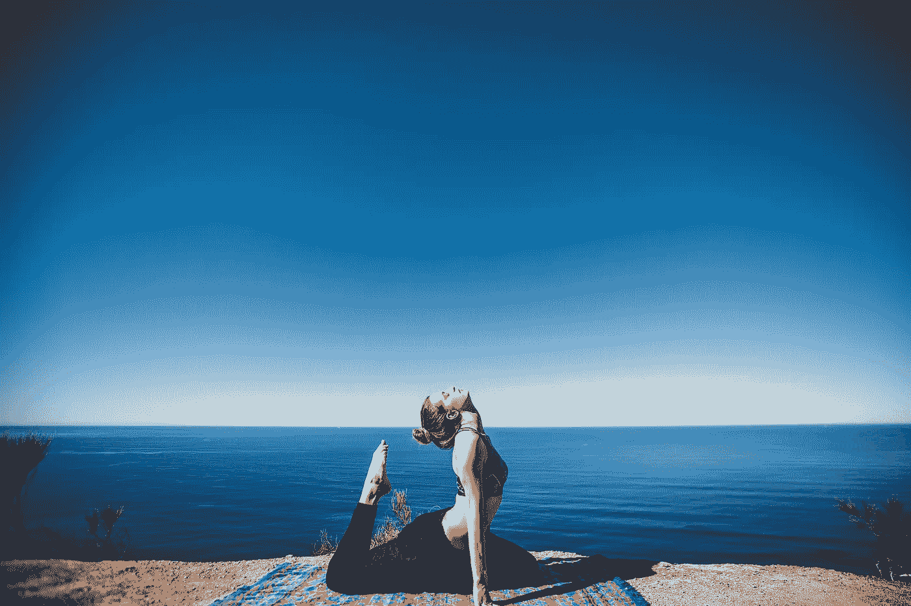

# 未来 3 年如何学习 108 项新技能

> 原文：<https://medium.com/swlh/how-to-learn-108-new-skills-in-the-next-3-years-ded0d46fda55>

Photo by [@matthewkane](https://unsplash.com/@matthewkane) on [Unsplash](https://unsplash.com/photos/smWTOhdPvJc)

为了这篇文章，我们将把“技能”这个词定义为:“做好某事的能力”。“嗯”，不一定是专业上的意思。

T 当我读到并理解下面这段话的时候，我知道我必须改变我的生活，成为一个更有技能的人:

> “未来属于那些学习更多技能并结合…