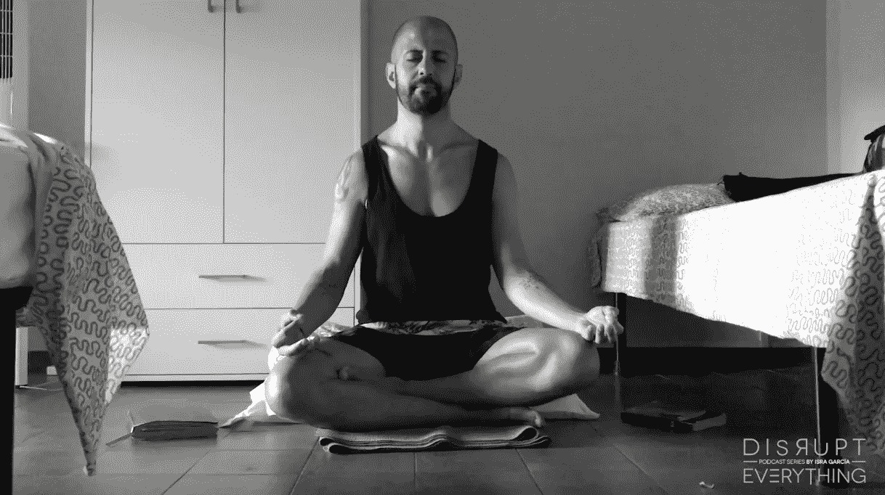

# 如何每天学习和成长:6 个行之有效的策略

> 原文：<https://medium.com/swlh/how-to-learn-and-grow-every-day-6-proven-strategies-cadf29bfd004>

## 计划+实践+沉思+系统+解决问题+实验

我生活和工作中必不可少的一部分就是每天如何学习和成长。今天，我有六个策略来帮助我实现它

# 1.计划我正在寻找的课程

这让我可以仔细思考我想学什么。这些目标不仅仅是为了我想要达到的目标。我也想对我想学的东西有目标。

# 2.刻意练习

我在这里做的不是自动地做事情而不改进，而是应用有意(和有意识的)训练的原则，这样你就可以不断地改进。这意味着采取行动，比如停下来反思我的业务进展和工作成果。或者创造一个每天的时间空间来提高我的核心技能，并在我的 [**高性能**](/swlh/20-top-and-simple-practices-to-reach-your-daily-high-performance-ea81c5cdb300) 算法中整合新的超级习惯。

# 3.沉思

这个技巧帮助我对新思想的吸收和我学到的教训有了更多的认识。它还帮助我发现那些产生新项目、实验、业务、服务或改进我所做工作的冲动或本能。在沙滩上或公园里散步，同时大声自言自语(戴着耳机)是处理这些见解的一个很好的方式。显然，我不是第一个发现这一点的人，从贝多芬、查尔斯·达尔文到史蒂夫·乔布斯、杰克·多西或彼得·迪亚曼蒂斯。另一种方法是通过与厚和非常反思的人交谈。

# 4.学习时间

它包括阅读、交谈(甚至是与自己交谈)、参与类似 Hatch、Echo 或[SOP](https://isragarcia.com/projects/stand-out-program)的活动、观察他人或旅行。

# 5.问题一出现就解决

当问题在一天中出现时，我们通常把它们藏在地毯下面，继续我们的工作，好像什么也没有发生。拥有一个空白空间可以创造出定位小问题并在它们变大之前解决它们所需的空间。决策也是如此。

# 6.实验

我几乎每个月都进行小的测试，在我的智力、情感、精神和问候中寻找潜在的回报。对我来说，最具挑衅性的是，无论实验是否成功，都是一个学习有价值的东西的机会，也是我的想法的试验场。

如何每天学习和成长首先是一个坚持和主动的问题。其余的，如果你去寻找，就会找到你。

【本帖首发于**】**

# **只有当你觉得值得的时候，才让这个故事震撼吧！如果你发现任何有价值的东西，请鼓掌。**

> **Isra Garcia = 53 个客户，48 家企业，400 次演讲，3.504 篇帖子，24 个项目，6 本书，380 场讲座，6 家公司，17 次冒险，25 次实验，∞失败。到目前为止…**
> 
> **[有一手](https://isragarcia.com/wp/marketer)。顾问。扬声器。作家。教育家。经理。在 [IG](http://thisisig.com) 的负责人。博主。企业家。颠覆性创新。数字化转型。高绩效者和生活方式实验者。**

# **行动号召>>点击[这里](http://feeds.feedburner.com/isragarcia)订阅更多类似的文章！**

****

## **这篇文章发表在 [The Startup](https://medium.com/swlh) 上，这是 Medium 最大的创业刊物，拥有 338，320 多名读者。**

## **在此订阅接收[我们的头条新闻](http://growthsupply.com/the-startup-newsletter/)。**

****