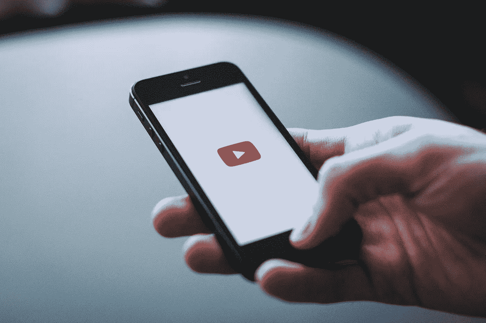
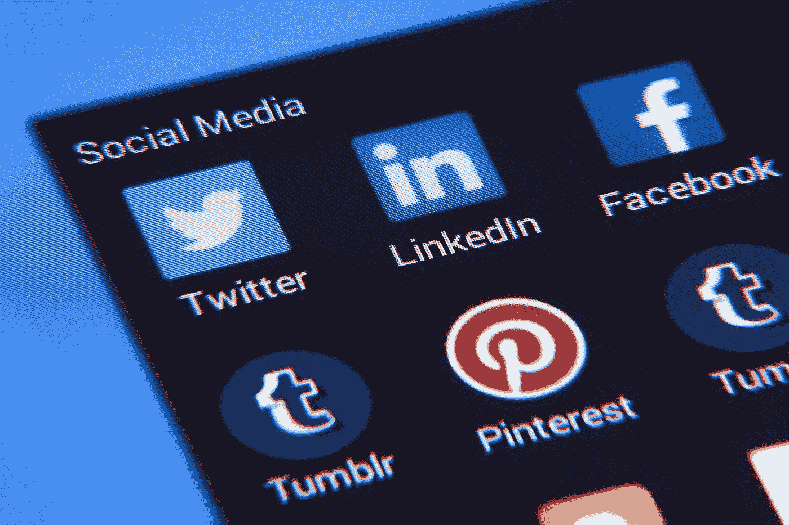

# 如何边学习边学习？

> 原文：<https://medium.com/swlh/how-to-learn-while-studying-dfbbcac39b9>

[©Pixabay](https://pixabay.com/en/phone-screen-technology-mobile-1052023/)

我的大学下学期的注册期刚刚开始，当我作为一名三年级旅游管理专业的学生进入第二学期时，我意识到我对我正在学习的这个领域仍然知之甚少。然而，在大学的三年里，我确实在学位之外的领域学到了很多东西，比如企业家精神、平面设计、网页设计、公共演讲和领导力。所有这一切让我评估我如何能够学习这些东西，而我的大脑没有融化，考虑到我必须从头开始学习这些东西，而我甚至不能专注于一个小时的学习会议，为第二天的考试。

# **学习 VS 研究**

在我开始列举之前，我们首先需要定义一些术语。我真的不得不在我的个人字典中深入挖掘这个问题，看看我怎么也不是一个想象力丰富的专家，所以把这作为我的观点(IMO)情况。对我来说，学习就是你按照自己的速度，通过自己的方式，获得你所选择的任何领域的知识。另一方面，学习有预先确定的目标，你*必须*通过之前提供的方式(如考试、测验、作业、家庭作业等)达到这些目标。).学习是你可以控制的事情，而学习是更固定的，你在学习时学习一些东西的最佳情况是把最少的努力放在学习上，为你提供更多的时间学习，因此是被动学习。

# **被动学习**

我在我上的一堂课上发现了这个术语，教授在课上教我们为什么我们应该成为主动的学习者而不是被动的学习者，它通常被用于一个负面的含义中，意思是你在没有理解或解释所提供的信息的情况下听到了。我在参加理财速成班时观看的一个视频[中也遇到了被动这个词，尽管它与学习无关，但更多的是与收入有关。在了解这一点后，这个术语对我来说意味着完全不同的东西，它是我从头开始学习新的和不同的东西的基础。对我来说，被动学习就是在精神上几乎不需要任何努力就能获得知识。基本上，当你做其他事情，比如为考试而学习时，你可以让学习自动进行。下面是我做的一些事情，你可以用来在学习的时候被动地学习。](https://www.youtube.com/watch?v=mCG-Y9bkGpU)

[©Pixabay](https://pixabay.com/en/iphone-apple-cellphone-earphone-2588807/)

## 听播客

现在，对于那些不了解播客的人来说，播客是通过不同渠道上传到不同应用程序的音频记录，如 Castbox、Spotify、Soundcloud 或苹果的播客应用程序，想想 YouTube，但它们不是提供视频日志，而是提供音频日志。就像在 YouTube 上一样，你也可以下载播客，但与你必须看着屏幕才能看到正在发生什么的视频不同，你可以像听音乐一样听播客，这允许你做更多的事情。

**如何利用它进行被动学习:**

*   **上下学时听播客**。正如我说的，你可以下载播客，这样你就可以在路上听了，我建议你在上学路上等着的时候听。
*   **选择与你想学的内容相关的频道**。播客为你提供了大量可供选择的频道，无论你是想学习一门新的语言还是培养自信，很可能总有一个播客适合你。
*   **选择教育频道**。就像 YouTube 播客提供了丰富的选择，一些频道是教育频道，而另一些是娱乐频道。你可以听任何一个，但是为了学习，选择教育类的。

[©Pixabay](https://pixabay.com/en/bible-iphone-mobile-phone-read-2690301/)

## 阅读在线文章

这是我在去年年中(六月左右)开始融入日常生活的一个习惯。总的来说，我从来没有真正喜欢过阅读，但在我的脸书 feed 上看到一个非常吸引人的标题后，我开始了转变。读了一篇文章后，我意识到这是一个很好的方法，通过将信息分解成列表和项目符号来获取信息，这慢慢地成为了我的日常习惯。

**如何利用它进行被动学习:**

*   **下载专注于文章的应用，如 Medium、Pocket 或 Flipboard** 。现在你可以在你的社交媒体订阅源上阅读文章(我们稍后会谈到)，但我建议你下载专用应用程序以避免分心。
*   **等待时阅读**。排队时消磨时间的方法有很多，但能充分利用这段时间的方法却屈指可数，其中之一就是开始阅读一篇文章。
*   **避免热门文章**。现在，我知道有些人可能已经习惯于阅读一些文章，比如无聊时要做的 10 件事，或者根据你的星座，你的爱情生活会是什么样子。我绝不是在评判任何读这类文章的人，我的确读了《你单身的 8 个理由》和《为什么你应该自豪》，但这类文章是为了娱乐和金钱而不是信息或学习。

[©Pixabay](https://pixabay.com/en/youtube-iphone-smartphone-mobile-2617510/)

## 利用 YouTube

如果你像我一样，那么视频是你消费内容的最佳方式之一。开始是上瘾的事情变成了对我有益的事情。通过观看有关最新游戏新闻和短剧的视频，我现在在这个平台上观看和学习不同专家的新技能。

**如何利用它进行被动学习:**

*   **找专家**。无论你想学哪个领域，都有可能已经有专家了，而且这些专家也有可能有自己的 YouTube 频道。花时间去寻找它们，判断它们的内容，然后订阅以保持更新。
*   **像上课一样对待它**。我经常切换我订阅的频道，就好像我在从一个班级切换到另一个班级一样。我注意到我已经从一个频道看了多长时间的视频，然后我移到下一个频道，做同样的事情。
*   **制作播放列表**。YouTube 的一个特点是能够制作播放列表，你可以利用这一点，就像你在设计自己的课程一样。找到视频，将它们归类到播放列表中，并根据谈论的话题给它们命名。一个例子是我用来学习[财务管理的播放列表。](https://www.youtube.com/playlist?list=PLSe3dVkuNevVPzOezALexRYjC5IQeEu7u)

[©Pixabay](https://pixabay.com/en/social-media-facebook-twitter-1795578/)

## 优化您的社交媒体

大多数人会说，学习一件事情的最好方法之一就是专注于它，排除一切干扰。我反对，我认为通过管理你的干扰，你实际上可以学得更好，没有什么比社交媒体更接近干扰的顶端了。通过管理你的订阅源，你实际上可以对你关注的主题了解更多。

**如何利用它进行被动学习:**

*   **喜欢并关注提供与您想要学习的内容相关的页面和人员**。通过这样做，你可以有意识地把你想学习的内容放到你的 feed 上。
*   **取消关注吵闹的朋友**。这是给脸书的，你可能有一个朋友，他整天发帖子，消耗了你一半的信息。幸运的是，你还不需要解除他们的好友关系。脸书有一个 unfollow 功能，可以在过滤掉你的朋友昨晚吃了什么的同时，保持你们的友谊完好无损。这是为了让你的 feed 保持尽可能低的噪音，以便从你喜欢的页面上看到更多的帖子。
*   **直接从你的 feed 上阅读文章**。正如我之前说过的，阅读你的文章是一种选择。这对于那些刚刚开始养成习惯，但已经开始成为日常生活一部分的人来说尤其方便。我建议你下载一个专用的应用程序来避免分心。

边学习边学习并不是一件很困难也不耗费时间的任务，只是要知道你想学什么，以及对你来说什么是最方便的学习方法。这些只是让学习变得方便的一些方法，你还可以做更多的事情来让学习一门新的技能、语言或兴趣变得更加顺畅。

## 这篇文章发表在 [The Startup](https://medium.com/swlh) 上，这是 Medium 最大的创业刊物，有 281，454+人关注。

## 订阅接收[我们的头条新闻](http://growthsupply.com/the-startup-newsletter/)。

