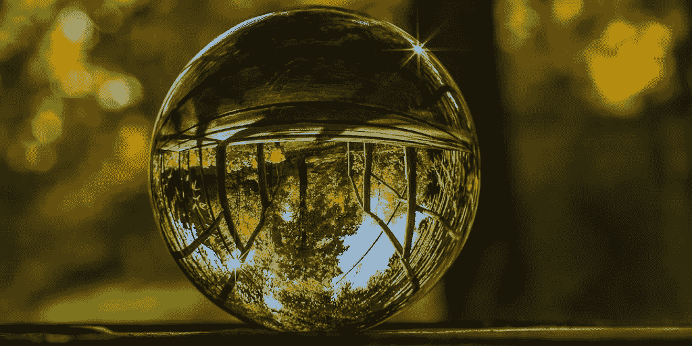

# 如何利用视觉化放下

> 原文：<https://medium.com/swlh/how-to-let-go-using-visualization-63ea1ff67d3d>

我们对控制的渴望让我们很难放下事物、处境和人。我们知道不可能控制生活中发生的每一件事，但我们每天都在与这个事实做斗争。它可以是一个简单的答案，我们一直在等待，但没有来，或者是一个雨天，破坏了我们的假期计划。我们没有变得有创造力，没有找到一种不同的方式来让事情运转，而是被愤怒和沮丧所淹没。

帮助我处理负面情绪的第一件事是学会放手的承诺——我只是决定我想接受投降的智慧。如你所知，意识到你需要改变生活中的某些东西是走向康复的第一步。即使只是希望学会放手也改变了我的观点——每次我发现自己处于沮丧的时刻，我都会停止思考，专注于我的承诺。我也不得不接受负面情绪是我们自身的一部分，但是它们来来去去，就像海洋中的波浪。

我在许多精神教导中听到的“我们是海洋”的比喻引起了我的共鸣。把我自己想象成整个海洋，看着波浪通过，正确看待我的问题——我们无法控制波浪，但它们也是暂时的。这是一个美丽而有效的视觉化图像，可以帮助你放下那些让你停滞不前的事情——允许海浪运动，看着它们消失在岸边。

> 当你被负面情绪压垮时，想象是一个强大的工具。

我从我的精神导师那里学到的另一个技巧是放开一个代表问题的假想球。我记得我们在沙滩上散步，我告诉她我压力太大了——她温柔地叫住我，让我闭上眼睛。想象一下，你的胃里有一个球，这通常是我们集中焦虑的地方。现在把球从肚子里拿出来，移动你的手，就像你真的在做一样——拿出来。把球放在一只手的手掌里(你选择它的特征，我喜欢想象它透明而轻盈)，看着它，在你的手里看到你面临的问题——它已经不在你的肚子里了。把球握在手里，想握多久就握多久，轻轻地把它发射出去，然后收回来——感受它，但记住它不再是你的一部分，所以你必须放手。一旦你觉得准备好了，就把它发射到天空，看着它不断上升——直到它从视野中消失。你可以根据需要多次重复这个练习；它会帮助你集中注意力，接受问题，然后放手。

学会屈服是困难的，但这是面对艰难时世的一项基本技能。总有一些新的东西要拥抱，也有一些别的东西要放下——这里面有和谐。

> 以不同的方式想象我们自己和我们的问题可以帮助我们正确地看待它们，看到它们的短暂性。

*最初发表于*[*【www.chiarabtownley.com】*](https://www.chiarabtownley.com/blog/2018/1/12/how-to-let-go-using-visualization)*。*

## 这篇文章发表在 [The Startup](https://medium.com/swlh) 上，这是 Medium 最大的创业刊物，拥有 284，454+读者。

## 在这里订阅接收[我们的头条新闻](http://growthsupply.com/the-startup-newsletter/)。

