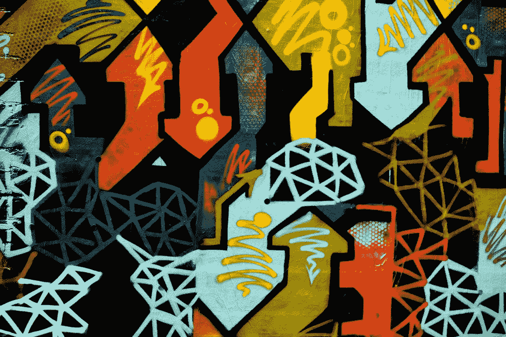
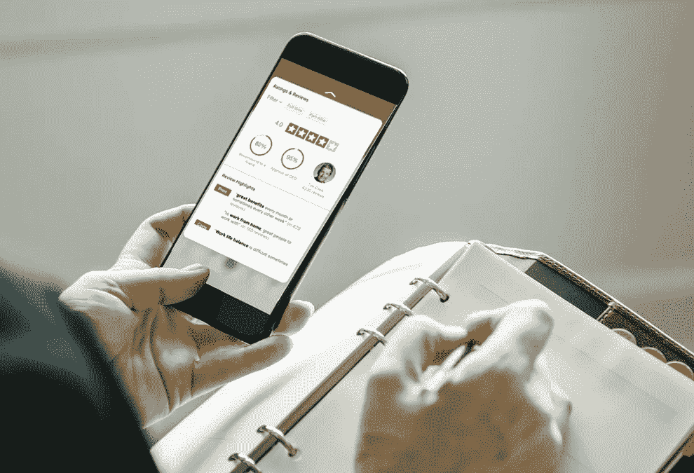

# 如何提升你的职业发展

> 原文：<https://medium.com/swlh/how-to-level-up-your-career-development-b7ddb781fc49>

Credit: [Annie Spratt](https://unsplash.com/@anniespratt)

## 随着你的晋升，绘制和探索你的职业生涯

*这篇博文报道了在 2018 年格蕾丝·赫柏大会期间，由特雷西·基奥(惠普公司首席人力资源官)和迈克尔·乔丹(惠普公司全球人才与学习主管)主持的一场职业会议。*

# 管理你的职业生涯

Credit: [Unsplash](https://unsplash.com/@kobuagency)

## 1.找一个赞助商

> 导师给你建议，赞助商为你辩护。赞助人是为下一次机会打开大门并帮助你的名字/技能为人所知的人。

*   想想你在 5-10 年内/下一个角色想去哪里，去寻求建议，进行对话。
*   赞助商可能比你级别高，而且在同一个组织里
*   这是一种双向的关系，你作为被“资助”的人，展示出你的承诺
*   伸出手，在你的公司内外有更多的导师(这样他们会带来不同的观点，减少一个导师的时间投入)

## 2.多说“是”

女性有自我怀疑和低估自己技能和能力的倾向，这导致她们对新的机会和项目说“不”。

> [在研究中](https://www.theatlantic.com/magazine/archive/2014/05/the-confidence-gap/359815/)，男人高估了自己的能力和表现，而女人则低估了两者。他们的表演在质量上没有区别。

找出你的障碍是什么。比如在照顾孩子方面得到更多的帮助)并确保在改变角色或职责时寻求帮助(例如帮助有特殊需求的儿童和儿童保育；搬迁)。

评估可能的风险(如果你不得不离开新的职位，你的退出计划/离职)，谈论替代方案/可能性，而不是说不(例如“也许不是现在，而是明年…”)

Credit: Unsplash

## 3.坚持不懈(不完美)

要求具体的反馈，找到问题的根源，而不是表面的一般性问题。人们自然会拒绝给予/倾听批评性的反馈，所以你需要主动向他人寻求反馈。

*   告诉我你最后一次失败是什么时候？
*   我应该继续做什么？
*   我需要以不同的方式思考什么？
*   我需要做些什么来改善我的团队？

## 4.相信！

在会议前预见问题和常见问题。例如，如果你害怕公开演讲，练习并做好笔记，这样它就知道你的东西了。不断学习，扩大知识面！

*   注意你的语言会表现出自我怀疑。使用限定词…“我不确定这是否是个好主意，但是…”)
*   在与高层领导会面之前，非正式地分享工作

Credit: Unsplash

# 协商你的工资

不接受第一次报价(外部)；因为报价条件总是有余地的。优惠(内部)有更多的限制

*   在一家公司呆一段时间也是有价值的。退休资格)。找一个律师看一下录取通知书(职位越高越重要)
*   以书面形式获得头衔、薪酬和福利

Credit: Unsplash

## 制定一份条款清单

使用电子表格来比较你目前的角色和你对下一个角色的期望。

类别包括:

*   标题
*   假期
*   底薪
*   奖金
*   开始广播
*   退休金
*   ESPP
*   服务奖
*   401k 匹配
*   遣散费
*   退休人员计划
*   长期激励/股权
*   重新安置
*   归属时间表
*   员工资源

这种方法旨在显示差距，以及你可能会因为担任新角色而错过的东西(例如，年中离职，因此错过了促销和奖金)；这有助于你更有效地与他们的人力资源谈判。

由于谈判是让双方达到互惠互利的一种方式，如果你注意到任何差距，请他们的人力资源帮助你获得良好的薪酬/福利平衡，以抵消接受新报价的成本。

—

 [## 加入英特尔信息技术峰会，免费学习 3 个月 UX 设计

### 以合理的价格通过常青藤联盟级别的 UX 课程推进你的设计生涯。看什么…

www.interaction-design.org](https://www.interaction-design.org/invite?ep=joanna-ngai) 

你觉得这有用吗？ [*给我买杯咖啡*](https://www.buymeacoffee.com/joannan) *给我的大脑一个拥抱。*🍵

*随时查阅* [*我的设计作品*](http://dribbble.com/joannan) *或者我的*[*UX 设计手册*](https://www.amazon.com/gp/product/B01IECEMYU/ref=dbs_a_def_rwt_bibl_vppi_i1)*[*升级你的作品集*](https://www.amazon.com/How-Design-Your-Portfolio-Upgrading-ebook/dp/B07CRWPBS5)*[*了解设计思维*](https://www.amazon.com/gp/product/B07F6TYCHX/ref=dbs_a_def_rwt_bibl_vppi_i2) *。***