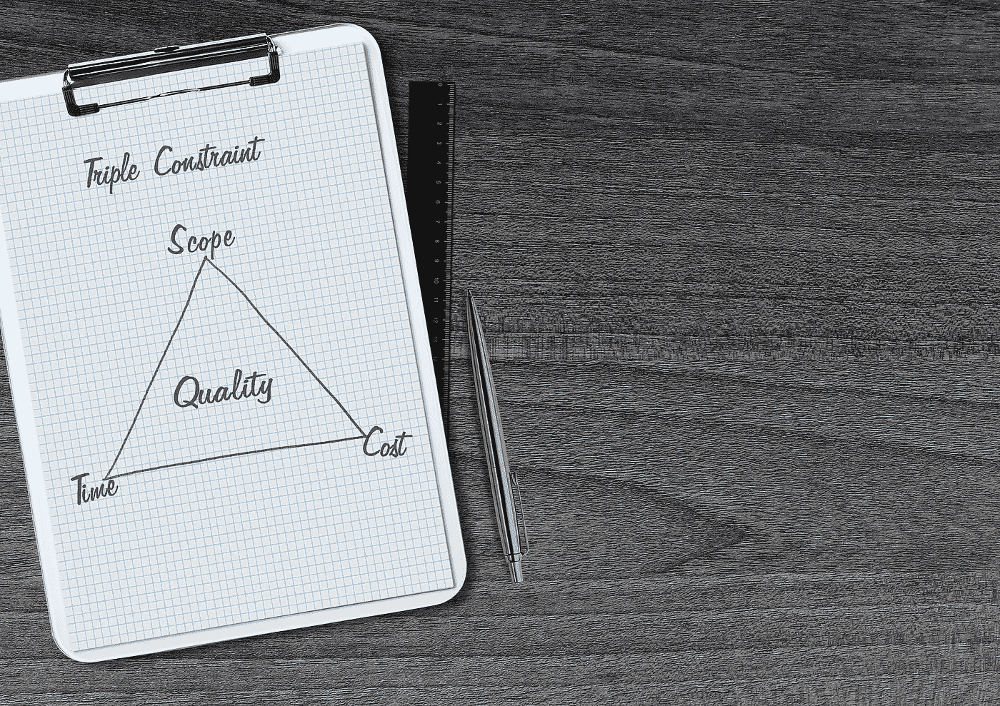
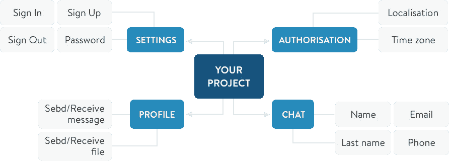
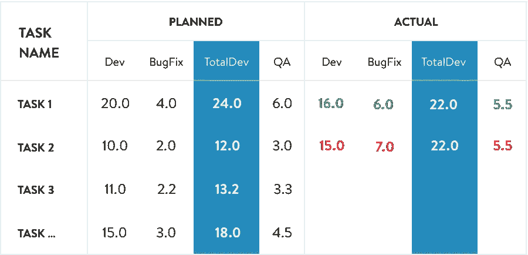
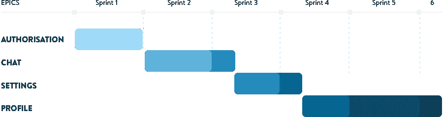
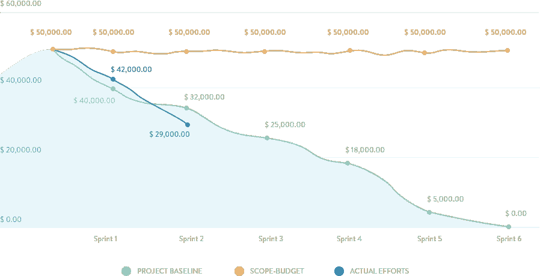

# 如何在 IT 项目中利用三重约束

> 原文：<https://medium.com/swlh/how-to-leverage-the-triple-constraint-in-it-projects-d6e65d20cd6a>

IT 公司的项目经理经常不得不处理这样的请求，比如“我想以固定的价格做这个应用程序”或者“你能告诉我我项目的精确成本吗？”。问这些问题的客户可能只是对他们想要实现什么有一个简单的想法，他们可能不确定他们项目的所有细节，但是，他们需要答案。

处理这种情况的唯一方法是引入一个清晰的过程，让交付的软件产品满足技术需求，同时达到期望的时间/成本结果。基本上，这使我们有必要在每个 IT 项目面临的约束之间找到正确的平衡:范围、进度和成本。这也被称为三重约束，项目管理三角或[时间、成本、质量三角](https://anadea.info/blog/time-quality-cost-which-ones-do-you-choose-for-your-app)。

在本文中，我们将向您展示如何恰当地管理所有三个约束，并在整个软件开发生命周期中[保持透明性](https://anadea.info/blog/transparency-as-a-clue-to-successful-partnership)。

让我们详细回顾一下每个约束。

# **范围**

范围是完成项目所需的一组特性和功能。需要某些步骤和活动来明确定义范围，并在预算内按时交付。

第一步是创建一个规范文档，我们可以:

1.将功能分为史诗和用户故事。

2.写下用户故事的场景。

3.指定用户故事的接受标准。

创建本文档的目的是概述所有功能的要求，并明确每个功能的起点和终点。

第二步是为系统创建一个设计(特性)。在这个阶段，所有的页面、屏幕、特性和模块都被精确地绘制出来，这样所有的项目参与者都可以清楚地了解它在未来会是什么样子。

基于这两个步骤的结果，项目经理创建工作分解结构，记录所有需要实现的特性。现在，项目有了可以由开发团队评估的项目列表，这是过程的下一步。

每个特性的评估包括以下活动:

**1。功能的开发。在这个阶段，开发人员根据规范文档和设计编写代码。**

**2。功能测试。** [QA 专员](https://anadea.info/services/quality-assurance)确保特性满足指定的需求，并且不会对系统的其他部分造成任何负面影响。如果检测到任何问题，质量工程师记录问题(称为“bug”)并提交给开发团队。

**3。修复错误。**根据 QA 专家的建议，开发人员修复缺陷或实施 QA 发起的改进。

为了跟踪开发阶段的进展，项目经理将计划的估计与实际的进行比较，以便清楚地了解项目是否按计划进行。

# **日程**

一旦我们有了带有估计的工作分解结构，我们就可以理解给定分配的开发团队实现项目需要多长时间。

用于此目的的工具是甘特图。该图表通过将任务名称、开始日期、持续时间和结束日期转换为级联的水平条形图，使项目管理时间线的可视化变得容易。

在敏捷(Scrum)开发中，项目通常被分成迭代(Sprints)。每次冲刺的持续时间为 2 周，包括以下活动:

1.Sprint 规划为 sprint 规划工作范围。

2.范围的实现(开发和测试)。

3.每日站立，让团队同步冲刺进度。

4.展示 sprint 工作成果的演示会议。

5.回顾会议，总结冲刺成果。

因此，使用甘特图可以让所有参与者知道特性开发何时开始，何时结束。

# **成本**

项目三角形的第三边是成本——在计划的时间表内，应该为范围实施支付的资金。成本通常由以下公式计算。

**服务小时数(h) *每小时费率($) =成本($** )

项目成本是一个非常敏感的方面，应该非常仔细地跟踪。对于预算跟踪，我们可以使用燃尽图，这是一个项目预算相对于计划资金基线的图形表示。资金显示在纵轴上，短跑显示在横轴上。这张图表显示了我们是否保持在预算之内，或者有超出预算的风险。

变更请求，例如添加新功能或修改 UX 流程，可能会显著影响预算。燃尽图将有助于把握预算脉搏，并在整个项目生命周期中控制预算。

# **结论**

利用工作分解结构、甘特图和燃尽图，我们可以在开发过程中保持透明度，并在范围、进度和成本之间保持平衡。当您了解项目中事情的实际状态时，您可以有效地管理它，并在出现问题时解决问题。

不管你的项目是大是小，它都有自己的项目管理三角，如果管理得当，它可以成为你的商业冒险成功的三角。

*最初发表于* [*anadea.info*](https://anadea.info/blog/how-to-leverage-the-project-management-triangle)

## 这篇文章发表在 [The Startup](https://medium.com/swlh) 上，这是 Medium 最大的创业刊物，有 343，876 人关注。

## 订阅接收[我们的头条新闻](http://growthsupply.com/the-startup-newsletter/)。

