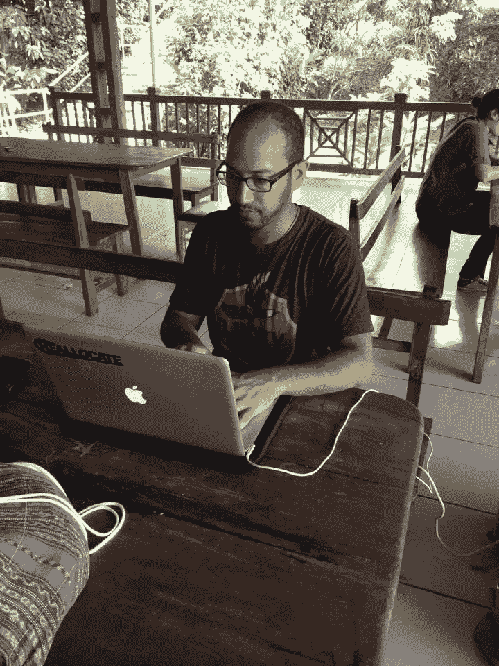

# 如何过上成功的数字游牧生活

> 原文：<https://medium.com/swlh/how-to-live-a-successful-digital-nomad-life-7f690bb880c4>

## 伟大的数字流浪者的成功生活方式:[又是新一集](https://medium.com/u/729b1f389d0c# 45——朱利安·戴维斯</h1>
 >听这里的< < <](https://isragarcia.es/disrupt-everything/?name=2018-07-27_45_dep_-_julian_davis.mp3)

> 如果你能梦想有趣、有意义和充实的生活，那么你就能实现它。

**目录索引**

1.  数字游牧者生活中最决定性的时刻。
2.  游牧生活和生活方式的原则。
3.  成为数字流浪者的优势、劣势和惊喜。
4.  如何从一份传统的工作转变为一个过着紧张职业生活的数字流浪者？
5.  游牧者最有用和实用的工具。
6.  改变他生活的建议、提示、技巧和小玩意。
7.  关于旅行，学习，和捷径。
8.  更多的个人方面。

> 人类拥有美好而充满活力的想象和创造能力。我们拥有描绘不同生活方式的工具，只要你愿意沿着那个方向追随你的直觉、创造力和目标——Julian。

## 你也可以直接从 [Disrupt Everything 播客系列主页](https://isragarcia.es/disrupt-everything/)收听。

【本帖最早出现在[**isragarcia.com**](https://isragarcia.com/chris-brogan-human-business)】

听听别人这样的采访:

*   [**杰夫·布拉**](https://isragarcia.com/jeff-bullas-podcast-interview) 。
*   [**迪姆西**](https://isragarcia.com/tim-west-food-hacking-life-hacking) 。
*   [克里斯布罗根 。](https://isragarcia.com/chris-brogan-human-business)

# 只有当你觉得值得的时候，才让这个故事震撼吧！如果你发现任何有价值的东西，请鼓掌。

> Isra Garcia = 55 个客户，48 家企业，400 次演讲，3.574 篇帖子，24 个项目，6 本书，380 场讲座，6 家公司，17 次冒险，26 次实验，∞失败。到目前为止…
> 
> [营销人员](https://isragarcia.com/wp/marketer)。顾问。扬声器。作家。教育家。经理。 [IG](http://thisisig.com) 的负责人。博主。企业家。颠覆性创新。数字化转型。高绩效者和生活方式实验者。

# 行动号召>>点击[这里](http://feeds.feedburner.com/isragarcia)订阅更多类似的文章！

## 这篇文章发表在 [The Startup](https://medium.com/swlh) 上，这是 Medium 最大的创业刊物，有+ 375，041 人关注。

## 订阅接收[我们的头条新闻](http://growthsupply.com/the-startup-newsletter/)。

