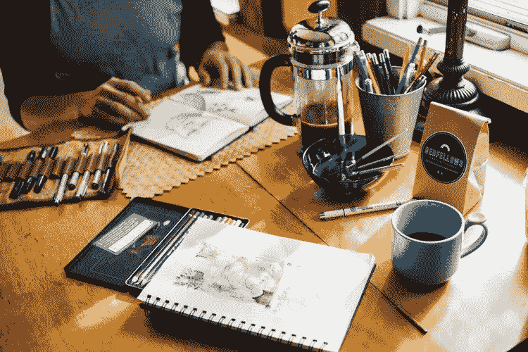
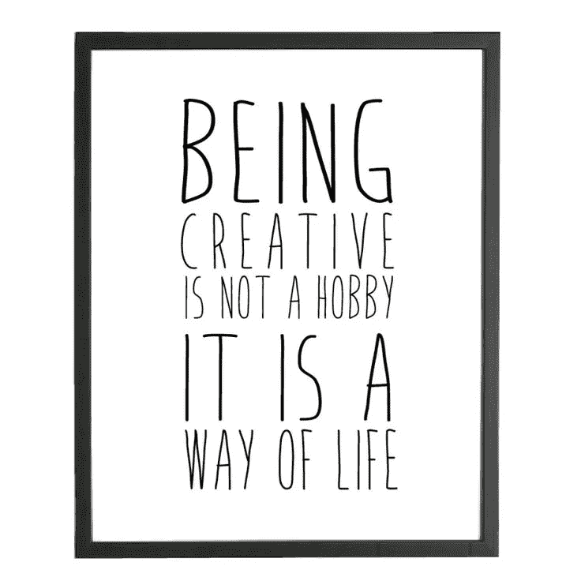

# 如何在创业环境中保持你的创造力

> 原文：<https://medium.com/swlh/how-to-maintain-your-creativity-in-a-startup-environment-d3e03ed92923>

## 有没有办法在繁忙的创业环境中保持创造力？

在创业公司工作有很多挑战。但是对于所有的创意人员来说，最重要的一点是在日常生活中保持他们的创作热情。

繁忙的启动环境可能会让人精疲力尽。它会耗尽你所有的创造力，将你的注意力转移到其他需要你关注的任务上。如果公司的不同领域有更大的需求，这甚至会导致角色的变化。当你试图保持创造力和激情时，这可能是一个挑战。

到目前为止，我已经为四家初创公司工作过，我知道这种斗争是真实的。每个公司都有不同的挑战，这取决于团队或他们目前所处的阶段，但最终的问题是相同的，

> 在繁忙的创业公司工作时，你如何保持创造力？"

# 掌握你的时间

首先，让我们从提醒**你要对自己的时间**负责开始。是的，需要满足的优先级和目标是不断变化的，但是平衡所有的任务取决于你。

尽管听起来很有挑战性，但如果你是远离干扰的，这并非不可能。从在一天中创造时间块开始，专注于重要的事情。

这样你就不会忘记接下来会发生什么，并且你能够保持你的优先权。

# 为所有意外的变化做好准备

然后是意想不到的因素。

在初创公司工作意味着你需要做好意料之外的准备。

无论是积极的还是消极的变化，总有新的理由让你放下手头的工作，专注于不同的事情。

可能是突然的成功，也可能是大危机，但结局都是一样的。你把所有的精力都放在处理这件事上，你需要省去你完美计划的时间表。

这时你就需要提升你的组织能力。

重要的是要足够敏捷地改变你的优先事项，并准备好在最需要你的地方提供帮助。

这是一项在创业环境中非常重要的技能，一旦你开始掌握它，你就会意识到再也没有惊喜了。

# 珍惜你的创意时刻

然后是创造力。

如果你对你正在做的事情充满热情，并且喜欢创新，那么你就知道保持你的手艺有多重要。

无论是写作、设计、拍照，还是任何其他形式的创造力，尽管你在日常生活中挣扎，你还是会有保持它的冲动。

在繁忙的创业环境中保持创造力并不总是容易的，但也不是不可能的。

找到对你更有效的方法，并把它加入到你的每周计划中。

*   每天为创造性的时刻设定一个时间段
*   记日记，记笔记和涂鸦
*   远离办公室，保持创造力
*   创造性地利用你的周末
*   请一天假，从忙碌中恢复过来
*   改变风景
*   午休时去散步
*   读书
*   听播客
*   从日常生活中获得灵感
*   与其他创意人员合作

> 不要把你的创造力当成一件苦差事。

如果你喜欢你正在做的事情，那么你需要保持这种热情。如果你和我一样，那么你的创造性时刻将很容易成为你日常生活中的珍贵片段。他们总是在那里提醒你，你不想摆脱他们。它们帮助你保持专注，也能让你从忙碌的一天中放松下来。

是的，有时候保持创造力并不容易。但是你仍然可以用你喜欢的其他时间来弥补这些日子。你会惊讶地发现拥抱这些时刻会让你感觉多么不同。

## 激励自己即使在忙碌的时候也要保持活力:

> “你不能用尽创造力。用的越多，拥有的就越多。”—玛娅·安杰洛
> 
> "创造力是发明、实验、成长、冒险、打破规则、犯错和享受乐趣."—玛丽·卢·库克
> 
> “创意不是我思考的方式，而是我喜欢的生活方式。”—保罗·桑迪普

## 这个故事发表在 [The Startup](https://medium.com/swlh) 上，这是 Medium 最大的创业刊物，有 295，232+人关注。

## 订阅接收[我们的头条新闻](http://growthsupply.com/the-startup-newsletter/)。

