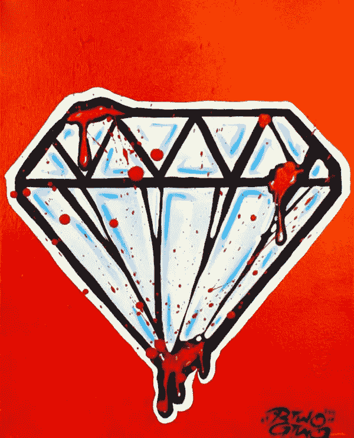

# 如何赚到 6 位数——别胡扯了。

> 原文：<https://medium.com/swlh/how-to-make-6-figures-no-bullshit-bf381126f004>

Image Credit: [MATTHIAS HANGST](https://www.instagram.com/matthias.hangst/?hl=en)/GETTY IMAGES

又一篇 clickbait 文章？你现在应该知道我不是那样的人。

赚六位数是关于有钱去旅行，创造一个侧面的骗局，照顾好你的身体，投资自己和投资资产。

在我们深入细节之前，要明白金钱不会让你幸福。它会让你做很酷的事，但只有你能让自己开心。不要让这篇文章的标题让你有不同的想法。

我看过很多视频和文章承诺“六位数的生活方式”，但大多数都没有实现。用我自己的经验，我想告诉你我是怎么做的。

## 以下是如何获得 6 位数的方法:

# 做别人不准备做的工作。

给新客户打电话。敲门。参加管理会议，当你搞砸了，让他们撕你一个新的屁眼。

> “能让你拿到 6 位数薪水的工作通常是没人愿意做的工作”

仅仅做最低限度的工作或你工作描述中的工作不会让你达到目标！你必须比那更主动。

*积极主动的最佳方式是什么？*

解决与你无关的业务问题。

发现无人知晓的业务问题。

大多数人不准备这样想，但如果你这样做，你会很快达到 6 位数，甚至 7 位数。

Image Credit: Shutterstock

# **聪明工作，不辛苦。**

你以前听过。这是陈词滥调。

**你不需要一天工作 12 个小时才能赚到六位数。**

我所做的是做一些深度的工作。这里两个小时。一小时后到。在数小时的深度工作中，没有即时消息，没有电子邮件，最重要的是——没有该死的电话！！！

你的手机让你变得愚蠢，让你变成一个注意力上瘾者。做你该死的手机的奴隶，你不会有六位数的收入。收起来。做深度工作。这就是你如何聪明地工作，而不是努力工作，并获得高薪支票。

# **被视为领导者。**

领导者通常能挣大钱。即使你现在不是一个领导者，你也可以被视为一个领导者。

你展示自己是领导者的方式如下:

表明你想培养他人

做讨厌的工作(销售电话)

表明你愿意被你培养的人取代成为领导者(领导者培养领导者)

在第一天递交辞职信存档(领导自己支持)

我总是把自己标榜为领导者。即使我没有领导者的头衔，我也用我在社交媒体上的工作作为我领导力的例子。

*“在个人发展和创业领域，我在 LinkedIn 上领导着 X 个粉丝”*我会说。

# **明白自己的价值是什么。**

我的是社交媒体和个人发展。你呢？

如果你不能清楚地表达你的价值是什么，你就完了。

Photo Credit: SuperStock/Getty Images

即使你能说出你的价值是什么，你也必须能够证明它。以下是我如何在社交媒体上做到的:

-在 2017 年 LinkedIn 上分享最多的博客文章

一篇 Quora 文章的浏览量达到 1000 万

-有 3 篇关于 Entrepreneur.com 的病毒文章

在我写的一篇博客文章中，脸书的股票达到了 84，000 股

-我写的一篇中型文章进入了 2018 年阅读量最高的 15 篇文章

因为我写的一篇病毒式文章，阿里安娜·赫芬顿亲自邀请我加入她的博客

注意:传达你的价值观和听起来好像你什么都知道，你是自多瑞托发明以来最伟大的人之间有着微妙的区别。对我来说，区别在于去除你的自我。这完全取决于你如何交流，以及你使用的语气。

# **把你的爱好融入到工作中。**

我把博客、企业家精神和个人发展融入到我所做的每一件事情中。

> **把业余爱好和工作结合起来是你达到 6 位数的原因。如果胡萝卜大棒和你喜欢做的事情有关，你更有可能去追逐它。**

即使在我刚有一份普通的销售工作时，我也把社交媒体放在最前面和最中心的位置。我向客户、员工和任何愿意倾听的人做社交媒体演示。

尽管我的工作与社交媒体毫无关系，但我让它成为了角色的一部分。我拒绝接受任何其他建议。爱好带来了更多的激情。

激情给了我能量，让人们记住了我。赢了！

# 为了健康而疯狂。

锻炼，冥想，学会保持冷静。挣六位数的工资会很有压力，你需要一种放松的方式。

提炼出能让你达到六位数的两个工具:你的大脑和你的身体。弄乱这些，你就不太可能与和你有同样梦想的人竞争。

# **创造内容。**

这是新的部分，使 6 位数，没有人得到。从我自己的经验来看，拥有一个坚实的在线追随者已经帮我赚了六位数。为什么？这是社会证明。

人们希望与那些被公认为知识渊博的人打交道，这些知识可以通过他们在网上的所作所为得到验证。通过内容分享价值是开始新对话的方式。

这些对话会导致:

1.工作机会

2.咨询机会

3.结识新朋友

4.你身边的客户

5.验证你的想法需要 6 位数

6.最重要的是，对话有助于你完善自我以及如何推销自己

所有这些导致了 6 位数的收入。

# 好工作不是在网上找到的。

很遗憾地说。下一个在线工作创业不会解决你所有的 6 位数问题。你找到高薪工作的方法是通过努力和你的关系网。

Image Credit: [NeonMFG](https://neonmfg.com/products/hustle-neon-sign)

> “通过从比我聪明的人那里获得介绍，我错过了许多职业机会。这些介绍创造了优势，让招聘经理很难对谈话说不”

人们不明白的是介绍并不意味着什么。一旦你有了介绍，你实际上必须自己完成交易。

你必须能够将对话转化为好奇心。

好奇心导致面试或推销你的咨询服务的机会。很少有决策者会在第一次谈话时就购买。

## 完成交易需要以下条件:

闭上你的嘴，倾听

事先问一些你心中有数的质量问题

事先了解你的立场和你的一项独特技能

尊重他们的时间

找到共同的兴趣(最近，我去了欧洲)

# 面试就像它会过时一样。

和所有人说话。见很多公司。与 39 名招聘人员交谈。我就是这么做的。事实是，我在一家公司工作了很长时间，已经不了解市场是如何运作的。

> 不了解你的公司很可能不会付给你六位数的薪水。

在我的案例中，一个不知名的公司推荐人调查了我，让我参加了四轮面试，并让我做案例研究。

当我得到第一个案例研究时，我像个小婴儿一样打破僵局，告诉他们我不干。*“你不知道我是谁吗？”这是我巨大的自我和大脑告诉我的。我被迷惑了。*

**通过多年的个人发展，我看清了自己的胡说八道，并投入到工作中。**

我花了整整一周的时间准备这个案例研究。关于这个话题，我知道十分之二的东西。这是痛苦的，情绪化的，折磨人的。

我尽我所能准备好了去球场。我提交了案例研究，令我惊讶的是，我完成了它。努力工作是无可替代的。别做苏克了。

面试。面试。面试。这就是你学习赚六位数所需技能的方法。没有哪个求职网站会告诉你这些！

# **傻傻的坦诚透明。**

很多人满脑子都是棕色的东西。学会变得对人极其诚实。很难得，会让你脱颖而出。

突出你的弱点。

谈谈你的恐惧。

展示职业错误和你学到的东西。

Image Credit: [Art Abyss](https://art.alphacoders.com/arts/view/86096)

不要试图成为那颗完美的钻石，因为没人相信你。当你被认为是真实的，那就会变得有感染力。我们都想和真实的人做生意。为什么？真实是我们人类的自然状态。

# 正确定位自己。

要想赚到六位数，你必须推销自己。许多人这样推销自己:

“我是一名演讲者、教练、顾问、企业家、领导者和教授——难道你不知道我什么都做吗？”

这会毁了任何赚 6 位数的机会。这太复杂了，你刚才说的是*“我做所有的事情”*意思是你可能什么都不做。

**变得更简单。**

我是一个对社交媒体和个人发展了如指掌的企业家。这是我的粗略估计，甚至那句台词也可能太多了。

问自己这个问题:

“如果我因一件事而出名，那会是什么？”

这就是你该死的投球，直到你脸色发青。其他一切都是噪音，令人困惑。另一个大问题是:

*“你想拿着一船钱去做什么？”*

这个游戏的规则很简单:你只能选一样东西。再说一遍，这就是你的定位。一行！

# **最后提示。**

不要迷失在数字上。我在这篇文章中说 6 位数比什么都重要。不要被你的网上银行屏幕上的数字所困扰。取而代之的是:

*   解决有趣的问题
*   将你独特的自我融入你所做的每一件事
*   玩长线游戏

# 行动呼吁

如果你想提高你的工作效率，学习一些有价值的生活窍门，那就订阅我的私人邮件列表吧。你还将获得我的免费电子书，它将帮助你成为改变游戏规则的在线影响者。

[**点击这里立即订阅！**](http://timdenning.net/free-ebook)

## 这篇文章发表在 [The Startup](https://medium.com/swlh) 上，这是 Medium 最大的创业刊物，有 351，974+人关注。

## 在此订阅接收[我们的头条新闻](http://growthsupply.com/the-startup-newsletter/)。

