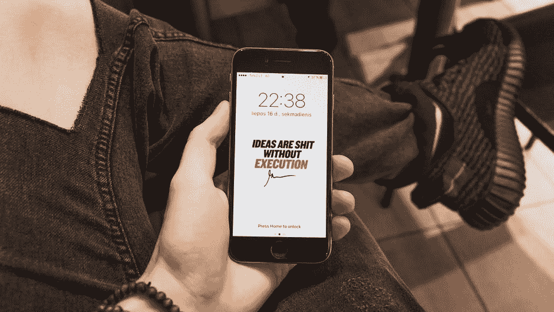
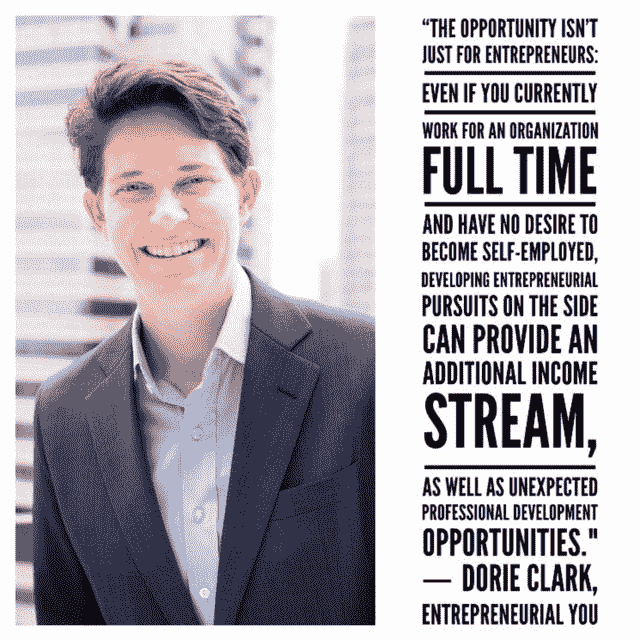
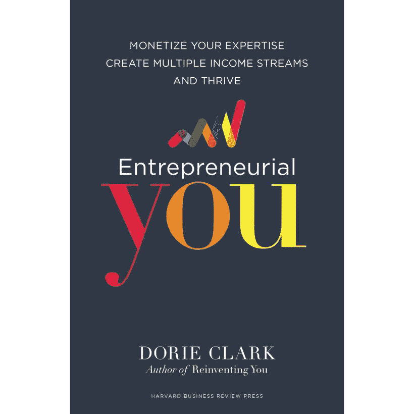

# 如何从你的兼职中获利

> 原文：<https://medium.com/swlh/how-to-make-a-profit-off-your-side-hustle-833d26613053>

这是不可避免的:根据 Intuit 最近的一项研究，到 2020 年，零工经济将增长到美国劳动力的 43%。

无论你是对成为自己老板的自由感到兴奋，还是对经济形势的变化感到恐惧，弄清楚如何将你的才能和激情货币化都是令人畏惧的。

幸运的是，多莉·克拉克(Dorie Clark)已经撰写并亲自测试了她的新书，以此作为指南，并提醒我们，多样化可以同时让你赚更多的钱并降低风险，无论你是全职职业还是全职企业家。

在刚刚发布的[创业的你:将你的专业知识货币化，创造多种收入流，茁壮成长](https://www.amazon.com/gp/product/1633692272/ref=as_li_tl?ie=UTF8&camp=1789&creative=9325&creativeASIN=1633692272&linkCode=as2&tag=strategicstep-20&linkId=7cd0a85ae8bb9c39ab345499d65598b7) ( *哈佛商业评论出版社*)中，Dorie Clark 概述了如何收获创业的强大承诺，并揭示了帮助你塑造自己职业命运的蓝图。

Dorie 是一名营销战略顾问和专业演讲者，以其清晰、精确和可操作的见解而闻名。

她被美联社、 *Fortune* 和 *Inc.* 杂志评为“品牌专家”，她还是《重塑你和《脱颖而出*》的作者，《T13》被 *Inc.* 杂志评为 2015 年 [#1 领导力书籍，并被*福布斯评为年度十大商业书籍之一。*](http://www.inc.com/geoffrey-james/top-10-leadership-books-of-2015.html)*

我们都知道很多人聪明、有才华、擅长自己的工作，然而他们却在努力建立他们应得的事业或职业。

我们也知道一些伟大的专业人士，他们已经建立了一个强大的企业，但是时间太紧，他们不能享受它。

> 他们需要的是培养新的收入来源，让他们能够利用自己的工作，而不是让自己精疲力竭。

**多利的新书，** [***创业的你***](https://www.amazon.com/gp/product/1633692272/ref=as_li_tl?ie=UTF8&camp=1789&creative=9325&creativeASIN=1633692272&linkCode=as2&tag=strategicstep-20&linkId=7cd0a85ae8bb9c39ab345499d65598b7) **，讲的就是如何做到这一点。**

多莉分享了如何建立一个繁荣的企业和创造多种收入来源的详细细节——这不仅对企业家有价值，而且对希望在生活中创造更多安全和机会的普通专业人士也有价值。

*企业家的你*是一本全面、清晰、简明的指南，书中有可操作的“试试看”部分、案例研究和鼓舞人心的成功故事(*，书中还提供了一些现实*，帮助读者执行这些策略。

克拉克解释说:

> **“机会不仅仅是给创业者的:即使你目前全职为一家机构工作，并且不想成为个体经营者，发展创业追求也能提供额外的收入来源，以及意想不到的职业发展机会。**
> 
> 不管我们是为自己工作还是为他人工作，我们都需要找到使收入来源多样化的方法。这使我们能够找到对冲不确定性的方法，增加我们的影响，并赚取更多。”

我很高兴听到 Dorie Clark 在 Jenny Blake 的 Pivot 播客上分享更多关于她写*创业的你*的经历……尤其是当我听说 Dorie 自己能够通过应用书中的策略而获得近 20 万美元的额外收入(*在一年内*)。

[珍妮·布莱克](https://medium.com/u/f074592a0fb0?source=post_page-----833d26613053--------------------------------)说这本书“让她的战术心歌唱”，我完全同意。

多莉解释说，她把从与 50 多位顶级企业家的访谈中学到的技巧用于自己的企业，并将其作为本书行动项目的实验室。她为自己证明了这些技巧确实有效，并创建了一本真正分解了创业路线图的指南。

克拉克在书中为她的读者提供了一流的资源，包括详细的计划、透明的推介过程，以及她用来实施这些策略的实际脚本的下载。

创业的你为各种各样的专业人士提供了一系列可靠的战略建议——从那些已经走上职业道路的人，到那些刚刚开始写博客的人，再到那些电子邮件列表上有数千人准备今晚赚钱的人。

Dorie 通过鼓励微观目标和过程中的一致性来教导可持续发展的成功，提醒读者这是一个长期的游戏，并且:

> “坚持足够长的时间来突破会有不成比例的回报……对于那些愿意调整和改变的人来说，机会是无限的。”

这本书以*重塑你*和*脱颖而出*完成了三部曲，是我未来几年在职业生涯和创业生活的每个阶段都会参考的战略指南和资源。

要自己开始，你可以下载 Dorie 的[免费 88 题创业的你自我评估](http://dorieclark.com/entrepreneur)。

无论你是一个有抱负的企业家，一个成功的副业骗子，还是一个专注于职业生涯的老板，我强烈建议拿起一本[创业的你](https://www.amazon.com/gp/product/1633692272/ref=as_li_tl?ie=UTF8&camp=1789&creative=9325&creativeASIN=1633692272&linkCode=as2&tag=strategicstep-20&linkId=7cd0a85ae8bb9c39ab345499d65598b7)，放在你的办公桌上触手可及的地方！

**披露:这篇帖子包含附属链接，意思是，在不增加你额外费用的情况下，如果你点击并购买，我会赚取一小笔佣金。*

我从哈佛商业评论出版社收到了这本书。我所表达的观点是我自己的观点；我喜欢阅读，不会浪费时间去消费或推荐我认为不太好的东西。我只认可我认为对我个人有帮助，并且相信对我的战略团体有建设性的书。

你准备好最终将你的旅行梦想变成现实了吗？ [*今天就注册我的简讯*](http://eepurl.com/dylLZf) *，我会发给你开始环游世界、过上你一直梦想的生活所需的前三步！*

如果你喜欢这篇文章，请吧👏并分享给你的朋友。记住，你最多可以鼓掌 50 次——这对我真的很重要。

*我很乐意在*[*insta gram*](https://www.instagram.com/strategicstephtravels/)*，* [*脸书*](https://www.facebook.com/StrategicStephTravels) *，*[*Twitter*](https://twitter.com/StrategicSteph)*，或者*[*LinkedIn*](https://www.linkedin.com/in/stephanielhuston)*上与你联系！❤*

## 这篇文章发表在 [The Startup](https://medium.com/swlh) 上，这是 Medium 最大的创业刊物，有 301，336+人关注。

## 在这里订阅接收[我们的头条新闻](http://growthsupply.com/the-startup-newsletter/)。

