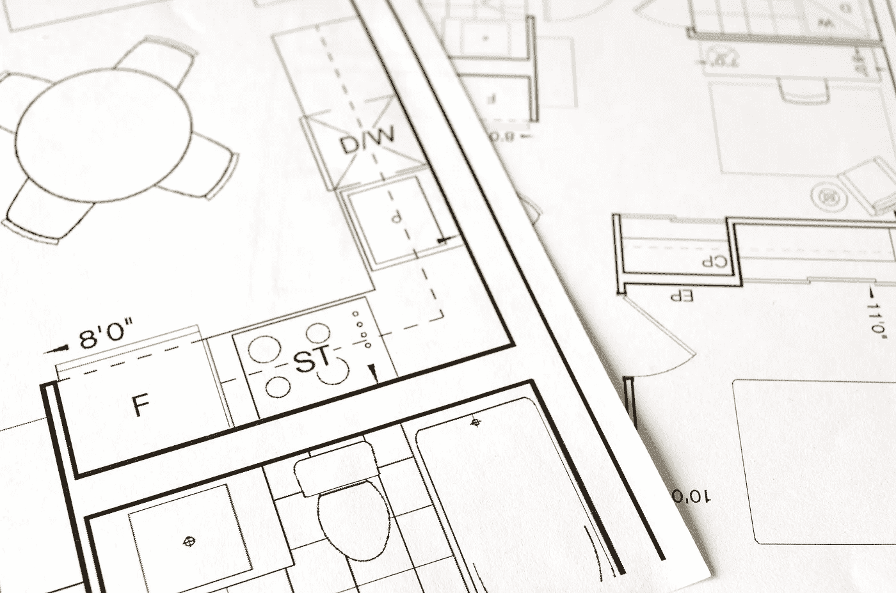

# 如何通过设计您的环境做出更好的决策

> 原文：<https://medium.com/swlh/how-to-make-better-decisions-by-designing-your-environment-4d1e504b7e1f>

想要更多的生产力技巧吗？这里有一份特别的礼物送给你——[*免费访问我的新两周一次的受邀才能参加的生产力黑客活动！*](http://oneproductivity.com/?ref=medium_make_better_decisions)

行为改变不是由动机和意志力控制的。

战胜内心的自我去跑步的次数是有限的。很快，例行公事变得无聊，你跳过一些运行，并且…