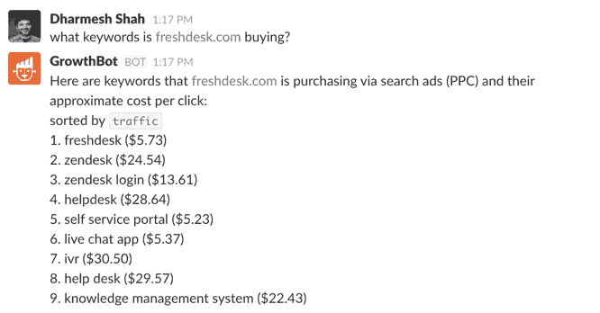

# 如何让竞争情报成为你的竞争优势

> 原文：<https://medium.com/swlh/how-to-make-competitive-intelligence-your-competitive-advantage-95685763bb50>

我凝视着周围的雪海。一望无际的白色。一片空白、空旷的风景。

一开始是令人兴奋的。没有人在前面，没有人尾随或超过我。无牵无挂，我完全是一个人。

然后我意识到我迷路了。我往哪个方向走了？我在兜圈子吗？我是在一条路上吗？

这是我第一次在日本滑雪，我拐错了弯。而现在，我周围美丽的风景中没有任何人或事能给我方向感。

多年后，当我在创业行业的朋友抱怨他们的竞争对手时，我脑海中浮现的就是这段经历。

他们渴望一个空白的广阔市场，没有竞争者在他们旁边(或前面或后面)奋力向前。这是一个企业家的白日梦:没有人阻止你加速前进，眼睛紧紧盯着奖品。

当然，没有竞争对手的市场是罕见的:如果一个产品值得制造，它周围的市场不会空很久。如果是的话，这个产品可能就不值得生产了。

即便如此，吸引力依然存在。这就是为什么我们经常被告知要完全忽略我们的竞争对手。

将他们拒之门外，专注于你的产品和用户:其他一切都会水到渠成。

毫无疑问，沉迷于“竞争”是一个坏主意。当公司被卷入[的竞争](https://www.fastcompany.com/3048493/the-top-10-business-rivalries-in-history)时，他们经常错过更重要的事情(当可口可乐和百事可乐在争夺时，他们没有利用能量饮料的到来赚钱——红牛现在是世界上最受欢迎的软饮料)。

但我们必须在狭隘的关注点和竞争对手的困扰之间做出选择吗？

我不这么认为。如果我们能调整我们的镜头，我们周围的风景将开始变得不同。狭隘的焦点可以变成一个外围视觉，它既包容又充满信息。

单个公司——尤其是初创公司——在所依赖的信息方面自然会受到限制。在同一领域(或相邻领域)经营的许多公司的综合知识不可避免地要广泛得多。

因此，我们可以开始将竞争对手视为宝贵的资源，而不是讨厌的对手。

**以下是方法。**

# 繁忙市场的额外好处

许多创业公司进入了一个已经拥挤的市场。这通常被认为是令人畏惧的，甚至是非常消极的。

不是的。

事实上，进入一个没有背景的未知领域要困难得多。

竞争对手带来的支持一开始可能并不明显，但却是实实在在的。

仅仅通过他们的存在，竞争对手已经在帮助你开拓你的类别，制造噪音，教育你的用户。他们使你的想法合法化，并证明这个想法是有市场的。

正如 Buffer 首席执行官乔尔·加斯科因(Joel Gascoigne)所说:

> 创业公司的真正问题是大多数人不了解他们。
> 
> 竞争有助于照亮市场，这通常比你独自一人更有用。

有警示性的[故事](https://hbr.org/1999/07/why-good-companies-go-bad)，企业成为“主动惰性的受害者”——懒惰于他们最初强大的无竞争对手的成功——并最终失败。还有其他一些企业，在新竞争者的刺激下，摒弃了自满的习惯。

那是因为强竞争才是终极加速器。每个人向前迈出的一步都是每个人向前迈出的一步。

如果没有阿迪达斯对耐克运动鞋的抢购，耐克还会是运动服装之王吗？如果没有比尔·盖茨，史蒂夫·乔布斯会留下什么？如果没有甲骨文的推动，Salesforce 的繁荣还会如此响亮吗？

竞争会加强而不是削弱一个市场。公司努力争取领先地位，并通过相互提供服务来赢得客户，从而创造了大量的价值。

另外，饱和的市场是最有利可图的。如果你的企业能在创业密集的丛林中茁壮成长，它就能(几乎)在任何情况下生存下来。

# 间接视力

竞争市场的好处不会自动获得。你需要的是对你所在行业的全面了解——它的巅峰和低谷，新玩家和老玩家，创新和灾难。

这将让你保持敏捷，尤其是如果你像我一样，处在一个不断变化和飞速发展的市场中。

有了大视野的周边视野，你可以快速转向，反应更快。

当你采用这种心态时，竞争格局就会变成一座信息金矿，引导你前进。

但是我们如何利用这种竞争情报呢？

它可以归结为三个基本步骤:

1.  **从一堆不同的网站收集数据**
2.  **分析数据**
3.  **解读结果**

当然，我们一直在做这种事情。问题是，这往往是一个乏味、耗时的过程，交织着无尽的分散注意力的机会——特别是当一半的相关信息将被互联网的噪音淹没。

事实上，我们可以用很多更好的方式度过工作日。

人类不擅长处理大型数据集。[机器是](https://blog.growthbot.org/the-samantha-effect-a-closer-look-into-the-future-of-bots)。

进入机器人——聪明的自动化系统。通过链接到多个 API(应用程序编程接口)并与之通信，像我们新的数字助理 [GrowthBot](https://growthbot.org) 这样的机器可以帮助我们绘制我们正在运营的景观。

但是自动化的潜力不止于此。作为人类，我们的能力是有限的，而且经常是有偏见的。尽管站在行业趋势和变革的最前沿很重要，但我们自己永远也不可能完全了解这一点。

这是因为我们依赖于我们接触到的有限的信息，而不是我们领域的完整知识(这是不可能的)。此外，当我们达到信息处理的极限时，我们无法插入新的服务器。

然而，一台智能机器将能够学习关于一个行业及其参与者的一切知识。

然后，它可以总结并向我们展示核心内容，让我们尽可能成为无所不知、无所不知的专家。

# 减少反复试验

事情是这样的:所有的企业都在为别人试水。

这取决于那些跟随他们脚步的人来利用这一点。

通过密切关注，尾随公司可以巧妙地从他人的成功和失败中获益。

这并不像听起来那么邪恶。基本都是常识，还是‘后发[优势](https://insight.kellogg.northwestern.edu/article/the_second_mover_advantage)’。

> 虽然先行者在创造产品类别时付出了高昂的代价，但后进入者可以从先行者的经验中学习，享受更低的成本并因此犯更少的错误。

想象一下，如果谷歌没有注意到雅虎用户界面中的错误，或者优步没有利用公众对 Lyft 的热情，情况会怎样？

事实上，世界上许多最成功的企业都不是建立在原创基础上的。相反，它们是由仅仅看到现有概念中的差距的企业家发起的。或许这个差距是更好的品牌、更智能的客户服务或更高的 UX。

一个例子是苹果公司重新定义和主导手机市场的方式——这是摩托罗拉开创的一个类别。

关键是，这种成功是建立在对一个想法的迅速、敏捷的追随——然后改进——之上的；而不是第一个执行的人。

同样，你可以在几秒钟内(免费)得出一个结论，这可能需要另一家企业花费数百小时和数千美元才能实现。

当你开始寻找时，到处都有捷径。在他人经验的基础上减少试错的机会。

也许类似的策略会对你有用，也许不会。不管怎样，你知道的越多，你未来的决定就越明智。

简而言之:当见解是二手的时，它们不一定就没那么有用。

# 集体(竞争)智慧

行业内的集体智慧是我们所有人都可以贡献和受益的东西，通过汇集资源和建立在已经取得的成就上。

把一个潜在的战场变成一个网络，就像开源软件的情况一样。

沿着这条路的某个地方，你的竞争对手甚至可能成为你的合作者:进入'[合作竞争](https://www.forbes.com/sites/unicefusa/2018/02/27/every-child-deserves-to-survive/#30c40dc36ad9)'(合作竞争)。

大玩家已经设定了趋势:现货。IM 已经开始使用脸书的 API，尽管事实上他们的目标是让用户参与到*不是*脸书的网站上。苹果和微软在移动操作系统功能和专利的授权上联手。谷歌资助了 Mozilla 的 Firefox。主要竞争对手亚马逊和苹果联手通过 iPad 的 Kindle 应用程序分销亚马逊的电子书。

所有这些公司都有相同的目标市场，但他们发现联合力量——而不是不断试图超越对方——是一个强大的工具。

这种心态也可以在小范围内付诸实践。

只要我们渴望成长、改进和适应，质疑除了我们自己以外的商业策略总是有价值的。也许答案会让我们大吃一惊，也许会激发改变。

像我们这样的企业，是的；也包括我们觉得有趣的不相关的业务。

所以，不，这不是对我们的竞争对手不健康的迷恋。但这也不是要把我们周围的人拒之门外，去创造一个空无一物的海市蜃楼。

这是关于好奇心，思想开放，愿意向他人学习。而在今天的 AI 的帮助下，竞争情报可以成为竞争优势。

*最初发表于*[*【blog.growthbot.org】*](https://blog.growthbot.org/how-to-make-competitive-intelligence-your-competitive-advantage)*。*

感谢阅读。

> 如果你喜欢这篇文章，请随意点击那个按钮👏帮助其他人找到它。

.