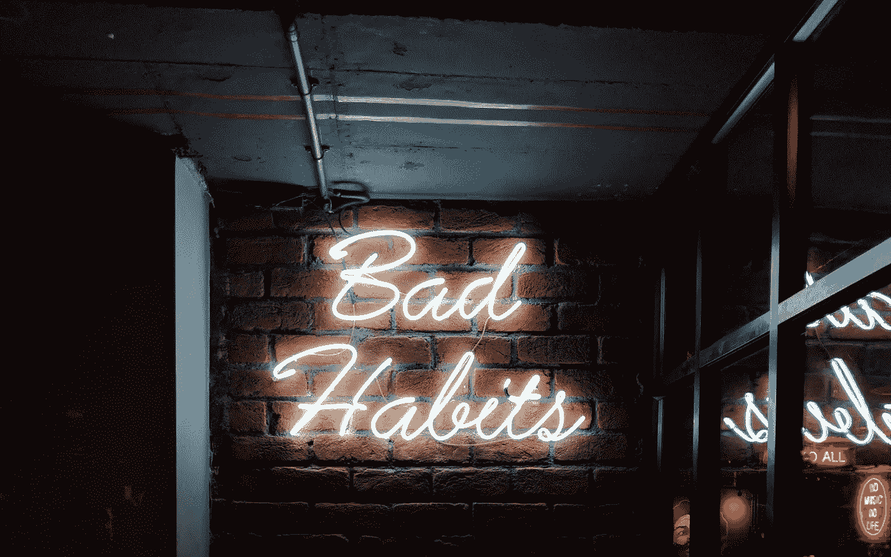

# 如何让好奇心成为创新的重点

> 原文：<https://medium.com/swlh/how-to-make-curiosity-a-priority-for-innovation-b8af6d9a934a>

Curiosity may kill the cat (sometimes) but it won’t kill your business. Photo by Dmitriy Karfagenskiy on Unsplash.

好奇害死猫。

你知道吗[的完整短语是](https://newspaperarchive.com/titusville-herald-dec-23-1912-p-6/)“好奇心杀死了猫，但满足感让它复活了？”改变了一些事情，不是吗？

如果你追溯得更远，事情会变得有趣——尤其是在商业环境中。

> “……手忙脚乱， ***挂忧，小心害死猫*** ，屁股朝天，刽子手身上长痘。”—本杰明·琼森，1598 年， [*每个人都有自己的幽默*](https://www.phrases.org.uk/meanings/curiosity-killed-the-cat.html)

琼森的戏剧最初是由威廉·莎士比亚表演的，他在*中使用了“忧虑害死猫”。用今天的话来说，忧虑害死猫就像说忧虑害死猫一样。*

*忧虑害死猫。忧虑毁了你的生意。*

*没有什么比恐惧、担忧和焦虑更能摧毁你的灵魂，扼杀创造力，阻碍创新。*

**

*The best thing about asking questions? It thinks outside the box for you. Photo by Nikita Kachanovsky on Unsplash.*

# *好奇心是我们创新的方式*

*好奇心又回来了。这不是一条容易的路。*

*如果质疑一切让你不舒服，这可能与西方文化有关。自公元 397 年圣奥古斯丁宣称上帝为好奇者创造了地狱以来，提问就一直受到谴责。*

*阻力来得容易。*

*你为什么要问问题？伴随问题而来的是风险。然而，客观地说，你知道提问也可能带来巨大的回报。*

*亚历山大·格雷厄姆·贝尔。阿尔伯特·爱因斯坦。史蒂夫·乔布斯。这些人知道如何问尖锐的问题。他们知道如何失败。以及如何带着更多问题重新开始。*

*新研究显示好奇心对一个组织的表现至关重要。我们需要为此进行研究吗？*

*然后，我开始反思我在与大大小小的企业合作时遇到的一些阻力。众所周知，我会问一些几乎对我有害的问题，因为我知道答案会带来最重大的突破。*

*如果你不去问困难的问题，那么你就不会得到困难的答案。正是在这些艰难的答案中，我们找到了新的突破口。这就是你构建长期、可持续解决方案的方式，让你在竞争中脱颖而出。*

*你需要对你自己、你的员工和你的顾客保持好奇，因为好奇会杀死猫，但绝对不会杀死你的生意。*

**

*Comfortable with the status quo? That’s a bad habit you can do without. Photo by Manan Chhabra on Unsplash.*

# *你永远不会因为太忙而没有好奇心*

*70%的人说他们在工作中遇到了问更多问题的障碍。*

*你是否对员工提问设置了障碍？*

*如果你独自工作，你会花时间质疑你的假设吗？*

*很吓人吧？放手。承认你可能不知道最好的方法。正确的方法。*

*如果你开始质疑事情，你可能会意识到你有更多的工作要做。或者事情进展不顺利。*

*也许这些问题的答案会导致让你害怕的行为。*

*很好。那叫成长。*

*作为一个企业主，好奇心是你工作的一个重要部分。*

*那你是做什么的？在你的日历上划出个人发展的时间——阅读、研究、评估。不要担心你将如何*做这件事*，要好奇什么在起作用。什么不是？*

*[作为领导，好奇心从你开始](https://fostergrowth.tech/6-ways-leader-listening/)。你想创建一个好奇的组织吗？学习环境？建模吧。*

*想想你能为好奇的[模特](https://hbr.org/2018/09/curiosity)做些什么。*

*你能做些什么来找到那些会问问题并让你创造或帮助你创造学习环境的人？因为创新来源于好奇心。改变不是来自无所事事地一遍又一遍地做同样的事情。*

*你必须有足够的好奇心去创新。*

# *对你的顾客保持好奇*

*你必须有足够的好奇心去服务你的公众。好奇心能让你与所有竞争对手并驾齐驱——如果不是领先一步的话。*

*首先要向过去、现在和潜在的客户征求反馈。收入来自客户。是什么让他们夜不能寐？你满足他们的需求了吗？怎么才能提高？*

*是的，这些问题可能很吓人。尤其是当你担心自己在关键领域有所欠缺的时候。同时，也许你擅长一些意想不到的事情。如果你不问，你的计划可能会偏离目标。*

*问问题可能会帮你省钱。或者给你赚钱。*

*尽管你害怕问问题，但你需要足够的好奇心来评估如何改进。这是关键。*

*问一些可衡量的问题。答案将引导你采取战术行动。*

*因为质疑一切的关键在于接下来会发生什么——决定你将采取什么行动。*

****更喜欢听？查看*** [***本播客第一集***](https://radiopublic.com/third-paddle-podcast-helping-busi-WDRqeN/ep/s1!72b3d) ***关于好奇心和不完美的行动。****

## *[**准备好更多了吗？订阅获取最新的文章和想法。**](https://fostergrowth.tech/medium-opt-in/)*

**Jen McFarland 是一名* [*企业主*](https://fostergrowth.tech/) *、商业顾问、* [*播客、*](https://fostergrowth.tech/podcast) *、* [*博主、*](https://fostergrowth.tech/blog) *，以及项目周转艺术家。她已经帮助数百家企业和数千名播客听众做出了更好的商业决策。Jen 的热情在于帮助女性企业主克服领导力和技术方面的困难。**

**

## *这篇文章发表在 [The Startup](https://medium.com/swlh) 上，这是 Medium 最大的创业刊物，拥有+ 374，357 名读者。*

## *在这里订阅接收[我们的头条新闻](http://growthsupply.com/the-startup-newsletter/)。*

**