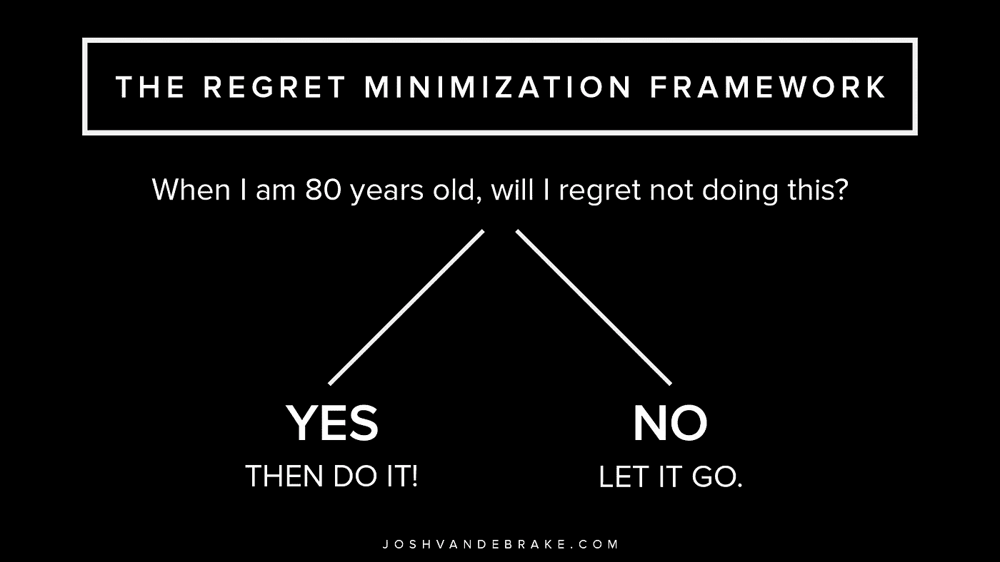

# 如何像杰夫·贝索斯一样做决定

> 原文：<https://medium.com/swlh/how-to-make-decisions-like-jeff-bezos-e6e621edb6df>

## 用这个思维框架简化你最困难的决定

[Photo](https://joshvandebrake.com/)

大多数人都知道杰夫·贝索斯如何创建 Amazon.com，将其打造成为一个网络帝国，并获得了“世界首富”的称号但是为了开始这个网上的冒险，他不得不冒巨大的风险，放弃一生难得的机会。

你知道，杰夫·贝索斯已经是很多人认为非常成功的人了。30 岁时，他成为华尔街投资银行公司 [D.E. Shaw & Co.](https://www.deshaw.com/) 有史以来最年轻的高级副总裁。据估计，他的薪水已经达到了六位数，而且注定会在公司中继续上升。

但他有很快厌倦的倾向，同时对互联网零售业务有一种秘密的热情，而互联网零售业务仍处于早期阶段。他梦想在万维网的这个新领域建立自己的公司，根据他的研究，万维网的活跃使用率估计每月增长 2300%。

这是他的机会。但他不得不做出最终决定:冒险创办一家初创公司，还是继续他在华尔街充满希望、已然成功的职业生涯？

为了做出这个决定，他采用了后来被创造出来的**后悔最小化框架** *，*一个用于决策的心智框架。

正如他所说:

> “我知道当我 80 岁的时候，我不会后悔尝试过这个。我不会后悔尝试参与这个被称为互联网的东西，我认为这将是一件非常重要的事情。我知道如果我失败了，我不会后悔，但我知道我可能会后悔的一件事是从未尝试过。”—杰夫·贝索斯

# 虽然有一些细微的变化，但基本概念是这样的:

1.  想象一下 80 岁的自己，回顾自己的一生。
2.  并且**问**自己，“*我会后悔没这么做吗？*
3.  如果答案是**是**，那就去做。简单明了。
4.  如果答案是**否**，那就随它去吧。不要再为此烦恼了。

杰夫·贝索斯采用了这个框架，这使他决定离开自己的生活，搬到西雅图，并开始他的新的商业冒险。这个决定让他走上了后来成为世界首富的道路。

我们都有想法。想法我们太忙，太累，或者太害怕去生活。不要梦想最好或最坏的可能结果，试着把自己放在后悔最小化的框架内:

> 想象一下你 80 岁的时候，回顾自己的一生，问自己:“我会后悔没有追逐自己的梦想吗？”

# 那就出去做吧。

## 这篇文章发表在 [The Startup](https://medium.com/swlh) 上，这是 Medium 最大的创业刊物，拥有+399，714 名读者。

## 订阅接收[我们的头条](http://growthsupply.com/the-startup-newsletter/)。

