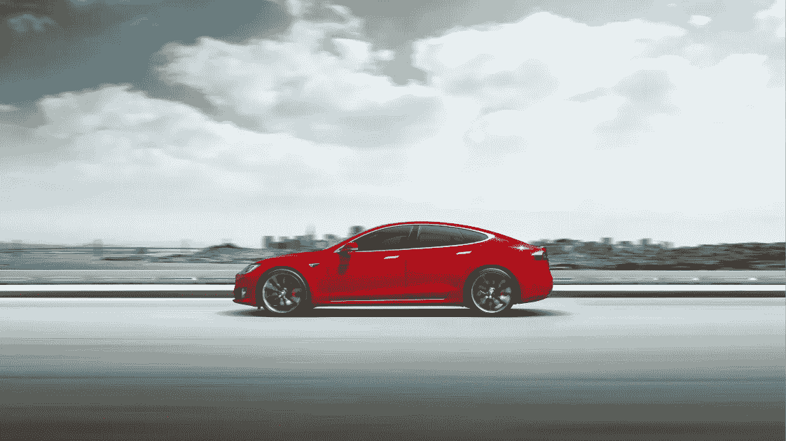
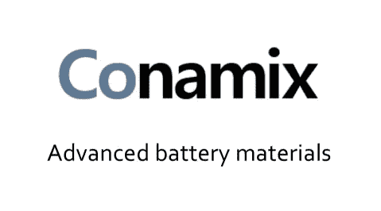
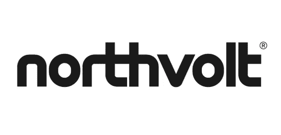

# 不去刚果怎么做电动车电池

> 原文：<https://medium.com/swlh/how-to-make-electric-vehicle-batteries-without-going-to-congo-4f665222aa52>

## 两个电池创业公司的故事

Tesla Model S (Image Source: MIT Technology Review)

钴。

这是一种有光泽的银蓝色金属，仅仅几年前，我们大多数人对它都不屑一顾。快进到今天，这种金属不仅抓住了世界各地大型电池制造商和汽车公司的想象力，还为创新创业公司带来了大量机会。

是的，钴现在是首要的电池原料。

## 一种炙手可热却又麻烦不断的商品

钴的故事在电池宇宙中的优势是如此有趣，几乎不可能忽视。在即将到来的电动汽车(EV)革命的风口浪尖上，电池中的钴需求预计将在未来五年翻一番。

Batteries come to dominate cobalt (Source: [Macquarie Research](http://www.fullertreacymoney.com/system/data/files/PDFs/2017/October/10th/MacquarieCommoditiesComment091017xe283966.pdf))

然而，对钴的真正疑虑是在供应方面。

[全球超过一半的钴储量位于世界上最贫穷的国家之一——刚果民主共和国。在适当的情况下，这种自然财富的存在可以让一个国家的公民摆脱贫困。不幸的是，这种情况在刚果从未存在过。自 19 世纪晚期以来，这个国家一直被外国和当地精英不断地](http://www.rcsglobal.com/wp-content/uploads/rcs/pdfs/RCS-Global-The-Emerging-Cobalt-Challenge.pdf)[开采资源。](https://blog.usejournal.com/the-cobalt-catastrophe-5cb5cf991f37)

如今，绝大多数刚果钴流入了中国的电池和电动汽车制造商手中，给这两个国家带来了截然不同的结果。刚果仍然经济贫困，社会脆弱，而中国占据电动汽车的驾驶座。

此外，全球 94%的钴产量依赖于铜、镍和铂的开采，这意味着钴仅仅扮演着次要或副产品的角色。问题是，如果初级金属提取业务受到影响，依赖从刚果这样地缘政治不稳定的地区开采的副产品可能会引发供应链灾难。

鉴于这些供应方面的风险，绕过刚果-中国钴链，或者更好的是，从电池中提取钴，有望成为电动汽车制造商的潜在游戏规则改变者。

两家背景迥异的初创公司在这些努力中处于领先地位。

## 一个即将出现的美国新手

2013 年，时任康乃尔大学化学工程副教授的托拜厄斯·汉拉斯和他的研究生本·理查德创造了一项不同寻常的记录:在实验室制造了最大数量的硅纳米线(直径为十亿分之一米的硅结构)。

由于硅比传统的碳阳极具有更高的比容量，因此长期以来一直受到为手机等小型产品提供锂离子电池的制造商的关注。然而，生产更多的硅来驱动电动汽车是一个非常棘手的问题。

汉拉特[解释道](https://research.cornell.edu/news-features/nexus-ny-and-labs-entrepreneurial-story):

> (电子产品制造商)正在制造放在计算机芯片上的薄膜，但如果你想制造一辆带有硅阳极的电动汽车，你需要大约 10 公斤的硅。由电子学建立起来的制造方法根本不适用于千克数量。

意识到他们实际上已经发明了可以彻底改变电动汽车电池制造的东西，两人将他们的发明变成了一家名为 **Conamix** 的初创公司。对商业新手来说，这是勇敢的第一步，但勇敢不足以取得商业上的成功。Conamix 需要的是金钱和指导形式的支持。

## **走向商业化的旅程**

对汉拉斯和理查兹来说幸运的是，一个名为 NEXUS-NY 的清洁能源种子加速器项目当时正处于第一年。他们申请了。

在 56 名申请者中，该集团成为获得 5 万美元无股权财务支持的 12 家公司之一。Conamix 还与查尔斯·汉密尔顿(Charles Hamilton)搭档，后者是一位经验丰富的技术转让专家，他在清洁能源初创公司的背景被证明是一个理想的搭档。

在一起工作时，Conamix 团队的第一个主要障碍是通过 Hanrath [称之为](https://nexus-ny.org/wp-content/uploads/2014/10/NewEnergy_Final_pages.pdf)的恶臭测试:与潜在客户交谈并找出他们未满足的需求。该团队做了一些早期的原型制作，并向一群风险资本家和投资者展示了他们的产品优势。

反应是积极的:

> 我们被选中进入第二阶段。这是你做概念验证工作的时候，测试你的产品，看看它是否真的能做你创建原型时理论上它能做的事情。

Conamix 最终关闭了两个 50，000 美元的基金，分别与 High Tech Rochester 和 Excell Partners。

## 从硅阳极到无钴阴极

随着硅阳极被攻克，Hanrath 和他的团队将注意力转向解决一个更加雄心勃勃的挑战:如何重新利用 Conamix 技术来大规模制造无钴阴极材料。

汉密尔顿[告诉](https://www.bloomberg.com/news/articles/2018-06-20/battery-startup-gets-funding-to-develop-cobalt-free-materials)彭博:

> 世界需要更低成本的材料投入到现有的制造基础设施中，以满足日益增长的汽车需求。

继续他们的筹款狂欢，该公司最近[在首轮融资中筹集了](https://www.technologyreview.com/the-download/611518/a-freshly-funded-battery-startup-aims-to-ease-the-cobalt-crunch/)200 万美元(更大的 800 万美元承诺的一部分)，其主要投资者是 Volta Energy Technologies，一家总部位于伊利诺伊州的基金，旨在支持减少对钴依赖的能源解决方案。

突然间，Conamix 现在发现自己与电池材料的顶级公司共享舞台，因为 Volta 本身得到了美国公用事业巨头 Exelon、和Albemarle 的支持，后者是世界上最大的锂生产商之一。

这个新手已经登上了世界舞台。

## 瑞典引领着欧洲的反击

在几千英里之外的欧洲，两项重大发展使其电池制造业与中国在电池供应链上的主导地位发生了冲突。

其中一个包括创立一个名为欧洲电池联盟的倡议，以支持有竞争力的制造价值链，并减少对竞争对手的技术依赖。另一个是由联盟支持的瑞典电池创业公司 Northvolt 的发布。

## 一家雄心勃勃、经营有方的初创公司

Northvolt 植根于瑞典对清洁空气的偏好。去年，该国的立法者将这种倾向具体化为一个名为《气候法案》的政策框架，承诺到 2045 年实现温室气体净零排放。然而，从零开始建立一家电池制造创业公司需要的不仅仅是对所有绿色事物的热爱。这需要远见、经验和动力。

对瑞典人来说幸运的是，彼得·卡尔松是一个具有这种品质的人。

作为前特斯拉全球供应链经理，Carlsson 计划在瑞典 Skellefteå建立欧洲最大的锂离子电池公司 Northvolt。该公司预计将于 2020 年投入运营，目标产能为每年 8 千兆瓦时，目标是在 2023 年完全建成并运行后达到 32 千兆瓦时。

他会怎么做？

在欧洲决策者以及一些北欧和加拿大供应商的帮助下。为了打破亚洲的影响力，欧盟政治家们正在推动电池的本地开发。毫不奇怪，Northvolt 的大部分资金——一笔高达 5250 万欧元的贷款——来自瑞典能源署和欧洲投资银行。

## 来自芬兰的钴

连线[报道【Northvolt 将从*“芬兰的大型精炼厂”获得钴*](https://www.wired.com/story/ev-green-battery-factory-in-the-netherlands-competes-with-the-gigafactory/)

从彭博新能源金融公司等一系列消息来源推断，这家炼油厂似乎是自由港钴公司，它在芬兰西部的科科拉有一家大型炼油厂。

芬兰还拥有一些欧洲[最大的钴储量](https://www.investinfinland.fi/-/finland-is-a-battery-powerhouse-for-electric-vehicles)，2016 年产量约 2500 吨，约为全球产量的 3%。根据芬兰地质调查局的调查，芬兰已知的钴储量超过 445，000 吨。

## 掌控价值链

随着人们沿着价值链的不同阶段向下移动，电池制造的吸引力会降低。Northvolt 瞄准了进入壁垒较高的第二阶段(制造电池活性材料)。首先，Carlsson [告诉《连线》Northvolt 的计划:](https://www.wired.com/story/ev-green-battery-factory-in-the-netherlands-competes-with-the-gigafactory/)

> 我们打算自己制造阳极和阴极化学混合物，而不是从欧洲或亚洲制造商那里购买。

卡尔松在特斯拉的前同事首席运营官·保罗·塞鲁蒂也持同样的观点:

> 通过扩大电池生产规模并控制从原材料提取到成品的整个(价值链)，我们认为我们实现了一个有竞争力的商业模式。

很明显，Cerruti 和 Carlsson 还打算控制价值链的第一阶段(原材料的提取)。他们不会通过将 Northvolt 转变为矿商/炼油商，而是通过结盟来实现这一目标，正如 Northvolt 最近与加拿大矿业公司 Nemaska Lithium 签订的锂供应协议所示。

随着瑞典拥有[过剩的](https://www.wired.com/story/ev-green-battery-factory-in-the-netherlands-competes-with-the-gigafactory/)水力发电来运行一个电池工厂，一个有竞争力的、然而绿色的电池制造操作开始看起来越来越可行。

## **没有简单的出路**

然而，关于 Northvolt 成为欧洲电池领头羊的能力，最大的担忧是一种令人抓狂的情况，即汽车制造商不愿意等待欧洲的行业，而是与该地区的中国公司达成交易。例如，当代 Amperex Technology Co .准备[选择](https://www.bloomberg.com/news/articles/2018-06-06/china-battery-maker-catl-is-said-set-to-choose-germany-for-plant)德国建立一个电池工厂，并正在与梅赛德斯-奔驰就可能的供应交易进行谈判，而中国电动汽车公司比亚迪据说也在[考虑在欧洲生产](https://www.reuters.com/article/us-autos-batteries-europe-insight/europe-up-against-asian-juggernaut-in-electric-car-battery-drive-idUSKCN1J10MF)电池。

不仅仅是中国人——卡尔松的前老板 Elon Musk 已经表达了他想在欧洲开一家大型工厂的愿望。

面对这种情况，Northvolt 最大的王牌将是利用欧洲人的环保意识，销售用水力发电和合乎道德的原材料生产的电池，从而开拓出一个利基市场。

只有时间才能证明 Northvolt 是否会成为一个巨大的成功故事，但就目前而言，卡尔森应该继续努力给决策者带来他们想要的东西:价值链中更大的平衡。

## 你喜欢这个吗？随意点击拍手图标。为了跟上更多这样的故事和更新: [Twitter](https://twitter.com/ab_tausif?lang=en) 和 [Medium](/@tausif000)

## 这篇文章发表在[《创业](https://medium.com/swlh)》上，这是 Medium 最大的创业刊物，有 340，876+人关注。

## 在这里订阅接收[我们的头条新闻](http://growthsupply.com/the-startup-newsletter/)。

