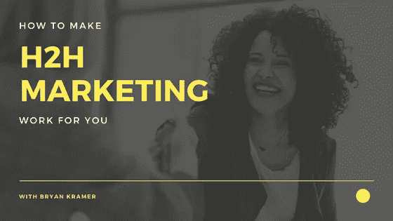

# 如何让 H2H(人对人)营销为你所用——专家布莱恩·克莱默精彩访谈

> 原文：<https://medium.com/swlh/how-to-make-h2h-human-to-human-marketing-work-for-you-magnificent-interview-w-expert-bryan-5a3ef193e0b6>

H2H Marketing

如果你想把你的产品卖给另一家公司，你的营销策略应该是什么？多年来，重点是 B2B 营销或企业对企业营销。目标是迎合业务需求。

根据营销专家布莱恩·克莱默的说法，这种营销方式已经过时了。目前在线营销的趋势被称为 H2H 营销，或人际营销。

克莱默是两次畅销书作家，TED 演讲者，著名的营销策略家。他对最新的营销趋势了如指掌，而且他已经注意到了过去几年中在线市场的变化。

事实证明，从 B2B 到 H2H 的这种转变，对于利用这种转变的企业家和营销人员来说，比传统营销要有效得多。

# 为什么对 B2B 的关注是倒退的

B2B 营销的问题在于，一个基本的事实往往被抛在了一边——他们经营的公司背后是人类。

当然，在内心深处，我们都认识到这一点，但我们的营销努力并不总是符合这一事实。结果是陈旧的，几乎是机器人的内容，对任何人都没有吸引力。

这对那些认识到在线营销对他们的生意有多重要的人来说是非常令人沮丧的。他们明白他们需要这么做，也明白为什么需要这么做(因为大多数人都是基于网上调查做出购买决定的)。但是他们还没有完全掌握如何去做。他们忘记了使他们的内容人性化。

# 如何开始关注人对人(H2H)营销

谢天谢地，人性化营销并不难。当然，这很复杂，需要时间。但是一旦你掌握了窍门，你可能会开始享受这个过程。为什么？因为你也是人，我们都渴望人与人之间的联系！

以下几个步骤将帮助你走向成功的 H2H 营销实践:

# 1.不要试图完美，像一个真正的人一样说话

布莱恩在我们的采访中提出了一个有趣的观点。他说我们写的东西往往比我们实际说话的方式更正式。我们努力做到完美，避免错误，在这个过程中，我们最终听起来更像一个机器人，而不是一个人。

不要担心完美。[就像你在对一个真实的人说话一样写作，你的信息会被广泛接受。](https://blog.kissmetrics.com/relatable-and-actionable-content/)

# 2.加入一些乐趣和幽默

幽默几乎总是受欢迎的。你可以在你的网站、产品描述、社交媒体帖子或博客中添加幽默元素。

布莱恩提到了一个很好的幽默例子——MailChimp 的例子。当他们为使用其服务的客户处理付款或其他信息时，他们不仅仅有“正在加载”或“正在处理”的消息。那些太无聊了！

相反，他们有一条信息，上面写着，“我们正在处理这些数字。我们只能走这么快，但在那之前，看看这个。”这条简单而有趣的信息让等待文件加载或付款变得不那么烦人了。

# 3.与你的团队进行角色扮演

当考虑向世界发布什么类型的营销内容时，考虑客户体验很重要。最好的方法是设身处地为客户着想。尝试与团队中的其他人进行角色扮演，至少有一个人扮演顾客。

注意细节。与产品互动。提问，看得到什么样的回应。

你越能设身处地为顾客着想，就越有可能找到吸引他们的方法。

# 4.首先关注上下文，然后是内容

在网上了解你的客户就像剥洋葱一样——你必须一层一层地去做。根据 Bryan 的说法，最好的方法是首先关注上下文。你不能从“嗨，我是某某”变成“你准备好买我的产品了吗？”在一篇博文中。在现实世界中，这就好比从“你好，我叫某某”到“你愿意嫁给我吗？”在一个晚上。

最好的做法是慢慢透露你的一些事情——你在哪里长大，是什么让你进入这一行，你最讨厌的是什么。了解你的客户很重要，但让他们了解你同样重要。一旦他们知道你是谁，他们就会倾向于听你的信息。

布莱恩的最新畅销书[分享学:分享如何推动人类经济](https://www.amazon.com/Shareology-Sharing-Powering-Human-Economy/dp/1630473847)中更详细地讨论了这种分享的想法。你会学到做这件事的最好方法，你会知道你是什么类型的分享者。了解这一点将有助于你以一种非常个性化的方式分享你的故事，吸引更多的人。人类很聪明——他们能感觉到你是否真实。以这种方式分享会帮助他们更加信任你。

# 以人为本的外展将使您的业务更上一层楼

人与人之间的互动是世界运转的动力。这就是[创造关系](http://www.magnificent.com/magnificent-stuff/building-business-relationships)，伙伴关系，信任和社区。这就是你想要通过你的营销努力来培养的。如果你关注的是企业的营销，而不是企业背后的人，这是不可能的。

当你实施这些改变，把你的营销从 B2B 转向 H2H 时，你会注意到一个转变。你的客户会更加投入，新客户会被你的产品所吸引，你会获得更多的回头客。

改变你的营销习惯需要一点努力——主要是一种精神上的调整，让你的头脑围绕新的[营销策略](http://robertrose.net/)。但最终，你为这一营销转型所付出的时间和努力将是完全值得的。

你知道你是哪种分享者吗？以布莱恩的免费评估为例。30 秒钟后，你将会对 H2H 营销活动的方向有更深入的了解。

# 关于布莱恩·克莱默

布莱恩·克莱默是著名的社会商业战略家、全球主题演讲人、高管教练和畅销书作家。他是世界上分享的艺术和科学的最重要的领导者之一，并因在营销和社交领域发起#H2H 人类商业运动而闻名。

Bryan 拥有超过 350，000 名社交粉丝和追随者，对社交技术和社交行为的复杂性和互通性有着深刻的理解，他既是该领域的实践者，也是该领域的权威。

Magnificent Marketing

## 这篇文章发表在[《创业](https://medium.com/swlh)》上，这是 Medium 最大的创业刊物，有 298，432+人关注。

## 在这里订阅接收[我们的头条新闻](http://growthsupply.com/the-startup-newsletter/)。

