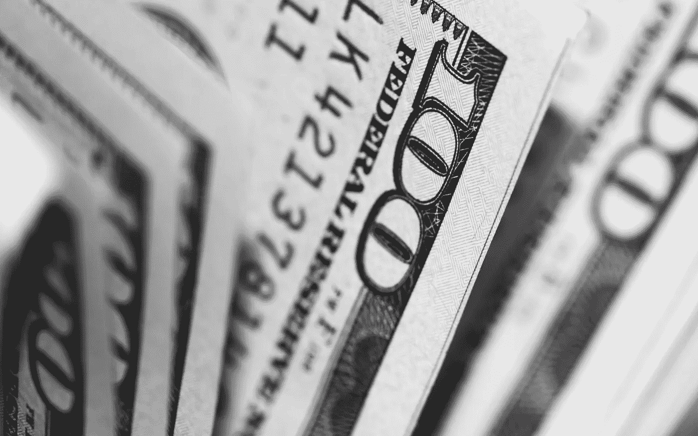
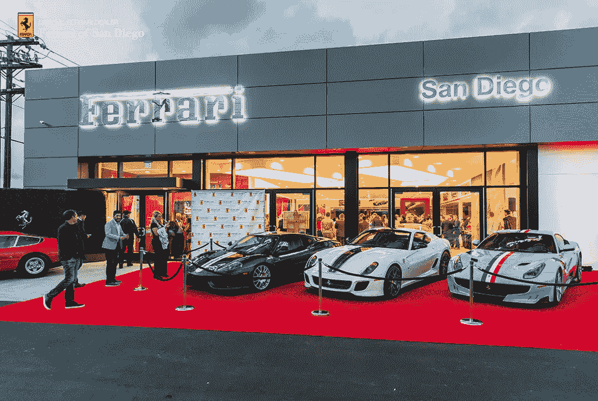
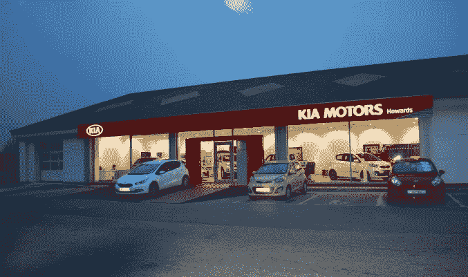

# 如何通过主持第一次研讨会赚超过 1000 美元

> 原文：<https://medium.com/swlh/how-to-make-over-1k-hosting-your-first-workshop-ab0a319c8114>

Photo by [Pepi Stojanovski](https://unsplash.com/photos/MJSFNZ8BAXw?utm_source=unsplash&utm_medium=referral&utm_content=creditCopyText) on [Unsplash](https://unsplash.com/search/photos/money?utm_source=unsplash&utm_medium=referral&utm_content=creditCopyText)

当我第一次创业(写作和咨询)时，我发现要积累真正的财富，你必须学会一件事:

> 时间不是金钱。

时间是穷人用来换钱的东西。一天只有这么多时间，所以他们才穷。

美国人有一个疯狂的想法，我们应该:

高中毕业>背上巨额债务去上大学>找一份可以工作 40 年的好工作>每个月把你微薄收入的 20%存起来>永远不要去国外度假>不要投资任何有风险的事情>如果可以的话就升职>借更多的债务去买房子>为别人拼命工作以获利，因为你有债务>一辈子都这样>如果你想要的不只是这个美国梦，那你就是疯了>退休。

这太疯狂了。

你知道什么更糟吗？

在这个平台上，大多数寻找创业建议的人都是自由职业者、顾问、教练——从事服务行业的人。

很聪明。我们开始我们自己的生意，一个可以扩大规模的生意，一个可以让我们摆脱伪装成美国梦的激烈竞争的生意。

但是，问题是，我们大多数人最终都出卖了自己的时间。所以，同样的狗屎——不同的厕所。

好吧，让我来谈谈我真正的观点。以销售服务为生的人需要一种简单、可扩展的策略来摆脱“销售时间”的竞赛。

研讨会是服务行业赚取额外收入的绝佳方式。很多。

你不必出卖你的时间。

你认为为什么你会看到这么多的咨询顾问集体提供在线课程，直到奶牛回家？

## 我想我应该聪明点，看看到底是怎么回事。

我对在线课程感兴趣。但是，在我投入大量时间/金钱之前，我决定举办我的第一次研讨会。它需要

*   2 小时的准备时间
*   6 小时的教学时间

研讨会是了解你的市场共鸣的一种简单方式。如果你在考虑做一门在线课程，工作坊就是你测试材料的方式。

我赚了超过 1000 美元(我第一次跑的时候没想到会这么多)。

现在，我将向你们展示我是如何做到的。

# 什么是好的车间？

*   人们会带着可行的建议离开
*   为与会者提供切实的价值(参加我的研讨会的价值是一个写作推介、一个写作作品集，以及为 lead gen 发送的第一封电子邮件)
*   教师对他们所教的东西有实际操作经验。我教授一个为自由作家发展写作业务的研讨会——我教这个是因为我自己也做过，从我的写作中赚了超过 6 位数的钱。

# 创建高利润车间的步骤

## 第一步。建立一些信誉

*   在你擅长的领域写作。获取在媒体出版物上发表的文章。在 LinkedIn 上写作，并在你所处的领域内的 LinkedIn 群组中分享你的文章。
*   在大学或活动中发表演讲。这比你想象的要容易得多。联系你附近的学院/大学——具体来说，联系与你的业务相匹配的部门的人(例如，如果你想举办营销研讨会，给营销班做讲座)。
*   **登录 Meetup 应用**，向你所在行业或领域的一些团体提供免费建议。当地图书馆、商会和其他组织也是不错的选择。
*   **试水**。几次谈话后，你会知道在你的目标领域/行业中什么最能引起人们的共鸣。从与会者那里获得反馈，了解哪些有效，哪些无效，以及他们觉得缺少什么。
*   **收集邮件**。当你在不同的地方四处演讲和教学时，问问人们是否想看看你关于这个主题的一些内容。他们会答应的。让他们要么用电子邮件在纸上签名，要么让他们将其转换成电子表格。

*注意:不要因为一个人的建议而在你的研讨会/课堂上增加内容。仅添加多人(至少 3 人)建议的部分。不要拿出有人建议你省略的任何东西，等等。

## 第二步。选择一个超级利基市场

当需要选择一个教授的话题时，我决定要高度专注。

我可以教自由职业者如何创业。但相反，我专注于自由职业中的一个更小的领域——自由作家。

理想情况下，你的定位应该是你的一部分(比如我是一名自由作家)。人们信任“去过那里，做过那件事”的人

你的定位越明确，你的工作室就越相关，因此，你能赚的钱就越多。

## 第三步。让你的工作室价值是你收费的 10 倍

在我的工作室里，我一步一步地带领作家们从创作作品到获得高薪客户。

我要价 300-1500 美元。但是，参加我的研讨会的作家会带着每年会付给他们 2 万多美元的客户离开。我的工作室提供了巨大的价值。确保你的也这样做。

你还需要向潜在的参与者展示这种巨大的价值。

例如，我让作家们知道，当他们将我的策略应用到他们的业务中时，他们将从每个客户那里每年获得 2 万多美元。

所以，300 美元的门票相对于他们长远的收入来说只是小钱。这比他们每篇文章的收费要低。

## 第四步。做一个法拉利，而不是起亚

如果你要卖昂贵的东西，你需要看起来昂贵。

你见过法拉利展厅吗？

[https://www.ferrariofsandiego.com/blogs/291/events/ferrari-of-san-diego-grand-opening-party/](https://www.ferrariofsandiego.com/blogs/291/events/ferrari-of-san-diego-grand-opening-party/)

起亚呢？

[http://dealers.kia.co.uk/howardskia/about-us](http://dealers.kia.co.uk/howardskia/about-us)

现在，我不是说凯是坏车。我有一个。把我从 A 点带到 B 点就像我的宝马一样好。

我并不是说拥有起亚经销店的人不富裕，只是说他们必须卖出大约 40 辆起亚才能与法拉利卖出一辆车的收入持平。

[起亚平均每辆车的净利润约为 19%](https://ycharts.com/companies/KIMTF/gross_profit_margin)。起亚的价格大约是 15000 美元。因此，每辆车的净收益接近 3000 美元。

[法拉利平均每辆车净赚 8 万美元](https://www.cnbc.com/2018/08/17/profit-ferrari-makes-per-car.html)。

如果你想赚大钱，那么你需要提升你的品牌。成为高级教练，每月收费 5000 美元，每周通话 30 分钟。

做一个文章最低收费 500 美元的作家。

你的工作室每张票收费 300 美元，而不是 25 美元。提升你对自己的期望。提升别人对你的看法。

# 结果

将上述方法应用到我的第一个工作室后，我赚了超过 1000 美元。我只需要卖出 4 张票就可以了。

> 以 300 美元卖出 4 张票比以 50 美元卖出 20 张票要容易得多。

最困难的部分将是面对合适的人——为你的法拉利工作室买单的人。但是，你去那里免费说得越多，你就能越快找到你要找的人。

## 这篇文章发表在[的《创业](https://medium.com/swlh)，这是 Medium 最大的创业刊物，拥有+395，714 人关注。

## 在这里订阅接收[我们的头条新闻](http://growthsupply.com/the-startup-newsletter/)。

