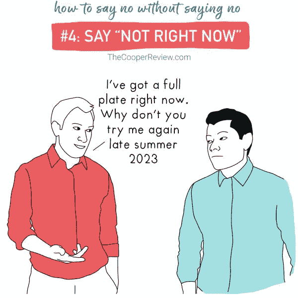

# 如何在工作中与时间和平共处

> 原文：<https://medium.com/swlh/how-to-make-peace-with-time-at-work-bd1ade52f8f>

我桌子上有这段引文

***谓从量力而行开始；然后做可能的事，突然你就在做不可能的事。***

我通常在周一早上读它，以高剂量的辛烷开始一周。当我进入最佳状态时，这种感觉随着一大堆干扰而消退。

我的日历开始呼喊我付出时间的人的名字。面试，同行评审，设计会议，领导会谈。就在我回到座位上喘口气的时候，财务团队给我带来了一些爆炸性新闻。从早上 8 点开始我的一天，下一次我看表时已经是下午 3 点了。而我待办清单上最重要的任务还在努力争取我的注意力。

我多么希望我有更多的时间！或者至少是时间转换器。

但是我的意识让我想起了小杰克逊·布朗的名言-

***不要说你时间不够。你每天拥有与海伦·凯勒、巴斯德、米开朗基罗、特蕾莎修女、达芬奇、托马斯·杰斐逊和阿尔伯特·爱因斯坦完全相同的时间。***

这听起来像是另一句激励性的话，但这是事实。如果你知道保护时间不受干扰的艺术，美好的事情就会发生。假设你也陷入了分心的漩涡，让我分享一些(有时)对我有效的事情

# 1.练习“时间阻塞”

[时间阻断技术](http://calnewport.com/blog/2013/12/21/deep-habits-the-importance-of-planning-every-minute-of-your-work-day/)的概念是 Cal Newport 介绍给我的。虽然它的结果是基于你的诚实。但是所有著名的作家和运动员都使用这种技术来产生令人难以置信的结果。

时间阻塞就像排班一样——只是更加严格。你需要把你的时间分成几个时间段，并在这段时间内给自己分配任务。然后封锁。你不能超过那个特定任务的时间段。

卡尔建议，当你有很长的时间来取得进展时，把小事放在一起，处理困难的事情。早上花 30 分钟或一个小时进行优先排序，然后直接投入到你最重要的工作中。

# 2.相信常规的力量

你知道史蒂夫·乔布斯、巴拉克·奥巴马、本杰明·富兰克林和斯蒂芬·金之间有一个共同点吗——他们遵循固定的日程。每一天。遵循固定的程序不仅能消除干扰，还能减少决策疲劳和限制拖延。例如，如果你采纳了卡尔·纽波特的建议，进行时间封锁，并把它作为一种惯例，那么你周围的人就会知道，在这段时间里，你不会有时间参加任何讨论。

例行公事，比如冥想，可以改变你对生活和工作的整个看法。一旦你养成了习惯，你的大脑和身体就会同步，你会注意到工作会变得不费力。

# 3.学会说不

我学会了[莎拉·库珀](/@sarahcpr)的方法——[如何不说不](https://thecooperreview.com/how-to-say-no-without-saying-no/)。相信我，这是掌控事情的正确方法。下面是我一直以来的最爱(*顺便说一句，你应该关注她。她写了很棒的讽刺作品*

好吧，我撒谎。

这不是最好的方法。最好的方法是权衡你的选择——不要因为你不想说不而感到难过而说是。只要礼貌一点，有合适的理由，只要你不是赫敏·格兰杰的马尔福，他们仍然会认为你是人。

所以，拒绝不需要你的会议。是啊，同样的会议，你必须一直盯着你的笔记本电脑屏幕，假设没有人在看你。对因平庸而压垮每一个脑细胞的工作说不。对无聊的咖啡会议说不，在这些会议上，你不断地通过按下想象中的宇宙飞船的“曲速”按钮来修补消失的想法。

说不不等于自私。等于做出了正确的选择。

# 4.一次做一件事

想象你自己一起设计线框、模型、编写代码、进行自动化测试、审查同行的代码。在你开始用头撞墙，像金刚一样尖叫之前还有几个小时？我敢打赌，只有几个小时。

我们都在待办事项清单上堆积了无数的事情。我们试图通过多任务处理来完成这些任务。

不要。

最好的事情是[相信](https://www.goodreads.com/quotes/5936116-by-the-yard-it-s-hard-but-inch-by-inch-anything-s)——***靠码很难；但是一寸一寸的，任何东西都是固定的！***

当一个任务逻辑上没有完成时，在任务间周旋会适得其反。根据 Gloria Mark 的说法，如果你进行上下文切换，平均需要 23 分 15 秒才能回到原来的任务。那是很多时间。

但是，Helleww！好消息是你可以保存它。回到起点一次性阻塞。

说到这里，我想说认识到你的时间是宝贵的这一点很重要，以此来结束我的演讲。我希望你能平静地面对即将耗尽的时间，并且更有效率。哦！抱歉，我是说有效。因为变得更有效率比富有成效更具挑战性。

愿原力与你同在。

喜欢你读的书吗？请点击👏下面这样别人就能找到了！

这是我们第 19 版的 [**周刊快讯**](http://blogs.quovantis.com/newsletter/) **。如果你想在**注册下面的**之前查看以前的版本，这是我们的[档案](http://blogs.quovantis.com/newsletter/)。**

## 这个故事发表在 [The Startup](https://medium.com/swlh) 上，这是 Medium 最大的企业家出版物，拥有 306，792+人。

## 在此订阅接收[我们的头条新闻](http://growthsupply.com/the-startup-newsletter/)。

