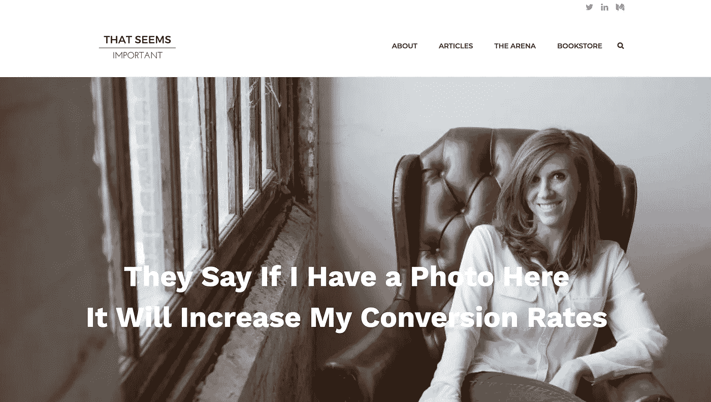
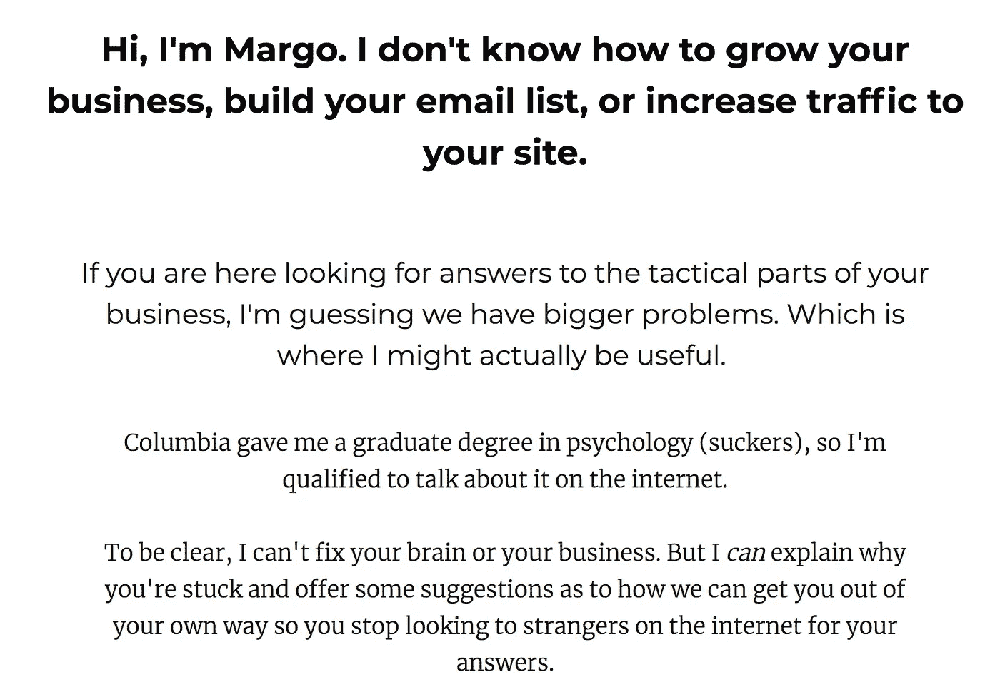

# 如何让人们在乎(你+你卖的东西)

> 原文：<https://medium.com/swlh/how-to-make-people-give-a-damn-about-you-what-youre-selling-8374e3f9f548>

Photo by [paul wallez](https://unsplash.com/photos/csYbFa-h_V8?utm_source=unsplash&utm_medium=referral&utm_content=creditCopyText) on [Unsplash](https://unsplash.com/search/photos/damn?utm_source=unsplash&utm_medium=referral&utm_content=creditCopyText)

尽管所有浪漫的理想都是相反的，但所有创造性工作、艺术、文案、广告、营销、销售或战略的关键都归结为一个简单的目标:

无论你做什么，你绝对必须说服人们在乎你和你提供的东西。

这种对消费者注意力的不懈追求是为什么从机智和幽默到令人毛骨悚然的极端具体的销售策略都在日复一日地工作，以抓住和驾驭你的大脑。

这些技巧，如果使用得当，可以让你多看两眼，评估和消化新信息——至少一会儿。

翻译？它们是旨在让人们在乎的策略。

***然而*，消费者做出是否在乎的决定大约只需 7 秒钟。**

让赌注更高得离谱的是，消费者在那一小段时间内的最终意见往往会成为他们一生的意见。

这使得诅咒成为市场上最虚幻、最珍贵的商品，也是目前最难获得的商品之一。

回到 20 世纪 70 年代，人们惊讶地发现他们每天会收到 500 多个广告。这几天？ [**更接近 5000。**](https://www.cbsnews.com/news/cutting-through-advertising-clutter/)

这无疑也是一种浪费——因为一旦人们在乎某样东西，他们最终会意识到它的价值很低，或者是出于诚信？

…对他们来说，在乎类似的事情要难得多。

是的，即使你的提议是这个星球上最好看的。

是的，即使你解释得很好。

可悲的是，再教育也不总是等于直接的收入/观点改变。

在整个数字商业世界，这一现实变得越来越明显。(我写过几次，包括[这里](/swlh/content-is-king-and-other-reasons-you-shouldn-t-write-online-ab5bd1766505)和[这里](https://startupsventurecapital.com/8-observations-from-a-crumbling-niche-and-how-to-avoid-getting-crushed-6a7e6b2512e5)。)

事实是:如今，在人们面前露脸极其容易……但让他们真正关心到愿意投入时间或金钱——也就是在乎——却极其困难。

所以:我们很容易同意诅咒很重要，而且随着时间的推移，越来越难被吸引。

现在的问题变成了:首先你如何开始挑选它们？

你如何让人们从漠不关心变成完全绝对关心的顾客——或者至少关心到打开你的电子邮件，或者分享你最新的博客帖子？

我有一些想法。

好好放松一下你的脖子，让我们开始吧。

# 让人们在乎你的 5 种方法+你在卖什么。

**方式一:你先。**

说真的。

在你出售任何东西之前，要毫无疑问地证明你在乎你的观众*首先*——而不仅仅是他们钱包里的东西。

找出他们最需要的东西，给他们——如果可以的话，免费。

找出他们的不安全感和恐惧是什么，彻底解决它们，并提供解决方案。

找出他们的目标和梦想是什么，尽可能公开地向他们展示实现目标的途径。

这种最初的该死的给予让你的内容和业务完全不同。

这也是一个决定因素，比如说，一个选择加入的礼物——一个说服他人注册你的电子邮件列表的免费提议——是失败还是着火。

我的意思是:

如果你看看你的行业中的其他人都提供了什么选择礼物，并以此作为你的指导方针(而不是先给你的观众一个该死的)？*悲伤的长号声。*

如果你走这条路，你的窥视者可能要么已经知道这个信息，要么会认为这是一个他们已经见过 100 次的逃避策略。

不用说，这是一个该死的杀手。

相比之下，如果你基于你知道你的人真正需要和想要的东西，因为你做了你的研究或问了他们，你创造了一个选择加入的礼物？你现有的人喜欢它，新的线索往往会涌入。*好的*。

举个例子，考虑将“如何写博客”的自愿加入礼物与承诺教你“如何写博客，写起来感觉有趣和热情——并获得疯狂参与”的礼物进行比较。

第一个？呃，你知道的。

第二个？那是你内心深处真正想要的，对吗？谁没有呢？

第二个例子表明我花时间去弄清楚人们真正想要的是什么。更多注册。更多的胜利。更多甜蜜的诅咒。

当你真正关心时，你可以向你的观众展示你真正理解。当你真正理解时，你可以为更多的人创造更好的东西。

当你为更多的人制造好东西时，你会赚更多的钱，总体上对生活感觉良好。

说真的，谁不想要呢！？

**方式二:别废话。**

胡说是一个即时的杀手。

此外，尽管“胡说八道”和“营销策略”之间有一条界线，但这条界线或许并不像一些人想象的那么明显。

归根结底就是拒绝做出无法兑现的承诺。

永远不要做出无法兑现的保证。不要以获取额外的电子邮件地址或十个电子邮件地址为名，捏造信息或你的专业知识。

人们*迟早会*发现，一旦信任被扼杀，你就永远扼杀了它*。*

虽然更加具体、清晰和诚实可能不会给你带来 1000 个新线索，但更有可能给你带来 100 个真正对你、你的观点和你能提供的东西感兴趣的线索。

(相信我，向那些渴望得到 100 英镑的人推销*要比你通过向他们灌输废话而设法获得的 1000 英镑容易得多——因为你已经向他们展示了他们可以指望你兑现的 100 英镑。)*

找出你能做出的最大承诺，并努力实现它。让它成为现实，让它给人留下深刻的印象，并展示成果。那些关注你的人会找到你，给你留下深刻印象，并想立即知道更多。

**方式三:前期投入(实际)价值——不提出要求。**

当前数字世界震耳欲聋的喧嚣的好处是什么？透明从未如此性感过**。**

例如，最近我发现我被列入了电子邮件营销之王的推销信中，他本人是他的项目*势力范围*的监督人。你可以在这里看看，因为它很棒。

但是我的尖牙舞爪并不是故事中最吸引人的部分。(Obvs。)

在他的销售信中，伴侣挖掘了他使用预售页面来销售产品。

一言以蔽之，预售页很长(长！)撰写分享资源的博客文章，并提供可操作的、完全适用于我当前业务的想法，这些想法与更大的提议(通常即将推出)的理念或目标相结合。在预售页面的最后，你邀请人们通过注册来了解更多关于你的产品的信息。

这是一个非常聪明的策略，而且获取信息不需要付费或者选择加入。你不必给他你的电子邮件地址、电话号码或信用卡。你不必等到培养序列中的第三封信才知道到底发生了什么。

你知道吗？它*工作*。

预售页面并不是一个新概念，但它们目前的影响是营销世界持续、剧烈变化的征兆。

虽然预售页面可能不会像深受喜爱的 3 部分视频培训系列策略那样吸引大量的电子邮件地址，但我敢打赌，这种策略会更容易转化为更多的销售方式。

原因是什么？通过不把你的东西藏在付费墙后面，你创造了难忘的、高价值的体验，*和*那些注册的人会对你提供的任何东西垂涎三尺。

你给出价值。你建立信任。然后，也只有在那时，你才发出邀请。

…然后你可以看着你的完美顾客心甘情愿地说出他们的谴责。

**方式 4:专注于“在合适的时间给合适的人合适的东西”——也就是细分。**

我把最后一部分放在引号中，因为伴侣在他的工作中多次谈到这一点，(#transparency)，并使用了该短语的变体。如果你还没有深入了解他的作品，那就一定要深入了解一下。但是以这篇博文的名义，我现在要深入探讨这对你意味着什么。

在今天的环境下，销售线索不再是一个数字游戏，而是更多的参与游戏。

市场营销中有一句话，我一直在重复:“你可以从一份 200 人的名单中赚到 100 万美元，而从一万名不感兴趣的人身上赚不到任何钱。”

那 200 个人才是你应该追的人。不是 1000。

他们的是你最想获得的诅咒。

因为想想吧。当你在海里撒网时，你可以:

1.  在一个你听说有很多鱼的地方撒下一张大网，其他船都会去的地方。
2.  撒一个小一点的网，但是花时间研究你最想要什么鱼，它们在哪里游泳，什么时候会有更少的船，以及那些鱼最有可能去吃什么样的鱼饵。

第一张网可能会带来一些你想要的鱼……但是它也会*带来很多你可能不想要的其他东西；像不能食用的物种，还有一些旧轮胎，马桶盖，靴子，啤酒罐等。那只是大网的本性。*

总的来说，第二张网可能会带来更少的鱼…但是你可能会带来更多你一开始就在寻找的美味的鱼。

这就是细分的用武之地；也就是说，为你的买家创建“桶”——无论他们是选择了某个免费赠品，还是从测验中获得了某个结果，或者在调查中以特定的方式回答了问题，等等。—根据他们的愿望、目标、奋斗和购买习惯，将他们归入特定的群体。

虽然我了解细分的基础，但我不是专家，但如果你想与这样的人联系:瑞安·莱维斯克的书“ [*”问:这是一种违反直觉的在线方法，可以准确地发现你的客户想买什么……创造大量疯狂的粉丝……并使任何业务更上一层楼*](https://www.amazon.com/Ask-Counterintuitive-Discover-Customers-Business/dp/1939447720) ”就是关于这一点的。(顺便说一下，这不是附属链接，这只是一本很棒的书。)

从本质上来说，细分的目标是帮助你的信息非常有针对性，所以当 98%的人不能或不愿意给出一个该死的报价时，你不会向 100%的人发送相同的“购买我的东西”电子邮件。细分让你把所有的精力都集中在那宝贵的 2%上。

作为细分价值的后续:在我上个月演讲的一次活动中，我问传奇的 [Copyhackers](http://copyhackers.com/) 创始人乔安娜·韦贝，“你看到人们在营销中犯的最大错误是什么？”

她的回答是:“他们忘记了细分，或者完全忽略了它。”

所以:你不必相信我的话。但是考虑一下拿她的。

方法 5:始终如一地出现，并且要有信心。用言行证明*你得到了*。

传奇变装演员露波曾说过这样一句话:“知道你是谁，并时刻准备着。”

虽然这是我最喜欢的在这个星球上成功和普遍存在的原则，但它完全适用于营销和个人品牌，以及在拥挤的市场中培养诅咒。

为了展示和传递，你必须知道你在乎什么和谁，并热情地分享。

你还必须知道你想如何展示自己。你搞笑吗？不敬？激情？令人难以置信的甜蜜和善良？你愤世嫉俗吗？你看到所有事物的美了吗？你厌倦了什么狗屁？有哪些秘密是人们谈得不够的？

如果你还没有以上问题的答案，尽快找到它们。然后，全力以赴。

这将为你的业务创造一个一致的氛围，以及你的文案、图片和网站的外观和感觉，将使你既令人难忘、值得信赖，又是一个不可抗拒的该死的磁铁。

我应该补充一点:一致性并不意味着你必须谨慎行事或避免冒险。事实上，你*必须*接受它们，才能让合适的人在乎你提供的东西。

作为一个例子，让我们来谈谈我的女孩玛戈亚伦的网站，[这似乎很重要。](https://www.thatseemsimportant.com/)

她拿自己的网站内容冒险。作为 [The Arena](https://www.thatseemsimportant.com/apply-to-the-arena/) 的创始人和运营者，一位高层企业主和营销人员的策划人(顺便说一句，我刚刚加入——这太棒了),她可以很容易地让她的网站鹦鹉学舌，重复我们已经听过 100 遍的内容。

*“你想在你的生意中做更多的转化吗？*

你是否觉得陷入了贫困的深渊？

加入我的智囊团，解决你所有的问题。

请付 50，000 美元。”

相反，马戈的网站上有大约 50 个自我暗示的营销笑话，只有营销人员才会知道。看看她主页的前几行:

这种方法可以让那些不适合她的人立刻离开，让那些迫不及待想给她致命一击的业内专业人士兴奋起来。包括我自己。

…事实上我笑得太厉害了，给了*所以*很多谴责。在看到这个网站后，我立即在社交媒体上找到了马戈，并把她的网站发布在我最喜欢的作家群之一上，分享我的爱。

在我看来，最好的营销人员得到销售，得到策略，得到笑话。哦，马戈明白这个笑话吗——这就是她每天出现的方式。

她为此承担的风险在我所有的诅咒中得到了回报。我会继续买她卖的任何东西。

现在请不要搞错:正如我提供的所有营销和促销建议一样，你需要给这些想法*时间来发挥作用。*

你不能把种子种在地里，然后向它们扔脸书广告，直到它们发芽。

你的企业也是如此。

为了让你的“该死的给予者”的强大领域开花结果，你必须准备好土壤(首先给你的人一个该死的)，给他们施肥(用好东西——不是废话)，给他们浇水，但不要太多(在正确的时间给所有正确的东西)，每天照顾他们(出现)。

如果你还没准备好那种步法？没关系。但是你听到的所有捷径策略最终只会让你回到这个起点。

**我很确定它就在圣经的某个地方:*你给予的诅咒越多，你得到的就越多。***

一旦你给了他们？随着时间的推移，你得到的回报就越多。

这不仅是建立长期、盈利、可持续业务的最佳方式。

我怀疑这是唯一的方法。

—

**希拉里·韦斯是一名文案、代笔、作家，也是《The Wordshops:非常规企业家文案课程的作者。**自 2011 年以来，她一直是 200 多个品牌的代言人、代言人和代言人，并专注于品牌代言人的开发，以及为极具影响力的品牌提供有价值的信息。想了解更多类似的东西，想加入她的邮件列表，就去 hillaryweiss.com/subscribe.了解她的课程，顺便去 http://thewordshops.org。

## 这个故事发表在 [The Startup](https://medium.com/swlh) 上，这是 Medium 最大的创业刊物，拥有 307，871+人关注。

## 在这里订阅接收[我们的头条新闻](http://growthsupply.com/the-startup-newsletter/)。

